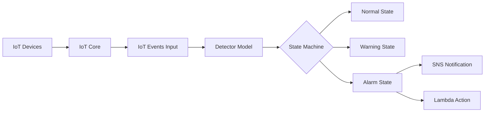

# How to Use IoT Events for Detecting Complex Events

Author: [nawazdhandala](https://github.com/nawazdhandala)

Tags: AWS, IoT, IoT Events, Event Detection, Serverless, Monitoring

Description: Learn how to use AWS IoT Events to detect complex event patterns from IoT device telemetry, trigger alarms, and automate responses in real time.

---

When you have thousands of IoT devices streaming data, spotting meaningful patterns gets tricky fast. A single temperature reading going above threshold is easy enough. But what about detecting that three sensors in the same zone have reported anomalies within a five-minute window while humidity also dropped below 30%? That is where AWS IoT Events comes in.

AWS IoT Events is a managed service that lets you define detector models - essentially state machines - that evaluate incoming IoT data and transition between states based on conditions you define. It is purpose-built for scenarios where simple threshold alerts fall short and you need to reason about combinations of events over time.

## Why IoT Events Instead of Simple Rules

AWS IoT Core has a rules engine, and it works great for straightforward if-then actions. But the rules engine is stateless. It evaluates each message independently with no memory of what happened before.

IoT Events, on the other hand, maintains state. It can remember that sensor A reported high temperature two minutes ago and is now waiting to see if sensor B does the same. This statefulness is what makes complex event detection possible.



## Setting Up an IoT Events Input

Before you build a detector model, you need to define an input. An input tells IoT Events what shape your incoming data has and which fields to extract.

Here is how to create an input using the AWS CLI:

```json
// input-definition.json - defines the schema for incoming sensor data
{
  "inputDefinition": {
    "attributes": [
      { "jsonPath": "sensorId" },
      { "jsonPath": "temperature" },
      { "jsonPath": "humidity" },
      { "jsonPath": "zone" },
      { "jsonPath": "timestamp" }
    ]
  }
}
```

```bash
# Create the IoT Events input from the definition file
aws iotevents create-input \
  --input-name "EnvironmentSensorInput" \
  --input-description "Temperature and humidity readings from zone sensors" \
  --input-definition file://input-definition.json
```

You can route data into this input from IoT Core using a rule action, or you can call the `BatchPutMessage` API directly from your application.

## Building a Detector Model

The detector model is the core of IoT Events. It is a state machine where each state can have entry actions, exit actions, and transition events. Transitions fire when conditions you specify become true.

Let us build a detector model that watches for a complex condition: temperature above 80 degrees for more than 5 minutes while humidity drops below 30%.

```json
// detector-model.json - a two-state model for environment monitoring
{
  "detectorModelName": "EnvironmentAnomalyDetector",
  "detectorModelDescription": "Detects sustained high temp with low humidity",
  "key": "zone",
  "detectorModelDefinition": {
    "states": [
      {
        "stateName": "Normal",
        "onInput": {
          "events": [],
          "transitionEvents": [
            {
              "eventName": "TempSpikeDetected",
              "condition": "$input.EnvironmentSensorInput.temperature > 80",
              "nextState": "Warning",
              "actions": []
            }
          ]
        },
        "onEnter": { "events": [] },
        "onExit": { "events": [] }
      },
      {
        "stateName": "Warning",
        "onInput": {
          "events": [],
          "transitionEvents": [
            {
              "eventName": "ConditionMet",
              "condition": "timeout('tempTimer') AND $input.EnvironmentSensorInput.humidity < 30",
              "nextState": "Alarm",
              "actions": []
            },
            {
              "eventName": "TempNormalized",
              "condition": "$input.EnvironmentSensorInput.temperature <= 80",
              "nextState": "Normal",
              "actions": []
            }
          ]
        },
        "onEnter": {
          "events": [
            {
              "eventName": "SetTimer",
              "condition": "true",
              "actions": [
                {
                  "setTimer": {
                    "timerName": "tempTimer",
                    "seconds": 300
                  }
                }
              ]
            }
          ]
        },
        "onExit": { "events": [] }
      }
    ],
    "initialStateName": "Normal"
  }
}
```

```bash
# Deploy the detector model with the definition
aws iotevents create-detector-model \
  --cli-input-json file://detector-model.json \
  --evaluation-method "BATCH"
```

The `key` field is important. Setting it to `zone` means IoT Events creates a separate detector instance for each unique zone value it sees. So zone-A and zone-B are tracked independently.

## Connecting IoT Core to IoT Events

To feed data from your devices into the detector model, set up an IoT Core rule that forwards messages to the IoT Events input.

```json
// iot-rule.json - routes messages from the sensor topic to IoT Events
{
  "sql": "SELECT sensorId, temperature, humidity, zone, timestamp() as timestamp FROM 'sensors/environment/+'",
  "actions": [
    {
      "iotEvents": {
        "inputName": "EnvironmentSensorInput",
        "messageId": "${newuuid()}",
        "roleArn": "arn:aws:iam::123456789012:role/IoTEventsForwardRole"
      }
    }
  ]
}
```

```bash
# Create the IoT Core rule to forward sensor data
aws iot create-topic-rule \
  --rule-name "ForwardToIoTEvents" \
  --topic-rule-payload file://iot-rule.json
```

## Adding Alarm Actions

When the detector transitions into an alarm state, you probably want to do something about it. IoT Events supports several action types including SNS notifications, Lambda invocations, SQS messages, DynamoDB writes, and more.

Here is how to add an SNS notification to the Alarm state:

```json
// Add this to the Alarm state's onEnter events
{
  "eventName": "SendAlarmNotification",
  "condition": "true",
  "actions": [
    {
      "sns": {
        "targetArn": "arn:aws:sns:us-east-1:123456789012:EnvironmentAlerts",
        "payload": {
          "contentExpression": "'Zone ' + $input.EnvironmentSensorInput.zone + ' has sustained high temperature with low humidity'",
          "type": "STRING"
        }
      }
    },
    {
      "lambda": {
        "functionArn": "arn:aws:lambda:us-east-1:123456789012:function:HandleEnvironmentAlarm",
        "payload": {
          "contentExpression": "$input.EnvironmentSensorInput",
          "type": "JSON"
        }
      }
    }
  ]
}
```

## Using Timers for Time-Based Conditions

Timers are one of the most powerful features in IoT Events. They let you express conditions like "if this value stays above threshold for X seconds" or "if no message arrives within Y minutes."

The detector model we built earlier uses a timer called `tempTimer` set to 300 seconds. The transition to the Alarm state only happens if that timer expires AND humidity is below 30%. If the temperature drops back to normal before the timer fires, the detector returns to the Normal state and the timer is effectively cancelled.

You can also use timers to detect the absence of data. If a device stops reporting, you can set a timer on each message arrival and transition to a "DeviceOffline" state when the timer expires without being reset.

## Monitoring Your Detector Models

Once deployed, you will want to keep an eye on how your detector models are performing. IoT Events publishes metrics to CloudWatch, and you can set up dashboards to track things like the number of active detector instances, state transitions, and error rates.

For deeper monitoring of your entire IoT infrastructure, consider setting up a comprehensive observability solution. You can learn more about monitoring strategies in our post on [monitoring IoT devices with CloudWatch](https://oneuptime.com/blog/post/monitor-iot-devices-with-cloudwatch/view).

```bash
# List all detector model instances and their current states
aws iotevents-data list-detectors \
  --detector-model-name "EnvironmentAnomalyDetector"

# Get details about a specific detector instance
aws iotevents-data describe-detector \
  --detector-model-name "EnvironmentAnomalyDetector" \
  --key-value "zone-A"
```

## Best Practices

**Keep detector models focused.** Rather than building one massive state machine that handles every possible scenario, create multiple smaller detector models that each handle one concern. This makes them easier to debug and update.

**Use the BATCH evaluation method** when you do not need immediate real-time responses. Batch evaluation processes messages in groups and is more cost-effective for high-volume scenarios.

**Test with the BatchPutMessage API** before connecting live device data. You can send synthetic messages to verify your state transitions work correctly.

**Version your detector models.** IoT Events supports versioning, so you can update a model without affecting running instances until you are ready to activate the new version.

**Set appropriate timer durations.** Timers that are too short will cause false positives. Timers that are too long will cause slow responses. Start with conservative values and tune based on real-world data.

## Pricing Considerations

IoT Events charges based on the number of messages evaluated by your detector models. Each message that arrives at an input and gets evaluated by a detector model counts as one message evaluation. There is no charge for the number of detector instances or states.

For high-volume deployments, this can add up quickly. Be strategic about which messages you route to IoT Events versus handling with simpler IoT Core rules.

## Wrapping Up

AWS IoT Events fills a real gap in the IoT processing pipeline. Simple rules engines handle the easy stuff, and stream processing services like Kinesis handle bulk data transformations. But for stateful, time-aware pattern detection across multiple data sources, IoT Events is purpose-built and far simpler than rolling your own solution.

Start with a straightforward two-state detector model, validate it with test data, and then gradually add complexity as you understand the patterns in your device fleet.
