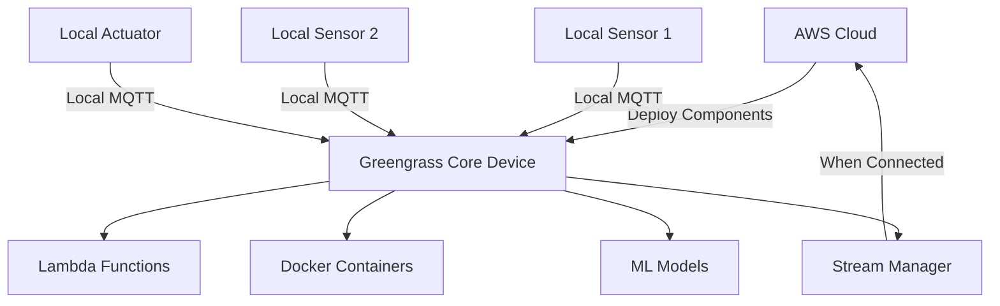

# How to Use IoT Greengrass for Edge Computing

Author: [nawazdhandala](https://github.com/nawazdhandala)

Tags: AWS, IoT Greengrass, Edge Computing, Lambda

Description: Guide to deploying AWS IoT Greengrass for edge computing, covering core setup, local Lambda functions, machine learning inference at the edge, and device communication.

---

Not everything belongs in the cloud. When you need real-time responses measured in milliseconds rather than seconds, when your network connectivity is unreliable, or when you're generating more data than you can economically send to the cloud, you need compute at the edge. That's what AWS IoT Greengrass does.

Greengrass extends AWS to edge devices. You write Lambda functions and deploy them to a device running the Greengrass Core. Those functions execute locally, interact with local hardware and peripherals, and selectively sync data back to the cloud. The device keeps working even when the internet connection drops.

## What Greengrass Gives You

Greengrass V2 (the current version) provides:

- **Local compute**: Run Lambda functions or Docker containers on edge devices
- **Local messaging**: Devices communicate with each other without going through the cloud
- **ML inference**: Run machine learning models locally
- **Stream management**: Buffer and batch data before sending to the cloud
- **Secret management**: Securely access credentials at the edge
- **OTA updates**: Deploy new code and configuration remotely



## Installing Greengrass Core

Greengrass V2 runs on Linux devices with Java 8 or later. The device needs at least 128 MB RAM and 256 MB disk space, though production workloads typically need more.

```bash
# Download and install Greengrass Core V2
curl -s https://d2s8p88vqu9w66.cloudfront.net/releases/greengrass-nucleus-latest.zip -o greengrass-nucleus.zip
unzip greengrass-nucleus.zip -d GreengrassInstaller

# Install with automatic provisioning
sudo -E java -Droot="/greengrass/v2" \
    -Dlog.store=FILE \
    -jar ./GreengrassInstaller/lib/Greengrass.jar \
    --aws-region us-east-1 \
    --thing-name MyGreengrassCore \
    --thing-group-name MyGreengrassGroup \
    --thing-policy-name GreengrassV2IoTThingPolicy \
    --tes-role-name GreengrassV2TokenExchangeRole \
    --tes-role-alias-name GreengrassCoreTokenExchangeRoleAlias \
    --component-default-user ggc_user:ggc_group \
    --provision true \
    --setup-system-service true
```

This command does a lot:

- Creates an IoT Thing for the Greengrass Core
- Sets up certificates and policies
- Configures the token exchange service for AWS credential access
- Installs Greengrass as a systemd service

Verify it's running.

```bash
# Check Greengrass Core status
sudo systemctl status greengrass

# View Greengrass logs
sudo tail -f /greengrass/v2/logs/greengrass.log
```

## Creating a Greengrass Component

Components are the deployment units in Greengrass V2. A component is a recipe (YAML/JSON describing the component) plus artifacts (code, binaries, models).

Here's a simple component that reads a temperature sensor and publishes to local MQTT.

First, the component code.

```python
# artifacts/com.example.TemperatureReader/1.0.0/temperature_reader.py
import json
import time
import random
import awsiot.greengrasscoreipc as ipc
from awsiot.greengrasscoreipc.model import (
    PublishToTopicRequest,
    PublishMessage,
    JsonMessage
)

# Connect to the Greengrass IPC
ipc_client = ipc.connect()

TOPIC = "sensors/temperature/readings"
PUBLISH_INTERVAL = 10  # seconds

def read_temperature():
    """Read from temperature sensor. Replace with actual sensor code."""
    # In production, read from GPIO, I2C, or serial port
    return round(20 + random.uniform(-5, 10), 1)

def publish_reading(temperature):
    """Publish temperature reading to local MQTT topic."""
    message = {
        "device_id": "edge-sensor-001",
        "temperature": temperature,
        "timestamp": int(time.time()),
        "source": "edge"
    }

    request = PublishToTopicRequest(
        topic=TOPIC,
        publish_message=PublishMessage(
            json_message=JsonMessage(message=message)
        )
    )

    ipc_client.new_publish_to_topic().activate(request).result()
    print(f"Published: {json.dumps(message)}")

# Main loop
print("Temperature reader starting...")
while True:
    temp = read_temperature()
    publish_reading(temp)
    time.sleep(PUBLISH_INTERVAL)
```

Now the component recipe.

```yaml
# recipes/com.example.TemperatureReader-1.0.0.yaml
RecipeFormatVersion: '2020-01-25'
ComponentName: com.example.TemperatureReader
ComponentVersion: '1.0.0'
ComponentDescription: Reads temperature sensor and publishes to local MQTT
ComponentPublisher: Example Corp

ComponentDependencies:
  aws.greengrass.Nucleus:
    VersionRequirement: '>=2.0.0'

ComponentConfiguration:
  DefaultConfiguration:
    publishInterval: 10
    sensorPin: 4

Manifests:
  - Platform:
      os: linux
    Lifecycle:
      install: pip3 install awsiotsdk
      run:
        script: python3 {artifacts:path}/temperature_reader.py
    Artifacts:
      - URI: s3://my-greengrass-components/com.example.TemperatureReader/1.0.0/temperature_reader.py
```

## Deploying Components

Upload the artifact to S3 and create a deployment.

```bash
# Upload the component artifact to S3
aws s3 cp temperature_reader.py \
    s3://my-greengrass-components/com.example.TemperatureReader/1.0.0/temperature_reader.py

# Create the component in Greengrass
aws greengrassv2 create-component-version \
    --inline-recipe fileb://recipes/com.example.TemperatureReader-1.0.0.yaml

# Create a deployment to the core device
aws greengrassv2 create-deployment \
    --target-arn "arn:aws:iot:us-east-1:123456789:thing/MyGreengrassCore" \
    --deployment-name "DeployTemperatureReader" \
    --components '{
        "com.example.TemperatureReader": {
            "componentVersion": "1.0.0",
            "configurationUpdate": {
                "merge": "{\"publishInterval\": 5}"
            }
        }
    }'
```

## Running Lambda Functions at the Edge

You can deploy Lambda functions to run locally on the Greengrass Core. They execute in a Lambda-like container with access to local resources.

```python
# lambda_function.py - Lambda function that runs on Greengrass
import json
import logging
import greengrasssdk

logger = logging.getLogger()
client = greengrasssdk.client('iot-data')

def handler(event, context):
    """Process incoming sensor data locally."""
    temperature = event.get('temperature')
    device_id = event.get('device_id')

    # Local processing - no cloud round trip needed
    if temperature > 35:
        alert = {
            'device_id': device_id,
            'alert': 'high_temperature',
            'temperature': temperature,
            'action': 'activate_cooling'
        }

        # Publish alert to local topic
        client.publish(
            topic='alerts/temperature',
            payload=json.dumps(alert)
        )

        # Also publish to a cloud-synced topic
        client.publish(
            topic='cloud/alerts/temperature',
            payload=json.dumps(alert)
        )

        logger.info(f"High temp alert for {device_id}: {temperature}")

    return {'status': 'processed'}
```

## Local Device Communication

One of Greengrass's most useful features is local MQTT messaging between devices. Devices connected to the Greengrass Core can communicate without any cloud involvement.

```python
# local_subscriber.py - Subscribe to local MQTT topics
import awsiot.greengrasscoreipc as ipc
from awsiot.greengrasscoreipc.model import (
    SubscribeToTopicRequest,
    SubscriptionResponseMessage
)
import json

ipc_client = ipc.connect()

class StreamHandler(ipc.client.SubscribeToTopicStreamHandler):
    def on_stream_event(self, event: SubscriptionResponseMessage):
        message = json.loads(event.json_message.message)
        print(f"Received: {message}")

        # React to local sensor data
        if message.get('temperature', 0) > 30:
            print("Temperature threshold exceeded - activating fan")
            # Send command to actuator
            activate_fan()

    def on_stream_error(self, error):
        print(f"Stream error: {error}")

    def on_stream_closed(self):
        print("Stream closed")

# Subscribe to local temperature readings
request = SubscribeToTopicRequest(topic="sensors/temperature/readings")
handler = StreamHandler()
operation = ipc_client.new_subscribe_to_topic(handler)
operation.activate(request)

# Keep running
import time
while True:
    time.sleep(1)
```

## ML Inference at the Edge

Greengrass can run ML models locally for real-time inference without cloud latency.

```python
# ml_inference.py - Run ML model at the edge
import json
import numpy as np
import awsiot.greengrasscoreipc as ipc
from awsiot.greengrasscoreipc.model import PublishToTopicRequest, PublishMessage, JsonMessage

# Load the model (deployed as a component artifact)
import tflite_runtime.interpreter as tflite

interpreter = tflite.Interpreter(model_path="/greengrass/v2/packages/artifacts/model.tflite")
interpreter.allocate_tensors()

ipc_client = ipc.connect()

def run_inference(sensor_data):
    """Run anomaly detection on sensor data."""
    input_details = interpreter.get_input_details()
    output_details = interpreter.get_output_details()

    # Prepare input
    input_data = np.array([sensor_data], dtype=np.float32)
    interpreter.set_tensor(input_details[0]['index'], input_data)

    # Run inference
    interpreter.invoke()

    # Get results
    output = interpreter.get_tensor(output_details[0]['index'])
    anomaly_score = float(output[0][0])

    return anomaly_score

def process_and_publish(sensor_reading):
    """Process sensor data through ML model and publish results."""
    score = run_inference(sensor_reading)

    result = {
        "anomaly_score": score,
        "is_anomaly": score > 0.8,
        "sensor_data": sensor_reading
    }

    if result["is_anomaly"]:
        # Publish anomaly alert locally and to cloud
        request = PublishToTopicRequest(
            topic="ml/anomalies",
            publish_message=PublishMessage(
                json_message=JsonMessage(message=result)
            )
        )
        ipc_client.new_publish_to_topic().activate(request)

    return result
```

## Stream Manager

Stream Manager buffers data locally and sends it to the cloud efficiently. It handles network interruptions automatically.

```python
# stream_manager_example.py - Use Stream Manager for reliable cloud upload
from stream_manager import (
    StreamManagerClient,
    MessageStreamDefinition,
    StrategyOnFull,
    ExportDefinition,
    IoTAnalyticsConfig
)

# Create stream manager client
stream_client = StreamManagerClient()

# Create a stream that exports to IoT Analytics
stream_client.create_message_stream(
    MessageStreamDefinition(
        name="SensorDataStream",
        max_size=268435456,  # 256 MB local buffer
        stream_segment_size=16777216,  # 16 MB segments
        strategy_on_full=StrategyOnFull.OverwriteOldestData,
        export_definition=ExportDefinition(
            iot_analytics=[
                IoTAnalyticsConfig(
                    identifier="IoTAnalyticsExport",
                    iot_channel="sensor_data_channel"
                )
            ]
        )
    )
)

# Append data to the stream
import json
data = json.dumps({"temperature": 22.5, "humidity": 45}).encode()
stream_client.append_message("SensorDataStream", data)
```

## Wrapping Up

Greengrass bridges the gap between cloud and edge. When you need sub-millisecond response times, offline operation, or local data processing before cloud upload, it's the right tool. The component model in V2 makes deployment and updates clean, and the IPC mechanism gives your edge code access to local MQTT, stream management, and secrets.

Start with a simple component, get comfortable with the deployment workflow, then layer on ML inference and stream management as your use case demands. For the cloud side of your IoT architecture, see our guides on [IoT Core device connectivity](https://oneuptime.com/blog/post/set-up-aws-iot-core-for-device-connectivity/view) and the [Rules Engine](https://oneuptime.com/blog/post/use-iot-core-rules-engine/view).
