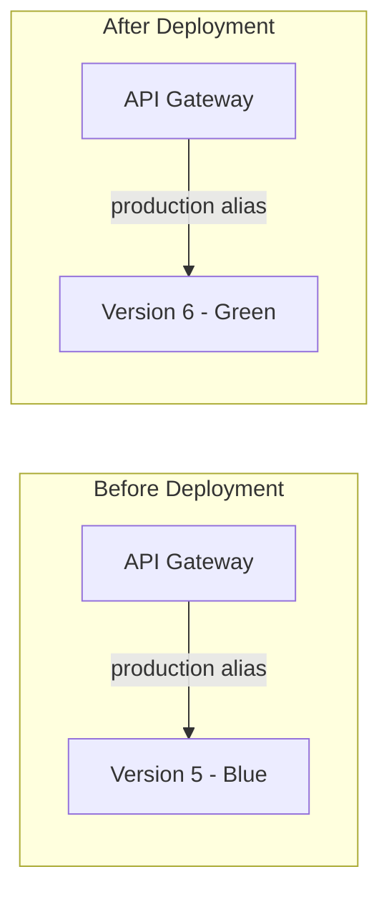

# How to Use Lambda Aliases and Versions for Deployment Strategies

Author: [nawazdhandala](https://github.com/nawazdhandala)

Tags: AWS, Lambda, Deployment, Versioning, Serverless

Description: Master Lambda versions and aliases to implement safe deployment strategies including blue-green deployments, traffic shifting, and instant rollbacks.

---

Every time you update a Lambda function, the previous code is gone. If the new version has a bug, you're scrambling to redeploy the old code. Lambda versions and aliases solve this by giving you immutable snapshots of your function code and a way to route traffic between them. They're the foundation for safe deployment strategies like blue-green, canary, and instant rollback.

Let's break down how versions and aliases work, and how to use them for reliable deployments.

## Versions: Immutable Snapshots

A Lambda version is a numbered, immutable snapshot of your function's code and configuration. When you publish a version, Lambda freezes everything - the code, environment variables, memory, timeout, layers, VPC config - and assigns it a sequential number.

```bash
# Publish a new version of your function
aws lambda publish-version \
  --function-name my-api \
  --description "Release v2.3.1 - Fixed payment processing bug"

# Output includes the version number
# "Version": "5"
```

Important things about versions:
- Each version gets a unique ARN: `arn:aws:lambda:us-east-1:123456789012:function:my-api:5`
- Versions are immutable - you can't change the code or config
- The `$LATEST` pseudo-version always points to the most recent code
- Versions persist until you explicitly delete them

List your function's versions:

```bash
# See all published versions
aws lambda list-versions-by-function \
  --function-name my-api \
  --query "Versions[].{Version: Version, Description: Description, LastModified: LastModified}" \
  --output table
```

## Aliases: Named Pointers

An alias is a named pointer to a specific version. Think of it as a friendly name for a version number. Instead of configuring your API Gateway to point to version 5, you point it to the "production" alias, which you can move between versions at will.

```bash
# Create a "production" alias pointing to version 5
aws lambda create-alias \
  --function-name my-api \
  --name production \
  --function-version 5

# Create a "staging" alias pointing to version 6
aws lambda create-alias \
  --function-name my-api \
  --name staging \
  --function-version 6
```

Each alias gets its own ARN: `arn:aws:lambda:us-east-1:123456789012:function:my-api:production`

Configure your event sources (API Gateway, S3 triggers, etc.) to use the alias ARN instead of the function ARN. This way, you can change which version handles traffic without updating any event source configuration.

## Blue-Green Deployments

In a blue-green deployment, you run two environments (blue = current, green = new) and switch traffic instantly between them.

With Lambda aliases, this is just pointing the alias to a different version:

```bash
# Current state: production alias -> version 5 (blue)

# Deploy new code
aws lambda update-function-code \
  --function-name my-api \
  --zip-file fileb://new-code.zip

# Publish as a new version (green)
NEW_VERSION=$(aws lambda publish-version \
  --function-name my-api \
  --query 'Version' --output text)

echo "Published version: $NEW_VERSION"

# Test the new version directly
aws lambda invoke \
  --function-name "my-api:$NEW_VERSION" \
  --payload '{"test": true}' \
  response.json

# Switch production traffic to the new version (blue -> green)
aws lambda update-alias \
  --function-name my-api \
  --name production \
  --function-version "$NEW_VERSION"

# Instant rollback if something goes wrong
aws lambda update-alias \
  --function-name my-api \
  --name production \
  --function-version 5
```

The switch is atomic. One moment all traffic goes to version 5, the next moment it all goes to the new version. There's no window where requests split between versions.



## Weighted Aliases (Traffic Shifting)

Lambda aliases can split traffic between two versions using routing configuration. This is the basis for canary and linear deployment strategies:

```bash
# Send 90% of traffic to version 5, 10% to version 6
aws lambda update-alias \
  --function-name my-api \
  --name production \
  --function-version 5 \
  --routing-config '{"AdditionalVersionWeights": {"6": 0.1}}'
```

You can gradually shift traffic:

```bash
# Step 1: 90/10 split
aws lambda update-alias \
  --function-name my-api \
  --name production \
  --function-version 5 \
  --routing-config '{"AdditionalVersionWeights": {"6": 0.1}}'

# Step 2: 70/30 split (after monitoring looks good)
aws lambda update-alias \
  --function-name my-api \
  --name production \
  --function-version 5 \
  --routing-config '{"AdditionalVersionWeights": {"6": 0.3}}'

# Step 3: 50/50 split
aws lambda update-alias \
  --function-name my-api \
  --name production \
  --function-version 5 \
  --routing-config '{"AdditionalVersionWeights": {"6": 0.5}}'

# Step 4: Full cutover - remove routing config
aws lambda update-alias \
  --function-name my-api \
  --name production \
  --function-version 6 \
  --routing-config '{}'
```

For automated canary deployments, see our post on [implementing canary deployments for Lambda functions](https://oneuptime.com/blog/post/implement-canary-deployments-for-lambda-functions/view).

## CloudFormation with Versions and Aliases

Here's how to manage versions and aliases in CloudFormation:

```yaml
# CloudFormation template with Lambda versions and aliases
Resources:
  MyFunction:
    Type: AWS::Lambda::Function
    Properties:
      FunctionName: my-api
      Runtime: nodejs20.x
      Handler: index.handler
      Role: !GetAtt LambdaRole.Arn
      Code:
        S3Bucket: my-deploy-bucket
        S3Key: function-v2.3.1.zip

  # Publish a new version each time the code changes
  FunctionVersion:
    Type: AWS::Lambda::Version
    Properties:
      FunctionName: !Ref MyFunction
      Description: "Deployed on 2026-02-12"

  # Production alias points to the current version
  ProductionAlias:
    Type: AWS::Lambda::Alias
    Properties:
      FunctionName: !Ref MyFunction
      FunctionVersion: !GetAtt FunctionVersion.Version
      Name: production
      # Optional: traffic shifting configuration
      RoutingConfig:
        AdditionalVersionWeights:
          - FunctionVersion: !Ref PreviousVersion
            FunctionWeight: 0.1

  # API Gateway points to the alias, not the function directly
  ApiIntegration:
    Type: AWS::ApiGatewayV2::Integration
    Properties:
      ApiId: !Ref HttpApi
      IntegrationType: AWS_PROXY
      # Use the alias ARN so we can shift traffic without changing the API
      IntegrationUri: !Ref ProductionAlias
```

## Automated Version Cleanup

Over time, you'll accumulate many versions. Clean up old ones to stay organized:

```javascript
// Lambda function that cleans up old versions, keeping the last N
const { LambdaClient, ListVersionsByFunctionCommand, DeleteFunctionCommand } = require('@aws-sdk/client-lambda');

const lambda = new LambdaClient({ region: 'us-east-1' });
const KEEP_VERSIONS = 10;

exports.handler = async (event) => {
  const functionName = event.functionName;

  // List all versions
  const response = await lambda.send(new ListVersionsByFunctionCommand({
    FunctionName: functionName,
  }));

  // Filter out $LATEST and sort by version number
  const versions = response.Versions
    .filter(v => v.Version !== '$LATEST')
    .sort((a, b) => parseInt(b.Version) - parseInt(a.Version));

  // Delete versions beyond the keep limit
  const toDelete = versions.slice(KEEP_VERSIONS);

  for (const version of toDelete) {
    console.log(`Deleting ${functionName}:${version.Version}`);
    await lambda.send(new DeleteFunctionCommand({
      FunctionName: functionName,
      Qualifier: version.Version,
    }));
  }

  console.log(`Kept ${KEEP_VERSIONS} versions, deleted ${toDelete.length}`);
};
```

## Provisioned Concurrency with Aliases

You can configure provisioned concurrency on an alias to keep a specific number of execution environments warm:

```bash
# Keep 10 warm instances for the production alias
aws lambda put-provisioned-concurrency-config \
  --function-name my-api \
  --qualifier production \
  --provisioned-concurrent-executions 10
```

This is especially useful during traffic shifts - you can pre-warm the new version before sending it traffic.

## Best Practices

1. **Always deploy through aliases** - Never point event sources to `$LATEST` or a specific version number. Always use an alias.

2. **Publish a version for every deployment** - This creates a rollback point and an audit trail.

3. **Use separate aliases for environments** - `staging`, `production`, `canary` each point to different versions.

4. **Automate version cleanup** - Run a scheduled cleanup to remove old versions.

5. **Test versions directly before promoting** - Invoke the specific version to verify it works before updating the alias.

6. **Monitor during traffic shifts** - Watch error rates and latency when shifting traffic. Automate rollback if metrics exceed thresholds.

## Wrapping Up

Lambda versions and aliases are simple concepts that enable sophisticated deployment strategies. Versions give you immutable snapshots and rollback points. Aliases give you stable endpoints that can switch between versions instantly. Together, they let you implement blue-green deployments, canary releases, and traffic shifting - all without modifying any event source configuration. Every production Lambda function should be using them.
