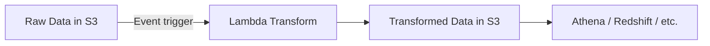
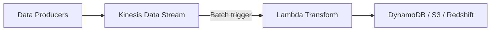
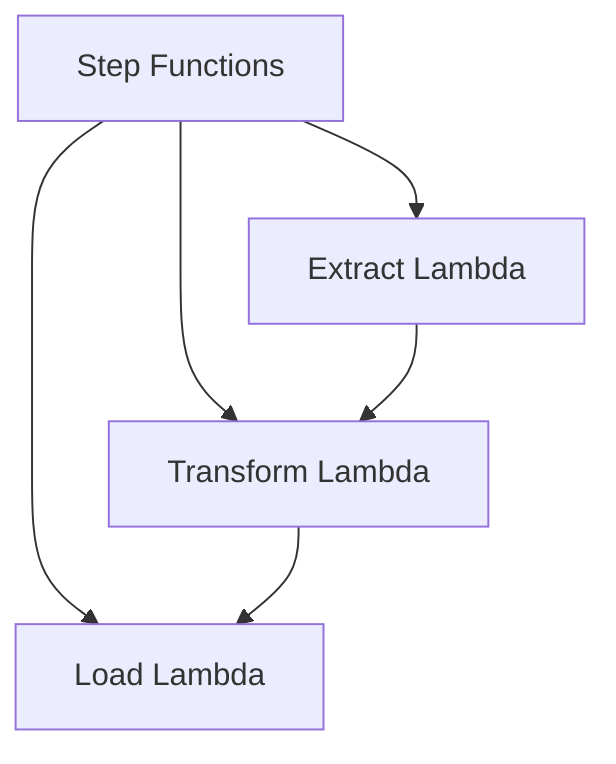

# How to Use Lambda for Data Transformation in ETL Pipelines

Author: [nawazdhandala](https://github.com/nawazdhandala)

Tags: AWS, Lambda, ETL, Data Processing, Serverless

Description: Build serverless ETL pipelines using AWS Lambda for data extraction, transformation, and loading, with practical examples for common data processing patterns.

---

ETL - Extract, Transform, Load - is the backbone of most data workflows. You pull data from a source, clean and reshape it, then push it somewhere useful. Traditionally this meant running Spark clusters or dedicated ETL servers. But for many workloads, Lambda does the job just fine - and you don't have to manage any infrastructure.

Lambda won't replace your Spark cluster for terabyte-scale batch jobs. But for event-driven transformations, real-time data processing, and moderate-volume ETL work, it's a great fit. Let's look at how to build ETL pipelines with Lambda.

## When Lambda Makes Sense for ETL

Lambda is a good choice when:

- Individual records or small batches need transformation in real time
- Files arrive in S3 and need processing immediately
- Data volumes are moderate (up to a few GB per file)
- You want event-driven processing rather than scheduled batch jobs
- The transformation logic is straightforward

Lambda is not ideal when:

- You're processing massive datasets (hundreds of GB or more)
- You need complex joins across multiple large datasets
- The processing takes longer than 15 minutes per invocation

## Architecture Patterns

There are a few common architectures for Lambda-based ETL.

### Pattern 1: S3-Triggered Transformation

Files land in S3, Lambda transforms them, and writes the results to another location.



### Pattern 2: Kinesis Stream Processing

Data flows through Kinesis, Lambda processes each batch of records in real time.



### Pattern 3: Step Functions Orchestrated ETL

Step Functions coordinates multiple Lambda functions for multi-stage ETL.



## Example: CSV to Parquet Transformation

A common ETL task is converting CSV files to Parquet format for efficient querying with Athena. Here's how:

```python
# Transform CSV files from S3 into Parquet format
import json
import boto3
import pandas as pd
from io import BytesIO, StringIO
from urllib.parse import unquote_plus

s3 = boto3.client('s3')

def handler(event, context):
    for record in event['Records']:
        bucket = record['s3']['bucket']['name']
        key = unquote_plus(record['s3']['object']['key'])

        print(f"Processing: s3://{bucket}/{key}")

        # Extract: Download the CSV from S3
        response = s3.get_object(Bucket=bucket, Key=key)
        csv_content = response['Body'].read().decode('utf-8')

        # Transform: Parse and clean the data
        df = pd.read_csv(StringIO(csv_content))

        # Remove rows with missing required fields
        df = df.dropna(subset=['customer_id', 'amount'])

        # Normalize column names (lowercase, underscores)
        df.columns = [col.strip().lower().replace(' ', '_') for col in df.columns]

        # Convert date strings to proper datetime
        if 'transaction_date' in df.columns:
            df['transaction_date'] = pd.to_datetime(df['transaction_date'])

        # Add metadata columns
        df['source_file'] = key
        df['processed_at'] = pd.Timestamp.now()

        # Add derived columns
        if 'amount' in df.columns and 'quantity' in df.columns:
            df['unit_price'] = df['amount'] / df['quantity'].replace(0, 1)

        # Load: Write as Parquet to the output bucket
        parquet_buffer = BytesIO()
        df.to_parquet(parquet_buffer, index=False, engine='pyarrow')
        parquet_buffer.seek(0)

        # Change the file extension and prefix
        output_key = key.replace('raw/', 'transformed/').replace('.csv', '.parquet')
        s3.put_object(
            Bucket='transformed-data-bucket',
            Key=output_key,
            Body=parquet_buffer,
            ContentType='application/x-parquet'
        )

        print(f"Wrote {len(df)} rows to s3://transformed-data-bucket/{output_key}")

    return {'statusCode': 200}
```

## Example: JSON Log Normalization

Another common task is normalizing JSON logs from different sources into a consistent schema:

```javascript
// Normalize JSON logs from various sources into a standard format
const { S3Client, GetObjectCommand, PutObjectCommand } = require('@aws-sdk/client-s3');
const { createGunzip } = require('zlib');
const { pipeline } = require('stream/promises');

const s3 = new S3Client({ region: 'us-east-1' });

// Define normalization rules for different log sources
const normalizers = {
  nginx: (log) => ({
    timestamp: new Date(log.time_local).toISOString(),
    source: 'nginx',
    method: log.request_method,
    path: log.request_uri,
    status: parseInt(log.status),
    duration_ms: parseFloat(log.request_time) * 1000,
    client_ip: log.remote_addr,
    user_agent: log.http_user_agent,
  }),

  express: (log) => ({
    timestamp: log.timestamp || new Date().toISOString(),
    source: 'express',
    method: log.method,
    path: log.url,
    status: log.statusCode,
    duration_ms: log.responseTime,
    client_ip: log.ip,
    user_agent: log.headers?.['user-agent'],
  }),

  cloudfront: (log) => ({
    timestamp: `${log.date}T${log.time}Z`,
    source: 'cloudfront',
    method: log['cs-method'],
    path: log['cs-uri-stem'],
    status: parseInt(log['sc-status']),
    duration_ms: parseFloat(log['time-taken']) * 1000,
    client_ip: log['c-ip'],
    user_agent: log['cs(User-Agent)'],
  }),
};

exports.handler = async (event) => {
  for (const record of event.Records) {
    const bucket = record.s3.bucket.name;
    const key = decodeURIComponent(record.s3.object.key.replace(/\+/g, ' '));

    // Determine the log source from the prefix
    const source = key.split('/')[1];  // e.g., logs/nginx/2026-02-12.json.gz
    const normalizer = normalizers[source];

    if (!normalizer) {
      console.log(`Unknown log source: ${source}, skipping`);
      continue;
    }

    // Download and decompress
    const response = await s3.send(new GetObjectCommand({ Bucket: bucket, Key: key }));
    const rawData = await response.Body.transformToString();

    // Parse JSON lines format
    const logs = rawData
      .split('\n')
      .filter(line => line.trim())
      .map(line => {
        try {
          return normalizer(JSON.parse(line));
        } catch (e) {
          console.warn(`Failed to parse line: ${e.message}`);
          return null;
        }
      })
      .filter(Boolean);

    // Write normalized logs as JSON lines
    const outputKey = key.replace('raw-logs/', 'normalized/').replace('.gz', '');
    const outputBody = logs.map(l => JSON.stringify(l)).join('\n');

    await s3.send(new PutObjectCommand({
      Bucket: 'normalized-logs-bucket',
      Key: outputKey,
      Body: outputBody,
      ContentType: 'application/x-ndjson',
    }));

    console.log(`Normalized ${logs.length} logs from ${source}`);
  }
};
```

## Example: Real-Time Stream Processing

For real-time ETL, use Lambda with Kinesis Data Streams:

```javascript
// Process Kinesis records in real time - aggregate and forward
const { FirehoseClient, PutRecordBatchCommand } = require('@aws-sdk/client-firehose');

const firehose = new FirehoseClient({ region: 'us-east-1' });

exports.handler = async (event) => {
  const transformedRecords = [];

  for (const record of event.Records) {
    // Decode the Kinesis record
    const payload = JSON.parse(
      Buffer.from(record.kinesis.data, 'base64').toString('utf-8')
    );

    // Transform: enrich, filter, reshape
    const transformed = {
      event_id: payload.id,
      event_type: payload.type,
      user_id: payload.userId,
      // Flatten nested properties
      device_type: payload.context?.device || 'unknown',
      os: payload.context?.os || 'unknown',
      // Add processing metadata
      processed_at: new Date().toISOString(),
      partition_key: `${payload.type}/${new Date().toISOString().slice(0, 10)}`,
    };

    // Filter out internal/test events
    if (transformed.event_type.startsWith('test_')) continue;

    transformedRecords.push({
      Data: Buffer.from(JSON.stringify(transformed) + '\n'),
    });
  }

  // Load: Send to Firehose for delivery to S3/Redshift
  if (transformedRecords.length > 0) {
    // Firehose accepts batches of up to 500 records
    const batches = [];
    for (let i = 0; i < transformedRecords.length; i += 500) {
      batches.push(transformedRecords.slice(i, i + 500));
    }

    for (const batch of batches) {
      await firehose.send(new PutRecordBatchCommand({
        DeliveryStreamName: 'transformed-events-stream',
        Records: batch,
      }));
    }
  }

  console.log(`Processed ${event.Records.length} records, forwarded ${transformedRecords.length}`);
};
```

## Error Handling in ETL Lambdas

Data processing errors need careful handling. You don't want one bad record to block the entire batch:

```javascript
// Process records individually, collect errors for later review
async function processWithErrorHandling(records) {
  const successes = [];
  const failures = [];

  for (const record of records) {
    try {
      const result = await transformRecord(record);
      successes.push(result);
    } catch (error) {
      console.error(`Failed to process record: ${error.message}`, {
        record: JSON.stringify(record).substring(0, 500),
      });
      failures.push({
        record,
        error: error.message,
        timestamp: new Date().toISOString(),
      });
    }
  }

  // Write failures to a dead letter location for investigation
  if (failures.length > 0) {
    await writeFailures(failures);
  }

  return { processed: successes.length, failed: failures.length };
}
```

## Lambda Configuration for ETL

ETL functions often need more resources than typical API handlers:

```yaml
# CloudFormation config for ETL Lambda
EtlFunction:
  Type: AWS::Lambda::Function
  Properties:
    Runtime: python3.12
    Handler: handler.handler
    MemorySize: 3008    # Max out for heavy data processing
    Timeout: 900        # 15 minutes max for large files
    EphemeralStorage:
      Size: 10240       # 10 GB temp storage for large files
```

## Wrapping Up

Lambda-based ETL works well for event-driven, moderate-volume data processing. Whether you're converting file formats, normalizing logs, or processing streaming data, the serverless approach means you only pay for the compute time used during actual transformation. For larger datasets that exceed Lambda's 15-minute timeout or memory limits, consider AWS Glue or Step Functions to break the work into smaller chunks. For real-time streaming, Lambda with Kinesis gives you a solid, scalable pipeline without managing any infrastructure.
