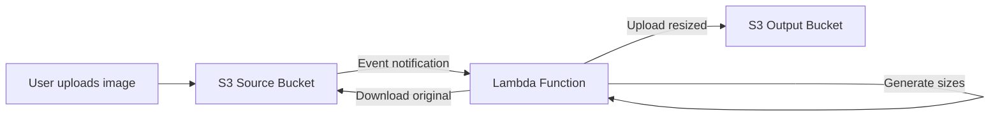

# How to Use Lambda for Image Resizing on Upload

Author: [nawazdhandala](https://github.com/nawazdhandala)

Tags: AWS, Lambda, S3, Image Processing, Serverless

Description: Build an automatic image resizing pipeline using AWS Lambda and S3 that generates thumbnails and optimized versions whenever an image is uploaded.

---

Resizing images on the server is one of those tasks that seems simple until you have to do it at scale. You could run a background worker, but then you're paying for a server that sits idle between uploads. Lambda is a natural fit here - it runs only when an image arrives, scales automatically, and costs nothing when there's no work to do.

In this post, we'll build a Lambda function that automatically generates multiple image sizes whenever someone uploads a photo to S3. The setup works for user avatars, product images, blog thumbnails, or any use case where you need images in multiple dimensions.

## The Architecture

When an image lands in the source S3 bucket, an event notification triggers Lambda. The function downloads the original image, resizes it to the dimensions you need, and uploads the resized versions to an output bucket (or a different prefix in the same bucket).



## Choosing an Image Library

For Node.js Lambda functions, Sharp is the go-to library. It's fast, handles most image formats, and works well in the Lambda runtime. For Python, Pillow is the standard choice.

Sharp uses native binaries, so you need to install the version compiled for Amazon Linux. The easiest way is to install it in a Docker container that matches the Lambda runtime, or use a Lambda Layer.

## Step 1: Set Up the Project

Create a new project and install dependencies:

```bash
# Initialize the project and install Sharp for image processing
mkdir image-resizer && cd image-resizer
npm init -y
npm install @aws-sdk/client-s3 sharp
```

If you're deploying with a zip file, make sure you install Sharp for the Linux platform:

```bash
# Install Sharp compiled for AWS Lambda's Linux environment
npm install --platform=linux --arch=x64 sharp
```

## Step 2: Write the Lambda Function

Here's the complete function that resizes images into multiple sizes:

```javascript
// Lambda function that generates multiple image sizes on S3 upload
const { S3Client, GetObjectCommand, PutObjectCommand } = require('@aws-sdk/client-s3');
const sharp = require('sharp');

const s3 = new S3Client({ region: process.env.AWS_REGION });

// Define the sizes you need
const SIZES = [
  { name: 'thumbnail', width: 150, height: 150 },
  { name: 'medium', width: 600, height: 600 },
  { name: 'large', width: 1200, height: 1200 },
];

const OUTPUT_BUCKET = process.env.OUTPUT_BUCKET;

exports.handler = async (event) => {
  const results = [];

  for (const record of event.Records) {
    const sourceBucket = record.s3.bucket.name;
    const sourceKey = decodeURIComponent(record.s3.object.key.replace(/\+/g, ' '));

    // Only process image files
    const extension = sourceKey.split('.').pop().toLowerCase();
    if (!['jpg', 'jpeg', 'png', 'webp', 'gif'].includes(extension)) {
      console.log(`Skipping non-image file: ${sourceKey}`);
      continue;
    }

    console.log(`Processing image: s3://${sourceBucket}/${sourceKey}`);

    // Download the original image
    const original = await s3.send(
      new GetObjectCommand({ Bucket: sourceBucket, Key: sourceKey })
    );
    const imageBuffer = Buffer.from(await original.Body.transformToByteArray());

    // Get the filename without extension
    const baseName = sourceKey.replace(/\.[^.]+$/, '');

    // Generate each size
    for (const size of SIZES) {
      const resized = await sharp(imageBuffer)
        .resize(size.width, size.height, {
          fit: 'inside',           // Maintain aspect ratio, fit within bounds
          withoutEnlargement: true // Don't upscale small images
        })
        .jpeg({ quality: 85, progressive: true }) // Convert to optimized JPEG
        .toBuffer();

      const outputKey = `${baseName}-${size.name}.jpg`;

      // Upload the resized image
      await s3.send(new PutObjectCommand({
        Bucket: OUTPUT_BUCKET,
        Key: outputKey,
        Body: resized,
        ContentType: 'image/jpeg',
        CacheControl: 'max-age=31536000', // Cache for 1 year
      }));

      console.log(`Created ${size.name}: ${outputKey} (${resized.length} bytes)`);
      results.push({ size: size.name, key: outputKey, bytes: resized.length });
    }
  }

  return { statusCode: 200, body: JSON.stringify(results) };
};
```

## Step 3: Generate WebP Versions Too

Modern browsers support WebP, which gives better compression than JPEG. Let's extend the function to output both formats:

```javascript
// Generate both JPEG and WebP versions for each size
async function resizeAndUpload(imageBuffer, baseName, size) {
  const resizedBuffer = await sharp(imageBuffer)
    .resize(size.width, size.height, {
      fit: 'inside',
      withoutEnlargement: true
    })
    .toBuffer();

  // Generate JPEG version
  const jpeg = await sharp(resizedBuffer)
    .jpeg({ quality: 85, progressive: true })
    .toBuffer();

  // Generate WebP version (typically 25-35% smaller)
  const webp = await sharp(resizedBuffer)
    .webp({ quality: 80 })
    .toBuffer();

  // Upload both versions in parallel
  await Promise.all([
    s3.send(new PutObjectCommand({
      Bucket: OUTPUT_BUCKET,
      Key: `${baseName}-${size.name}.jpg`,
      Body: jpeg,
      ContentType: 'image/jpeg',
      CacheControl: 'max-age=31536000',
    })),
    s3.send(new PutObjectCommand({
      Bucket: OUTPUT_BUCKET,
      Key: `${baseName}-${size.name}.webp`,
      Body: webp,
      ContentType: 'image/webp',
      CacheControl: 'max-age=31536000',
    })),
  ]);

  return { jpeg: jpeg.length, webp: webp.length };
}
```

## Step 4: Configure the S3 Trigger

Set up the event notification on the source bucket. Make sure you use a separate output bucket to avoid infinite loops.

```yaml
# CloudFormation: S3 trigger for image uploads
Resources:
  SourceBucket:
    Type: AWS::S3::Bucket
    Properties:
      BucketName: my-image-uploads
      NotificationConfiguration:
        LambdaConfigurations:
          - Event: s3:ObjectCreated:*
            Function: !GetAtt ImageResizerFunction.Arn
            Filter:
              S3Key:
                Rules:
                  - Name: prefix
                    Value: originals/

  OutputBucket:
    Type: AWS::S3::Bucket
    Properties:
      BucketName: my-resized-images

  ImageResizerFunction:
    Type: AWS::Lambda::Function
    Properties:
      FunctionName: image-resizer
      Runtime: nodejs20.x
      Handler: index.handler
      MemorySize: 1536  # Image processing needs more memory/CPU
      Timeout: 60
      Role: !GetAtt LambdaRole.Arn
      Environment:
        Variables:
          OUTPUT_BUCKET: !Ref OutputBucket
      Code:
        S3Bucket: my-deployment-bucket
        S3Key: image-resizer.zip

  # Permission for S3 to invoke Lambda
  S3Permission:
    Type: AWS::Lambda::Permission
    Properties:
      FunctionName: !Ref ImageResizerFunction
      Action: lambda:InvokeFunction
      Principal: s3.amazonaws.com
      SourceArn: !GetAtt SourceBucket.Arn
```

## Step 5: IAM Permissions

The function needs to read from the source bucket and write to the output bucket:

```json
{
  "Version": "2012-10-17",
  "Statement": [
    {
      "Effect": "Allow",
      "Action": ["s3:GetObject"],
      "Resource": "arn:aws:s3:::my-image-uploads/*"
    },
    {
      "Effect": "Allow",
      "Action": ["s3:PutObject"],
      "Resource": "arn:aws:s3:::my-resized-images/*"
    }
  ]
}
```

## Python Alternative with Pillow

If you prefer Python, here's the equivalent using Pillow:

```python
# Python Lambda function for image resizing using Pillow
import json
import boto3
from io import BytesIO
from PIL import Image
from urllib.parse import unquote_plus

s3 = boto3.client('s3')
OUTPUT_BUCKET = 'my-resized-images'

SIZES = [
    ('thumbnail', 150, 150),
    ('medium', 600, 600),
    ('large', 1200, 1200),
]

def handler(event, context):
    for record in event['Records']:
        bucket = record['s3']['bucket']['name']
        key = unquote_plus(record['s3']['object']['key'])

        # Download original image
        response = s3.get_object(Bucket=bucket, Key=key)
        image = Image.open(BytesIO(response['Body'].read()))

        base_name = key.rsplit('.', 1)[0]

        for name, width, height in SIZES:
            # Resize maintaining aspect ratio
            resized = image.copy()
            resized.thumbnail((width, height), Image.LANCZOS)

            # Save to buffer as JPEG
            buffer = BytesIO()
            resized.save(buffer, 'JPEG', quality=85, progressive=True)
            buffer.seek(0)

            output_key = f"{base_name}-{name}.jpg"
            s3.put_object(
                Bucket=OUTPUT_BUCKET,
                Key=output_key,
                Body=buffer,
                ContentType='image/jpeg',
                CacheControl='max-age=31536000'
            )
            print(f"Created {name}: {output_key}")

    return {'statusCode': 200}
```

## Memory and Timeout Configuration

Image processing is CPU-intensive, and Lambda allocates CPU proportionally to memory. For images under 5 MB, 512 MB of memory is usually enough. For larger images or when generating many sizes, bump it up to 1536 MB or higher.

Rule of thumb:
- Small images (under 2 MB): 512 MB memory, 30s timeout
- Medium images (2-10 MB): 1024 MB memory, 60s timeout
- Large images (10+ MB): 2048 MB memory, 120s timeout

## Handling Edge Cases

Your function should handle these situations gracefully:

```javascript
// Validate image before processing
async function validateImage(buffer) {
  try {
    const metadata = await sharp(buffer).metadata();

    // Skip if image is too small to resize
    if (metadata.width < 100 || metadata.height < 100) {
      console.log('Image too small, skipping resize');
      return false;
    }

    // Skip animated GIFs (Sharp handles them differently)
    if (metadata.format === 'gif' && metadata.pages > 1) {
      console.log('Animated GIF detected, skipping');
      return false;
    }

    return true;
  } catch (err) {
    console.error('Invalid image file:', err.message);
    return false;
  }
}
```

## Monitoring and Observability

Track these metrics to understand your resizing pipeline's health:

- **Duration** - How long each resize takes. Helps you tune memory settings.
- **Errors** - Failed resizes due to corrupt images or S3 issues.
- **Throttles** - If you're hitting concurrent execution limits.
- **File sizes** - Track output sizes to ensure compression is working.

For deeper monitoring, see our post on [monitoring Lambda performance with CloudWatch](https://oneuptime.com/blog/post/monitor-lambda-function-performance-with-cloudwatch/view).

## Wrapping Up

Lambda-based image resizing is elegant, cost-effective, and scales effortlessly. You don't manage servers, you don't worry about capacity planning, and you only pay for the compute time used during actual resizing. The key considerations are choosing the right memory allocation, using separate buckets to avoid loops, handling edge cases in your image validation, and outputting modern formats like WebP alongside JPEG for better performance.
