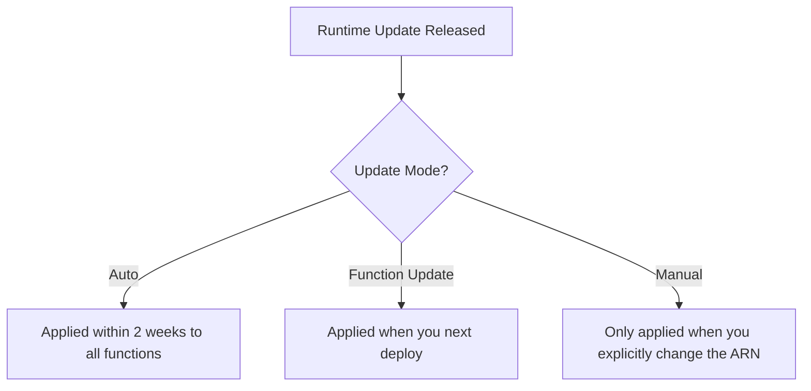

# How to Use Lambda Runtime Management Controls

Author: [nawazdhandala](https://github.com/nawazdhandala)

Tags: AWS, Lambda, Runtime Management, Serverless, DevOps, Governance

Description: Learn how to use AWS Lambda runtime management controls to manage runtime updates and maintain stability in production environments

---

AWS Lambda runtimes receive regular updates for security patches, bug fixes, and performance improvements. By default, Lambda automatically applies these updates to your functions. For most teams, this is exactly what you want. But when you are running mission-critical production workloads, an unexpected runtime change can introduce subtle behavior differences that break things.

Lambda runtime management controls give you the ability to choose when and how runtime updates are applied. You can let AWS handle everything automatically, you can lock to a specific runtime version, or you can use a function update as the trigger to adopt a new runtime version.

This guide walks through the three runtime update modes, when to use each one, and how to configure them.

## Understanding Lambda Runtimes

Every Lambda function runs on a managed runtime that includes the language interpreter (Node.js, Python, Java, etc.), the Lambda runtime API client, and the underlying Amazon Linux operating system. AWS periodically releases new versions of these runtimes.

A runtime version is identified by an ARN like:

```
arn:aws:lambda:us-east-1::runtime:python3.12:20240101
```

The date component indicates the specific version. When AWS releases a patch, a new version with a new date is published.



## The Three Update Modes

### 1. Auto (Default)

This is the default mode. AWS applies runtime updates to your function within roughly two weeks of a new runtime version becoming available. You do not need to do anything.

**Best for**: Development environments, non-critical workloads, and teams that want to stay current without manual intervention.

```bash
# Set runtime management to Auto (this is the default)
aws lambda put-runtime-management-config \
  --function-name my-function \
  --update-runtime-on "Auto"
```

### 2. Function Update

In this mode, Lambda only applies a new runtime version when you make an update to your function (deploying new code or changing configuration). If you do not touch the function, it stays on its current runtime version indefinitely.

**Best for**: Production workloads where you want runtime updates tied to your deployment pipeline. You control the timing by choosing when to deploy.

```bash
# Apply runtime updates only on function deployment
aws lambda put-runtime-management-config \
  --function-name my-function \
  --update-runtime-on "FunctionUpdate"
```

This mode gives you a natural coupling between code changes and runtime changes. When you deploy and run your test suite, you validate both your code and any runtime changes together.

### 3. Manual

In this mode, you explicitly pin your function to a specific runtime version ARN. Lambda never changes the runtime unless you update the ARN yourself.

**Best for**: Highly regulated environments, functions with strict compatibility requirements, or situations where you need to roll back to a previous runtime version.

```bash
# Pin to a specific runtime version
aws lambda put-runtime-management-config \
  --function-name my-function \
  --update-runtime-on "Manual" \
  --runtime-version-arn "arn:aws:lambda:us-east-1::runtime:python3.12:20240815"
```

## Finding Available Runtime Versions

To pin to a specific version, you first need to know what versions are available. You can find the current runtime version of your function in the console or via the CLI.

```bash
# Get the current runtime management configuration
aws lambda get-runtime-management-config \
  --function-name my-function
```

The response includes the current `RuntimeVersionArn`:

```json
{
  "UpdateRuntimeOn": "Auto",
  "RuntimeVersionArn": "arn:aws:lambda:us-east-1::runtime:python3.12:20240815"
}
```

You can also find the runtime version in your function's CloudWatch logs. Each invocation logs the runtime version in the INIT_START log line.

## Practical Configuration Strategies

### Strategy 1: Progressive Rollout

Use different modes across your environments to catch issues early.

```bash
# Development: Always on the latest runtime
aws lambda put-runtime-management-config \
  --function-name my-function-dev \
  --update-runtime-on "Auto"

# Staging: Update on deployment, catches issues during QA
aws lambda put-runtime-management-config \
  --function-name my-function-staging \
  --update-runtime-on "FunctionUpdate"

# Production: Manual control for maximum stability
aws lambda put-runtime-management-config \
  --function-name my-function-prod \
  --update-runtime-on "Manual" \
  --runtime-version-arn "arn:aws:lambda:us-east-1::runtime:python3.12:20240815"
```

This way, dev catches runtime issues first, staging validates during your release process, and production only changes when you explicitly approve it.

### Strategy 2: Fleet-Wide Governance with AWS Organizations

For organizations managing hundreds of Lambda functions, you can use AWS Config rules or Service Control Policies to enforce runtime management settings.

```json
{
  "Version": "2012-10-17",
  "Statement": [
    {
      "Sid": "RequireManualRuntimeManagement",
      "Effect": "Deny",
      "Action": "lambda:PutRuntimeManagementConfig",
      "Resource": "arn:aws:lambda:*:*:function:prod-*",
      "Condition": {
        "StringNotEquals": {
          "lambda:UpdateRuntimeOn": "Manual"
        }
      }
    }
  ]
}
```

This SCP ensures that any function with a "prod-" prefix must use manual runtime management.

### Strategy 3: Automated Version Tracking

Create a Lambda function that periodically checks runtime versions across your fleet and alerts on mismatches.

```python
# runtime_checker.py - Track runtime versions across functions
import boto3
import json

lambda_client = boto3.client('lambda')

def lambda_handler(event, context):
    """Check runtime versions across all Lambda functions."""

    paginator = lambda_client.get_paginator('list_functions')
    version_report = {}

    for page in paginator.paginate():
        for function in page['Functions']:
            func_name = function['FunctionName']
            runtime = function.get('Runtime', 'unknown')

            try:
                config = lambda_client.get_runtime_management_config(
                    FunctionName=func_name
                )
                version_arn = config.get('RuntimeVersionArn', 'unknown')
                update_mode = config.get('UpdateRuntimeOn', 'unknown')

                # Group by runtime and version
                key = f"{runtime}:{version_arn}"
                if key not in version_report:
                    version_report[key] = {
                        'runtime': runtime,
                        'version': version_arn,
                        'functions': [],
                        'count': 0
                    }
                version_report[key]['functions'].append(func_name)
                version_report[key]['count'] += 1

            except Exception as e:
                print(f"Could not get runtime config for {func_name}: {e}")

    # Log the report
    for key, info in version_report.items():
        print(f"Runtime {info['runtime']} version {info['version']}: "
              f"{info['count']} functions")

    return version_report
```

## Handling Runtime Deprecation

AWS eventually deprecates old runtime versions. When a runtime reaches end of support:

1. You can no longer create new functions with that runtime.
2. You can no longer update the runtime version on existing functions.
3. Existing functions continue to run but no longer receive security patches.

If you are using manual mode and pinned to an old runtime version, you need to plan your migration before the runtime reaches end of support. AWS publishes deprecation timelines well in advance.

```bash
# Check if your function is using a deprecated or soon-to-be-deprecated runtime
aws lambda get-function \
  --function-name my-function \
  --query 'Configuration.Runtime'
```

## CloudWatch Metrics for Runtime Changes

Lambda emits CloudWatch metrics that you can use to detect runtime changes and their impact.

Monitor these after a runtime change:

- **Duration**: Look for changes in p50 and p99 execution time.
- **Errors**: Watch for increases in error rates.
- **Init Duration**: Cold start times may change with new runtime versions.
- **Throttles**: New runtime overhead could change concurrency patterns.

Set up CloudWatch alarms on these metrics to catch regressions quickly. For a comprehensive monitoring setup, see our guide on [connecting Amazon Managed Grafana to CloudWatch](https://oneuptime.com/blog/post/2026-02-12-connect-amazon-managed-grafana-to-cloudwatch/view).

## Rolling Back a Runtime Version

If a new runtime version causes issues, here is how to roll back depending on your mode:

For **Manual** mode, simply change the ARN back:

```bash
# Roll back to the previous runtime version
aws lambda put-runtime-management-config \
  --function-name my-function \
  --update-runtime-on "Manual" \
  --runtime-version-arn "arn:aws:lambda:us-east-1::runtime:python3.12:20240701"
```

For **Function Update** mode, deploying any change to your function will apply the latest runtime. To avoid this, switch to Manual mode first, pin the old version, then investigate.

For **Auto** mode, you cannot prevent the update. Switch to Manual mode and pin the old version.

## Wrapping Up

Runtime management controls are about giving you the right level of control for your risk tolerance. Most functions are fine with Auto mode. Production workloads benefit from Function Update mode, which ties runtime changes to your deployment pipeline. And regulated or sensitive environments may need Manual mode for full control.

The important thing is to be intentional about your choice. Default Auto mode works until it does not, and by then you are debugging a production issue caused by a runtime change you did not expect. Choosing your mode proactively puts you in control.
