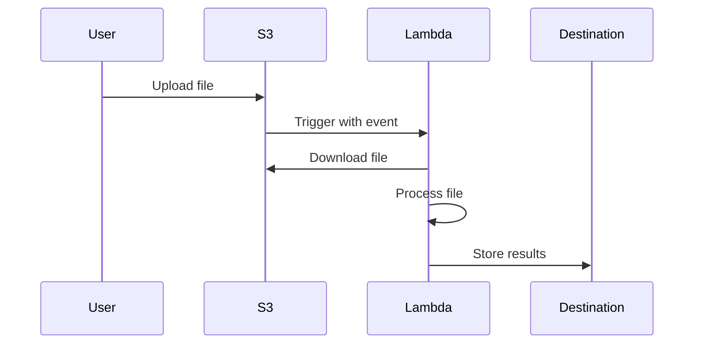

# How to Use Lambda to Process Files from S3

Author: [nawazdhandala](https://github.com/nawazdhandala)

Tags: AWS, Lambda, S3, Serverless, File Processing

Description: Learn how to trigger AWS Lambda functions from S3 events to automatically process uploaded files, including setup, code examples, and best practices.

---

One of the most popular Lambda patterns is reacting to files uploaded to S3. Upload a CSV and Lambda parses it. Drop an image and Lambda generates thumbnails. Add a log file and Lambda indexes it. The event-driven nature of this setup means you don't need to poll for new files or run a background worker - processing happens automatically the moment a file lands in the bucket.

Let's build this from scratch, covering the S3 event notification setup, the Lambda function code, error handling, and the edge cases that'll bite you in production.

## How It Works

S3 can send event notifications when objects are created, deleted, or modified. When you configure S3 to notify Lambda, every matching event triggers your function with metadata about the uploaded object - the bucket name, object key, size, and event type.



## Step 1: Create the Lambda Function

Let's start with a Lambda function that processes CSV files. This example reads a CSV from S3, parses it, and writes the results to DynamoDB.

```javascript
// Lambda function triggered by S3 upload events
const { S3Client, GetObjectCommand } = require('@aws-sdk/client-s3');
const { DynamoDBClient, PutItemCommand } = require('@aws-sdk/client-dynamodb');
const { parse } = require('csv-parse/sync');

const s3 = new S3Client({ region: 'us-east-1' });
const dynamo = new DynamoDBClient({ region: 'us-east-1' });

exports.handler = async (event) => {
  // S3 events can contain multiple records
  for (const record of event.Records) {
    const bucket = record.s3.bucket.name;
    const key = decodeURIComponent(record.s3.object.key.replace(/\+/g, ' '));

    console.log(`Processing file: s3://${bucket}/${key}`);

    // Download the file from S3
    const response = await s3.send(new GetObjectCommand({ Bucket: bucket, Key: key }));
    const body = await response.Body.transformToString();

    // Parse the CSV content
    const records = parse(body, {
      columns: true,        // Use first row as headers
      skip_empty_lines: true,
      trim: true,
    });

    console.log(`Parsed ${records.length} records from CSV`);

    // Process each row
    for (const row of records) {
      await dynamo.send(new PutItemCommand({
        TableName: 'ProcessedRecords',
        Item: {
          id: { S: row.id },
          name: { S: row.name },
          email: { S: row.email },
          processedAt: { S: new Date().toISOString() },
        },
      }));
    }
  }

  return { statusCode: 200, body: 'Processing complete' };
};
```

## Step 2: Set Up IAM Permissions

Your Lambda function needs permission to read from S3 and write to whatever destination you're using:

```json
{
  "Version": "2012-10-17",
  "Statement": [
    {
      "Effect": "Allow",
      "Action": [
        "s3:GetObject"
      ],
      "Resource": "arn:aws:s3:::my-upload-bucket/*"
    },
    {
      "Effect": "Allow",
      "Action": [
        "dynamodb:PutItem"
      ],
      "Resource": "arn:aws:dynamodb:us-east-1:123456789012:table/ProcessedRecords"
    },
    {
      "Effect": "Allow",
      "Action": [
        "logs:CreateLogGroup",
        "logs:CreateLogStream",
        "logs:PutLogEvents"
      ],
      "Resource": "arn:aws:logs:*:*:*"
    }
  ]
}
```

## Step 3: Configure the S3 Event Notification

You can set up the trigger through the AWS Console, CLI, or Infrastructure as Code.

Using the AWS CLI:

```bash
# First, add permission for S3 to invoke the Lambda function
aws lambda add-permission \
  --function-name s3-file-processor \
  --principal s3.amazonaws.com \
  --statement-id s3-trigger \
  --action "lambda:InvokeFunction" \
  --source-arn arn:aws:s3:::my-upload-bucket \
  --source-account 123456789012

# Then configure the S3 bucket notification
aws s3api put-bucket-notification-configuration \
  --bucket my-upload-bucket \
  --notification-configuration '{
    "LambdaFunctionConfigurations": [
      {
        "LambdaFunctionArn": "arn:aws:lambda:us-east-1:123456789012:function:s3-file-processor",
        "Events": ["s3:ObjectCreated:*"],
        "Filter": {
          "Key": {
            "FilterRules": [
              {"Name": "prefix", "Value": "uploads/"},
              {"Name": "suffix", "Value": ".csv"}
            ]
          }
        }
      }
    ]
  }'
```

This configuration triggers Lambda only when objects with the `.csv` extension are created under the `uploads/` prefix.

Using CloudFormation:

```yaml
# S3 bucket with Lambda trigger
Resources:
  UploadBucket:
    Type: AWS::S3::Bucket
    Properties:
      BucketName: my-upload-bucket
      NotificationConfiguration:
        LambdaConfigurations:
          - Event: s3:ObjectCreated:*
            Function: !GetAtt ProcessorFunction.Arn
            Filter:
              S3Key:
                Rules:
                  - Name: prefix
                    Value: uploads/
                  - Name: suffix
                    Value: .csv

  # Permission for S3 to invoke Lambda
  S3InvokePermission:
    Type: AWS::Lambda::Permission
    Properties:
      FunctionName: !Ref ProcessorFunction
      Action: lambda:InvokeFunction
      Principal: s3.amazonaws.com
      SourceArn: !GetAtt UploadBucket.Arn
```

## Handling Large Files

Lambda has a 15-minute execution timeout and limited memory (up to 10 GB). For large files, you need to stream the data instead of loading everything into memory.

Here's a streaming approach for large CSV files:

```javascript
// Stream large files instead of loading them entirely into memory
const { S3Client, GetObjectCommand } = require('@aws-sdk/client-s3');
const { parse } = require('csv-parse');
const { pipeline } = require('stream/promises');
const { Transform } = require('stream');

const s3 = new S3Client({ region: 'us-east-1' });

exports.handler = async (event) => {
  const { bucket, key } = extractS3Info(event.Records[0]);

  const response = await s3.send(new GetObjectCommand({ Bucket: bucket, Key: key }));

  let processedCount = 0;
  const batchSize = 25;
  let batch = [];

  // Create a transform stream that processes rows in batches
  const processor = new Transform({
    objectMode: true,
    async transform(row, encoding, callback) {
      batch.push(row);
      if (batch.length >= batchSize) {
        await writeBatch(batch);
        processedCount += batch.length;
        batch = [];
      }
      callback();
    },
    async flush(callback) {
      if (batch.length > 0) {
        await writeBatch(batch);
        processedCount += batch.length;
      }
      callback();
    },
  });

  // Pipe the S3 stream through the CSV parser and processor
  await pipeline(
    response.Body,
    parse({ columns: true, trim: true }),
    processor
  );

  console.log(`Processed ${processedCount} records`);
};
```

## The Recursive Trigger Trap

This is the most dangerous gotcha. If your Lambda reads from a bucket and writes back to the same bucket, you can create an infinite loop. Lambda triggers on the write, which triggers another invocation, which writes again, and so on. This can rack up thousands of dollars in minutes.

To avoid this:

1. **Use different buckets** for input and output
2. **Use different prefixes** and filter your trigger carefully
3. **Add a check** in your code to skip files that have already been processed

```javascript
// Safety check to prevent recursive triggers
exports.handler = async (event) => {
  for (const record of event.Records) {
    const key = decodeURIComponent(record.s3.object.key.replace(/\+/g, ' '));

    // Skip if the file is in the output directory
    if (key.startsWith('processed/')) {
      console.log(`Skipping already-processed file: ${key}`);
      continue;
    }

    // Process the file and write to a different prefix
    await processFile(record.s3.bucket.name, key);
  }
};
```

## Error Handling and Dead Letter Queues

S3 event notifications are asynchronous. If your Lambda function fails, AWS retries it twice. After that, the event is lost unless you've configured a dead letter queue (DLQ) or an on-failure destination.

Set up an SQS dead letter queue to capture failed events:

```bash
# Configure a DLQ for failed S3 processing events
aws lambda put-function-event-invoke-config \
  --function-name s3-file-processor \
  --maximum-retry-attempts 2 \
  --destination-config '{
    "OnFailure": {
      "Destination": "arn:aws:sqs:us-east-1:123456789012:s3-processing-dlq"
    }
  }'
```

For more on Lambda error handling, see our guide on [handling errors in Lambda functions gracefully](https://oneuptime.com/blog/post/2026-02-12-handle-errors-in-lambda-functions-gracefully/view).

## Processing Different File Types

You can set up multiple triggers for different file types, each invoking a different Lambda function:

```yaml
# Multiple triggers for different file types
NotificationConfiguration:
  LambdaConfigurations:
    - Event: s3:ObjectCreated:*
      Function: !GetAtt CsvProcessorFunction.Arn
      Filter:
        S3Key:
          Rules:
            - Name: suffix
              Value: .csv
    - Event: s3:ObjectCreated:*
      Function: !GetAtt ImageProcessorFunction.Arn
      Filter:
        S3Key:
          Rules:
            - Name: suffix
              Value: .jpg
    - Event: s3:ObjectCreated:*
      Function: !GetAtt JsonProcessorFunction.Arn
      Filter:
        S3Key:
          Rules:
            - Name: suffix
              Value: .json
```

## Performance Tips

- **Increase Lambda memory** to get more CPU. Processing files is often CPU-bound, and Lambda allocates CPU proportionally to memory.
- **Use /tmp for scratch space** - Lambda provides up to 10 GB of ephemeral storage for temporary files.
- **Process in parallel** within a single invocation when dealing with many small operations.
- **Set appropriate timeouts** based on your largest expected file size.

## Wrapping Up

Lambda + S3 event notifications is one of the most powerful serverless patterns in AWS. It lets you build reactive file processing pipelines without managing any infrastructure. The key things to remember: avoid the recursive trigger trap, stream large files instead of loading them into memory, configure dead letter queues for failed events, and use appropriate file type filters to route different files to different processors.
