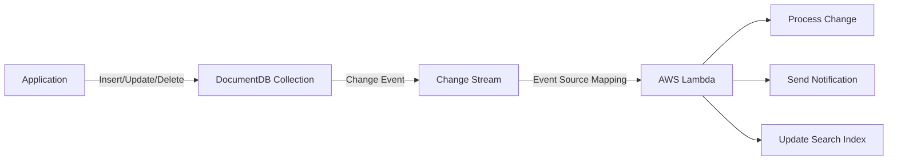

# How to Use Lambda with DocumentDB Change Streams

Author: [nawazdhandala](https://github.com/nawazdhandala)

Tags: AWS, Lambda, DocumentDB, Change Streams, Event-Driven, Serverless

Description: Learn how to trigger AWS Lambda functions from Amazon DocumentDB change streams to build reactive event-driven applications

---

Amazon DocumentDB is AWS's managed document database service compatible with MongoDB. One of its most powerful features is change streams, which let you react to database changes in real time. Combine this with AWS Lambda, and you get a fully serverless, event-driven pipeline that fires whenever documents are inserted, updated, or deleted.

This pattern is incredibly useful. You can build audit logs, trigger notifications, synchronize data to other systems, or maintain materialized views - all without polling the database.

In this guide, you will set up Lambda to consume DocumentDB change streams, handle the event payloads, and configure the integration for reliability.

## How Change Streams Work

DocumentDB change streams use the database's operation log (oplog) to track changes. When you open a change stream, DocumentDB sends you a continuous feed of change events for a collection, database, or the entire cluster.



Lambda uses an event source mapping to poll the change stream, similar to how it works with Kinesis or DynamoDB Streams. The key difference is that DocumentDB change streams are MongoDB-compatible, so the event format follows the MongoDB change stream specification.

## Prerequisites

Before you start, you need:

- An Amazon DocumentDB cluster running in a VPC
- Change streams enabled on the cluster (enabled by default on DocumentDB 4.0+)
- A Lambda function with VPC access to the DocumentDB cluster
- IAM permissions and network connectivity between Lambda and DocumentDB

## Step 1: Enable Change Streams on DocumentDB

Change streams are enabled by default on DocumentDB 4.0 and later. If you are running an older version or need to verify, check the cluster parameter group.

```bash
# Verify change streams are enabled
aws docdb describe-db-cluster-parameters \
  --db-cluster-parameter-group-name default.docdb4.0 \
  --filters "Name=parameter-name,Values=change_stream_log_retention_duration"
```

The `change_stream_log_retention_duration` parameter controls how long change events are retained. The default is 3 hours. For production workloads, consider increasing this to give your Lambda function more time to catch up after failures.

```bash
# Increase retention to 24 hours (in seconds)
aws docdb modify-db-cluster-parameter-group \
  --db-cluster-parameter-group-name my-docdb-params \
  --parameters "ParameterName=change_stream_log_retention_duration,ParameterValue=86400,ApplyMethod=immediate"
```

## Step 2: Store DocumentDB Credentials in Secrets Manager

Lambda needs credentials to connect to DocumentDB. Store them in Secrets Manager.

```bash
# Store DocumentDB credentials
aws secretsmanager create-secret \
  --name docdb/lambda-consumer \
  --secret-string '{"username":"lambdauser","password":"your-secure-password"}'
```

Create a dedicated user in DocumentDB with read-only access for your Lambda consumer. There is no need to give it write permissions unless your processing logic writes back to DocumentDB.

```javascript
// Run this in the DocumentDB mongo shell
db.createUser({
  user: "lambdauser",
  pwd: "your-secure-password",
  roles: [
    { role: "read", db: "myapp" }
  ]
});
```

## Step 3: Configure Lambda VPC and Security Groups

Lambda needs network access to both DocumentDB and Secrets Manager.

```bash
# Update Lambda to run in the DocumentDB VPC
aws lambda update-function-configuration \
  --function-name docdb-stream-processor \
  --vpc-config SubnetIds=subnet-abc123,subnet-def456,SecurityGroupIds=sg-lambda-docdb
```

Make sure the security group rules allow:

- Lambda security group to reach DocumentDB on port 27017
- Lambda security group to reach Secrets Manager (either via VPC endpoint or NAT Gateway)

Setting up a VPC endpoint for Secrets Manager avoids the need for a NAT Gateway, which saves cost.

```bash
# Create a VPC endpoint for Secrets Manager
aws ec2 create-vpc-endpoint \
  --vpc-id vpc-abc123 \
  --service-name com.amazonaws.us-east-1.secretsmanager \
  --vpc-endpoint-type Interface \
  --subnet-ids subnet-abc123 subnet-def456 \
  --security-group-ids sg-vpc-endpoint
```

## Step 4: Write the Lambda Function

The event payload from DocumentDB change streams contains the full change event from MongoDB's change stream specification.

```python
# handler.py - Process DocumentDB change stream events
import json

def lambda_handler(event, context):
    """Process DocumentDB change stream events."""

    failed_items = []

    for i, record in enumerate(event.get('events', [])):
        try:
            # The change event follows MongoDB change stream format
            change_event = record['event']

            operation_type = change_event.get('operationType')
            namespace = change_event.get('ns', {})
            db_name = namespace.get('db')
            collection_name = namespace.get('coll')

            print(f"Change: {operation_type} on {db_name}.{collection_name}")

            if operation_type == 'insert':
                handle_insert(change_event)
            elif operation_type == 'update':
                handle_update(change_event)
            elif operation_type == 'delete':
                handle_delete(change_event)
            elif operation_type == 'replace':
                handle_replace(change_event)
            else:
                print(f"Unhandled operation type: {operation_type}")

        except Exception as e:
            print(f"Error processing event {i}: {str(e)}")
            failed_items.append({"itemIdentifier": str(i)})

    return {"batchItemFailures": failed_items}


def handle_insert(event):
    """Process a new document insertion."""
    full_document = event.get('fullDocument', {})
    document_id = event.get('documentKey', {}).get('_id')

    print(f"New document inserted: {document_id}")
    print(f"Document: {json.dumps(full_document, default=str)}")

    # Example: Send to an analytics pipeline
    # Example: Update a search index
    # Example: Trigger a welcome email for new users


def handle_update(event):
    """Process a document update."""
    document_id = event.get('documentKey', {}).get('_id')
    update_description = event.get('updateDescription', {})
    updated_fields = update_description.get('updatedFields', {})
    removed_fields = update_description.get('removedFields', [])

    print(f"Document updated: {document_id}")
    print(f"Updated fields: {json.dumps(updated_fields, default=str)}")
    print(f"Removed fields: {removed_fields}")

    # Example: Sync changes to a read replica
    # Example: Invalidate a cache entry
    # Example: Log the change for audit trail


def handle_delete(event):
    """Process a document deletion."""
    document_id = event.get('documentKey', {}).get('_id')

    print(f"Document deleted: {document_id}")

    # Example: Clean up related resources
    # Example: Update dependent systems
    # Example: Archive the deletion event


def handle_replace(event):
    """Process a full document replacement."""
    document_id = event.get('documentKey', {}).get('_id')
    full_document = event.get('fullDocument', {})

    print(f"Document replaced: {document_id}")
    print(f"New document: {json.dumps(full_document, default=str)}")
```

## Step 5: Create the Event Source Mapping

Now connect Lambda to the DocumentDB change stream.

```bash
# Create the event source mapping
aws lambda create-event-source-mapping \
  --function-name docdb-stream-processor \
  --event-source-arn arn:aws:rds:us-east-1:123456789012:cluster:my-docdb-cluster \
  --source-access-configurations '[
    {"Type": "BASIC_AUTH", "URI": "arn:aws:secretsmanager:us-east-1:123456789012:secret:docdb/lambda-consumer"}
  ]' \
  --document-db-event-source-config '{
    "DatabaseName": "myapp",
    "CollectionName": "orders",
    "FullDocument": "UpdateLookup"
  }' \
  --starting-position LATEST \
  --batch-size 100 \
  --maximum-batching-window-in-seconds 10 \
  --function-response-types "ReportBatchItemFailures"
```

Key configuration options:

- **DatabaseName**: The database to watch for changes.
- **CollectionName**: The specific collection. Omit this to watch the entire database.
- **FullDocument**: Set to "UpdateLookup" to include the full document in update events (not just the changed fields).
- **starting-position**: LATEST for new changes only, or TRIM_HORIZON for all available changes.

## Practical Use Cases

### Building an Audit Log

One of the most common uses is creating an immutable audit trail. Every change to a collection gets captured and stored separately.

```python
# Write change events to an audit log in DynamoDB
import boto3
import time

dynamodb = boto3.resource('dynamodb')
audit_table = dynamodb.Table('document-audit-log')

def write_audit_entry(change_event):
    """Write a change event to the audit log."""
    audit_table.put_item(Item={
        'document_id': str(change_event['documentKey']['_id']),
        'timestamp': int(time.time() * 1000),
        'operation': change_event['operationType'],
        'collection': change_event['ns']['coll'],
        'changes': json.dumps(change_event.get('updateDescription', {}), default=str),
        'full_document': json.dumps(change_event.get('fullDocument', {}), default=str),
    })
```

### Syncing to Elasticsearch

Another popular pattern is keeping a search index in sync with your primary data store. For more on event-driven data synchronization, check out our post on [implementing the outbox pattern with DynamoDB Streams](https://oneuptime.com/blog/post/implement-outbox-pattern-with-dynamodb-streams/view).

## Handling Failures and Retries

When Lambda fails to process a batch, it retries from the last successfully committed resume token. This means idempotency matters. If your function partially processes a batch before failing, some records may be processed twice on retry.

Design your downstream operations to handle duplicates. Use conditional writes, upserts, or deduplication keys to make your processing idempotent.

## Monitoring

Monitor these metrics to keep your pipeline healthy:

- Lambda invocation errors and duration
- DocumentDB cluster CPU and connections
- Change stream lag (how far behind the consumer is)

Set up CloudWatch alarms on Lambda errors and duration to catch problems early.

## Wrapping Up

Lambda with DocumentDB change streams gives you a reactive, serverless pipeline that responds to database changes in near real time. The setup involves some VPC networking configuration, but once connected, it runs hands-free. Lambda manages the change stream cursor, handles retries, and scales based on the volume of changes. Focus your effort on the processing logic, and let AWS handle the infrastructure.
