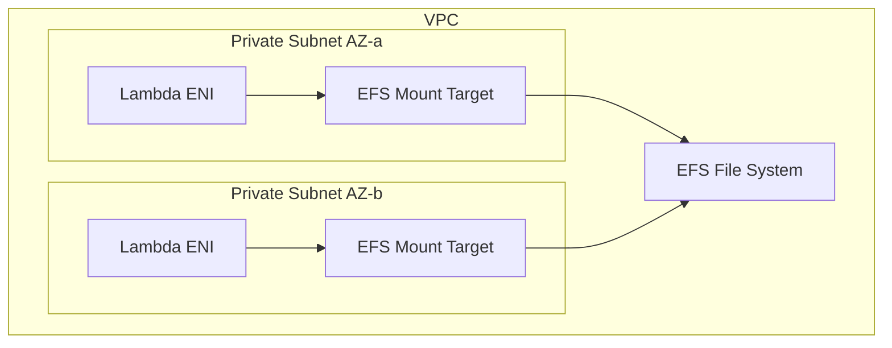

# How to Use Lambda with EFS for Shared File Storage

Author: [nawazdhandala](https://github.com/nawazdhandala)

Tags: AWS, Lambda, EFS, Storage, Serverless

Description: Learn how to mount Amazon EFS file systems to AWS Lambda functions for persistent, shared storage that works across multiple function invocations and instances.

---

Lambda functions have two built-in storage options: the deployment package (read-only, up to 250 MB) and `/tmp` (read-write, up to 10 GB, but ephemeral). Neither works when you need persistent, shared storage that multiple Lambda invocations or even multiple functions can access simultaneously.

That's where EFS comes in. Amazon Elastic File System provides a fully managed NFS file system that you can mount to your Lambda functions. Every invocation sees the same files. Multiple functions can read and write to the same file system. Data persists between invocations. It's like giving your Lambda functions a shared hard drive.

## When You Need EFS with Lambda

EFS makes sense when:

- Multiple Lambda invocations need to share data (e.g., a shared cache or model files)
- You need more than 10 GB of working storage
- Processing requires large reference files (ML models, lookup tables)
- Lambda functions need to exchange data through files
- You're migrating an application that relies on file system access

EFS does not make sense when:

- You just need temporary scratch space (use `/tmp`)
- You're storing output files (use S3)
- You need high-throughput, low-latency access (EFS adds network latency)

## Architecture Overview

Lambda accesses EFS through an EFS Access Point within your VPC. Your Lambda function needs to be VPC-connected, and EFS mount targets must exist in the same subnets.



## Step 1: Create the EFS File System

First, create the EFS file system and mount targets:

```bash
# Create the EFS file system
aws efs create-file-system \
  --performance-mode generalPurpose \
  --throughput-mode bursting \
  --encrypted \
  --tags Key=Name,Value=lambda-shared-storage

# Note the FileSystemId from the output, e.g., fs-0abc123def456
```

Create mount targets in each subnet where Lambda will run:

```bash
# Create mount targets in your private subnets
aws efs create-mount-target \
  --file-system-id fs-0abc123def456 \
  --subnet-id subnet-private-a \
  --security-groups sg-efs-access

aws efs create-mount-target \
  --file-system-id fs-0abc123def456 \
  --subnet-id subnet-private-b \
  --security-groups sg-efs-access
```

## Step 2: Create an Access Point

EFS Access Points provide application-specific entry points into the file system with enforced user identity and directory:

```bash
# Create an access point for the Lambda function
aws efs create-access-point \
  --file-system-id fs-0abc123def456 \
  --posix-user "Uid=1000,Gid=1000" \
  --root-directory "Path=/lambda-data,CreationInfo={OwnerUid=1000,OwnerGid=1000,Permissions=755}"
```

The access point:
- Sets the POSIX user identity Lambda uses when accessing files
- Creates the root directory automatically if it doesn't exist
- Restricts Lambda to a specific directory within the file system

## Step 3: Configure Security Groups

The EFS security group must allow NFS traffic (port 2049) from Lambda:

```yaml
# Security group for EFS - allows NFS from Lambda
EfsSecurityGroup:
  Type: AWS::EC2::SecurityGroup
  Properties:
    GroupDescription: Allow NFS from Lambda
    VpcId: !Ref MyVPC
    SecurityGroupIngress:
      - IpProtocol: tcp
        FromPort: 2049
        ToPort: 2049
        SourceSecurityGroupId: !Ref LambdaSecurityGroup

# Lambda security group needs outbound NFS
LambdaSecurityGroup:
  Type: AWS::EC2::SecurityGroup
  Properties:
    GroupDescription: Lambda function SG
    VpcId: !Ref MyVPC
    SecurityGroupEgress:
      - IpProtocol: tcp
        FromPort: 2049
        ToPort: 2049
        DestinationSecurityGroupId: !Ref EfsSecurityGroup
```

## Step 4: Mount EFS to Lambda

Now configure your Lambda function to mount the EFS access point:

```bash
# Add the EFS mount to your Lambda function
aws lambda update-function-configuration \
  --function-name my-function \
  --file-system-configs '[{
    "Arn": "arn:aws:elasticfilesystem:us-east-1:123456789012:access-point/fsap-0abc123",
    "LocalMountPath": "/mnt/data"
  }]' \
  --vpc-config '{"SubnetIds": ["subnet-private-a", "subnet-private-b"], "SecurityGroupIds": ["sg-lambda"]}'
```

Using CloudFormation:

```yaml
# Complete CloudFormation setup for Lambda with EFS
Resources:
  SharedFileSystem:
    Type: AWS::EFS::FileSystem
    Properties:
      Encrypted: true
      PerformanceMode: generalPurpose
      ThroughputMode: bursting

  MountTargetA:
    Type: AWS::EFS::MountTarget
    Properties:
      FileSystemId: !Ref SharedFileSystem
      SubnetId: !Ref PrivateSubnetA
      SecurityGroups:
        - !Ref EfsSecurityGroup

  MountTargetB:
    Type: AWS::EFS::MountTarget
    Properties:
      FileSystemId: !Ref SharedFileSystem
      SubnetId: !Ref PrivateSubnetB
      SecurityGroups:
        - !Ref EfsSecurityGroup

  AccessPoint:
    Type: AWS::EFS::AccessPoint
    Properties:
      FileSystemId: !Ref SharedFileSystem
      PosixUser:
        Uid: "1000"
        Gid: "1000"
      RootDirectory:
        Path: /lambda-data
        CreationInfo:
          OwnerUid: "1000"
          OwnerGid: "1000"
          Permissions: "755"

  ProcessorFunction:
    Type: AWS::Lambda::Function
    DependsOn:
      - MountTargetA
      - MountTargetB
    Properties:
      FunctionName: efs-processor
      Runtime: python3.12
      Handler: index.handler
      MemorySize: 512
      Timeout: 60
      Role: !GetAtt LambdaRole.Arn
      VpcConfig:
        SubnetIds:
          - !Ref PrivateSubnetA
          - !Ref PrivateSubnetB
        SecurityGroupIds:
          - !Ref LambdaSecurityGroup
      FileSystemConfigs:
        - Arn: !GetAtt AccessPoint.Arn
          LocalMountPath: /mnt/data
```

## Step 5: Use EFS in Your Lambda Code

Once mounted, EFS appears as a regular directory at the mount path. Standard file operations just work:

```javascript
// Read and write files on EFS - works like a regular filesystem
const fs = require('fs').promises;
const path = require('path');

const EFS_PATH = '/mnt/data';

exports.handler = async (event) => {
  // Write a file to EFS
  const filePath = path.join(EFS_PATH, 'results', `${event.jobId}.json`);
  await fs.mkdir(path.dirname(filePath), { recursive: true });
  await fs.writeFile(filePath, JSON.stringify(event.data, null, 2));

  // Read all result files
  const resultsDir = path.join(EFS_PATH, 'results');
  const files = await fs.readdir(resultsDir);

  console.log(`Total result files on EFS: ${files.length}`);

  // Read a specific file
  const content = await fs.readFile(filePath, 'utf-8');
  return { statusCode: 200, body: content };
};
```

## Use Case: Shared ML Model Loading

A common pattern is storing machine learning models on EFS so they don't need to be included in the deployment package:

```python
# Load an ML model from EFS - shared across all invocations
import json
import os

MODEL_PATH = '/mnt/data/models/sentiment-model'
model = None

def load_model():
    global model
    if model is not None:
        return model

    # Check if the model exists on EFS
    if os.path.exists(MODEL_PATH):
        print(f"Loading model from EFS: {MODEL_PATH}")
        import torch
        model = torch.load(os.path.join(MODEL_PATH, 'model.pt'))
        return model
    else:
        raise FileNotFoundError(f"Model not found at {MODEL_PATH}")

def handler(event, context):
    model = load_model()
    text = event['text']

    # Run inference
    prediction = model.predict(text)

    return {
        'statusCode': 200,
        'body': json.dumps({'sentiment': prediction})
    }
```

Upload the model to EFS once (from an EC2 instance or another Lambda), and every invocation loads it from the shared filesystem.

## Use Case: File Processing Pipeline

Multiple Lambda functions can work on the same files through EFS:

```python
# Stage 1: Download and save files to EFS
def download_handler(event, context):
    import urllib.request

    url = event['fileUrl']
    filename = event['filename']
    filepath = f"/mnt/data/incoming/{filename}"

    os.makedirs(os.path.dirname(filepath), exist_ok=True)
    urllib.request.urlretrieve(url, filepath)

    return {'filepath': filepath, 'status': 'downloaded'}


# Stage 2: Process files from EFS (separate Lambda function)
def process_handler(event, context):
    filepath = event['filepath']

    # Read the file from EFS
    with open(filepath, 'r') as f:
        data = f.read()

    # Process the data
    result = transform_data(data)

    # Write result to EFS for the next stage
    output_path = filepath.replace('/incoming/', '/processed/')
    os.makedirs(os.path.dirname(output_path), exist_ok=True)
    with open(output_path, 'w') as f:
        f.write(result)

    return {'filepath': output_path, 'status': 'processed'}
```

## Performance Considerations

EFS adds network latency compared to local storage. Here's what to keep in mind:

- **First access is slow** - EFS needs to establish the NFS connection. Subsequent reads in the same invocation are faster.
- **Throughput scales with size** - In bursting mode, throughput depends on how much data is stored. A nearly empty filesystem will be slow.
- **Use Provisioned Throughput** for consistent performance if your filesystem is small but access is heavy.
- **Read-heavy workloads** work well. Write-heavy workloads may see higher latency.
- **Cache locally** - If you read the same file repeatedly, copy it to `/tmp` on first access:

```javascript
// Cache frequently read files in /tmp for faster access
const fs = require('fs').promises;

async function getFile(efsPath) {
  const tmpPath = `/tmp/${efsPath.replace(/\//g, '_')}`;

  try {
    // Try /tmp first (fast local storage)
    return await fs.readFile(tmpPath, 'utf-8');
  } catch {
    // Fall back to EFS and cache in /tmp
    const content = await fs.readFile(efsPath, 'utf-8');
    await fs.writeFile(tmpPath, content);
    return content;
  }
}
```

## IAM Permissions

Your Lambda execution role needs EFS permissions:

```json
{
  "Version": "2012-10-17",
  "Statement": [
    {
      "Effect": "Allow",
      "Action": [
        "elasticfilesystem:ClientMount",
        "elasticfilesystem:ClientWrite"
      ],
      "Resource": "arn:aws:elasticfilesystem:us-east-1:123456789012:file-system/fs-0abc123def456"
    }
  ]
}
```

## Wrapping Up

EFS gives Lambda functions something they normally lack - persistent, shared storage. It's ideal for ML model serving, multi-stage file processing pipelines, and any workload where Lambda functions need to share data through a filesystem. The trade-off is added latency and the need for VPC configuration, so use it when you genuinely need persistent shared storage rather than as a general-purpose storage layer. For more on Lambda VPC configuration, see our guide on [connecting Lambda functions to a VPC](https://oneuptime.com/blog/post/2026-02-12-connect-lambda-functions-to-a-vpc/view).
