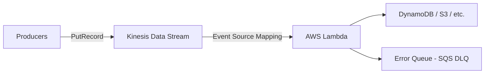
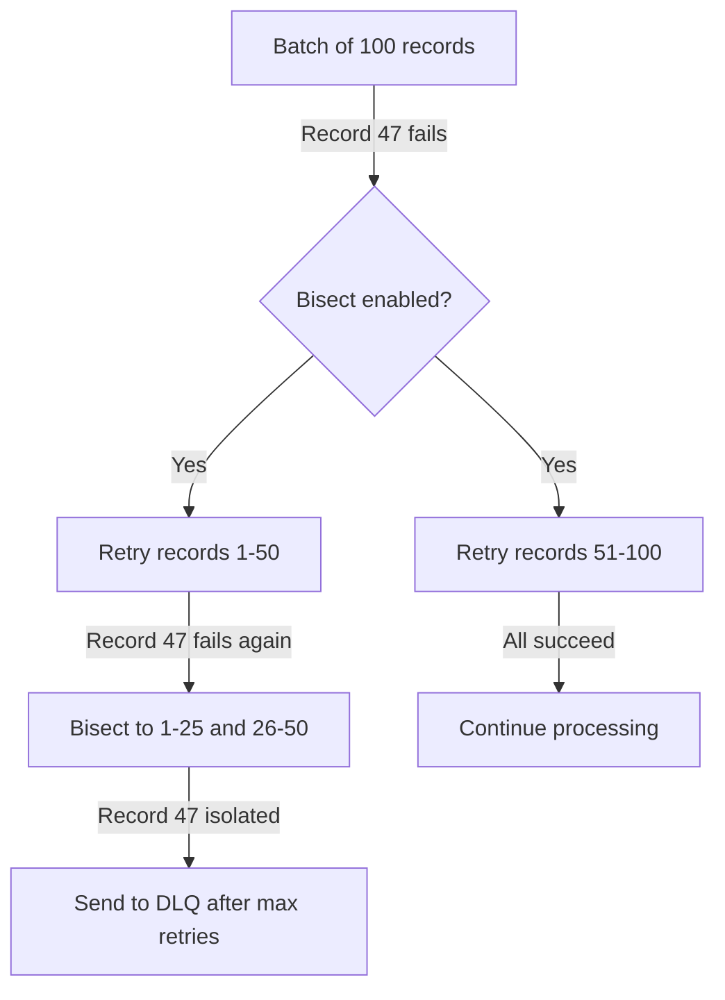

# How to Use Lambda with Kinesis for Real-Time Stream Processing

Author: [nawazdhandala](https://github.com/nawazdhandala)

Tags: AWS, Lambda, Kinesis, Streaming, Real-Time, Serverless

Description: A practical guide to processing real-time data streams with AWS Lambda and Amazon Kinesis Data Streams including configuration and error handling

---

Real-time data processing is one of those things that sounds fancy until you realize how many everyday systems depend on it. Clickstream analytics, IoT sensor feeds, log aggregation, fraud detection - all of these need data processed as it arrives, not minutes or hours later.

Amazon Kinesis Data Streams and AWS Lambda form a natural pair for this workload. Kinesis captures and buffers the streaming data, and Lambda processes each batch of records without you managing any servers. In this guide, you will set up this integration from scratch and learn how to handle the tricky parts like error handling, batching, and scaling.

## Architecture Overview

The flow is straightforward. Producers push records into a Kinesis stream. Lambda polls the stream using an event source mapping and processes records in batches.



Each Kinesis shard gets its own Lambda invocation. If you have 4 shards, up to 4 Lambda functions run concurrently (or more with parallelization factor). This gives you predictable scaling tied directly to your stream's throughput.

## Step 1: Create a Kinesis Data Stream

Start by creating a stream with an appropriate number of shards. Each shard handles up to 1MB/sec of writes and 2MB/sec of reads.

```bash
# Create a Kinesis stream with 2 shards
aws kinesis create-stream \
  --stream-name clickstream-events \
  --shard-count 2

# Wait for the stream to become active
aws kinesis wait stream-exists \
  --stream-name clickstream-events

# Verify the stream status
aws kinesis describe-stream-summary \
  --stream-name clickstream-events
```

For most applications, start with fewer shards and scale up as needed. You can use on-demand mode instead if you prefer automatic scaling.

## Step 2: Write the Lambda Function

Your Lambda function receives a batch of Kinesis records. Each record has a base64-encoded data payload that you need to decode.

```python
# handler.py - Process Kinesis records in batches
import json
import base64
from datetime import datetime

def lambda_handler(event, context):
    """Process a batch of Kinesis records."""

    successful = 0
    failed_records = []

    for i, record in enumerate(event['Records']):
        try:
            # Decode the base64-encoded Kinesis data
            payload = base64.b64decode(record['kinesis']['data']).decode('utf-8')
            data = json.loads(payload)

            # Extract metadata from the Kinesis record
            sequence_number = record['kinesis']['sequenceNumber']
            partition_key = record['kinesis']['partitionKey']
            shard_id = record['eventID'].split(':')[0]

            # Your processing logic goes here
            process_event(data, partition_key)
            successful += 1

        except Exception as e:
            print(f"Error processing record {i}: {str(e)}")
            # Track which records failed for partial batch response
            failed_records.append({
                "itemIdentifier": record['kinesis']['sequenceNumber']
            })

    print(f"Processed {successful}/{len(event['Records'])} records successfully")

    # Return failed items so Lambda retries only those
    if failed_records:
        return {"batchItemFailures": failed_records}

    return {"batchItemFailures": []}


def process_event(data, partition_key):
    """Process a single event record."""

    event_type = data.get('event_type', 'unknown')
    timestamp = data.get('timestamp', datetime.utcnow().isoformat())

    # Example: route different event types to different handlers
    if event_type == 'page_view':
        handle_page_view(data)
    elif event_type == 'click':
        handle_click_event(data)
    elif event_type == 'purchase':
        handle_purchase_event(data)
    else:
        print(f"Unknown event type: {event_type}")


def handle_page_view(data):
    """Process page view events."""
    print(f"Page view: {data.get('url')} by user {data.get('user_id')}")


def handle_click_event(data):
    """Process click events."""
    print(f"Click: {data.get('element_id')} on {data.get('page')}")


def handle_purchase_event(data):
    """Process purchase events."""
    print(f"Purchase: ${data.get('amount')} by user {data.get('user_id')}")
```

The key detail here is the `batchItemFailures` response. This is Lambda's partial batch failure reporting feature. Instead of retrying the entire batch when one record fails, Lambda only retries the failed records.

## Step 3: Create the Event Source Mapping

The event source mapping tells Lambda how to poll your Kinesis stream.

```bash
# Create the event source mapping
aws lambda create-event-source-mapping \
  --function-name kinesis-stream-processor \
  --event-source-arn arn:aws:kinesis:us-east-1:123456789012:stream/clickstream-events \
  --starting-position LATEST \
  --batch-size 100 \
  --maximum-batching-window-in-seconds 5 \
  --parallelization-factor 2 \
  --maximum-retry-attempts 3 \
  --bisect-batch-on-function-error \
  --destination-config '{"OnFailure":{"Destination":"arn:aws:sqs:us-east-1:123456789012:kinesis-dlq"}}' \
  --function-response-types "ReportBatchItemFailures"
```

Let me break down the important settings:

- **batch-size**: Maximum number of records per invocation (up to 10,000).
- **maximum-batching-window-in-seconds**: How long to wait to fill a batch before invoking. Adds latency but improves efficiency.
- **parallelization-factor**: Number of concurrent Lambda invocations per shard (1-10). Setting this to 2 means each shard can have 2 Lambda functions processing in parallel.
- **bisect-batch-on-function-error**: If the whole batch fails, split it in half and retry each half separately. This helps isolate poison pill records.
- **maximum-retry-attempts**: How many times to retry before sending to the DLQ.

## Step 4: Send Test Records

Push some records into your stream to test the pipeline.

```python
# produce_records.py - Send test events to Kinesis
import boto3
import json
import time
import random

kinesis = boto3.client('kinesis', region_name='us-east-1')

# Generate sample clickstream events
event_types = ['page_view', 'click', 'purchase']
pages = ['/home', '/products', '/cart', '/checkout']

for i in range(50):
    event = {
        'event_type': random.choice(event_types),
        'user_id': f'user-{random.randint(1, 100)}',
        'page': random.choice(pages),
        'timestamp': time.time(),
        'amount': round(random.uniform(10.0, 200.0), 2) if random.random() > 0.7 else None,
    }

    # Partition key determines which shard receives the record
    # Using user_id ensures all events for a user go to the same shard
    response = kinesis.put_record(
        StreamName='clickstream-events',
        Data=json.dumps(event),
        PartitionKey=event['user_id']
    )

    print(f"Record {i}: shard={response['ShardId']}, seq={response['SequenceNumber'][:20]}...")

print("Done sending records")
```

The partition key choice matters. By partitioning on user_id, all events for the same user land on the same shard. This guarantees ordering per user, which is important for analytics pipelines.

## Scaling Considerations

Lambda and Kinesis scaling is tied to shards and the parallelization factor.

| Shards | Parallelization Factor | Max Concurrent Lambdas |
|--------|----------------------|----------------------|
| 2      | 1                    | 2                    |
| 2      | 5                    | 10                   |
| 4      | 2                    | 8                    |
| 10     | 10                   | 100                  |

If your processing throughput is not keeping up with incoming records, you have two levers: add more shards or increase the parallelization factor. Increasing parallelization is faster and does not require resharding, but it means records within a shard may be processed out of order across different Lambda invocations.

## Handling Poison Pill Records

Sometimes a single malformed record can cause your entire batch to fail repeatedly. The combination of `bisect-batch-on-function-error` and `ReportBatchItemFailures` handles this gracefully.



With `ReportBatchItemFailures` enabled, your function can report exactly which records failed. Lambda then only retries from the failed record's position in the shard, not the entire batch.

## Monitoring Your Stream Processing

Watch these CloudWatch metrics to keep your pipeline healthy:

- **IteratorAge**: The age of the last record processed. If this keeps growing, your consumers cannot keep up.
- **GetRecords.IteratorAgeMilliseconds**: Same concept at the Kinesis level.
- **Lambda Errors**: Track function errors separately from Kinesis throttling.
- **Lambda Duration**: Ensure processing time stays well below your timeout.

Set up a CloudWatch alarm on IteratorAge. If it exceeds a few minutes, you need to scale up. For a deeper look at monitoring strategies, see our post on [setting up alerting rules in Amazon Managed Prometheus](https://oneuptime.com/blog/post/2026-02-12-set-up-alerting-rules-in-amazon-managed-prometheus/view).

## Cost Optimization Tips

Kinesis charges per shard-hour plus per-PUT payload unit. Lambda charges per invocation and duration. To keep costs down:

1. Use the batching window to accumulate records and reduce Lambda invocations.
2. Right-size your shard count. Over-provisioning shards is the most common cost mistake.
3. Consider Kinesis Data Streams on-demand mode if your traffic is unpredictable.
4. Process records efficiently in your Lambda function. Faster execution means lower Lambda costs.

## Wrapping Up

Lambda and Kinesis together give you a fully managed, auto-scaling stream processing pipeline. The key to a reliable setup is proper error handling with partial batch failures, sensible batching configuration, and monitoring IteratorAge to catch processing lag before it becomes a problem.

Start with a small number of shards and a parallelization factor of 1, then scale both as your throughput demands grow. The beauty of this architecture is that scaling up is just changing a number - no code changes, no infrastructure redesign.
