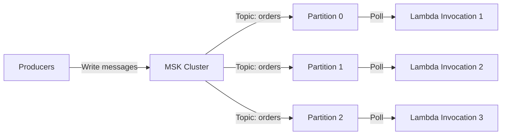

# How to Use Lambda with MSK (Kafka) Event Source Mapping

Author: [nawazdhandala](https://github.com/nawazdhandala)

Tags: AWS, Lambda, MSK, Kafka, Serverless, Event-Driven

Description: Step-by-step guide to configuring AWS Lambda to consume messages from Amazon MSK Kafka topics using event source mappings

---

Apache Kafka is the backbone of many event-driven architectures. It handles massive throughput, provides durable message storage, and supports complex streaming topologies. Amazon Managed Streaming for Apache Kafka (MSK) takes away the operational burden of running Kafka clusters on AWS.

But what about the consumers? Traditionally, you would run a consumer group on EC2 or ECS, managing scaling, failover, and deployments yourself. With Lambda's Kafka event source mapping, AWS handles the consumer for you. Lambda automatically polls your MSK topics, manages offsets, and scales based on the number of partitions.

In this guide, you will set up a Lambda function that consumes messages from an MSK cluster, handle common pitfalls, and configure it for production use.

## How Lambda Consumes from MSK

Lambda acts as a Kafka consumer group under the hood. It creates an internal consumer that polls your MSK topics, fetches batches of messages, and invokes your Lambda function with those batches.



One Lambda invocation runs per partition (or more, with the parallelization factor). This is the same model Kafka uses with traditional consumer groups - one consumer per partition.

## Prerequisites

Before setting up the event source mapping, you need:

- An MSK cluster running in a VPC
- A topic created on the cluster
- A Lambda function deployed in the same VPC (or with VPC connectivity)
- IAM permissions for Lambda to access the MSK cluster

The VPC requirement is important. MSK clusters run inside a VPC, and Lambda needs network access to reach the Kafka brokers. Your Lambda function must be configured with a VPC and subnets that can reach the MSK cluster's security group.

## Step 1: Configure VPC Access for Lambda

Your Lambda function needs to be in the same VPC as your MSK cluster, or in a peered VPC.

```bash
# Update Lambda function to run in the MSK cluster's VPC
aws lambda update-function-configuration \
  --function-name msk-consumer \
  --vpc-config SubnetIds=subnet-abc123,subnet-def456,SecurityGroupIds=sg-msk-consumer
```

The security group `sg-msk-consumer` must allow outbound traffic to the MSK cluster's security group on the Kafka broker ports (typically 9092 for plaintext or 9094 for TLS).

Make sure the MSK cluster's security group allows inbound traffic from the Lambda security group.

```bash
# Allow Lambda's security group to reach MSK brokers
aws ec2 authorize-security-group-ingress \
  --group-id sg-msk-cluster \
  --protocol tcp \
  --port 9094 \
  --source-group sg-msk-consumer
```

## Step 2: Set Up IAM Permissions

Lambda needs specific permissions to interact with MSK.

```json
{
  "Version": "2012-10-17",
  "Statement": [
    {
      "Effect": "Allow",
      "Action": [
        "kafka:DescribeCluster",
        "kafka:DescribeClusterV2",
        "kafka:GetBootstrapBrokers",
        "kafka-cluster:Connect",
        "kafka-cluster:DescribeGroup",
        "kafka-cluster:AlterGroup",
        "kafka-cluster:DescribeTopic",
        "kafka-cluster:ReadData",
        "kafka-cluster:DescribeClusterDynamicConfiguration"
      ],
      "Resource": [
        "arn:aws:kafka:us-east-1:123456789012:cluster/my-msk-cluster/*",
        "arn:aws:kafka:us-east-1:123456789012:topic/my-msk-cluster/*",
        "arn:aws:kafka:us-east-1:123456789012:group/my-msk-cluster/*"
      ]
    },
    {
      "Effect": "Allow",
      "Action": [
        "ec2:CreateNetworkInterface",
        "ec2:DescribeNetworkInterfaces",
        "ec2:DeleteNetworkInterface",
        "ec2:DescribeVpcs",
        "ec2:DescribeSubnets",
        "ec2:DescribeSecurityGroups"
      ],
      "Resource": "*"
    }
  ]
}
```

The VPC networking permissions are required because Lambda creates ENIs (Elastic Network Interfaces) in your VPC to reach the MSK cluster.

## Step 3: Write the Lambda Function

The event payload from MSK is structured differently from other event sources. Messages are grouped by topic and partition.

```python
# handler.py - Process messages from MSK topics
import json
import base64

def lambda_handler(event, context):
    """Process a batch of Kafka messages from MSK."""

    failed_items = []

    # Messages are grouped by topic-partition
    for topic_partition, messages in event['records'].items():
        topic = topic_partition.rsplit('-', 1)[0]
        partition = topic_partition.rsplit('-', 1)[1]

        print(f"Processing {len(messages)} messages from {topic} partition {partition}")

        for message in messages:
            try:
                # Decode the base64-encoded value
                value = base64.b64decode(message['value']).decode('utf-8')
                data = json.loads(value)

                # Decode the key if present
                key = None
                if message.get('key'):
                    key = base64.b64decode(message['key']).decode('utf-8')

                # Extract Kafka metadata
                offset = message['offset']
                timestamp = message['timestamp']
                headers = decode_headers(message.get('headers', []))

                # Process the message
                process_message(topic, key, data, headers, offset)

            except Exception as e:
                print(f"Error processing message at offset {message['offset']}: {e}")
                failed_items.append({
                    "itemIdentifier": f"{topic_partition}-{message['offset']}"
                })

    if failed_items:
        return {"batchItemFailures": failed_items}

    return {"batchItemFailures": []}


def decode_headers(headers):
    """Decode Kafka message headers from base64."""
    decoded = {}
    for header in headers:
        for key, value_list in header.items():
            decoded[key] = base64.b64decode(value_list).decode('utf-8')
    return decoded


def process_message(topic, key, data, headers, offset):
    """Process a single Kafka message."""
    print(f"Topic: {topic}, Key: {key}, Offset: {offset}")
    print(f"Data: {json.dumps(data)}")

    # Your business logic here
    # For example, write to DynamoDB, trigger a workflow, etc.
```

## Step 4: Create the Event Source Mapping

Now connect your Lambda function to the MSK topic.

```bash
# Create the event source mapping for MSK
aws lambda create-event-source-mapping \
  --function-name msk-consumer \
  --event-source-arn arn:aws:kafka:us-east-1:123456789012:cluster/my-msk-cluster/cluster-uuid \
  --topics "orders" \
  --starting-position LATEST \
  --batch-size 100 \
  --maximum-batching-window-in-seconds 5 \
  --function-response-types "ReportBatchItemFailures"
```

Important configuration options:

- **topics**: The Kafka topic(s) to consume from.
- **starting-position**: LATEST skips existing messages, TRIM_HORIZON starts from the beginning.
- **batch-size**: Maximum number of messages per invocation (up to 10,000).
- **maximum-batching-window-in-seconds**: Wait up to this many seconds to fill a batch.

## Authentication Options

MSK supports several authentication mechanisms. Configure the event source mapping based on your cluster's setup.

For **IAM authentication** (recommended):

```bash
# MSK with IAM authentication
aws lambda create-event-source-mapping \
  --function-name msk-consumer \
  --event-source-arn arn:aws:kafka:us-east-1:123456789012:cluster/my-cluster/uuid \
  --topics "orders" \
  --starting-position LATEST \
  --source-access-configurations '[
    {"Type": "VPC_SUBNET", "URI": "subnet:subnet-abc123"},
    {"Type": "VPC_SUBNET", "URI": "subnet:subnet-def456"},
    {"Type": "VPC_SECURITY_GROUP", "URI": "security_group:sg-msk-consumer"}
  ]'
```

For **SASL/SCRAM authentication**:

```bash
# MSK with SASL/SCRAM - credentials stored in Secrets Manager
aws lambda create-event-source-mapping \
  --function-name msk-consumer \
  --event-source-arn arn:aws:kafka:us-east-1:123456789012:cluster/my-cluster/uuid \
  --topics "orders" \
  --starting-position LATEST \
  --source-access-configurations '[
    {"Type": "SASL_SCRAM_512_AUTH", "URI": "arn:aws:secretsmanager:us-east-1:123456789012:secret:msk-creds"}
  ]'
```

## Scaling and Concurrency

Lambda scales based on the number of partitions in your topic. By default, one Lambda invocation processes one partition. You can increase this with the parallelization factor.

```bash
# Update to allow 5 concurrent invocations per partition
aws lambda update-event-source-mapping \
  --uuid your-mapping-uuid \
  --parallelization-factor 5
```

With 10 partitions and a parallelization factor of 5, you get up to 50 concurrent Lambda invocations. Keep in mind that increasing parallelization means messages within a partition may be processed out of order across different Lambda instances.

## Handling Consumer Lag

If your Lambda function cannot keep up with the message production rate, consumer lag builds up. Monitor this with CloudWatch metrics:

- **OffsetLag**: The difference between the latest offset in the topic and the consumer's current offset.
- **Lambda Duration**: If your function takes too long per batch, processing falls behind.

When lag gets too high, you have a few options: increase parallelization factor, increase batch size to process more messages per invocation, optimize your function's processing speed, or add more partitions to the topic.

For comprehensive monitoring setup, take a look at our guide on [connecting Amazon Managed Grafana to CloudWatch](https://oneuptime.com/blog/post/2026-02-12-connect-amazon-managed-grafana-to-cloudwatch/view).

## Common Pitfalls

**ENI limits**: Lambda creates ENIs in your VPC. If you hit the ENI limit, new Lambda invocations cannot start. Request a limit increase proactively.

**Cold starts in VPC**: Lambda functions in a VPC used to have terrible cold starts. This is mostly resolved now, but you may still see slightly higher cold start times compared to non-VPC functions.

**Timeout configuration**: Set your Lambda timeout long enough to process a full batch. If you are processing 100 messages that each take 50ms, your function needs at least 5 seconds plus overhead.

**Offset management**: Lambda manages offsets automatically. If your function fails and retries, it replays from the last committed offset. Design your processing to be idempotent.

## Wrapping Up

Lambda's MSK event source mapping brings the simplicity of serverless to Kafka consumption. You do not need to manage consumer groups, handle rebalancing, or worry about offset commits. AWS handles all of that.

The tradeoff is that you give up some flexibility compared to running your own consumers. You cannot control the consumer configuration as finely, and there is a ceiling on how many messages per second a single Lambda invocation can process. For most workloads, this tradeoff is well worth it. Focus on your message processing logic and let AWS handle the plumbing.
