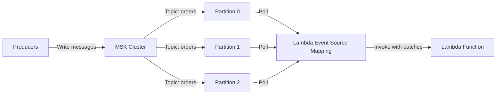

# How to Use Lambda with MSK (Kafka) Event Source Mapping

Author: [nawazdhandala](https://github.com/nawazdhandala)

Tags: AWS, Lambda, MSK, Kafka, Serverless, Event-Driven

Description: Step-by-step guide to configuring AWS Lambda to consume messages from Amazon MSK Kafka topics using event source mappings

---

Apache Kafka is the backbone of many event-driven architectures. It handles massive throughput, provides durable message storage, and supports complex streaming topologies. Amazon Managed Streaming for Apache Kafka (MSK) takes away the operational burden of running Kafka clusters on AWS.

But what about the consumers? Traditionally, you would run a consumer group on EC2 or ECS, managing scaling, failover, and deployments yourself. With Lambda's Kafka event source mapping, AWS handles the consumer for you. Lambda automatically polls your MSK topics, manages offsets, and scales based on the number of partitions.

In this guide, you will set up a Lambda function that consumes messages from an MSK cluster, handle common pitfalls, and configure it for production use.

## How Lambda Consumes from MSK

Lambda acts as a Kafka consumer group under the hood. It creates event pollers that poll your MSK topics, fetch batches of messages, and invoke your Lambda function with those batches.


```mermaid
flowchart LR
    A[Producers] -->|Write messages| B[MSK Cluster]
    B -->|Topic: orders| C[Partition 0]
    B -->|Topic: orders| D[Partition 1]
    B -->|Topic: orders| E[Partition 2]
    C -->|Poll| F[Lambda Event Source Mapping]
    D -->|Poll| F
    E -->|Poll| F
    F -->|Invoke with batches| G[Lambda Function]
```

Lambda reads messages sequentially for each topic partition, and a single Lambda payload can include messages from multiple partitions. This keeps the same ordering constraint Kafka consumers have within each partition.

## Prerequisites

Before setting up the event source mapping, you need:

- An MSK cluster running in a VPC
- A topic created on the cluster
- A Lambda function to process the batches
- IAM permissions for Lambda to access the MSK cluster

The VPC requirement is important, but it applies to the event source mapping, not to your function's own VPC configuration. MSK clusters run inside a VPC, and Lambda creates or reuses a Hyperplane ENI in the MSK cluster's subnet to reach the Kafka brokers.

## Step 1: Configure VPC Access for Lambda

Your event source mapping needs network access to the MSK cluster. For an Amazon MSK event source, Lambda uses the subnet and security group configuration from the MSK cluster, so you usually do not need to attach the Lambda function itself to the MSK VPC.

```bash
# Optional: attach the function to a VPC only if your code must reach VPC resources directly

aws lambda update-function-configuration \
  --function-name msk-consumer \
  --vpc-config SubnetIds=subnet-abc123,subnet-def456,SecurityGroupIds=sg-msk-consumer
```

The MSK cluster security group must allow traffic on the Kafka broker port used by your authentication mode: 9098 for IAM authentication, 9096 for SASL/SCRAM, or 9094 for TLS.

Make sure the MSK cluster's security group allows inbound traffic on the broker port. A common pattern is to use a self-referencing rule so the Hyperplane ENI that Lambda creates with the cluster's security group can reach the brokers.

```bash
# Allow resources using the MSK security group to reach MSK brokers with IAM auth
aws ec2 authorize-security-group-ingress \
  --group-id sg-msk-cluster \
  --protocol tcp \
  --port 9098 \
  --source-group sg-msk-cluster
```

If you use the default on-demand scaling mode, the event source mapping also needs a path to invoke the Lambda service, either through a NAT gateway or VPC endpoints for Lambda, AWS STS, and, when needed, Secrets Manager. Provisioned mode handles this connection for you.

## Step 2: Set Up IAM Permissions

Lambda needs specific permissions to interact with MSK.

```json
{
  "Version": "2012-10-17",
  "Statement": [
    {
      "Effect": "Allow",
      "Action": [
        "kafka:DescribeCluster",
        "kafka:DescribeClusterV2",
        "kafka:GetBootstrapBrokers",
        "kafka-cluster:Connect",
        "kafka-cluster:DescribeGroup",
        "kafka-cluster:AlterGroup",
        "kafka-cluster:DescribeTopic",
        "kafka-cluster:ReadData",
        "kafka-cluster:DescribeClusterDynamicConfiguration"
      ],
      "Resource": [
        "arn:aws:kafka:us-east-1:123456789012:cluster/my-msk-cluster/cluster-uuid",
        "arn:aws:kafka:us-east-1:123456789012:topic/my-msk-cluster/cluster-uuid/*",
        "arn:aws:kafka:us-east-1:123456789012:group/my-msk-cluster/cluster-uuid/*"
      ]
    },
    {
      "Effect": "Allow",
      "Action": [
        "ec2:CreateNetworkInterface",
        "ec2:DescribeNetworkInterfaces",
        "ec2:DeleteNetworkInterface",
        "ec2:DescribeVpcs",
        "ec2:DescribeSubnets",
        "ec2:DescribeSecurityGroups"
      ],
      "Resource": "*"
    }
  ]
}
```

The VPC networking permissions are required because Lambda creates ENIs (Elastic Network Interfaces) in your VPC to reach the MSK cluster.

## Step 3: Write the Lambda Function

The event payload from MSK is structured differently from other event sources. Messages are grouped by topic and partition.

```python
# handler.py - Process messages from MSK topics
import json
import base64

def lambda_handler(event, context):
    """Process a batch of Kafka messages from MSK."""

    failed_items = []

    # Messages are grouped by topic-partition
    for topic_partition, messages in event['records'].items():
        topic = messages[0]['topic'] if messages else topic_partition.rsplit('-', 1)[0]
        partition = messages[0]['partition'] if messages else topic_partition.rsplit('-', 1)[1]

        print(f"Processing {len(messages)} messages from {topic} partition {partition}")

        for message in messages:
            try:
                # Decode the base64-encoded value
                value = base64.b64decode(message['value']).decode('utf-8')
                data = json.loads(value)

                # Decode the key if present
                key = None
                if message.get('key'):
                    key = base64.b64decode(message['key']).decode('utf-8')

                # Extract Kafka metadata
                offset = message['offset']
                timestamp = message['timestamp']
                headers = decode_headers(message.get('headers', []))

                # Process the message
                process_message(topic, key, data, headers, offset)

            except Exception as e:
                print(f"Error processing message at offset {message['offset']}: {e}")
                failed_items.append({
                    "itemIdentifier": {
                        "partition": topic_partition,
                        "offset": message['offset']
                    }
                })

    if failed_items:
        return {"batchItemFailures": failed_items}

    return {"batchItemFailures": []}


def decode_headers(headers):
    """Decode Kafka message headers."""
    decoded = {}
    for header in headers:
        for key, value in header.items():
            decoded[key] = bytes(value).decode('utf-8')
    return decoded


def process_message(topic, key, data, headers, offset):
    """Process a single Kafka message."""
    print(f"Topic: {topic}, Key: {key}, Offset: {offset}")
    print(f"Data: {json.dumps(data)}")

    # Your business logic here
    # For example, write to DynamoDB, trigger a workflow, etc.
```

## Step 4: Create the Event Source Mapping

Now connect your Lambda function to the MSK topic.

```bash
# Create the event source mapping for MSK
aws lambda create-event-source-mapping \
  --function-name msk-consumer \
  --event-source-arn arn:aws:kafka:us-east-1:123456789012:cluster/my-msk-cluster/cluster-uuid \
  --topics "orders" \
  --starting-position LATEST \
  --batch-size 100 \
  --maximum-batching-window-in-seconds 5 \
  --function-response-types "ReportBatchItemFailures"
```

Important configuration options:

- **topics**: The Kafka topic(s) to consume from.
- **starting-position**: LATEST skips existing messages, TRIM_HORIZON starts from the beginning.
- **batch-size**: Maximum number of messages per invocation (up to 10,000).
- **maximum-batching-window-in-seconds**: Wait up to this many seconds to fill a batch.

## Authentication Options

MSK supports several authentication mechanisms. Configure the event source mapping based on your cluster's setup.

For **IAM authentication** (recommended):

```bash
# MSK with IAM authentication
aws lambda create-event-source-mapping \
  --function-name msk-consumer \
  --event-source-arn arn:aws:kafka:us-east-1:123456789012:cluster/my-cluster/uuid \
  --topics "orders" \
  --starting-position LATEST
```

For IAM authentication, grant the function execution role the required `kafka-cluster:*` permissions. You do not add `VPC_SUBNET` or `VPC_SECURITY_GROUP` source access configurations for an Amazon MSK event source; those source access configuration types are for self-managed Kafka.

For **SASL/SCRAM authentication**:

```bash
# MSK with SASL/SCRAM - credentials stored in Secrets Manager
aws lambda create-event-source-mapping \
  --function-name msk-consumer \
  --event-source-arn arn:aws:kafka:us-east-1:123456789012:cluster/my-cluster/uuid \
  --topics "orders" \
  --starting-position LATEST \
  --source-access-configurations '[
    {"Type": "SASL_SCRAM_512_AUTH", "URI": "arn:aws:secretsmanager:us-east-1:123456789012:secret:msk-creds"}
  ]'
```

For SASL/SCRAM, the execution role also needs permission to read the Secrets Manager secret, and `kms:Decrypt` if the secret uses a customer managed KMS key.

## Scaling and Concurrency

Lambda scales Kafka event source mappings with event pollers. In the default on-demand mode, Lambda adds or removes event pollers based on partition offset lag. For workloads that need more predictable throughput, configure provisioned mode with minimum and maximum poller counts.

```bash
# Configure provisioned pollers for a Kafka event source mapping
aws lambda update-event-source-mapping \
  --uuid your-mapping-uuid \
  --provisioned-poller-config '{"MinimumPollers": 5, "MaximumPollers": 10}'
```

Each Amazon MSK event poller can handle up to 5 MB/sec of throughput or up to 5 concurrent Lambda invocations. To maintain ordered processing within partitions, Lambda caps the maximum pollers to the number of partitions in the topic.

## Handling Consumer Lag

If your Lambda function cannot keep up with the message production rate, consumer lag builds up. Monitor this with CloudWatch metrics:

- **OffsetLag**: The difference between the latest offset in the topic and the consumer's current offset.
- **Lambda Duration**: If your function takes too long per batch, processing falls behind.

When lag gets too high, you have a few options: use provisioned mode with more pollers, increase batch size to process more messages per invocation, optimize your function's processing speed, or add more partitions to the topic.

For comprehensive monitoring setup, take a look at our guide on [connecting Amazon Managed Grafana to CloudWatch](https://oneuptime.com/blog/post/2026-02-12-connect-amazon-managed-grafana-to-cloudwatch/view).

## Common Pitfalls

**ENI limits**: Lambda creates Hyperplane ENIs in the MSK cluster's VPC for the event source mapping. If your function is also attached to a VPC for its own business logic, that VPC configuration can create additional ENIs.

**Cold starts in VPC**: You usually do not need to attach the function itself to the MSK VPC just to use an MSK trigger. If your business logic requires VPC access, you may still see slightly higher cold start times compared to non-VPC functions.

**Timeout configuration**: Set your Lambda timeout long enough to process a full batch. If you are processing 100 messages that each take 50ms, your function needs at least 5 seconds plus overhead. Amazon MSK event source mappings support functions with a maximum timeout of 14 minutes.

**Offset management**: Lambda manages offsets automatically. If your function fails and retries, it replays from the last committed offset. Design your processing to be idempotent.

## Wrapping Up

Lambda's MSK event source mapping brings the simplicity of serverless to Kafka consumption. You do not need to manage consumer groups, handle rebalancing, or worry about offset commits. AWS handles all of that.

The tradeoff is that you give up some flexibility compared to running your own consumers. You cannot control the consumer configuration as finely, and there is a ceiling on how many messages per second a single Lambda invocation can process. For most workloads, this tradeoff is well worth it. Focus on your message processing logic and let AWS handle the plumbing.
