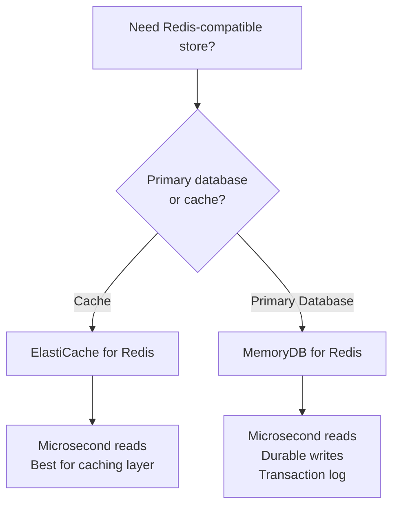

# How to Use MemoryDB for Redis Transactions

Author: [nawazdhandala](https://github.com/nawazdhandala)

Tags: AWS, MemoryDB, Redis, Transactions, Database, Durability

Description: Learn how to use Amazon MemoryDB for Redis as a durable primary database with transaction support for use cases that need both speed and data safety.

---

Redis is often thought of as a cache - a fast but ephemeral data store. If the node goes down, you might lose data. That is fine for caches, but it makes Redis unsuitable as a primary database for data that matters.

Amazon MemoryDB for Redis changes this equation. It provides a Redis-compatible interface with multi-AZ durability using a transaction log. Every write is persisted to a distributed transaction log across multiple Availability Zones before being acknowledged to the client. Your data survives node failures, AZ failures, and even complete cluster replacements.

This makes MemoryDB suitable for use cases where you need Redis performance with database-level durability, including scenarios that require transactional guarantees.

## MemoryDB vs ElastiCache



| Feature | ElastiCache | MemoryDB |
|---------|------------|----------|
| Read latency | Microseconds | Microseconds |
| Write latency | Microseconds | Single-digit milliseconds |
| Durability | In-memory only | Multi-AZ transaction log |
| Use case | Caching | Primary database |
| Data loss on failure | Possible | No |

The write latency difference is the tradeoff. MemoryDB writes take single-digit milliseconds because they wait for the transaction log to be persisted. ElastiCache writes are faster because they only go to memory.

## Setting Up MemoryDB

### Step 1: Create a Subnet Group

```bash
# Create a subnet group spanning multiple AZs for durability
aws memorydb create-subnet-group \
  --subnet-group-name my-memorydb-subnets \
  --description "Subnets for MemoryDB cluster" \
  --subnet-ids subnet-0abc123 subnet-0def456 subnet-0ghi789
```

### Step 2: Create an ACL (Access Control List)

MemoryDB uses ACLs for authentication and authorization.

```bash
# Create a user with read/write access
aws memorydb create-user \
  --user-name app-user \
  --authentication-mode '{
    "Type": "password",
    "Passwords": ["YourStr0ngRedisP@ss!"]
  }' \
  --access-string "on ~* &* +@all"

# Create an ACL and add the user
aws memorydb create-acl \
  --acl-name my-app-acl \
  --user-names app-user
```

The access string `on ~* &* +@all` grants full access. For production, restrict it to only the commands and key patterns your application needs.

### Step 3: Create the Cluster

```bash
# Create a MemoryDB cluster
aws memorydb create-cluster \
  --cluster-name my-memorydb \
  --node-type db.r6g.large \
  --num-shards 2 \
  --num-replicas-per-shard 1 \
  --acl-name my-app-acl \
  --subnet-group-name my-memorydb-subnets \
  --security-group-ids sg-0abc123 \
  --tls-enabled \
  --engine-version 7.1 \
  --snapshot-retention-limit 7 \
  --snapshot-window "03:00-04:00" \
  --maintenance-window "sun:05:00-sun:06:00"
```

## Working with Redis Transactions

Redis transactions use `MULTI`, `EXEC`, `WATCH`, and `DISCARD` commands. In MemoryDB, these transactions are durable - once `EXEC` returns successfully, all commands in the transaction have been persisted to the transaction log.

### Basic Transaction

```python
# Basic Redis transaction in MemoryDB
import redis

client = redis.Redis(
    host='clustercfg.my-memorydb.xxxxx.memorydb.us-east-1.amazonaws.com',
    port=6379,
    ssl=True,
    username='app-user',
    password='YourStr0ngRedisP@ss!',
    decode_responses=True
)

def transfer_funds(from_account, to_account, amount):
    """Transfer funds between accounts atomically."""
    pipe = client.pipeline(transaction=True)

    try:
        # Start the transaction
        pipe.multi()

        # Debit the source account
        pipe.decrby(f"balance:{from_account}", amount)

        # Credit the destination account
        pipe.incrby(f"balance:{to_account}", amount)

        # Record the transfer
        pipe.rpush(f"transfers:{from_account}", f"-{amount} to {to_account}")
        pipe.rpush(f"transfers:{to_account}", f"+{amount} from {from_account}")

        # Execute all commands atomically
        results = pipe.execute()

        return True
    except redis.WatchError:
        return False
```

### Optimistic Locking with WATCH

`WATCH` enables optimistic locking. If any watched key changes between `WATCH` and `EXEC`, the transaction is aborted.

```python
# Optimistic locking with WATCH for safe concurrent updates
def debit_account_safe(account_id, amount):
    """
    Safely debit an account using optimistic locking.
    Retries if another client modifies the balance concurrently.
    """
    max_retries = 5

    for attempt in range(max_retries):
        try:
            # Watch the balance key for changes
            pipe = client.pipeline(transaction=True)
            pipe.watch(f"balance:{account_id}")

            # Read current balance
            current_balance = int(pipe.get(f"balance:{account_id}") or 0)

            if current_balance < amount:
                pipe.unwatch()
                return False, "Insufficient funds"

            # Start the transaction
            pipe.multi()

            # Set the new balance
            pipe.set(f"balance:{account_id}", current_balance - amount)

            # Log the debit
            pipe.rpush(f"ledger:{account_id}", f"debit:{amount}:{current_balance - amount}")

            # Execute - will fail if balance was modified by another client
            pipe.execute()

            return True, "Success"

        except redis.WatchError:
            # Another client modified the balance, retry
            continue

    return False, "Too many concurrent modifications"
```

### Inventory Management with Transactions

```python
# Inventory management using Redis transactions for atomic stock operations
def purchase_item(user_id, item_id, quantity):
    """
    Purchase an item - decrements stock and creates an order atomically.
    Uses WATCH to prevent overselling.
    """
    stock_key = f"stock:{item_id}"
    order_key = f"orders:{user_id}"

    pipe = client.pipeline(transaction=True)

    try:
        # Watch the stock key
        pipe.watch(stock_key)

        # Check available stock
        available = int(pipe.get(stock_key) or 0)

        if available < quantity:
            pipe.unwatch()
            return {"success": False, "error": "Out of stock"}

        # Get item price
        price = float(pipe.hget(f"item:{item_id}", "price") or 0)

        # Start transaction
        pipe.multi()

        # Decrement stock
        pipe.decrby(stock_key, quantity)

        # Create order record
        import json
        import time
        order = json.dumps({
            "item_id": item_id,
            "quantity": quantity,
            "price": price,
            "total": price * quantity,
            "timestamp": time.time()
        })

        pipe.rpush(order_key, order)

        # Increment sales counter
        pipe.hincrby(f"item:{item_id}", "total_sold", quantity)

        # Execute atomically
        pipe.execute()

        return {"success": True, "total": price * quantity}

    except redis.WatchError:
        return {"success": False, "error": "Concurrent modification, please retry"}
```

### Lua Scripts for Complex Transactions

For more complex atomic operations, Lua scripts are often cleaner than MULTI/EXEC.

```python
# Lua script for atomic rate limiting with MemoryDB
rate_limit_script = """
local key = KEYS[1]
local limit = tonumber(ARGV[1])
local window = tonumber(ARGV[2])
local now = tonumber(ARGV[3])

-- Remove expired entries
redis.call('ZREMRANGEBYSCORE', key, 0, now - window)

-- Count current requests in the window
local count = redis.call('ZCARD', key)

if count < limit then
    -- Under limit - add this request and allow it
    redis.call('ZADD', key, now, now .. ':' .. math.random(1000000))
    redis.call('EXPIRE', key, window)
    return 1
else
    -- Over limit - reject
    return 0
end
"""

# Register the script
rate_limiter = client.register_script(rate_limit_script)

def check_rate_limit(user_id, max_requests=100, window_seconds=60):
    """
    Check if a user is within their rate limit.
    Atomic operation - safe for concurrent access.
    """
    import time
    result = rate_limiter(
        keys=[f"ratelimit:{user_id}"],
        args=[max_requests, window_seconds, int(time.time())]
    )
    return bool(result)
```

## Monitoring MemoryDB

### Key Metrics

```bash
# Monitor write latency - important because MemoryDB writes go to the transaction log
aws cloudwatch get-metric-statistics \
  --namespace AWS/MemoryDB \
  --metric-name CommandLatency \
  --dimensions Name=ClusterName,Value=my-memorydb Name=CommandType,Value=write \
  --start-time $(date -u -d '1 hour ago' +%Y-%m-%dT%H:%M:%S) \
  --end-time $(date -u +%Y-%m-%dT%H:%M:%S) \
  --period 60 \
  --statistics Average,p99
```

```bash
# Monitor transaction log replication lag
aws cloudwatch get-metric-statistics \
  --namespace AWS/MemoryDB \
  --metric-name ReplicationLag \
  --dimensions Name=ClusterName,Value=my-memorydb \
  --start-time $(date -u -d '1 hour ago' +%Y-%m-%dT%H:%M:%S) \
  --end-time $(date -u +%Y-%m-%dT%H:%M:%S) \
  --period 60 \
  --statistics Maximum
```

### Alerts

```bash
# Alert on high write latency
aws cloudwatch put-metric-alarm \
  --alarm-name memorydb-write-latency \
  --namespace AWS/MemoryDB \
  --metric-name CommandLatency \
  --dimensions Name=ClusterName,Value=my-memorydb Name=CommandType,Value=write \
  --extended-statistic p99 \
  --period 60 \
  --threshold 10 \
  --comparison-operator GreaterThanThreshold \
  --evaluation-periods 5 \
  --alarm-actions arn:aws:sns:us-east-1:123456789012:DatabaseAlerts
```

## Summary

MemoryDB for Redis gives you the speed of Redis with the durability of a traditional database. Transactions work exactly as they do in standard Redis, but with the guarantee that committed transactions survive infrastructure failures. For use cases like financial transactions, inventory management, session storage, and leaderboards where you need both performance and data safety, MemoryDB is the right choice.

For more on Redis-compatible services, see our guides on [ElastiCache Serverless](https://oneuptime.com/blog/post/2026-02-12-set-up-elasticache-serverless/view) and [ElastiCache Global Datastore](https://oneuptime.com/blog/post/2026-02-12-configure-elasticache-global-datastore-for-multi-region/view).
