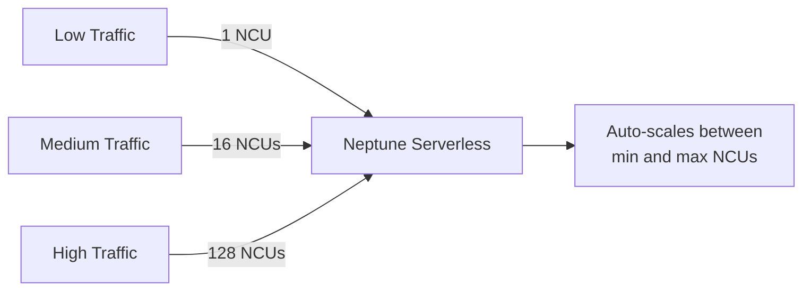

# How to Use Neptune Serverless

Author: [nawazdhandala](https://github.com/nawazdhandala)

Tags: AWS, Neptune, Graph Database, Serverless, Gremlin, openCypher

Description: Set up Amazon Neptune Serverless for graph database workloads that need automatic scaling without the overhead of managing instance sizes.

---

Running a graph database on fixed-size instances means you are either overpaying during quiet periods or scrambling to scale up during traffic spikes. Neptune Serverless solves this by automatically adjusting compute capacity based on your workload. It scales up when queries get complex or traffic increases, and scales back down when things are quiet.

This is especially valuable for graph workloads, which tend to be bursty. A recommendation engine might be quiet most of the day but spike during peak shopping hours. A knowledge graph might get hammered during business hours and be idle at night. Neptune Serverless handles these patterns without manual intervention.

## How Neptune Serverless Works

Neptune Serverless uses Neptune Capacity Units (NCUs) to measure compute. Each NCU provides approximately 2 GB of memory and corresponding CPU and networking capacity.



You set a minimum and maximum NCU range. Neptune automatically scales within that range based on:
- CPU utilization
- Memory utilization
- Number of concurrent connections
- Query complexity

## Creating a Neptune Serverless Cluster

### Step 1: Set Up Networking

Neptune runs inside a VPC and is not publicly accessible.

```bash
# Create a DB subnet group for Neptune
aws neptune create-db-subnet-group \
  --db-subnet-group-name neptune-serverless-subnets \
  --db-subnet-group-description "Subnets for Neptune Serverless" \
  --subnet-ids subnet-0abc123 subnet-0def456

# Create a security group
aws ec2 create-security-group \
  --group-name neptune-serverless-sg \
  --description "Security group for Neptune Serverless" \
  --vpc-id vpc-0abc123

# Allow Gremlin and SPARQL ports from your application subnets
aws ec2 authorize-security-group-ingress \
  --group-id sg-0abc123 \
  --protocol tcp \
  --port 8182 \
  --cidr 10.0.0.0/16
```

### Step 2: Create the Cluster

```bash
# Create a Neptune Serverless cluster
aws neptune create-db-cluster \
  --db-cluster-identifier my-neptune-serverless \
  --engine neptune \
  --engine-version 1.3.1.0 \
  --serverless-v2-scaling-configuration MinCapacity=1,MaxCapacity=64 \
  --vpc-security-group-ids sg-0abc123 \
  --db-subnet-group-name neptune-serverless-subnets \
  --storage-encrypted \
  --iam-database-authentication-enabled \
  --backup-retention-period 7
```

The `MinCapacity=1` keeps costs low during idle periods. `MaxCapacity=64` allows scaling up to 128 GB of memory for heavy workloads. Adjust these based on your needs.

### Step 3: Create a Serverless Instance

```bash
# Create a Serverless v2 writer instance
aws neptune create-db-instance \
  --db-instance-identifier my-neptune-serverless-writer \
  --db-cluster-identifier my-neptune-serverless \
  --db-instance-class db.serverless \
  --engine neptune

# Optionally, create a reader instance for read-heavy workloads
aws neptune create-db-instance \
  --db-instance-identifier my-neptune-serverless-reader \
  --db-cluster-identifier my-neptune-serverless \
  --db-instance-class db.serverless \
  --engine neptune
```

### Step 4: Get the Endpoint

```bash
# Get the cluster endpoints
aws neptune describe-db-clusters \
  --db-cluster-identifier my-neptune-serverless \
  --query 'DBClusters[0].{Writer:Endpoint,Reader:ReaderEndpoint,Port:Port}'
```

## Connecting and Querying

Neptune supports three query languages: Gremlin, openCypher, and SPARQL. Choose based on your use case and team expertise.

### Gremlin Queries

```python
# Connect to Neptune Serverless using Gremlin (Python)
from gremlin_python.driver import client, serializer

# Create a Gremlin client
gremlin_client = client.Client(
    'wss://my-neptune-serverless.cluster-xxxxx.us-east-1.neptune.amazonaws.com:8182/gremlin',
    'g',
    message_serializer=serializer.GraphSONSerializersV2d0()
)

# Add vertices
gremlin_client.submit("""
    g.addV('person').property('name', 'Alice').property('age', 30)
     .addV('person').property('name', 'Bob').property('age', 28)
     .addV('person').property('name', 'Charlie').property('age', 35)
""")

# Add edges
gremlin_client.submit("""
    g.V().has('name', 'Alice').addE('knows').to(g.V().has('name', 'Bob'))
     .V().has('name', 'Bob').addE('knows').to(g.V().has('name', 'Charlie'))
""")

# Query - find friends of friends
results = gremlin_client.submit("""
    g.V().has('name', 'Alice')
     .out('knows').out('knows')
     .dedup()
     .values('name')
""").all().result()

print(f"Alice's friends of friends: {results}")
```

### openCypher Queries

```python
# Connect to Neptune Serverless using openCypher (via HTTP endpoint)
import requests
import json

NEPTUNE_ENDPOINT = "https://my-neptune-serverless.cluster-xxxxx.us-east-1.neptune.amazonaws.com:8182"

def run_cypher(query, parameters=None):
    """Execute an openCypher query against Neptune."""
    payload = {"query": query}
    if parameters:
        payload["parameters"] = parameters

    response = requests.post(
        f"{NEPTUNE_ENDPOINT}/openCypher",
        json=payload,
        headers={"Content-Type": "application/json"}
    )
    return response.json()

# Create nodes and relationships
run_cypher("""
    CREATE (alice:Person {name: 'Alice', age: 30})
    CREATE (bob:Person {name: 'Bob', age: 28})
    CREATE (charlie:Person {name: 'Charlie', age: 35})
    CREATE (alice)-[:KNOWS {since: 2020}]->(bob)
    CREATE (bob)-[:KNOWS {since: 2021}]->(charlie)
""")

# Find shortest path between two people
result = run_cypher("""
    MATCH path = shortestPath(
        (a:Person {name: $start})-[:KNOWS*]-(b:Person {name: $end})
    )
    RETURN [n IN nodes(path) | n.name] AS people,
           length(path) AS distance
""", parameters={"start": "Alice", "end": "Charlie"})

print(json.dumps(result, indent=2))
```

## Scaling Configuration

### Adjusting Min/Max Capacity

```bash
# Update the scaling range - increase minimum for production workloads
aws neptune modify-db-cluster \
  --db-cluster-identifier my-neptune-serverless \
  --serverless-v2-scaling-configuration MinCapacity=4,MaxCapacity=128
```

Setting a higher minimum reduces cold-start latency because the cluster always has a baseline level of resources ready.

### Monitoring Capacity Utilization

```bash
# Monitor current NCU utilization
aws cloudwatch get-metric-statistics \
  --namespace AWS/Neptune \
  --metric-name ServerlessDatabaseCapacity \
  --dimensions Name=DBClusterIdentifier,Value=my-neptune-serverless \
  --start-time $(date -u -d '6 hours ago' +%Y-%m-%dT%H:%M:%S) \
  --end-time $(date -u +%Y-%m-%dT%H:%M:%S) \
  --period 300 \
  --statistics Average,Maximum
```

```bash
# Monitor CPU utilization to understand scaling triggers
aws cloudwatch get-metric-statistics \
  --namespace AWS/Neptune \
  --metric-name CPUUtilization \
  --dimensions Name=DBClusterIdentifier,Value=my-neptune-serverless \
  --start-time $(date -u -d '6 hours ago' +%Y-%m-%dT%H:%M:%S) \
  --end-time $(date -u +%Y-%m-%dT%H:%M:%S) \
  --period 300 \
  --statistics Average,Maximum
```

### Set Up Alerts

```bash
# Alert when scaling approaches the maximum
aws cloudwatch put-metric-alarm \
  --alarm-name neptune-capacity-high \
  --namespace AWS/Neptune \
  --metric-name ServerlessDatabaseCapacity \
  --dimensions Name=DBClusterIdentifier,Value=my-neptune-serverless \
  --statistic Maximum \
  --period 300 \
  --threshold 56 \
  --comparison-operator GreaterThanThreshold \
  --evaluation-periods 3 \
  --alarm-actions arn:aws:sns:us-east-1:123456789012:GraphDBAlerts
```

## Bulk Loading Data

For initial data loads, use the Neptune bulk loader.

```bash
# Start a bulk load from S3
curl -X POST \
  "https://my-neptune-serverless.cluster-xxxxx.us-east-1.neptune.amazonaws.com:8182/loader" \
  -H "Content-Type: application/json" \
  -d '{
    "source": "s3://my-graph-data/initial-load/",
    "format": "csv",
    "iamRoleArn": "arn:aws:iam::123456789012:role/NeptuneLoadRole",
    "region": "us-east-1",
    "failOnError": "FALSE",
    "parallelism": "HIGH",
    "updateSingleCardinalityProperties": "FALSE"
  }'
```

Before bulk loading, temporarily increase the minimum capacity to speed up the load.

```bash
# Increase min capacity for faster bulk loading
aws neptune modify-db-cluster \
  --db-cluster-identifier my-neptune-serverless \
  --serverless-v2-scaling-configuration MinCapacity=32,MaxCapacity=128

# After load completes, reduce back to save costs
aws neptune modify-db-cluster \
  --db-cluster-identifier my-neptune-serverless \
  --serverless-v2-scaling-configuration MinCapacity=1,MaxCapacity=64
```

## Use Case: Recommendation Engine

Here is a practical example of a recommendation engine running on Neptune Serverless.

```python
# Product recommendation engine using graph traversal
def get_recommendations(user_id, limit=10):
    """
    Find product recommendations based on what similar users purchased.
    Uses collaborative filtering via graph traversal.
    """
    result = run_cypher("""
        // Find products purchased by users who bought the same things
        MATCH (user:User {id: $userId})-[:PURCHASED]->(product:Product)
              <-[:PURCHASED]-(similar:User)-[:PURCHASED]->(rec:Product)
        WHERE NOT (user)-[:PURCHASED]->(rec)
          AND user <> similar
        WITH rec, count(DISTINCT similar) AS score
        ORDER BY score DESC
        LIMIT $limit
        RETURN rec.id AS productId, rec.name AS productName, score
    """, parameters={"userId": user_id, "limit": limit})

    return result['results']
```

## Cost Optimization Tips

1. **Set a low minimum NCU** (1-2) for development and staging environments.
2. **Use reader instances** for read-heavy workloads to spread the load.
3. **Schedule scaling** if your workload has predictable patterns - increase min capacity before peak hours.
4. **Monitor and right-size** the maximum NCU based on actual peak usage.

## Summary

Neptune Serverless takes the capacity planning guesswork out of running a graph database. It automatically scales between your defined minimum and maximum NCU range, handling everything from idle periods to traffic spikes. Combined with support for Gremlin, openCypher, and SPARQL, it is a flexible choice for graph workloads of any size.

For analytical graph workloads that require algorithms like PageRank and community detection, see our guide on [Neptune Analytics](https://oneuptime.com/blog/post/2026-02-12-set-up-neptune-analytics-for-graph-queries/view).
