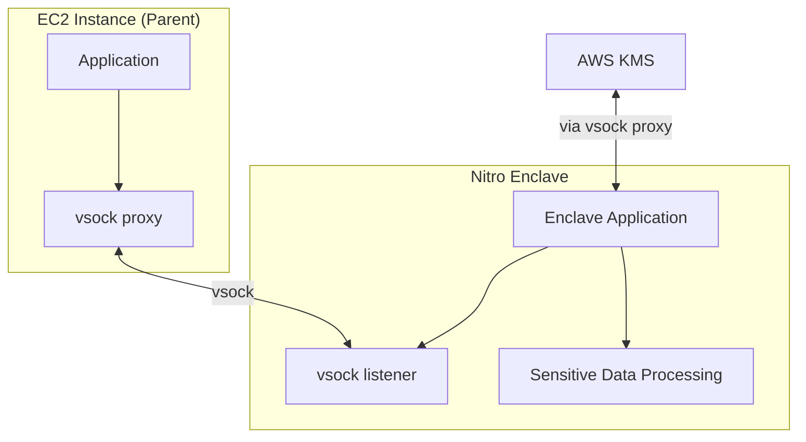

# How to Use Nitro Enclaves for Confidential Computing on EC2

Author: [nawazdhandala](https://github.com/nawazdhandala)

Tags: AWS, EC2, Nitro Enclaves, Confidential Computing, Security, Encryption

Description: A practical guide to using AWS Nitro Enclaves for confidential computing, including setup, attestation, cryptographic operations, and KMS integration.

---

Some data is so sensitive that even the people administering your servers shouldn't be able to see it. Credit card numbers being processed, private keys used for signing, healthcare records being analyzed - these all need protection not just at rest and in transit, but during processing too. That's what Nitro Enclaves deliver: isolated compute environments where even root on the parent instance can't peek inside.

## What Are Nitro Enclaves?

A Nitro Enclave is a fully isolated virtual machine created from an EC2 instance. It has its own kernel, its own memory, and its own CPU cores - all carved out from the parent instance. The critical difference from a regular VM is that there's no network access, no persistent storage, and no interactive access. The only communication channel is a narrow vsock connection to the parent instance.

This extreme isolation is the point. There's no SSH, no console, no way to attach a debugger. If someone compromises the parent instance, they still can't access what's happening inside the enclave.

## How Enclaves Work

The architecture looks like this:



The parent instance runs your main application. When it needs to process sensitive data, it sends it through vsock to the enclave. The enclave processes it and returns only the results. The sensitive data never exists in the parent's memory.

## Prerequisites

Nitro Enclaves work on most Nitro-based instance types with at least 4 vCPUs. You need at least 2 vCPUs and some memory allocated to the enclave, leaving the rest for the parent instance.

Supported instance families include m5, c5, r5, m6i, c6i, r6i, and many others. T-family instances are not supported.

## Setting Up the Parent Instance

First, launch an instance with Nitro Enclave support enabled:

```bash
# Launch an instance with Nitro Enclave support
aws ec2 run-instances \
  --image-id ami-0abc123 \
  --instance-type m5.2xlarge \
  --enclave-options 'Enabled=true' \
  --key-name my-key \
  --subnet-id subnet-abc123 \
  --security-group-ids sg-abc123
```

You can't enable enclave support after launch - it has to be specified at launch time.

Once the instance is running, install the Nitro Enclaves CLI:

```bash
# Install Nitro Enclaves CLI and allocator on Amazon Linux 2023
sudo dnf install -y aws-nitro-enclaves-cli aws-nitro-enclaves-cli-devel

# Add your user to the ne group
sudo usermod -aG ne ec2-user

# Configure the allocator - how much CPU and memory the enclave gets
sudo vi /etc/nitro_enclaves/allocator.yaml
```

Configure the allocator to give the enclave resources:

```yaml
# /etc/nitro_enclaves/allocator.yaml
# Allocate 2 CPUs and 4GB RAM to the enclave
memory_mib: 4096
cpu_count: 2
```

Start the services:

```bash
# Start the Nitro Enclaves allocator and vsock proxy
sudo systemctl enable nitro-enclaves-allocator.service
sudo systemctl start nitro-enclaves-allocator.service
sudo systemctl enable nitro-enclaves-vsock-proxy.service
sudo systemctl start nitro-enclaves-vsock-proxy.service
```

## Building an Enclave Application

Enclave applications are packaged as Docker images and then converted to Enclave Image Files (EIF). Let's build a simple one that processes encrypted data.

Create the application code:

```python
# enclave_app.py - Runs inside the Nitro Enclave
import json
import socket
import hashlib

VSOCK_CID_ANY = 0xFFFFFFFF
VSOCK_PORT = 5000

def process_sensitive_data(data):
    """Process sensitive data inside the enclave where it's protected."""
    # Example: hash a credit card number for tokenization
    card_number = data.get('card_number', '')
    # Create a token from the card number
    token = hashlib.sha256(card_number.encode()).hexdigest()[:16]
    return {
        'token': token,
        'last_four': card_number[-4:] if len(card_number) >= 4 else '',
        'status': 'tokenized'
    }

def main():
    """Listen on vsock for requests from the parent instance."""
    # Create vsock listener
    sock = socket.socket(socket.AF_VSOCK, socket.SOCK_STREAM)
    sock.bind((VSOCK_CID_ANY, VSOCK_PORT))
    sock.listen(5)
    print(f"Enclave listening on vsock port {VSOCK_PORT}")

    while True:
        conn, addr = sock.accept()
        try:
            # Read the request
            data = b''
            while True:
                chunk = conn.recv(4096)
                if not chunk:
                    break
                data += chunk

            # Parse and process
            request = json.loads(data.decode())
            result = process_sensitive_data(request)

            # Send the result back
            conn.sendall(json.dumps(result).encode())
        except Exception as e:
            conn.sendall(json.dumps({'error': str(e)}).encode())
        finally:
            conn.close()

if __name__ == '__main__':
    main()
```

Create the Dockerfile:

```dockerfile
# Dockerfile for the enclave application
FROM python:3.11-slim

WORKDIR /app
COPY enclave_app.py .

# The enclave has no network, so all dependencies must be baked in
CMD ["python", "enclave_app.py"]
```

Build the Docker image and convert it to an EIF:

```bash
# Build the Docker image
docker build -t enclave-app .

# Convert to Enclave Image File (EIF)
nitro-cli build-enclave \
  --docker-uri enclave-app:latest \
  --output-file enclave-app.eif
```

The build command outputs PCR (Platform Configuration Register) values. These are cryptographic measurements of the enclave image - save them, you'll need them for attestation.

## Running the Enclave

```bash
# Launch the enclave with 2 CPUs and 2GB RAM
nitro-cli run-enclave \
  --eif-path enclave-app.eif \
  --cpu-count 2 \
  --memory 2048 \
  --enclave-cid 16

# Verify it's running
nitro-cli describe-enclaves
```

The `enclave-cid` is the vsock address the parent uses to connect.

## Parent-Side Communication

The parent instance communicates with the enclave through vsock:

```python
# parent_app.py - Runs on the parent EC2 instance
import json
import socket

ENCLAVE_CID = 16
VSOCK_PORT = 5000

def send_to_enclave(data):
    """Send sensitive data to the enclave for processing."""
    sock = socket.socket(socket.AF_VSOCK, socket.SOCK_STREAM)
    sock.connect((ENCLAVE_CID, VSOCK_PORT))

    # Send the data
    sock.sendall(json.dumps(data).encode())
    sock.shutdown(socket.SHUT_WR)

    # Read the response
    response = b''
    while True:
        chunk = sock.recv(4096)
        if not chunk:
            break
        response += chunk

    sock.close()
    return json.loads(response.decode())

# Example: tokenize a credit card number
result = send_to_enclave({
    'card_number': '4111111111111111'
})
print(f"Token: {result['token']}")
print(f"Last four: {result['last_four']}")
# The actual card number never exists in the parent's memory
```

## KMS Integration with Attestation

The real power of Nitro Enclaves comes from KMS integration. You can create KMS keys that can only be used by a specific enclave, verified through cryptographic attestation.

First, create a KMS key with an enclave-specific policy:

```json
{
  "Version": "2012-10-17",
  "Statement": [
    {
      "Sid": "AllowEnclaveDecrypt",
      "Effect": "Allow",
      "Principal": {
        "AWS": "arn:aws:iam::123456789:role/enclave-role"
      },
      "Action": "kms:Decrypt",
      "Resource": "*",
      "Condition": {
        "StringEqualsIgnoreCase": {
          "kms:RecipientAttestation:PCR0": "abc123def456..."
        }
      }
    }
  ]
}
```

The `PCR0` condition means only an enclave with that exact image measurement can use this key. If someone modifies the enclave code even slightly, the PCR changes and KMS refuses the request.

## Configuring the vsock Proxy for KMS

The enclave can't access the network directly, so you need the vsock proxy to forward KMS requests:

```yaml
# /etc/nitro_enclaves/vsock-proxy.yaml
# Allow the enclave to communicate with KMS
- {address: kms.us-east-1.amazonaws.com, port: 443}
```

Restart the proxy:

```bash
# Restart the vsock proxy to pick up the new config
sudo systemctl restart nitro-enclaves-vsock-proxy.service
```

## Use Cases

**Payment processing**: Decrypt and process credit card data inside an enclave. The card numbers never exist in the parent's memory, reducing PCI DSS scope significantly.

**Private key operations**: Store signing keys inside the enclave. The parent sends data to be signed, gets back the signature, but never sees the private key.

**Healthcare data**: Process PHI inside an enclave to maintain HIPAA compliance while still using cloud infrastructure.

**Multi-party computation**: Multiple parties can send encrypted data to an enclave. The enclave decrypts and processes all the data, but no party can see the others' data.

## Debugging Enclaves

Since you can't SSH into an enclave, debugging requires a different approach:

```bash
# View enclave console output (very useful for debugging)
nitro-cli console --enclave-id i-0abc123-enc123

# Check enclave status
nitro-cli describe-enclaves

# Terminate and restart if needed
nitro-cli terminate-enclave --enclave-id i-0abc123-enc123
```

Always add verbose logging to your enclave application during development. The console output is your only window into what's happening inside.

## Monitoring

Monitor your enclave-enabled instances like any other EC2 instance, but pay attention to the memory and CPU allocation split. If you give 4 GB to the enclave on an 8 GB instance, the parent only has 4 GB left.

For comprehensive EC2 monitoring, see [monitoring EC2 instances with CloudWatch detailed monitoring](https://oneuptime.com/blog/post/monitor-ec2-instances-with-cloudwatch-detailed-monitoring/view).

Nitro Enclaves add a meaningful layer of protection for your most sensitive workloads. The setup takes some effort, but for applications handling financial data, healthcare records, or cryptographic keys, the isolation guarantee is worth it.
