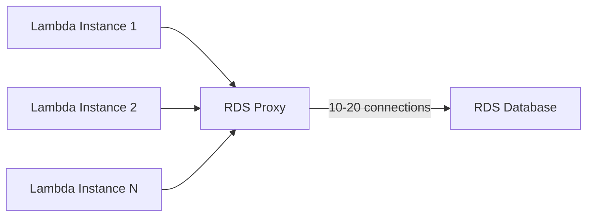

# How to Use RDS Proxy with Lambda for Database Connections

Author: [nawazdhandala](https://github.com/nawazdhandala)

Tags: AWS, Lambda, RDS, RDS Proxy, Serverless

Description: Learn how to set up and use Amazon RDS Proxy with AWS Lambda to efficiently manage database connections, reduce connection overhead, and prevent pool exhaustion.

---

If you've run Lambda functions connected to RDS in production, you've probably hit the connection limit problem. Every Lambda execution environment opens its own database connection. When traffic spikes and Lambda scales to hundreds of concurrent invocations, your database gets hammered with connection requests it can't handle. Connections fail, queries time out, and your application goes down.

RDS Proxy solves this. It sits between Lambda and your RDS database, pooling and multiplexing connections so that hundreds of Lambda invocations can share a much smaller number of actual database connections. Let's set it up from scratch.

## How RDS Proxy Works

RDS Proxy maintains a warm pool of database connections. When a Lambda function needs a connection, RDS Proxy hands it one from the pool instead of opening a new one to the database. When Lambda is done, the connection goes back to the pool rather than being closed.



Instead of N Lambda instances creating N database connections, RDS Proxy funnels them through a much smaller pool. This dramatically reduces load on the database and prevents connection exhaustion.

## Prerequisites

You'll need:
- An RDS or Aurora database running in a VPC
- Lambda functions configured for VPC access (see [connecting Lambda to a VPC](https://oneuptime.com/blog/post/2026-02-12-connect-lambda-functions-to-a-vpc/view))
- Database credentials stored in AWS Secrets Manager (RDS Proxy requires this)
- An IAM role for the proxy to access the secret

## Step 1: Store Credentials in Secrets Manager

RDS Proxy authenticates to your database using credentials from Secrets Manager. If you haven't already, create a secret:

```bash
# Create a secret with the database credentials
aws secretsmanager create-secret \
  --name "rds-proxy/db-credentials" \
  --secret-string '{
    "username": "app_user",
    "password": "your-secure-password",
    "engine": "postgres",
    "host": "mydb.cluster-abc123.us-east-1.rds.amazonaws.com",
    "port": 5432,
    "dbname": "myapp"
  }'
```

The `engine`, `host`, `port`, and `dbname` fields are optional in the secret, but `username` and `password` are required.

## Step 2: Create an IAM Role for the Proxy

RDS Proxy needs an IAM role that allows it to read the secret and decrypt it (if encrypted with KMS):

```json
{
  "Version": "2012-10-17",
  "Statement": [
    {
      "Effect": "Allow",
      "Action": [
        "secretsmanager:GetSecretValue"
      ],
      "Resource": "arn:aws:secretsmanager:us-east-1:123456789012:secret:rds-proxy/db-credentials-*"
    },
    {
      "Effect": "Allow",
      "Action": [
        "kms:Decrypt"
      ],
      "Resource": "arn:aws:kms:us-east-1:123456789012:key/your-kms-key-id",
      "Condition": {
        "StringEquals": {
          "kms:ViaService": "secretsmanager.us-east-1.amazonaws.com"
        }
      }
    }
  ]
}
```

The trust policy should allow RDS to assume this role:

```json
{
  "Version": "2012-10-17",
  "Statement": [
    {
      "Effect": "Allow",
      "Principal": {
        "Service": "rds.amazonaws.com"
      },
      "Action": "sts:AssumeRole"
    }
  ]
}
```

## Step 3: Create the RDS Proxy

Here's how to create the proxy using the AWS CLI:

```bash
# Create the RDS Proxy
aws rds create-db-proxy \
  --db-proxy-name my-lambda-proxy \
  --engine-family POSTGRESQL \
  --auth '[{
    "AuthScheme": "SECRETS",
    "SecretArn": "arn:aws:secretsmanager:us-east-1:123456789012:secret:rds-proxy/db-credentials-abc123",
    "IAMAuth": "DISABLED"
  }]' \
  --role-arn arn:aws:iam::123456789012:role/rds-proxy-role \
  --vpc-subnet-ids subnet-0abc123 subnet-0def456 \
  --vpc-security-group-ids sg-proxy123 \
  --require-tls
```

After creating the proxy, register it with your RDS instance or cluster:

```bash
# Register the target RDS instance
aws rds register-db-proxy-targets \
  --db-proxy-name my-lambda-proxy \
  --db-instance-identifiers my-rds-instance
```

Wait for the proxy to become available - this typically takes a few minutes:

```bash
# Check the proxy status
aws rds describe-db-proxies \
  --db-proxy-name my-lambda-proxy \
  --query "DBProxies[0].Status"
```

## Step 3b: CloudFormation Alternative

If you prefer Infrastructure as Code, here's the CloudFormation version:

```yaml
# RDS Proxy with CloudFormation
Resources:
  RDSProxy:
    Type: AWS::RDS::DBProxy
    Properties:
      DBProxyName: my-lambda-proxy
      EngineFamily: POSTGRESQL
      RequireTLS: true
      RoleArn: !GetAtt RDSProxyRole.Arn
      VpcSubnetIds:
        - !Ref PrivateSubnet1
        - !Ref PrivateSubnet2
      VpcSecurityGroupIds:
        - !Ref ProxySecurityGroup
      Auth:
        - AuthScheme: SECRETS
          SecretArn: !Ref DbCredentialsSecret
          IAMAuth: DISABLED

  # Associate the proxy with the RDS instance
  ProxyTargetGroup:
    Type: AWS::RDS::DBProxyTargetGroup
    Properties:
      DBProxyName: !Ref RDSProxy
      TargetGroupName: default
      DBInstanceIdentifiers:
        - !Ref MyRDSInstance
      ConnectionPoolConfigurationInfo:
        MaxConnectionsPercent: 80
        MaxIdleConnectionsPercent: 50
        ConnectionBorrowTimeout: 120
```

## Step 4: Configure Security Groups

The proxy needs its own security group. Lambda's security group needs to allow outbound traffic to the proxy, and the proxy's security group needs to allow inbound from Lambda and outbound to RDS.

```hcl
# Security group for RDS Proxy
resource "aws_security_group" "proxy_sg" {
  name   = "rds-proxy-sg"
  vpc_id = aws_vpc.main.id

  # Accept connections from Lambda
  ingress {
    from_port       = 5432
    to_port         = 5432
    protocol        = "tcp"
    security_groups = [aws_security_group.lambda_sg.id]
  }

  # Allow connections to RDS
  egress {
    from_port       = 5432
    to_port         = 5432
    protocol        = "tcp"
    security_groups = [aws_security_group.rds_sg.id]
  }
}
```

## Step 5: Update Your Lambda Function

Now update your Lambda function to connect to the proxy endpoint instead of the RDS endpoint directly:

```javascript
// Connect to RDS Proxy instead of RDS directly
const { Client } = require('pg');

let client = null;

async function getConnection() {
  if (client) return client;

  client = new Client({
    // Use the RDS Proxy endpoint, not the direct RDS endpoint
    host: process.env.RDS_PROXY_ENDPOINT,  // e.g., my-lambda-proxy.proxy-abc123.us-east-1.rds.amazonaws.com
    port: 5432,
    database: 'myapp',
    user: 'app_user',
    password: process.env.DB_PASSWORD,
    ssl: { rejectUnauthorized: false },  // RDS Proxy requires TLS
    connectionTimeoutMillis: 5000,
  });

  await client.connect();
  return client;
}

exports.handler = async (event) => {
  const db = await getConnection();
  const result = await db.query('SELECT NOW() as current_time');
  return {
    statusCode: 200,
    body: JSON.stringify(result.rows[0]),
  };
};
```

The key change: you're pointing `host` to the RDS Proxy endpoint instead of the RDS instance endpoint. Everything else stays the same.

## Using IAM Authentication with RDS Proxy

For even better security, you can use IAM authentication instead of database passwords. This means Lambda authenticates to the proxy using its IAM role - no password needed.

First, enable IAM auth on the proxy:

```bash
# Update proxy to require IAM authentication
aws rds modify-db-proxy \
  --db-proxy-name my-lambda-proxy \
  --auth '[{
    "AuthScheme": "SECRETS",
    "SecretArn": "arn:aws:secretsmanager:us-east-1:123456789012:secret:rds-proxy/db-credentials-abc123",
    "IAMAuth": "REQUIRED"
  }]'
```

Then in your Lambda function, generate an authentication token:

```javascript
// Using IAM auth with RDS Proxy - no password stored anywhere
const { RDS } = require('@aws-sdk/client-rds');
const { Client } = require('pg');

const rds = new RDS({ region: 'us-east-1' });

async function getConnection() {
  // Generate a temporary auth token using IAM credentials
  const token = await rds.generateAuthenticationToken({
    hostname: process.env.RDS_PROXY_ENDPOINT,
    port: 5432,
    username: 'app_user',
  });

  const client = new Client({
    host: process.env.RDS_PROXY_ENDPOINT,
    port: 5432,
    database: 'myapp',
    user: 'app_user',
    password: token,  // Use the temporary token as the password
    ssl: { rejectUnauthorized: false },
  });

  await client.connect();
  return client;
}
```

## Connection Pool Tuning

RDS Proxy's connection pool settings matter. The key parameters are:

- **MaxConnectionsPercent** - What percentage of the database's max connections the proxy can use (default: 100)
- **MaxIdleConnectionsPercent** - What percentage of connections can sit idle (default: 50)
- **ConnectionBorrowTimeout** - How long a client waits for a connection before timing out (default: 120 seconds)

For Lambda workloads with bursty traffic, I'd recommend:

```bash
# Tune the connection pool for Lambda workloads
aws rds modify-db-proxy-target-group \
  --db-proxy-name my-lambda-proxy \
  --target-group-name default \
  --connection-pool-config '{
    "MaxConnectionsPercent": 80,
    "MaxIdleConnectionsPercent": 30,
    "ConnectionBorrowTimeout": 30
  }'
```

Setting `MaxConnectionsPercent` to 80 leaves headroom for direct connections (migrations, admin tasks). A lower `ConnectionBorrowTimeout` of 30 seconds prevents Lambda from waiting too long and timing out anyway.

## Cost Considerations

RDS Proxy pricing is based on the number of vCPUs your underlying RDS instance has. As of writing, it's roughly $0.015 per vCPU per hour. For a db.r5.large (2 vCPUs), that's about $22/month.

It's not free, but compare that to the cost of connection-related outages or over-provisioning your RDS instance just to get more connections.

## Monitoring RDS Proxy

Keep an eye on these CloudWatch metrics:

- **DatabaseConnections** - Active connections from proxy to database
- **ClientConnections** - Active connections from Lambda to proxy
- **QueryRequests** - Total number of queries processed
- **AvailabilityPercentage** - Should be close to 100%

For comprehensive Lambda monitoring, check out [monitoring Lambda performance with CloudWatch](https://oneuptime.com/blog/post/2026-02-12-monitor-lambda-function-performance-with-cloudwatch/view).

## Wrapping Up

RDS Proxy is the right solution for Lambda-to-RDS connectivity at scale. It handles connection pooling, reduces database load, improves failover performance, and supports IAM authentication. The setup requires a few moving parts - Secrets Manager, IAM roles, security groups - but once it's running, your Lambda functions can scale freely without worrying about drowning the database in connections.
