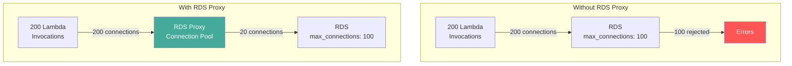

# How to Use RDS Proxy with Lambda Functions

Author: [nawazdhandala](https://github.com/nawazdhandala)

Tags: AWS, RDS Proxy, Lambda, Serverless, Database

Description: Learn how to use RDS Proxy with AWS Lambda to solve connection exhaustion, improve performance, and enable IAM-based database authentication.

---

Lambda and RDS are a famously awkward pairing. Lambda scales to hundreds of concurrent executions in seconds, while RDS has a fixed connection limit. Without a connection pool between them, your Lambda functions will exhaust the database connections and start throwing errors. RDS Proxy solves this problem elegantly. Let's walk through setting it up properly.

## The Problem in Detail

Here's what happens without RDS Proxy:

1. API Gateway receives 200 concurrent requests
2. Lambda scales to 200 concurrent executions
3. Each execution opens a database connection
4. Your db.t3.medium has max_connections = 100
5. 100 Lambda functions fail with "too many connections"

Even with connection reuse in Lambda (keeping the connection between warm invocations), cold starts create new connections, and burst traffic overwhelms the database.



## Architecture Overview

The setup involves these components:

1. **Lambda function** in a VPC with a security group
2. **RDS Proxy** in the same VPC with its own security group
3. **RDS instance** in private subnets with its security group
4. **Secrets Manager** storing database credentials
5. **IAM roles** for both Lambda and the proxy

## Step 1: Store Database Credentials

Create a Secrets Manager secret for the proxy to use.

```bash
aws secretsmanager create-secret \
  --name lambda-rds-proxy/db-creds \
  --secret-string '{
    "username": "lambda_user",
    "password": "LambdaStrongPassword123!"
  }'
```

## Step 2: Create IAM Roles

You need two roles: one for the proxy to access Secrets Manager, and one for Lambda to connect to the proxy using IAM auth.

This creates the proxy's IAM role.

```bash
# Proxy role - access to secrets
aws iam create-role \
  --role-name rds-proxy-lambda-role \
  --assume-role-policy-document '{
    "Version": "2012-10-17",
    "Statement": [{
      "Effect": "Allow",
      "Principal": {"Service": "rds.amazonaws.com"},
      "Action": "sts:AssumeRole"
    }]
  }'

aws iam put-role-policy \
  --role-name rds-proxy-lambda-role \
  --policy-name secrets-access \
  --policy-document '{
    "Version": "2012-10-17",
    "Statement": [{
      "Effect": "Allow",
      "Action": "secretsmanager:GetSecretValue",
      "Resource": "arn:aws:secretsmanager:us-east-1:123456789012:secret:lambda-rds-proxy/*"
    },{
      "Effect": "Allow",
      "Action": "kms:Decrypt",
      "Resource": "*",
      "Condition": {
        "StringEquals": {
          "kms:ViaService": "secretsmanager.us-east-1.amazonaws.com"
        }
      }
    }]
  }'
```

Add RDS Proxy connection permission to the Lambda execution role.

```bash
aws iam put-role-policy \
  --role-name lambda-execution-role \
  --policy-name rds-proxy-connect \
  --policy-document '{
    "Version": "2012-10-17",
    "Statement": [{
      "Effect": "Allow",
      "Action": "rds-db:connect",
      "Resource": "arn:aws:rds-db:us-east-1:123456789012:dbuser:prx-abc123/lambda_user"
    }]
  }'
```

## Step 3: Create the Database User

Create a database user that supports IAM authentication.

For PostgreSQL, run this SQL on your RDS instance.

```sql
-- Create the Lambda user
CREATE USER lambda_user WITH LOGIN;
GRANT rds_iam TO lambda_user;

-- Grant appropriate permissions
GRANT CONNECT ON DATABASE myappdb TO lambda_user;
GRANT USAGE ON SCHEMA public TO lambda_user;
GRANT SELECT, INSERT, UPDATE, DELETE ON ALL TABLES IN SCHEMA public TO lambda_user;
ALTER DEFAULT PRIVILEGES IN SCHEMA public
  GRANT SELECT, INSERT, UPDATE, DELETE ON TABLES TO lambda_user;
```

For MySQL:

```sql
CREATE USER 'lambda_user'@'%' IDENTIFIED WITH AWSAuthenticationPlugin AS 'RDS';
GRANT SELECT, INSERT, UPDATE, DELETE ON myappdb.* TO 'lambda_user'@'%';
FLUSH PRIVILEGES;
```

## Step 4: Create the RDS Proxy

This creates the proxy with IAM authentication required.

```bash
aws rds create-db-proxy \
  --db-proxy-name lambda-db-proxy \
  --engine-family POSTGRESQL \
  --auth '[{
    "AuthScheme": "SECRETS",
    "SecretArn": "arn:aws:secretsmanager:us-east-1:123456789012:secret:lambda-rds-proxy/db-creds-AbCdEf",
    "IAMAuth": "REQUIRED"
  }]' \
  --role-arn arn:aws:iam::123456789012:role/rds-proxy-lambda-role \
  --vpc-subnet-ids subnet-private-1 subnet-private-2 \
  --vpc-security-group-ids sg-proxy-123 \
  --require-tls \
  --idle-client-timeout 300 \
  --tags Key=Purpose,Value=lambda-connection-pooling
```

Register the RDS instance as a target.

```bash
aws rds register-db-proxy-targets \
  --db-proxy-name lambda-db-proxy \
  --db-instance-identifiers my-primary-db
```

Tune the connection pool for Lambda's bursty pattern.

```bash
aws rds modify-db-proxy-target-group \
  --db-proxy-name lambda-db-proxy \
  --target-group-name default \
  --connection-pool-config '{
    "MaxConnectionsPercent": 80,
    "MaxIdleConnectionsPercent": 10,
    "ConnectionBorrowTimeout": 30
  }'
```

Setting `MaxIdleConnectionsPercent` low is good for Lambda because Lambda traffic is bursty. You don't want the proxy holding many idle connections during quiet periods.

## Step 5: Configure Security Groups

Set up the security groups so traffic flows from Lambda through the proxy to RDS.

```bash
# Lambda SG -> Proxy SG (inbound on 5432)
aws ec2 authorize-security-group-ingress \
  --group-id sg-proxy-123 \
  --protocol tcp \
  --port 5432 \
  --source-group sg-lambda-123

# Proxy SG -> RDS SG (inbound on 5432)
aws ec2 authorize-security-group-ingress \
  --group-id sg-rds-123 \
  --protocol tcp \
  --port 5432 \
  --source-group sg-proxy-123
```

## Step 6: Configure Lambda

Put the Lambda function in the VPC and point it at the proxy.

```bash
aws lambda update-function-configuration \
  --function-name my-api-function \
  --vpc-config SubnetIds=subnet-private-1,subnet-private-2,SecurityGroupIds=sg-lambda-123 \
  --environment '{
    "Variables": {
      "DB_PROXY_HOST": "lambda-db-proxy.proxy-abc123.us-east-1.rds.amazonaws.com",
      "DB_PORT": "5432",
      "DB_NAME": "myappdb",
      "DB_USER": "lambda_user",
      "DB_REGION": "us-east-1"
    }
  }' \
  --timeout 30
```

## Step 7: Write the Lambda Function

Here's a complete Lambda function that connects to RDS through the proxy using IAM authentication.

### Python Version

This Lambda function uses IAM auth tokens to connect through RDS Proxy.

```python
import json
import os
import boto3
import psycopg2

# Initialize outside handler for connection reuse
rds_client = boto3.client('rds')
connection = None

def get_auth_token():
    """Generate IAM authentication token."""
    return rds_client.generate_db_auth_token(
        DBHostname=os.environ['DB_PROXY_HOST'],
        Port=int(os.environ['DB_PORT']),
        DBUsername=os.environ['DB_USER'],
        Region=os.environ['DB_REGION']
    )

def get_connection():
    """Get or create a database connection."""
    global connection
    if connection is None or connection.closed:
        token = get_auth_token()
        connection = psycopg2.connect(
            host=os.environ['DB_PROXY_HOST'],
            port=int(os.environ['DB_PORT']),
            database=os.environ['DB_NAME'],
            user=os.environ['DB_USER'],
            password=token,
            sslmode='require',
            connect_timeout=5
        )
        connection.autocommit = True
    return connection

def handler(event, context):
    try:
        conn = get_connection()
        with conn.cursor() as cur:
            cur.execute("""
                SELECT id, name, email, created_at
                FROM users
                WHERE active = true
                ORDER BY created_at DESC
                LIMIT 20
            """)
            columns = [desc[0] for desc in cur.description]
            rows = [dict(zip(columns, row)) for row in cur.fetchall()]

            return {
                'statusCode': 200,
                'headers': {'Content-Type': 'application/json'},
                'body': json.dumps(rows, default=str)
            }
    except psycopg2.OperationalError as e:
        # Connection might be stale, reset and retry
        global connection
        connection = None
        conn = get_connection()
        with conn.cursor() as cur:
            cur.execute("SELECT id, name, email FROM users WHERE active = true LIMIT 20")
            columns = [desc[0] for desc in cur.description]
            rows = [dict(zip(columns, row)) for row in cur.fetchall()]
            return {
                'statusCode': 200,
                'headers': {'Content-Type': 'application/json'},
                'body': json.dumps(rows, default=str)
            }
    except Exception as e:
        return {
            'statusCode': 500,
            'body': json.dumps({'error': str(e)})
        }
```

### Node.js Version

This Node.js Lambda function connects to RDS through the proxy with IAM auth.

```javascript
const { RDSClient } = require('@aws-sdk/client-rds');
const { Signer } = require('@aws-sdk/rds-signer');
const { Client } = require('pg');

let client = null;

async function getAuthToken() {
  const signer = new Signer({
    hostname: process.env.DB_PROXY_HOST,
    port: parseInt(process.env.DB_PORT),
    username: process.env.DB_USER,
    region: process.env.DB_REGION
  });
  return signer.getAuthToken();
}

async function getClient() {
  if (!client) {
    const token = await getAuthToken();
    client = new Client({
      host: process.env.DB_PROXY_HOST,
      port: parseInt(process.env.DB_PORT),
      database: process.env.DB_NAME,
      user: process.env.DB_USER,
      password: token,
      ssl: { rejectUnauthorized: true },
      connectionTimeoutMillis: 5000
    });
    await client.connect();
  }
  return client;
}

exports.handler = async (event) => {
  try {
    const db = await getClient();
    const result = await db.query(
      'SELECT id, name, email FROM users WHERE active = true LIMIT 20'
    );
    return {
      statusCode: 200,
      headers: { 'Content-Type': 'application/json' },
      body: JSON.stringify(result.rows)
    };
  } catch (error) {
    // Reset client on connection errors
    if (client) {
      try { await client.end(); } catch (e) { /* ignore */ }
      client = null;
    }
    return {
      statusCode: 500,
      body: JSON.stringify({ error: error.message })
    };
  }
};
```

## Performance Tips

1. **Keep connections outside the handler**: Create the connection in module scope so it's reused across warm invocations
2. **Set reserved concurrency**: Limit Lambda concurrency to prevent overwhelming even the proxy
3. **Use short IAM token TTL**: Auth tokens are valid for 15 minutes, which works well with Lambda's warm container lifetime
4. **Enable connection borrowing timeout**: Set `ConnectionBorrowTimeout` to a reasonable value (30-60 seconds) so Lambda doesn't hang waiting for a connection

## Monitoring

Track these CloudWatch metrics for your Lambda-Proxy-RDS stack:

- **Lambda**: ConcurrentExecutions, Duration, Errors
- **RDS Proxy**: ClientConnections, DatabaseConnections, QueryRequests
- **RDS**: DatabaseConnections, CPUUtilization, FreeableMemory

Set up dashboards to see all three layers at once. [OneUptime](https://oneuptime.com/blog/post/aws-infrastructure-monitoring/view) can consolidate these metrics into a single view.

## Common Issues

**"Connection timed out" from Lambda**: Check that Lambda's security group allows outbound to the proxy's security group on port 5432.

**"IAM authentication is not enabled"**: Make sure both the proxy AND the database user support IAM auth.

**"Too many connections" even with proxy**: The proxy still has limits. Check `MaxConnectionsPercent` and your Lambda concurrency.

**Slow first invocation**: Cold starts in VPC add 1-2 seconds, plus the IAM token generation and TLS handshake. Subsequent invocations reuse the connection and are much faster.

## Wrapping Up

RDS Proxy is the missing piece that makes Lambda and RDS work well together. It absorbs the connection spikes from Lambda's scaling behavior, handles Multi-AZ failover transparently, and eliminates the need to manage database passwords in your Lambda functions. The setup has a few moving parts - Secrets Manager, IAM roles, security groups, and the proxy itself - but once configured, it just works. Your Lambda functions connect to the proxy endpoint instead of the database, and everything else is handled for you.
