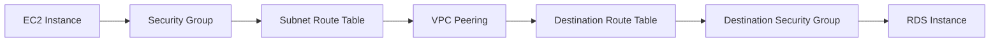

# How to Use Reachability Analyzer to Diagnose VPC Connectivity

Author: [nawazdhandala](https://github.com/nawazdhandala)

Tags: AWS, VPC, Networking, Troubleshooting

Description: Learn how to use AWS Reachability Analyzer to diagnose and troubleshoot VPC connectivity issues without sending actual traffic.

---

Debugging network connectivity in AWS can feel like searching for a needle in a haystack. You've got security groups, NACLs, route tables, internet gateways, NAT gateways, VPC peering connections, and transit gateways all working together. When something doesn't connect, figuring out which component is blocking traffic is tedious. That's where VPC Reachability Analyzer comes in.

## What Is Reachability Analyzer?

Reachability Analyzer is an AWS tool that performs static analysis of your VPC network configuration. Instead of sending actual packets (like a ping or traceroute), it examines your security groups, route tables, NACLs, and other networking components to determine whether a path exists between two endpoints. This means you can diagnose problems even when you can't send traffic - for example, when a security group is blocking all inbound connections.

The analysis doesn't look at application-level issues. It focuses purely on network-layer reachability: can traffic flow from point A to point B given the current configuration?

## When Should You Use It?

Reachability Analyzer is most useful in these scenarios:

- An EC2 instance can't connect to an RDS database in another subnet
- A Lambda function in a VPC can't reach the internet
- VPC peering is set up but traffic isn't flowing
- You've changed security groups and something broke
- You want to verify that a new network configuration will work before deploying applications

## Getting Started from the Console

Let's walk through a practical example. Say you have an EC2 instance that can't connect to an RDS instance on port 3306.

Navigate to the VPC console and find "Reachability Analyzer" in the left sidebar under "Network Analysis." Then click "Create and analyze path."

You'll need to specify:

- **Source type**: Choose "Instance" and select your EC2 instance
- **Destination type**: Choose "Instance" and select your RDS instance
- **Protocol**: TCP
- **Destination port**: 3306

Click "Create and analyze path" and wait for the analysis to complete. It usually takes 1-3 minutes.

## Reading the Results

If the path is reachable, you'll see a green "Reachable" status with the full path displayed. The path shows every hop the traffic takes - through subnets, route tables, security groups, and NACLs.

If the path is not reachable, this is where things get interesting. The analyzer will show you exactly where the path breaks. It highlights the component that's blocking traffic and explains why. For example, it might tell you:

- "Security group sg-abc123 does not allow inbound TCP traffic on port 3306"
- "Route table rtb-xyz789 does not have a route to the destination subnet"
- "Network ACL acl-def456 denies inbound traffic on port 3306"

This specificity is what makes Reachability Analyzer so valuable. Instead of manually checking every security group and route table, you get a direct answer.

## Using Reachability Analyzer with the AWS CLI

You can also run analyses from the command line, which is great for automation and scripting.

This command creates a network insights path between two EC2 instances on port 443.

```bash
# Create a network insights path
aws ec2 create-network-insights-path \
  --source i-0abc123def456 \
  --destination i-0xyz789ghi012 \
  --protocol tcp \
  --destination-port 443 \
  --source-ip 10.0.1.50 \
  --destination-ip 10.0.2.100
```

The output gives you a `NetworkInsightsPathId`. Use that to start the analysis.

This command runs the actual analysis on the path you just created.

```bash
# Start the analysis
aws ec2 start-network-insights-analysis \
  --network-insights-path-id nip-0abc123def456789
```

Then check the results.

This command retrieves the analysis results, showing whether the path is reachable or blocked.

```bash
# Get the results
aws ec2 describe-network-insights-analyses \
  --network-insights-analysis-ids nia-0abc123def456789
```

The output is a JSON blob with all the path details. The key field to look at is `NetworkPathFound` - it's either `true` or `false`. If false, the `Explanations` array tells you exactly what went wrong.

## Automating Connectivity Checks with a Script

Here's a Python script that creates a path, runs analysis, and waits for results. This is useful for CI/CD pipelines where you want to verify network connectivity after infrastructure changes.

This script automates the full workflow of creating a path, analyzing it, and printing the results.

```python
import boto3
import time

ec2 = boto3.client('ec2')

def check_connectivity(source_id, dest_id, port, protocol='tcp'):
    # Create the network insights path
    path = ec2.create_network_insights_path(
        Source=source_id,
        Destination=dest_id,
        Protocol=protocol,
        DestinationPort=port
    )
    path_id = path['NetworkInsightsPath']['NetworkInsightsPathId']
    print(f"Created path: {path_id}")

    # Start analysis
    analysis = ec2.start_network_insights_analysis(
        NetworkInsightsPathId=path_id
    )
    analysis_id = analysis['NetworkInsightsAnalysis']['NetworkInsightsAnalysisId']
    print(f"Started analysis: {analysis_id}")

    # Poll for results
    while True:
        result = ec2.describe_network_insights_analyses(
            NetworkInsightsAnalysisIds=[analysis_id]
        )
        status = result['NetworkInsightsAnalyses'][0]['Status']

        if status == 'succeeded':
            break
        elif status == 'failed':
            print("Analysis failed!")
            return None

        print(f"Status: {status}, waiting...")
        time.sleep(10)

    # Check results
    analysis_result = result['NetworkInsightsAnalyses'][0]
    reachable = analysis_result.get('NetworkPathFound', False)

    if reachable:
        print("Path is REACHABLE")
    else:
        print("Path is NOT REACHABLE")
        # Print explanations
        for explanation in analysis_result.get('Explanations', []):
            print(f"  Blocked by: {explanation.get('Component', {}).get('Id')}")
            print(f"  Reason: {explanation.get('ExplanationCode')}")

    # Clean up
    ec2.delete_network_insights_path(NetworkInsightsPathId=path_id)
    return reachable

# Check if an EC2 instance can reach RDS on port 3306
check_connectivity('i-0abc123def456', 'i-0xyz789ghi012', 3306)
```

## Supported Source and Destination Types

Reachability Analyzer supports a variety of endpoint types:

- EC2 instances
- Network interfaces (ENIs)
- Internet gateways
- VPN gateways
- VPC peering connections
- Transit gateways
- Transit gateway attachments
- NAT gateways
- VPC endpoints

This flexibility means you can test paths like "Can my EC2 instance reach the internet through this NAT gateway?" or "Is the transit gateway routing traffic correctly between VPCs?"

## Understanding the Path Components

When the analyzer returns a reachable path, it shows you every component the traffic passes through. Here's what a typical path might look like:



Each hop in the path is a potential point of failure. When the analyzer finds a problem, it identifies the specific hop and the reason for the blockage.

## Pricing and Limits

Reachability Analyzer charges per analysis. As of now, each analysis costs $0.10. There's no charge for creating or storing paths - you only pay when you run an analysis.

You can store up to 100 network insights paths per account per region. Each path can be analyzed multiple times, and you can keep the last 100 analyses per path.

## Tips for Effective Troubleshooting

Here are some practical tips from experience:

1. **Start simple**: Test connectivity between two instances in the same subnet first. If that works, add complexity.
2. **Check both directions**: Network traffic often needs to flow in both directions. Run analyses for both the request path and the response path.
3. **Use specific ports**: Don't just test generic connectivity. Test the exact port your application uses.
4. **Re-analyze after changes**: If you fix a security group, run the analysis again to confirm the fix worked.
5. **Save paths for repeated testing**: If you frequently test the same connectivity, save the path and re-run analyses as needed.

## Integrating with Monitoring

Reachability Analyzer is a diagnostic tool, not a monitoring tool. It tells you the current state of network configuration, not whether traffic is actually flowing. For ongoing monitoring, you'll want to combine it with tools like VPC Flow Logs and application-level health checks. Check out [monitoring your AWS infrastructure](https://oneuptime.com/blog/post/2026-02-13-aws-cloudwatch-infrastructure-monitoring/view) for a broader view of keeping your cloud environment healthy.

## Wrapping Up

VPC Reachability Analyzer takes the guesswork out of network troubleshooting in AWS. Instead of manually inspecting security groups, NACLs, and route tables, you point it at two endpoints and it tells you exactly whether traffic can flow and, if not, what's blocking it. It's especially useful for complex multi-VPC architectures where there are dozens of networking components between any two endpoints. At $0.10 per analysis, it's a small price to pay compared to the hours you'd spend debugging manually.
