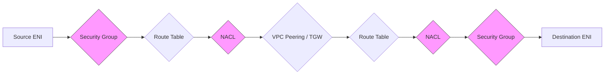

# How to Use Reachability Analyzer for Network Troubleshooting

Author: [nawazdhandala](https://github.com/nawazdhandala)

Tags: AWS, VPC, Networking, Troubleshooting, Reachability Analyzer

Description: A practical guide to using AWS Reachability Analyzer to diagnose network connectivity issues without sending any actual traffic.

---

Network troubleshooting in AWS can feel like detective work. You have security groups, NACLs, route tables, internet gateways, NAT gateways, VPC peering connections, and transit gateways all playing a role. When something does not connect, figuring out which component is blocking traffic can take hours of manual inspection.

AWS Reachability Analyzer changes this. It analyzes your network configuration and tells you whether a path exists between two endpoints - and if not, exactly where it breaks. Best of all, it does this without sending a single packet.

## What Is Reachability Analyzer?

Reachability Analyzer is a configuration analysis tool built into the VPC console. You give it a source, a destination, and optional protocol/port information. It then walks through every networking component in the path and tells you whether traffic can flow.



Each component in the path is evaluated. If any component blocks the traffic, Reachability Analyzer tells you exactly which one and why.

## Supported Resource Types

You can test connectivity between many different AWS resource types:

- EC2 instances
- Network interfaces (ENIs)
- Internet gateways
- VPN gateways
- VPC peering connections
- Transit gateways
- Transit gateway attachments
- VPC endpoints
- Network Load Balancers
- Application Load Balancers

## Creating a Network Insights Path

### Using the AWS CLI

First, create a Network Insights Path that defines the source and destination.

```bash
# Create a path to test connectivity from EC2 instance to another on port 443
aws ec2 create-network-insights-path \
  --source i-0abc123def456789a \
  --destination i-0abc123def456789b \
  --protocol TCP \
  --destination-port 443 \
  --tag-specifications 'ResourceType=network-insights-path,Tags=[{Key=Name,Value=WebToAPI}]'
```

This returns a Network Insights Path ID. Save it for the next step.

### Running the Analysis

```bash
# Start the reachability analysis using the path ID from the previous step
aws ec2 start-network-insights-analysis \
  --network-insights-path-id nip-0abc123def456789
```

### Checking the Results

```bash
# Get the analysis results - shows whether the path is reachable or not
aws ec2 describe-network-insights-analyses \
  --network-insights-analysis-ids nia-0abc123def456789 \
  --query 'NetworkInsightsAnalyses[0].{Status:Status,Reachable:NetworkPathFound,Explanations:Explanations}'
```

If the path is not reachable, the `Explanations` array tells you exactly what went wrong.

## Common Troubleshooting Scenarios

### Scenario 1: Security Group Blocking Traffic

One of the most common issues. The analysis result will look something like this.

```json
// Example output when a security group blocks the traffic
{
  "NetworkPathFound": false,
  "Explanations": [
    {
      "Direction": "ingress",
      "SecurityGroup": {
        "Id": "sg-0abc123",
        "Name": "api-server-sg"
      },
      "ExplanationCode": "SECURITY_GROUP_MISSING_ALLOW_RULE",
      "Port": 443,
      "Protocol": "tcp"
    }
  ]
}
```

The fix is straightforward - add an inbound rule to the security group.

```bash
# Add an inbound rule to allow HTTPS traffic from the source security group
aws ec2 authorize-security-group-ingress \
  --group-id sg-0abc123 \
  --protocol tcp \
  --port 443 \
  --source-group sg-0def456
```

### Scenario 2: Missing Route

When a route table does not have an entry for the destination CIDR, you will see something like this.

```json
// Example output when there is no route to the destination
{
  "NetworkPathFound": false,
  "Explanations": [
    {
      "RouteTable": {
        "Id": "rtb-0abc123"
      },
      "ExplanationCode": "NO_ROUTE_TO_DESTINATION",
      "Destination": "10.1.0.0/16"
    }
  ]
}
```

Fix it by adding the appropriate route.

```bash
# Add a route through the VPC peering connection to reach the destination CIDR
aws ec2 create-route \
  --route-table-id rtb-0abc123 \
  --destination-cidr-block 10.1.0.0/16 \
  --vpc-peering-connection-id pcx-0abc123
```

### Scenario 3: NACL Denying Traffic

NACLs are stateless, so you need both inbound and outbound rules. This is a common gotcha.

```json
// NACL blocking traffic - often forgotten because security groups are stateful
{
  "NetworkPathFound": false,
  "Explanations": [
    {
      "NetworkAcl": {
        "Id": "acl-0abc123"
      },
      "Direction": "egress",
      "ExplanationCode": "NETWORK_ACL_MISSING_ALLOW_RULE",
      "Port": 443,
      "Protocol": "tcp"
    }
  ]
}
```

## Automating Reachability Checks

You can integrate Reachability Analyzer into your CI/CD pipeline to catch connectivity issues before they hit production.

```python
# Python script to run reachability analysis and fail the pipeline if path is blocked
import boto3
import sys
import time

ec2 = boto3.client('ec2')

def check_reachability(path_id):
    # Start the analysis
    response = ec2.start_network_insights_analysis(
        NetworkInsightsPathId=path_id
    )
    analysis_id = response['NetworkInsightsAnalysis']['NetworkInsightsAnalysisId']

    # Poll until the analysis completes
    while True:
        result = ec2.describe_network_insights_analyses(
            NetworkInsightsAnalysisIds=[analysis_id]
        )
        analysis = result['NetworkInsightsAnalyses'][0]

        if analysis['Status'] == 'succeeded':
            if analysis['NetworkPathFound']:
                print(f"Path {path_id}: REACHABLE")
                return True
            else:
                print(f"Path {path_id}: NOT REACHABLE")
                for explanation in analysis.get('Explanations', []):
                    print(f"  Blocked by: {explanation.get('ExplanationCode')}")
                return False
        elif analysis['Status'] == 'failed':
            print(f"Analysis failed: {analysis.get('StatusMessage')}")
            return False

        time.sleep(5)

# Define paths to check - these should be pre-created
paths = [
    'nip-web-to-api',
    'nip-api-to-database',
    'nip-api-to-cache',
]

all_reachable = True
for path in paths:
    if not check_reachability(path):
        all_reachable = False

if not all_reachable:
    sys.exit(1)
```

## Using Reachability Analyzer with CloudFormation

You can define Network Insights Paths in CloudFormation to keep them version-controlled alongside your infrastructure.

```yaml
# CloudFormation template defining reachability paths for automated testing
Resources:
  WebToApiPath:
    Type: AWS::EC2::NetworkInsightsPath
    Properties:
      Source: !Ref WebServerInstance
      Destination: !Ref ApiServerInstance
      Protocol: tcp
      DestinationPort: 443
      Tags:
        - Key: Name
          Value: web-to-api-path

  ApiToDatabasePath:
    Type: AWS::EC2::NetworkInsightsPath
    Properties:
      Source: !Ref ApiServerInstance
      Destination: !Ref DatabaseInstance
      Protocol: tcp
      DestinationPort: 5432
      Tags:
        - Key: Name
          Value: api-to-database-path
```

## Pricing and Limits

Reachability Analyzer charges per analysis run. As of early 2026, each analysis costs $0.10. This is trivial compared to the time saved debugging network issues manually.

There are some limits to be aware of:

- Maximum of 100 Network Insights Paths per account per Region
- Maximum of 10 concurrent analyses
- Analysis results are retained for 30 days

## When to Use Reachability Analyzer vs. VPC Flow Logs

These tools complement each other well:

- Use **Reachability Analyzer** when you want to verify that your network configuration allows a specific path. It answers "can traffic flow?" based on configuration alone.
- Use **[VPC Flow Logs](https://oneuptime.com/blog/post/2026-02-12-monitor-network-performance-with-vpc-flow-logs/view)** when you want to see what traffic is actually flowing. It answers "what traffic did flow?" based on observed data.

If something is not connecting, start with Reachability Analyzer. If the configuration looks correct but you are still seeing issues, check flow logs for rejected packets that might indicate a problem at a different layer.

## Summary

Reachability Analyzer removes the guesswork from network troubleshooting in AWS. Instead of manually inspecting every security group, NACL, and route table, you point it at two endpoints and it tells you exactly where the path breaks. Combined with automation through the CLI or SDK, you can build connectivity validation into your deployment pipeline and catch issues before they cause outages.

The tool pays for itself the first time it saves you an hour of manual debugging. Make it part of your standard troubleshooting toolkit alongside [VPC Flow Logs](https://oneuptime.com/blog/post/2026-02-12-monitor-network-performance-with-vpc-flow-logs/view) and [Site-to-Site VPN monitoring](https://oneuptime.com/blog/post/2026-02-12-set-up-aws-site-to-site-vpn-with-bgp-routing/view).
