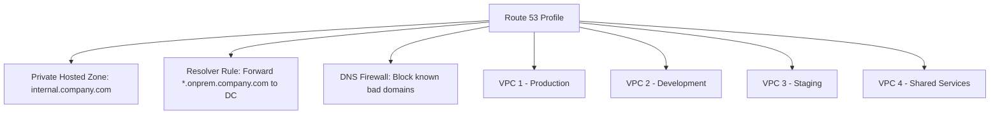

# How to Use Route 53 Profiles for VPC DNS Configuration

Author: [nawazdhandala](https://github.com/nawazdhandala)

Tags: AWS, Route 53, DNS, VPC, Profiles, Multi-Account

Description: Learn how to use Route 53 Profiles to standardize DNS configurations across multiple VPCs and accounts including resolver rules and private hosted zones.

---

Managing DNS configuration across dozens or hundreds of VPCs is tedious and error-prone. Every VPC needs the same resolver rules, the same private hosted zone associations, and the same DNS firewall rules. Route 53 Profiles let you define a DNS configuration once and apply it consistently across all your VPCs.

## What Are Route 53 Profiles?

A Route 53 Profile is a collection of DNS configurations that you can associate with multiple VPCs. Instead of manually configuring each VPC's DNS settings, you create a profile with your desired configuration and attach it.

A profile can include:
- Private hosted zone associations
- Resolver rules (forwarding rules)
- Route 53 Resolver DNS Firewall rule group associations



When you update the profile, all associated VPCs automatically get the updated configuration.

## Why Use Profiles?

Without profiles, you need to:
- Associate each private hosted zone with each VPC individually
- Share resolver rules via RAM and associate them per VPC
- Configure DNS firewall rules per VPC
- Repeat all of this for every new VPC

With profiles:
- Define the configuration once
- Associate the profile with each VPC
- New VPCs get everything by attaching the profile
- Updates propagate automatically

## Step 1: Create a Profile

```bash
# Create a new Route 53 Profile
aws route53profiles create-profile \
    --name "standard-dns-config" \
    --tags 'Key=Environment,Value=all' 'Key=ManagedBy,Value=NetworkTeam'

# Note the Profile ID from the response
# Example: rp-0123456789abcdef0
```

## Step 2: Add Resources to the Profile

### Add Private Hosted Zone Associations

```bash
# Associate a private hosted zone with the profile
aws route53profiles associate-resource-to-profile \
    --profile-id rp-0123456789abcdef0 \
    --name "internal-dns" \
    --resource-arn "arn:aws:route53:::hostedzone/Z1234INTERNAL" \
    --resource-properties '{"HostedZoneName": "internal.company.com"}'
```

This means that any VPC associated with this profile will automatically be able to resolve records in the internal.company.com private hosted zone.

### Add Resolver Rules

Resolver rules tell Route 53 Resolver where to forward DNS queries for specific domains. This is commonly used for hybrid DNS with on-premises:

```bash
# First, create a resolver rule if you do not have one
aws route53resolver create-resolver-rule \
    --name "forward-onprem" \
    --rule-type FORWARD \
    --domain-name "onprem.company.com" \
    --resolver-endpoint-id rslvr-out-0123456789abcdef0 \
    --target-ips 'Ip=10.0.0.53' 'Ip=10.0.0.54' \
    --tags 'Key=Purpose,Value=HybridDNS'

# Associate the resolver rule with the profile
aws route53profiles associate-resource-to-profile \
    --profile-id rp-0123456789abcdef0 \
    --name "onprem-forwarding" \
    --resource-arn "arn:aws:route53resolver:us-east-1:123456789012:resolver-rule/rslvr-rule-0123456789abcdef0"
```

### Add DNS Firewall Rule Groups

```bash
# Create a DNS Firewall rule group for blocking known bad domains
aws route53resolver create-firewall-rule-group \
    --name "block-malicious-domains" \
    --tags 'Key=Purpose,Value=Security'

# Add rules to block specific domain lists
aws route53resolver create-firewall-rule \
    --firewall-rule-group-id rslvr-frg-0123456789abcdef0 \
    --firewall-domain-list-id rslvr-fdl-malware-list \
    --priority 100 \
    --action BLOCK \
    --block-response NXDOMAIN \
    --name "block-malware-domains"

# Associate the firewall rule group with the profile
aws route53profiles associate-resource-to-profile \
    --profile-id rp-0123456789abcdef0 \
    --name "dns-firewall" \
    --resource-arn "arn:aws:route53resolver:us-east-1:123456789012:firewall-rule-group/rslvr-frg-0123456789abcdef0" \
    --resource-properties '{"Priority": 100}'
```

## Step 3: Associate Profile with VPCs

```bash
# Associate the profile with a VPC
aws route53profiles associate-profile \
    --profile-id rp-0123456789abcdef0 \
    --name "production-vpc" \
    --resource-id vpc-production

# Associate with additional VPCs
aws route53profiles associate-profile \
    --profile-id rp-0123456789abcdef0 \
    --name "development-vpc" \
    --resource-id vpc-development

aws route53profiles associate-profile \
    --profile-id rp-0123456789abcdef0 \
    --name "staging-vpc" \
    --resource-id vpc-staging
```

## Sharing Profiles Across Accounts

Use AWS RAM to share profiles with other accounts in your organization.

```bash
# Share the profile via RAM
aws ram create-resource-share \
    --name "dns-profile-share" \
    --resource-arns "arn:aws:route53profiles:us-east-1:123456789012:profile/rp-0123456789abcdef0" \
    --principals "arn:aws:organizations::123456789012:ou/o-abc123/ou-workloads" \
    --tags 'key=Purpose,value=DNSConfiguration'
```

In the recipient account:

```bash
# List available shared profiles (recipient account)
aws route53profiles list-profiles

# Associate the shared profile with a VPC in the recipient account
aws route53profiles associate-profile \
    --profile-id rp-0123456789abcdef0 \
    --name "workload-vpc" \
    --resource-id vpc-workload
```

## Managing Profile Updates

When you add or remove resources from a profile, the changes automatically propagate to all associated VPCs.

```bash
# Add a new private hosted zone to the profile
# All associated VPCs automatically get access to resolve records in this zone
aws route53profiles associate-resource-to-profile \
    --profile-id rp-0123456789abcdef0 \
    --name "new-service-dns" \
    --resource-arn "arn:aws:route53:::hostedzone/Z5678NEWSERVICE" \
    --resource-properties '{"HostedZoneName": "newservice.internal.company.com"}'

# Remove a resource from the profile
aws route53profiles disassociate-resource-from-profile \
    --profile-id rp-0123456789abcdef0 \
    --resource-arn "arn:aws:route53:::hostedzone/Z9999OLDSERVICE"
```

## Listing and Inspecting Profiles

```bash
# List all profiles in the account
aws route53profiles list-profiles \
    --query 'ProfileSummaries[].{Id:Id,Name:Name,Status:ShareStatus}'

# Get details of a specific profile
aws route53profiles get-profile \
    --profile-id rp-0123456789abcdef0

# List resources associated with a profile
aws route53profiles list-profile-resource-associations \
    --profile-id rp-0123456789abcdef0 \
    --query 'ProfileResourceAssociations[].{Name:Name,ResourceArn:ResourceArn,ResourceType:ResourceType}'

# List VPCs associated with a profile
aws route53profiles list-profile-associations \
    --profile-id rp-0123456789abcdef0 \
    --query 'ProfileAssociations[].{Name:Name,ResourceId:ResourceId,Status:Status}'
```

## Profile Design Patterns

### Pattern 1: Single Profile for All VPCs

The simplest approach - one profile with everything:

```
Profile: company-standard
  - Private HZ: internal.company.com
  - Private HZ: shared-services.internal.company.com
  - Resolver Rule: Forward *.onprem.company.com
  - DNS Firewall: Block malicious domains
```

### Pattern 2: Environment-Specific Profiles

Different profiles for production and non-production:

```
Profile: production-dns
  - Private HZ: internal.company.com
  - Private HZ: prod.internal.company.com
  - Resolver Rule: Forward *.onprem.company.com
  - DNS Firewall: Strict rules

Profile: nonprod-dns
  - Private HZ: internal.company.com
  - Private HZ: dev.internal.company.com
  - DNS Firewall: Moderate rules
```

### Pattern 3: Layered Profiles

Base profile for all VPCs plus overlay profiles for specific needs:

```
Profile: base-dns (applied to all VPCs)
  - DNS Firewall: Block malicious domains
  - Resolver Rule: Forward *.onprem.company.com

Profile: app-team-dns (applied to app team VPCs)
  - Private HZ: app-services.internal.company.com

Profile: data-team-dns (applied to data team VPCs)
  - Private HZ: data-platform.internal.company.com
```

Note: A VPC can only be associated with one profile. For layered configurations, include all required resources in the relevant profile.

## Automation with Terraform

```hcl
resource "aws_route53profiles_profile" "standard" {
  name = "standard-dns-config"
  tags = {
    ManagedBy = "Terraform"
  }
}

resource "aws_route53profiles_resource_association" "internal_hz" {
  profile_id   = aws_route53profiles_profile.standard.id
  name         = "internal-dns"
  resource_arn = aws_route53_zone.internal.arn
  resource_properties = jsonencode({
    HostedZoneName = "internal.company.com"
  })
}

resource "aws_route53profiles_association" "production" {
  profile_id  = aws_route53profiles_profile.standard.id
  name        = "production-vpc"
  resource_id = aws_vpc.production.id
}
```

## Monitoring

Track profile-related activity with CloudTrail:

```bash
# Search CloudTrail for profile changes
aws cloudtrail lookup-events \
    --lookup-attributes AttributeKey=EventSource,AttributeValue=route53profiles.amazonaws.com \
    --start-time "2026-02-11T00:00:00Z" \
    --end-time "2026-02-12T23:59:59Z"
```

For comprehensive DNS monitoring, see our guide on [monitoring Route 53 DNS query logging](https://oneuptime.com/blog/post/monitor-route-53-dns-query-logging/view).

## Conclusion

Route 53 Profiles transform DNS management from a per-VPC chore into a centralized, policy-driven operation. Define your DNS configuration once, share it across accounts via RAM, and let profiles handle the propagation. For organizations running dozens or hundreds of VPCs, this is a significant reduction in operational overhead and configuration drift risk.
