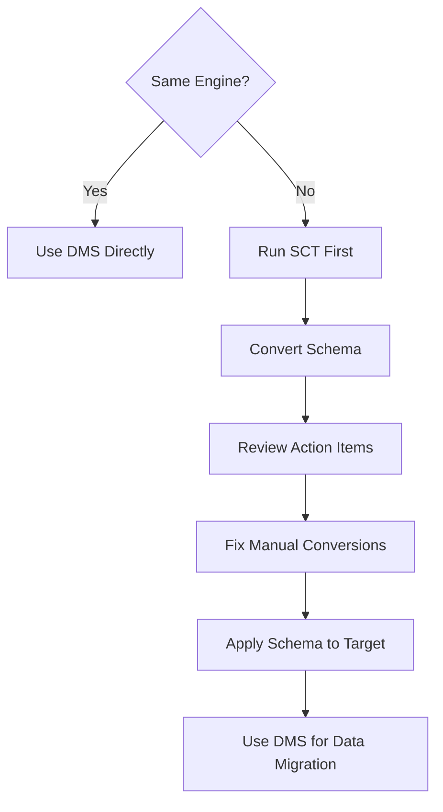
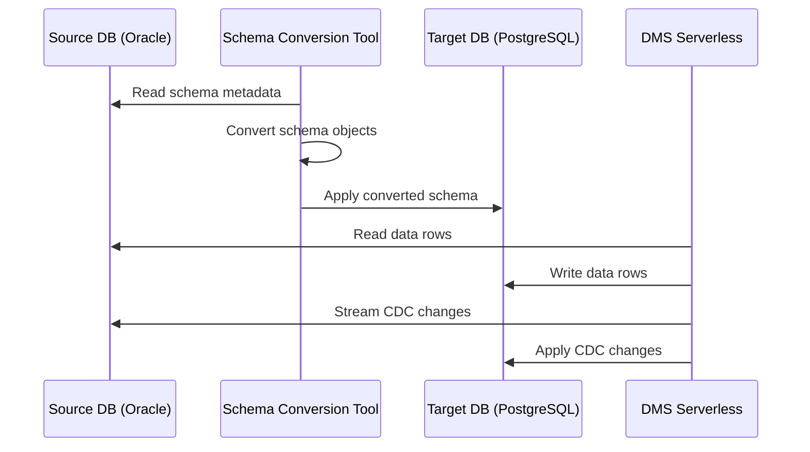

# How to Use Schema Conversion Tool for Heterogeneous Migrations

Author: [nawazdhandala](https://github.com/nawazdhandala)

Tags: AWS, DMS, Schema Conversion Tool, Database Migration, Heterogeneous Migration

Description: Learn how to use AWS Schema Conversion Tool to translate database schemas between different engine types during migration

---

Migrating between the same database engines is straightforward. Moving from MySQL 5.7 to MySQL 8.0 is mostly a version upgrade. But moving from Oracle to PostgreSQL? That is a different beast entirely. Stored procedures, data types, functions, and proprietary SQL syntax all need to be translated. That is exactly what the AWS Schema Conversion Tool (SCT) is built for.

SCT analyzes your source database schema, converts it to the target engine's syntax, and tells you exactly which parts it could not convert automatically so you can fix them by hand. This guide walks you through the entire process.

## When Do You Need SCT?

You need SCT whenever you are migrating between different database engines. Common scenarios include:

- Oracle to PostgreSQL (most popular)
- SQL Server to MySQL or PostgreSQL
- Oracle to MySQL
- Teradata or Netezza to Amazon Redshift (data warehouse migrations)

If you are moving between the same engine (MySQL to MySQL, Postgres to Postgres), you can skip SCT and go straight to DMS. Check out our guide on [setting up DMS Serverless](https://oneuptime.com/blog/post/set-up-dms-serverless-for-database-migration/view) for that path.



## Installing SCT

SCT is a desktop application that you download and run locally. It connects to both your source and target databases.

1. Download SCT from the AWS documentation page
2. Install the required JDBC drivers for both source and target database engines
3. Place JDBC drivers in the SCT `drivers` directory

The JDBC drivers are not bundled with SCT due to licensing. You need to download them separately from the respective database vendor websites.

## Step 1: Create a New Project

Launch SCT and create a new project. You will configure the source and target databases.

For the source connection, provide the hostname, port, username, password, and database/schema name. SCT will connect and read the full schema metadata.

For the target, do the same. If you have not created the target database yet, you can still generate the conversion scripts and apply them later.

## Step 2: Run the Assessment Report

Before converting anything, run the assessment report. This gives you a clear picture of how much of your schema can be converted automatically and how much requires manual work.

```
Source: Oracle 19c
Target: PostgreSQL 15

Summary:
  Storage Objects:     45/45 (100% auto-converted)
  Tables:             312/312 (100% auto-converted)
  Views:               87/92 (94.5% auto-converted)
  Stored Procedures:  156/203 (76.8% auto-converted)
  Functions:           89/134 (66.4% auto-converted)
  Triggers:            23/31 (74.2% auto-converted)
```

The assessment report uses a color-coded system:

- **Green**: Fully automatic conversion, no action needed
- **Yellow**: Mostly converted but needs minor tweaks
- **Orange**: Partially converted, significant manual work
- **Red**: Cannot be converted, must be rewritten from scratch

Pay close attention to the red items. These typically include Oracle-specific packages, CONNECT BY queries, or proprietary functions that have no direct PostgreSQL equivalent.

## Step 3: Convert the Schema

Right-click your source schema in the left panel and select "Convert schema." SCT will process every object and generate the equivalent target SQL.

Here is an example of what a conversion looks like for a simple Oracle stored procedure:

**Oracle Source:**

```sql
-- Oracle procedure using NVL and SYSDATE
CREATE OR REPLACE PROCEDURE update_employee_status (
    p_emp_id IN NUMBER,
    p_status IN VARCHAR2
) AS
BEGIN
    UPDATE employees
    SET status = p_status,
        updated_at = SYSDATE,
        notes = NVL(notes, 'No notes')
    WHERE employee_id = p_emp_id;
    COMMIT;
END;
```

**PostgreSQL Target (auto-converted by SCT):**

```sql
-- Equivalent PostgreSQL function using COALESCE and CURRENT_TIMESTAMP
CREATE OR REPLACE FUNCTION update_employee_status(
    p_emp_id INTEGER,
    p_status VARCHAR
) RETURNS void AS
$BODY$
BEGIN
    UPDATE employees
    SET status = p_status,
        updated_at = CURRENT_TIMESTAMP,
        notes = COALESCE(notes, 'No notes')
    WHERE employee_id = p_emp_id;
END;
$BODY$
LANGUAGE plpgsql;
```

Notice that SCT automatically translated `NVL` to `COALESCE`, `SYSDATE` to `CURRENT_TIMESTAMP`, `NUMBER` to `INTEGER`, and restructured the procedure as a PostgreSQL function. It also removed the explicit `COMMIT` since PostgreSQL functions run inside a transaction by default.

## Step 4: Review and Fix Action Items

The action items panel lists everything SCT could not convert automatically. Common issues include:

**Oracle CONNECT BY hierarchical queries** need to be rewritten using PostgreSQL's recursive CTEs:

```sql
-- PostgreSQL recursive CTE replacing Oracle CONNECT BY
WITH RECURSIVE org_tree AS (
    -- Base case: top-level managers
    SELECT employee_id, name, manager_id, 1 AS level
    FROM employees
    WHERE manager_id IS NULL

    UNION ALL

    -- Recursive case: employees reporting to someone in the tree
    SELECT e.employee_id, e.name, e.manager_id, t.level + 1
    FROM employees e
    JOIN org_tree t ON e.manager_id = t.employee_id
)
SELECT * FROM org_tree ORDER BY level, name;
```

**Oracle packages** do not exist in PostgreSQL. You need to break them into individual functions and use schemas for namespace grouping.

**Sequence handling** differs between engines. Oracle uses `sequence_name.NEXTVAL` while PostgreSQL uses `nextval('sequence_name')`. SCT usually handles this, but check your application code too.

## Step 5: Apply the Schema to the Target

Once you are satisfied with the conversion, apply it to your target database. Right-click the target schema in the right panel and select "Apply to database."

You can also export the SQL scripts and apply them manually if you prefer:

```bash
# Apply the exported schema conversion scripts to PostgreSQL
psql -h target-db.example.com -U admin -d mydb -f converted_schema.sql
```

Running the scripts manually gives you more control. You can review each statement, apply them in stages, and handle errors individually.

## Step 6: Migrate Data with DMS

With the schema in place on the target, use DMS to move the actual data. SCT and DMS work together seamlessly. SCT handles the schema structure while DMS handles the data rows.



## Data Type Mapping Reference

Here are the most common data type mappings that SCT handles:

| Oracle | PostgreSQL |
|--------|------------|
| NUMBER(p,s) | NUMERIC(p,s) |
| VARCHAR2(n) | VARCHAR(n) |
| DATE | TIMESTAMP |
| CLOB | TEXT |
| BLOB | BYTEA |
| RAW(n) | BYTEA |
| LONG | TEXT |

One gotcha: Oracle's `DATE` type includes time components, while PostgreSQL's `DATE` does not. SCT correctly maps Oracle `DATE` to PostgreSQL `TIMESTAMP` to preserve time information.

## Testing After Conversion

Never trust a migration without testing. Compare row counts between source and target for every table. Run your application's most critical queries against the target database and verify the results match.

```sql
-- Quick row count comparison query for validation
SELECT 'employees' AS table_name, COUNT(*) AS row_count FROM employees
UNION ALL
SELECT 'orders', COUNT(*) FROM orders
UNION ALL
SELECT 'products', COUNT(*) FROM products;
```

Run this on both source and target and compare the numbers. For more sophisticated validation, consider checksumming key columns.

## Tips for Large Migrations

For large schemas with hundreds of stored procedures, prioritize your conversion work. Start with the objects your application actually calls. Many legacy databases have abandoned procedures that nobody uses anymore - do not waste time converting those.

Keep a tracking spreadsheet of all red and orange action items. Assign them to team members and track progress. A migration with 200 stored procedures and 30% manual conversion rate means roughly 60 procedures need human attention.

## Wrapping Up

The Schema Conversion Tool is indispensable for heterogeneous database migrations. It automates the tedious part of translating database-specific syntax and gives you a clear roadmap for what needs manual attention. Combined with DMS for data movement, SCT makes engine-to-engine migrations practical for teams that would otherwise be stuck on expensive legacy databases.

If you are also dealing with CDC latency during the data migration phase, check out our guide on [handling DMS CDC latency issues](https://oneuptime.com/blog/post/handle-dms-cdc-latency-issues/view).
