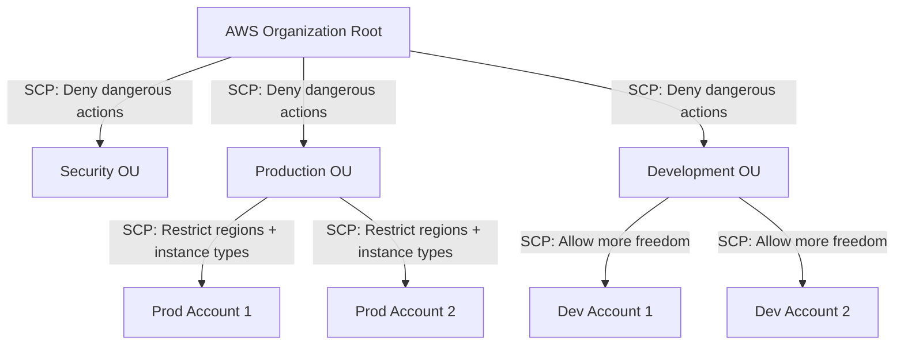

# How to Use Service Control Policies (SCPs) in AWS Organizations

Author: [nawazdhandala](https://github.com/nawazdhandala)

Tags: AWS, IAM, Organizations, Security, Governance

Description: A complete guide to implementing Service Control Policies in AWS Organizations for centralized guardrails across multiple accounts, with practical policy examples.

---

Service Control Policies (SCPs) are the top-level security guardrails in AWS. They set the maximum permissions for every identity in an AWS account - including the root user. Unlike IAM policies that grant permissions, SCPs only restrict them. They're your organization's safety net, preventing anyone from doing things like disabling CloudTrail, leaving a region you don't operate in, or spinning up expensive instance types.

If you're running a multi-account AWS environment (and you should be), SCPs are essential. Let's go through how to create and apply them effectively.

## How SCPs Work

SCPs are attached to organizational units (OUs) or individual accounts within AWS Organizations. They affect all IAM users and roles in those accounts - but they don't grant permissions themselves.

Think of it this way: IAM policies are the gas pedal. SCPs are the speed limiter. You can press the gas as hard as you want, but you can't go faster than the limiter allows.



## Enabling SCPs

Before you can use SCPs, you need to enable them in your organization:

```bash
# Enable service control policies in AWS Organizations
aws organizations enable-policy-type \
  --root-id r-abc1 \
  --policy-type SERVICE_CONTROL_POLICY
```

By default, a `FullAWSAccess` policy is attached to every OU and account. This allows everything. SCPs work by restricting from this default.

## The Two SCP Strategies

There are two approaches:

**Deny list (recommended):** Start with `FullAWSAccess` and add deny policies for specific actions you want to block. This is easier to manage because new AWS services work by default.

**Allow list:** Remove `FullAWSAccess` and explicitly allow only the services you want. This is more secure but harder to maintain because you have to update the SCP every time you need a new service.

Most organizations use the deny list approach. Let's focus on that.

## Essential SCPs Everyone Should Have

### Prevent CloudTrail Tampering

```json
{
    "Version": "2012-10-17",
    "Statement": [
        {
            "Sid": "ProtectCloudTrail",
            "Effect": "Deny",
            "Action": [
                "cloudtrail:DeleteTrail",
                "cloudtrail:StopLogging",
                "cloudtrail:UpdateTrail",
                "cloudtrail:PutEventSelectors"
            ],
            "Resource": "*",
            "Condition": {
                "StringNotLike": {
                    "aws:PrincipalArn": [
                        "arn:aws:iam::*:role/OrganizationAccountAccessRole",
                        "arn:aws:iam::*:role/SecurityAuditRole"
                    ]
                }
            }
        }
    ]
}
```

This prevents anyone except specific security roles from tampering with CloudTrail. If an attacker compromises an account, they can't cover their tracks.

### Restrict to Approved Regions

```json
{
    "Version": "2012-10-17",
    "Statement": [
        {
            "Sid": "DenyUnapprovedRegions",
            "Effect": "Deny",
            "NotAction": [
                "iam:*",
                "organizations:*",
                "sts:*",
                "support:*",
                "budgets:*",
                "cloudfront:*",
                "route53:*",
                "s3:GetBucketLocation",
                "s3:ListAllMyBuckets"
            ],
            "Resource": "*",
            "Condition": {
                "StringNotEquals": {
                    "aws:RequestedRegion": [
                        "us-east-1",
                        "us-west-2",
                        "eu-west-1"
                    ]
                }
            }
        }
    ]
}
```

The `NotAction` list excludes global services that don't have regional endpoints. Without these exceptions, IAM, Organizations, and CloudFront would break.

### Prevent Leaving the Organization

```json
{
    "Version": "2012-10-17",
    "Statement": [
        {
            "Sid": "DenyLeaveOrganization",
            "Effect": "Deny",
            "Action": "organizations:LeaveOrganization",
            "Resource": "*"
        }
    ]
}
```

Simple but important. If an attacker gains control of an account, they shouldn't be able to remove it from the organization (which would remove all SCP restrictions).

### Require Encryption

```json
{
    "Version": "2012-10-17",
    "Statement": [
        {
            "Sid": "DenyUnencryptedS3",
            "Effect": "Deny",
            "Action": "s3:PutObject",
            "Resource": "*",
            "Condition": {
                "StringNotEquals": {
                    "s3:x-amz-server-side-encryption": ["AES256", "aws:kms"]
                },
                "Null": {
                    "s3:x-amz-server-side-encryption": "false"
                }
            }
        },
        {
            "Sid": "DenyUnencryptedEBS",
            "Effect": "Deny",
            "Action": "ec2:CreateVolume",
            "Resource": "*",
            "Condition": {
                "Bool": {
                    "ec2:Encrypted": "false"
                }
            }
        }
    ]
}
```

### Restrict Expensive Instance Types

```json
{
    "Version": "2012-10-17",
    "Statement": [
        {
            "Sid": "DenyExpensiveInstances",
            "Effect": "Deny",
            "Action": "ec2:RunInstances",
            "Resource": "arn:aws:ec2:*:*:instance/*",
            "Condition": {
                "ForAnyValue:StringLike": {
                    "ec2:InstanceType": [
                        "p4*",
                        "p5*",
                        "x2*",
                        "u-*",
                        "*.metal",
                        "*.24xlarge",
                        "*.16xlarge",
                        "*.12xlarge"
                    ]
                }
            }
        }
    ]
}
```

This prevents launching GPU instances, bare metal, and very large instance types that could lead to massive unexpected charges.

## Creating and Attaching SCPs

```bash
# Create the SCP
aws organizations create-policy \
  --name "ProtectCloudTrail" \
  --description "Prevent CloudTrail tampering" \
  --type SERVICE_CONTROL_POLICY \
  --content file://protect-cloudtrail.json

# Attach it to an OU
aws organizations attach-policy \
  --policy-id p-abc123 \
  --target-id ou-root-production
```

To list current SCPs:

```bash
# List all SCPs in the organization
aws organizations list-policies --filter SERVICE_CONTROL_POLICY

# List SCPs attached to a specific OU
aws organizations list-policies-for-target \
  --target-id ou-root-production \
  --filter SERVICE_CONTROL_POLICY
```

## Terraform Configuration

```hcl
# Create an SCP to protect CloudTrail
resource "aws_organizations_policy" "protect_cloudtrail" {
  name        = "ProtectCloudTrail"
  description = "Prevent CloudTrail tampering"
  type        = "SERVICE_CONTROL_POLICY"

  content = jsonencode({
    Version = "2012-10-17"
    Statement = [
      {
        Sid    = "ProtectCloudTrail"
        Effect = "Deny"
        Action = [
          "cloudtrail:DeleteTrail",
          "cloudtrail:StopLogging",
          "cloudtrail:UpdateTrail"
        ]
        Resource = "*"
        Condition = {
          StringNotLike = {
            "aws:PrincipalArn" = [
              "arn:aws:iam::*:role/OrganizationAccountAccessRole"
            ]
          }
        }
      }
    ]
  })
}

# Attach to the production OU
resource "aws_organizations_policy_attachment" "production" {
  policy_id = aws_organizations_policy.protect_cloudtrail.id
  target_id = aws_organizations_organizational_unit.production.id
}
```

## SCP Limits and Gotchas

**Size limit:** Each SCP can be up to 5,120 characters. This fills up fast with complex policies. Use multiple smaller SCPs instead of one giant one.

**Management account is exempt:** SCPs don't affect the management account (the one that created the organization). Never run workloads in the management account.

**SCPs don't grant permissions:** They only restrict. You still need IAM policies to actually grant access.

**Maximum 5 SCPs per target:** You can attach up to 5 SCPs to each OU or account (including the default FullAWSAccess). Plan your policies accordingly.

**Inheritance:** SCPs are inherited down the OU tree. A deny at the root level affects every account in the organization. Be careful about what you apply at the root.

## Testing SCPs

Before applying an SCP broadly, test it on a single account first:

```bash
# Attach the SCP to a test account only
aws organizations attach-policy \
  --policy-id p-abc123 \
  --target-id 123456789012  # Just the test account
```

Use the IAM Policy Simulator or actually try the restricted actions to verify the SCP works as expected. Then gradually roll it out to OUs.

For understanding how SCPs interact with IAM policies and permission boundaries, see our guide on [setting up IAM permission boundaries](https://oneuptime.com/blog/post/set-up-iam-permission-boundaries/view).

## Wrapping Up

SCPs are your organization's security floor. They ensure that no matter what IAM policies exist in member accounts, certain actions are always blocked. Start with the essentials: protect CloudTrail, restrict regions, prevent organization escape, and block expensive resources. Then add policies specific to your compliance requirements. Test carefully, roll out gradually, and remember that the management account is always exempt.
