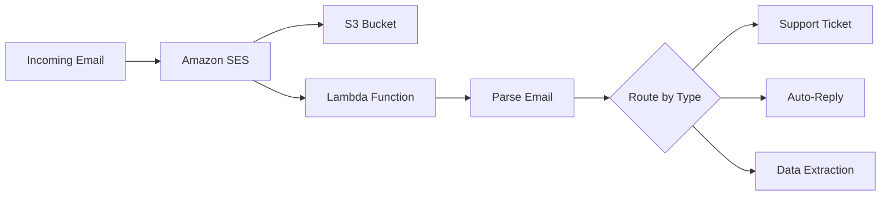

# How to Use SES with Lambda for Email Processing

Author: [nawazdhandala](https://github.com/nawazdhandala)

Tags: AWS, SES, Lambda, Email, Serverless

Description: Build automated email processing workflows by connecting Amazon SES with Lambda functions to parse, route, and respond to incoming emails programmatically.

---

Amazon SES and Lambda make a great combination for automated email processing. SES handles the email infrastructure - receiving, spam filtering, and storage - while Lambda runs your custom processing logic without you having to manage servers. You can build everything from simple auto-responders to sophisticated email parsing pipelines.

Let's build a practical email processing system step by step.

## The Architecture

Here's what the flow looks like.



SES receives the email, stores it in S3, and triggers Lambda. Lambda fetches the full email from S3, parses it, and then routes it based on your business logic.

## Setting Up the Infrastructure

I'll assume you've already configured SES for receiving emails (if not, see our guide on [using SES for receiving emails](https://oneuptime.com/blog/post/use-ses-for-receiving-emails/view)). Let's focus on the Lambda side.

First, create the Lambda function with the right permissions.

```yaml
# CloudFormation template for the Lambda function and IAM role
AWSTemplateFormatVersion: '2010-09-09'
Resources:
  EmailProcessorRole:
    Type: AWS::IAM::Role
    Properties:
      RoleName: email-processor-role
      AssumeRolePolicyDocument:
        Version: '2012-10-17'
        Statement:
          - Effect: Allow
            Principal:
              Service: lambda.amazonaws.com
            Action: sts:AssumeRole
      Policies:
        - PolicyName: email-processor-policy
          PolicyDocument:
            Version: '2012-10-17'
            Statement:
              - Effect: Allow
                Action:
                  - logs:CreateLogGroup
                  - logs:CreateLogStream
                  - logs:PutLogEvents
                Resource: '*'
              - Effect: Allow
                Action:
                  - s3:GetObject
                Resource: arn:aws:s3:::my-incoming-emails/*
              - Effect: Allow
                Action:
                  - ses:SendEmail
                  - ses:SendRawEmail
                Resource: '*'
              - Effect: Allow
                Action:
                  - dynamodb:PutItem
                  - dynamodb:UpdateItem
                  - dynamodb:GetItem
                Resource: arn:aws:dynamodb:us-east-1:*:table/email-tickets

  EmailProcessor:
    Type: AWS::Lambda::Function
    Properties:
      FunctionName: email-processor
      Runtime: python3.12
      Handler: index.lambda_handler
      Role: !GetAtt EmailProcessorRole.Arn
      Timeout: 60
      MemorySize: 256
```

## The Main Lambda Handler

Here's a comprehensive email processor that handles multiple types of incoming emails.

```python
import json
import boto3
import email
import re
import time
from email import policy
from email.utils import parseaddr

s3 = boto3.client('s3')
ses = boto3.client('ses')
dynamodb = boto3.resource('dynamodb')

BUCKET_NAME = 'my-incoming-emails'
SUPPORT_EMAIL = 'support@yourdomain.com'
TICKET_TABLE = dynamodb.Table('email-tickets')

def lambda_handler(event, context):
    """Main entry point for email processing."""

    for record in event['Records']:
        ses_notification = record['ses']
        mail_info = ses_notification['mail']
        receipt_info = ses_notification['receipt']

        # Skip spam and virus-infected emails
        if not passes_security_checks(receipt_info):
            print(f"Email {mail_info['messageId']} failed security checks")
            continue

        # Fetch and parse the full email from S3
        message_id = mail_info['messageId']
        parsed_email = fetch_and_parse_email(message_id)

        if parsed_email is None:
            print(f"Could not parse email {message_id}")
            continue

        # Route the email based on recipient and content
        route_email(parsed_email, mail_info)

def passes_security_checks(receipt):
    """Verify email passed spam and virus scanning."""
    checks = {
        'spamVerdict': receipt.get('spamVerdict', {}).get('status'),
        'virusVerdict': receipt.get('virusVerdict', {}).get('status'),
        'spfVerdict': receipt.get('spfVerdict', {}).get('status'),
        'dkimVerdict': receipt.get('dkimVerdict', {}).get('status'),
    }

    # Require spam and virus checks to pass
    # SPF and DKIM are informational - log but don't block
    if checks['spamVerdict'] != 'PASS':
        return False
    if checks['virusVerdict'] != 'PASS':
        return False

    if checks['spfVerdict'] != 'PASS':
        print(f"Warning: SPF check did not pass: {checks['spfVerdict']}")
    if checks['dkimVerdict'] != 'PASS':
        print(f"Warning: DKIM check did not pass: {checks['dkimVerdict']}")

    return True

def fetch_and_parse_email(message_id):
    """Download raw email from S3 and parse it."""
    try:
        key = f'incoming/{message_id}'
        response = s3.get_object(Bucket=BUCKET_NAME, Key=key)
        raw_email = response['Body'].read().decode('utf-8', errors='replace')
        return email.message_from_string(raw_email, policy=policy.default)
    except Exception as e:
        print(f"Error fetching email: {e}")
        return None
```

## Email Routing Logic

Different emails need different handling. Here's a router that decides what to do based on the recipient address and email content.

```python
def route_email(parsed_email, mail_info):
    """Route email to appropriate handler based on recipient and content."""

    recipients = mail_info['destination']
    sender = mail_info['source']
    subject = parsed_email['subject'] or '(no subject)'
    body = extract_body(parsed_email)

    for recipient in recipients:
        recipient_lower = recipient.lower()

        if 'support@' in recipient_lower:
            handle_support_email(sender, subject, body, parsed_email)
        elif 'orders@' in recipient_lower:
            handle_order_email(sender, subject, body)
        elif 'unsubscribe@' in recipient_lower:
            handle_unsubscribe(sender, subject)
        elif 'noreply@' in recipient_lower:
            # Auto-reply that this address doesn't accept incoming mail
            send_auto_reply(sender, subject)
        else:
            # Default handling - create a general ticket
            handle_support_email(sender, subject, body, parsed_email)

def extract_body(msg):
    """Get the plain text body from an email, falling back to HTML."""
    body = ''

    if msg.is_multipart():
        for part in msg.walk():
            content_type = part.get_content_type()
            disposition = str(part.get('Content-Disposition', ''))

            # Skip attachments
            if 'attachment' in disposition:
                continue

            if content_type == 'text/plain':
                body = part.get_content()
                break
            elif content_type == 'text/html' and not body:
                # Strip HTML tags for a rough plain text version
                html_content = part.get_content()
                body = re.sub(r'<[^>]+>', '', html_content)
    else:
        body = msg.get_content()

    return body.strip() if body else ''
```

## Support Ticket Creation

When a support email comes in, create a ticket and send an acknowledgment.

```python
def handle_support_email(sender, subject, body, parsed_email):
    """Create a support ticket and send acknowledgment."""

    # Generate a ticket ID
    ticket_id = f"TKT-{int(time.time())}"

    # Check if this is a reply to an existing ticket
    existing_ticket = find_existing_ticket(subject)
    if existing_ticket:
        update_ticket(existing_ticket, sender, body)
        return

    # Create new ticket in DynamoDB
    TICKET_TABLE.put_item(
        Item={
            'ticket_id': ticket_id,
            'sender': sender,
            'subject': subject,
            'body': body,
            'status': 'open',
            'created_at': int(time.time()),
            'updated_at': int(time.time()),
            'replies': []
        }
    )

    # Count attachments
    attachment_count = sum(
        1 for part in parsed_email.walk()
        if part.get_content_disposition() == 'attachment'
    )

    # Send acknowledgment
    ack_body = f"""Hi,

Thanks for contacting us. We've created ticket {ticket_id} for your request.

Subject: {subject}

We'll get back to you within 24 hours. If you need to add more information,
just reply to this email and include the ticket number in the subject line.

Best regards,
Support Team"""

    ses.send_email(
        Source=SUPPORT_EMAIL,
        Destination={'ToAddresses': [sender]},
        Message={
            'Subject': {'Data': f'Re: {subject} [{ticket_id}]'},
            'Body': {'Text': {'Data': ack_body}}
        }
    )

    print(f"Created ticket {ticket_id} for {sender}: {subject}")
    if attachment_count > 0:
        print(f"  {attachment_count} attachment(s) included")

def find_existing_ticket(subject):
    """Check if the subject contains an existing ticket ID."""
    match = re.search(r'TKT-\d+', subject)
    if match:
        ticket_id = match.group(0)
        try:
            response = TICKET_TABLE.get_item(Key={'ticket_id': ticket_id})
            if 'Item' in response:
                return response['Item']
        except Exception:
            pass
    return None

def update_ticket(ticket, sender, body):
    """Add a reply to an existing ticket."""
    TICKET_TABLE.update_item(
        Key={'ticket_id': ticket['ticket_id']},
        UpdateExpression='SET #replies = list_append(#replies, :new_reply), updated_at = :now',
        ExpressionAttributeNames={'#replies': 'replies'},
        ExpressionAttributeValues={
            ':new_reply': [{
                'sender': sender,
                'body': body,
                'timestamp': int(time.time())
            }],
            ':now': int(time.time())
        }
    )
    print(f"Updated ticket {ticket['ticket_id']} with reply from {sender}")
```

## Auto-Reply Handler

For addresses that shouldn't receive email, send a polite auto-reply.

```python
def send_auto_reply(sender, original_subject):
    """Send an auto-reply for unmonitored addresses."""

    # Don't auto-reply to other auto-replies (prevent loops)
    if is_automated_sender(sender):
        return

    reply_body = """Hi,

This email address does not accept incoming messages.

If you need assistance, please contact support@yourdomain.com.

This is an automated response."""

    ses.send_email(
        Source=SUPPORT_EMAIL,
        Destination={'ToAddresses': [sender]},
        Message={
            'Subject': {'Data': f'Re: {original_subject}'},
            'Body': {'Text': {'Data': reply_body}}
        }
    )

def is_automated_sender(sender):
    """Check if the sender is likely an automated system (to prevent reply loops)."""
    automated_patterns = [
        'noreply@', 'no-reply@', 'mailer-daemon@',
        'postmaster@', 'bounce@', 'auto@'
    ]
    sender_lower = sender.lower()
    return any(pattern in sender_lower for pattern in automated_patterns)
```

## Error Handling and Dead Letter Queues

In production, you want to make sure failed processing doesn't lose emails. Configure a Dead Letter Queue (DLQ) on your Lambda function.

```bash
# Create an SQS queue for failed processing
aws sqs create-queue --queue-name email-processing-dlq

# Configure the Lambda DLQ
aws lambda update-function-configuration \
  --function-name email-processor \
  --dead-letter-config TargetArn=arn:aws:sqs:us-east-1:123456789:email-processing-dlq
```

Also add retry logic in your function for transient errors, especially when calling DynamoDB or SES.

## Testing Locally

You can test your Lambda function locally by creating a test event that mimics what SES sends.

```json
{
  "Records": [{
    "ses": {
      "mail": {
        "messageId": "test-message-id",
        "source": "user@example.com",
        "destination": ["support@yourdomain.com"],
        "commonHeaders": {
          "subject": "I need help with my account"
        }
      },
      "receipt": {
        "spamVerdict": {"status": "PASS"},
        "virusVerdict": {"status": "PASS"},
        "spfVerdict": {"status": "PASS"},
        "dkimVerdict": {"status": "PASS"}
      }
    }
  }]
}
```

## Summary

SES plus Lambda gives you a fully serverless email processing pipeline. You get SES's email infrastructure and security scanning combined with Lambda's flexibility to run any processing logic you need. The key is structuring your code with a clean router pattern so it's easy to add new handlers as your needs grow. Start with simple use cases like auto-replies and support tickets, then expand from there.
