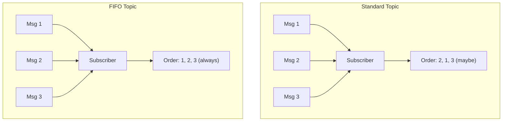

# How to Use SNS FIFO Topics for Ordered Messaging

Author: [nawazdhandala](https://github.com/nawazdhandala)

Tags: AWS, SNS, FIFO, Messaging, SQS

Description: Learn how to use SNS FIFO topics for strictly ordered, exactly-once message delivery with message groups, deduplication, and SQS FIFO queue subscribers.

---

Standard SNS topics deliver messages with best-effort ordering, meaning messages can arrive out of order. For most use cases that's fine, but sometimes order matters. Payment processing, state machine transitions, audit logs - these all need messages delivered in the exact sequence they were sent. That's where SNS FIFO topics come in.

## How FIFO Topics Differ from Standard

Here's the key difference: FIFO topics guarantee that messages are delivered to subscribers in the exact order they were published, and each message is delivered exactly once.



The tradeoffs:
- **Throughput**: FIFO topics support 300 messages/second (or 3000 with batching), vs. effectively unlimited for standard topics
- **Subscribers**: FIFO topics only support SQS FIFO queues as subscribers (no email, Lambda, HTTP, etc.)
- **Region**: FIFO topics are available in most regions but not all

## Creating a FIFO Topic

FIFO topic names must end with `.fifo`.

```bash
# Create a FIFO topic
aws sns create-topic \
  --name payment-events.fifo \
  --attributes '{
    "FifoTopic": "true",
    "ContentBasedDeduplication": "true"
  }'
```

The `ContentBasedDeduplication` flag uses a SHA-256 hash of the message body as the deduplication ID. If you publish the same message twice within a 5-minute window, the duplicate is automatically dropped.

## Creating a FIFO SQS Queue Subscriber

FIFO topics can only deliver to FIFO SQS queues. Create the queue and subscribe it.

```bash
# Create a FIFO SQS queue
aws sqs create-queue \
  --queue-name payment-processing.fifo \
  --attributes '{
    "FifoQueue": "true",
    "ContentBasedDeduplication": "true",
    "VisibilityTimeout": "300"
  }'

# Get the queue ARN
QUEUE_ARN=$(aws sqs get-queue-attributes \
  --queue-url https://sqs.us-east-1.amazonaws.com/123456789012/payment-processing.fifo \
  --attribute-names QueueArn \
  --query 'Attributes.QueueArn' \
  --output text)

# Set the queue policy to allow SNS
aws sqs set-queue-attributes \
  --queue-url https://sqs.us-east-1.amazonaws.com/123456789012/payment-processing.fifo \
  --attributes "{
    \"Policy\": \"{\\\"Version\\\":\\\"2012-10-17\\\",\\\"Statement\\\":[{\\\"Effect\\\":\\\"Allow\\\",\\\"Principal\\\":{\\\"Service\\\":\\\"sns.amazonaws.com\\\"},\\\"Action\\\":\\\"sqs:SendMessage\\\",\\\"Resource\\\":\\\"${QUEUE_ARN}\\\"}]}\"
  }"

# Subscribe the FIFO queue to the FIFO topic
aws sns subscribe \
  --topic-arn arn:aws:sns:us-east-1:123456789012:payment-events.fifo \
  --protocol sqs \
  --notification-endpoint $QUEUE_ARN
```

## Message Groups - The Key to FIFO Ordering

Message groups are how you control ordering granularity. Messages within the same group are delivered in order. Messages in different groups can be processed in parallel.

```python
import json
import boto3

sns = boto3.client('sns')

TOPIC_ARN = 'arn:aws:sns:us-east-1:123456789012:payment-events.fifo'

def publish_payment_event(customer_id, event_type, data):
    """Publish a payment event with ordering per customer.

    Using customer_id as the message group ensures all events
    for a single customer arrive in order, while events for
    different customers can be processed in parallel.
    """
    message = {
        'customer_id': customer_id,
        'event_type': event_type,
        'data': data,
    }

    response = sns.publish(
        TopicArn=TOPIC_ARN,
        Message=json.dumps(message),
        MessageGroupId=customer_id,  # Orders are per customer
        MessageAttributes={
            'event_type': {
                'DataType': 'String',
                'StringValue': event_type,
            }
        }
    )

    return response['MessageId']

# These events for customer C-001 are guaranteed to arrive in this order
publish_payment_event('C-001', 'payment_initiated', {'amount': 99.99})
publish_payment_event('C-001', 'payment_authorized', {'auth_code': 'AUTH123'})
publish_payment_event('C-001', 'payment_captured', {'amount': 99.99})

# These events for customer C-002 are processed independently
# They don't block or get blocked by C-001's events
publish_payment_event('C-002', 'payment_initiated', {'amount': 49.99})
```

## Deduplication Strategies

There are two ways to handle deduplication:

### Content-Based Deduplication

When enabled on the topic, SNS generates a deduplication ID from the message content. Identical messages within 5 minutes are automatically dropped.

```python
# With content-based deduplication enabled on the topic,
# publishing the same message twice within 5 minutes
# results in only one delivery
sns.publish(
    TopicArn=TOPIC_ARN,
    Message=json.dumps({'order_id': 'ORD-123', 'status': 'paid'}),
    MessageGroupId='ORD-123',
    # No MessageDeduplicationId needed - content hash is used
)
```

### Explicit Deduplication IDs

For more control, disable content-based deduplication and provide your own deduplication IDs.

```python
import hashlib

def publish_with_dedup(topic_arn, message, group_id, dedup_id):
    """Publish with an explicit deduplication ID.

    Use this when the same logical event might have different
    message bodies (e.g., different timestamps) but should
    still be deduplicated.
    """
    response = sns.publish(
        TopicArn=topic_arn,
        Message=json.dumps(message),
        MessageGroupId=group_id,
        MessageDeduplicationId=dedup_id,
    )
    return response['MessageId']

# Use a business-meaningful deduplication ID
# Even if retried with different timestamps, only one delivery occurs
publish_with_dedup(
    TOPIC_ARN,
    {
        'order_id': 'ORD-123',
        'event': 'payment_captured',
        'timestamp': '2026-02-12T10:30:00Z',
    },
    group_id='ORD-123',
    dedup_id='ORD-123-payment-captured',  # Business key as dedup ID
)
```

## Setting Up with CDK

CDK makes the FIFO topic and queue setup clean and handles all the permissions.

```typescript
import * as cdk from 'aws-cdk-lib';
import * as sns from 'aws-cdk-lib/aws-sns';
import * as sqs from 'aws-cdk-lib/aws-sqs';
import * as snsSubscriptions from 'aws-cdk-lib/aws-sns-subscriptions';

// Create FIFO topic
const paymentTopic = new sns.Topic(this, 'PaymentEvents', {
  topicName: 'payment-events.fifo',
  fifo: true,
  contentBasedDeduplication: true,
});

// Create FIFO queue for the payment processor
const paymentQueue = new sqs.Queue(this, 'PaymentQueue', {
  queueName: 'payment-processing.fifo',
  fifo: true,
  contentBasedDeduplication: true,
  visibilityTimeout: cdk.Duration.seconds(300),
  retentionPeriod: cdk.Duration.days(7),
});

// Create FIFO dead letter queue
const paymentDlq = new sqs.Queue(this, 'PaymentDLQ', {
  queueName: 'payment-processing-dlq.fifo',
  fifo: true,
  retentionPeriod: cdk.Duration.days(14),
});

// Subscribe the queue with a DLQ
paymentTopic.addSubscription(
  new snsSubscriptions.SqsSubscription(paymentQueue, {
    rawMessageDelivery: true,
    deadLetterQueue: paymentDlq,
  })
);
```

## Processing FIFO Messages

When processing messages from a FIFO SQS queue, remember that messages in the same group are blocked until the current message is processed (deleted or moved to DLQ).

```python
import json
import boto3

sqs = boto3.client('sqs')

QUEUE_URL = 'https://sqs.us-east-1.amazonaws.com/123456789012/payment-processing.fifo'

def process_fifo_messages():
    """Process messages from the FIFO queue.

    Messages from the same group are delivered in order and
    blocked until processed. Process quickly to avoid blocking.
    """
    while True:
        response = sqs.receive_message(
            QueueUrl=QUEUE_URL,
            MaxNumberOfMessages=10,
            WaitTimeSeconds=20,
            AttributeNames=['MessageGroupId', 'SequenceNumber'],
        )

        messages = response.get('Messages', [])
        for msg in messages:
            group_id = msg['Attributes'].get('MessageGroupId', 'unknown')
            sequence = msg['Attributes'].get('SequenceNumber', 'unknown')

            try:
                payload = json.loads(msg['Body'])
                print(f'Processing group={group_id} seq={sequence}: {payload}')

                # Process the message
                handle_payment_event(payload)

                # Delete after successful processing
                sqs.delete_message(
                    QueueUrl=QUEUE_URL,
                    ReceiptHandle=msg['ReceiptHandle']
                )

            except Exception as e:
                print(f'Error processing message: {e}')
                # Message stays in queue and blocks its group
                # until visibility timeout expires

def handle_payment_event(payload):
    """Handle a payment event - order is guaranteed."""
    event_type = payload.get('event_type')
    customer_id = payload.get('customer_id')
    print(f'  {event_type} for customer {customer_id}')

if __name__ == '__main__':
    process_fifo_messages()
```

## Performance Considerations

FIFO topics have a 300 transactions per second limit per topic (3000 with batching). If you need higher throughput:

- Use many different message group IDs to enable parallel processing
- Batch publishes into groups of up to 10 messages
- Consider using standard topics with application-level ordering if 3000 TPS isn't enough
- Distribute across multiple FIFO topics if your use case allows it

FIFO topics are the right choice when message ordering and exactly-once delivery matter more than raw throughput. Pair them with FIFO SQS queues for reliable, ordered processing.

For standard topics with higher throughput needs, see [creating an SNS topic](https://oneuptime.com/blog/post/create-an-sns-topic/view). For the fan-out pattern with standard queues, check [subscribing SQS queues to SNS](https://oneuptime.com/blog/post/subscribe-an-sqs-queue-to-sns/view).
