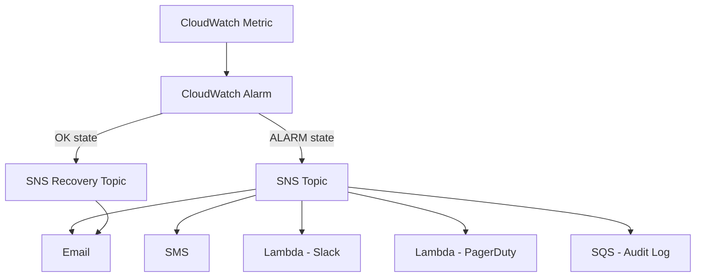

# How to Use SNS with CloudWatch Alarms

Author: [nawazdhandala](https://github.com/nawazdhandala)

Tags: AWS, SNS, CloudWatch, Monitoring, Alerting

Description: Learn how to connect CloudWatch alarms to SNS topics for automated alerting via email, SMS, Lambda, and Slack when metrics breach thresholds.

---

CloudWatch alarms and SNS are the bread and butter of AWS alerting. An alarm watches a metric, and when it breaches a threshold, it triggers an action - usually publishing to an SNS topic. From there, the notification fans out to whatever endpoints you've subscribed: email, SMS, Lambda, Slack webhooks, PagerDuty, or your on-call system.

Let's build a complete alerting pipeline from scratch.

## The Alerting Architecture



## Creating the SNS Topic for Alerts

Start by creating topics for different severity levels.

```bash
# Create topics for different alert severities
aws sns create-topic --name critical-alerts
aws sns create-topic --name warning-alerts
aws sns create-topic --name info-alerts

# Subscribe the on-call team email to critical alerts
aws sns subscribe \
  --topic-arn arn:aws:sns:us-east-1:123456789012:critical-alerts \
  --protocol email \
  --notification-endpoint oncall@example.com

# Subscribe SMS for critical alerts
aws sns subscribe \
  --topic-arn arn:aws:sns:us-east-1:123456789012:critical-alerts \
  --protocol sms \
  --notification-endpoint "+12025551234"

# Subscribe the team to warning alerts
aws sns subscribe \
  --topic-arn arn:aws:sns:us-east-1:123456789012:warning-alerts \
  --protocol email \
  --notification-endpoint team@example.com
```

## Creating CloudWatch Alarms with SNS Actions

Here are common alarm configurations for different AWS services.

### EC2 Instance CPU Alarm

```bash
# Alarm when CPU exceeds 90% for 5 minutes
aws cloudwatch put-metric-alarm \
  --alarm-name "EC2-HighCPU-i-1234567890abcdef0" \
  --alarm-description "CPU utilization above 90% on production web server" \
  --namespace "AWS/EC2" \
  --metric-name "CPUUtilization" \
  --dimensions Name=InstanceId,Value=i-1234567890abcdef0 \
  --statistic Average \
  --period 300 \
  --threshold 90 \
  --comparison-operator GreaterThanThreshold \
  --evaluation-periods 2 \
  --alarm-actions arn:aws:sns:us-east-1:123456789012:critical-alerts \
  --ok-actions arn:aws:sns:us-east-1:123456789012:info-alerts \
  --insufficient-data-actions arn:aws:sns:us-east-1:123456789012:warning-alerts
```

Notice the three action types:
- **alarm-actions**: Triggered when the alarm enters the ALARM state
- **ok-actions**: Triggered when the alarm returns to OK
- **insufficient-data-actions**: Triggered when CloudWatch doesn't have enough data

### RDS Database Connections Alarm

```bash
# Alarm when database connections exceed 80% of max
aws cloudwatch put-metric-alarm \
  --alarm-name "RDS-HighConnections-mydb" \
  --alarm-description "Database connections approaching limit" \
  --namespace "AWS/RDS" \
  --metric-name "DatabaseConnections" \
  --dimensions Name=DBInstanceIdentifier,Value=mydb \
  --statistic Average \
  --period 300 \
  --threshold 80 \
  --comparison-operator GreaterThanThreshold \
  --evaluation-periods 2 \
  --alarm-actions arn:aws:sns:us-east-1:123456789012:warning-alerts \
  --ok-actions arn:aws:sns:us-east-1:123456789012:info-alerts
```

### Application Load Balancer 5xx Errors

```bash
# Alarm on elevated 5xx error rate
aws cloudwatch put-metric-alarm \
  --alarm-name "ALB-High5xxRate-production" \
  --alarm-description "Elevated 5xx error rate on production ALB" \
  --namespace "AWS/ApplicationELB" \
  --metric-name "HTTPCode_Target_5XX_Count" \
  --dimensions Name=LoadBalancer,Value=app/production-alb/1234567890 \
  --statistic Sum \
  --period 60 \
  --threshold 10 \
  --comparison-operator GreaterThanThreshold \
  --evaluation-periods 3 \
  --alarm-actions arn:aws:sns:us-east-1:123456789012:critical-alerts
```

## Automating Alarm Creation with Python

Here's a script that creates a standard set of alarms for common AWS resources.

```python
import boto3

cloudwatch = boto3.client('cloudwatch')

def create_alarm(name, description, namespace, metric, dimensions,
                 threshold, comparison, period=300, eval_periods=2,
                 statistic='Average', alarm_topic=None, ok_topic=None):
    """Create a CloudWatch alarm with SNS notification."""

    params = {
        'AlarmName': name,
        'AlarmDescription': description,
        'Namespace': namespace,
        'MetricName': metric,
        'Dimensions': dimensions,
        'Statistic': statistic,
        'Period': period,
        'Threshold': threshold,
        'ComparisonOperator': comparison,
        'EvaluationPeriods': eval_periods,
        'TreatMissingData': 'notBreaching',
    }

    if alarm_topic:
        params['AlarmActions'] = [alarm_topic]
    if ok_topic:
        params['OKActions'] = [ok_topic]

    cloudwatch.put_metric_alarm(**params)
    print(f'Created alarm: {name}')

# Define your alert topics
CRITICAL = 'arn:aws:sns:us-east-1:123456789012:critical-alerts'
WARNING = 'arn:aws:sns:us-east-1:123456789012:warning-alerts'
INFO = 'arn:aws:sns:us-east-1:123456789012:info-alerts'

# EC2 alarms
ec2_instances = ['i-1234567890abcdef0', 'i-0987654321fedcba0']

for instance_id in ec2_instances:
    # High CPU alarm
    create_alarm(
        name=f'EC2-HighCPU-{instance_id}',
        description=f'High CPU on {instance_id}',
        namespace='AWS/EC2',
        metric='CPUUtilization',
        dimensions=[{'Name': 'InstanceId', 'Value': instance_id}],
        threshold=90,
        comparison='GreaterThanThreshold',
        alarm_topic=CRITICAL,
        ok_topic=INFO,
    )

    # Status check alarm
    create_alarm(
        name=f'EC2-StatusCheck-{instance_id}',
        description=f'Status check failed on {instance_id}',
        namespace='AWS/EC2',
        metric='StatusCheckFailed',
        dimensions=[{'Name': 'InstanceId', 'Value': instance_id}],
        threshold=0,
        comparison='GreaterThanThreshold',
        statistic='Maximum',
        period=60,
        eval_periods=2,
        alarm_topic=CRITICAL,
    )

# Lambda error rate alarm
lambda_functions = ['order-processor', 'payment-handler', 'notification-service']

for func_name in lambda_functions:
    create_alarm(
        name=f'Lambda-Errors-{func_name}',
        description=f'Errors in Lambda function {func_name}',
        namespace='AWS/Lambda',
        metric='Errors',
        dimensions=[{'Name': 'FunctionName', 'Value': func_name}],
        threshold=5,
        comparison='GreaterThanThreshold',
        statistic='Sum',
        period=300,
        alarm_topic=WARNING,
    )
```

## Sending Alerts to Slack via Lambda

A common pattern is to subscribe a Lambda function that formats the CloudWatch alarm notification and sends it to Slack.

```python
import json
import os
import urllib.request

# Set the Slack webhook URL as an environment variable
SLACK_WEBHOOK_URL = os.environ['SLACK_WEBHOOK_URL']

# Color mapping for alarm states
COLORS = {
    'ALARM': '#FF0000',    # Red
    'OK': '#00FF00',       # Green
    'INSUFFICIENT_DATA': '#FFFF00',  # Yellow
}

def handler(event, context):
    """Forward CloudWatch alarm notifications to Slack."""
    for record in event['Records']:
        message = json.loads(record['Sns']['Message'])

        alarm_name = message.get('AlarmName', 'Unknown')
        new_state = message.get('NewStateValue', 'Unknown')
        reason = message.get('NewStateReason', '')
        description = message.get('AlarmDescription', '')
        timestamp = message.get('StateChangeTime', '')
        region = message.get('Region', '')

        # Build the Slack message
        slack_message = {
            'attachments': [{
                'color': COLORS.get(new_state, '#808080'),
                'title': f'{new_state}: {alarm_name}',
                'text': description,
                'fields': [
                    {
                        'title': 'State',
                        'value': new_state,
                        'short': True,
                    },
                    {
                        'title': 'Region',
                        'value': region,
                        'short': True,
                    },
                    {
                        'title': 'Reason',
                        'value': reason[:200],  # Truncate long reasons
                        'short': False,
                    },
                ],
                'ts': timestamp,
            }]
        }

        # Send to Slack
        req = urllib.request.Request(
            SLACK_WEBHOOK_URL,
            data=json.dumps(slack_message).encode(),
            headers={'Content-Type': 'application/json'},
        )
        urllib.request.urlopen(req)
        print(f'Sent Slack notification for {alarm_name}')
```

## Setting Up with CDK

CDK makes the entire alarm-to-SNS pipeline easy to set up.

```typescript
import * as cdk from 'aws-cdk-lib';
import * as cloudwatch from 'aws-cdk-lib/aws-cloudwatch';
import * as cloudwatch_actions from 'aws-cdk-lib/aws-cloudwatch-actions';
import * as sns from 'aws-cdk-lib/aws-sns';
import * as snsSubscriptions from 'aws-cdk-lib/aws-sns-subscriptions';
import * as lambda from 'aws-cdk-lib/aws-lambda';

// Create alert topics
const criticalTopic = new sns.Topic(this, 'CriticalAlerts', {
  topicName: 'critical-alerts',
});

const warningTopic = new sns.Topic(this, 'WarningAlerts', {
  topicName: 'warning-alerts',
});

// Subscribe email
criticalTopic.addSubscription(
  new snsSubscriptions.EmailSubscription('oncall@example.com')
);

// Create the Slack notifier Lambda
const slackNotifier = new lambda.Function(this, 'SlackNotifier', {
  runtime: lambda.Runtime.PYTHON_3_12,
  handler: 'index.handler',
  code: lambda.Code.fromAsset('lambda/slack-notifier'),
  environment: {
    SLACK_WEBHOOK_URL: 'https://hooks.slack.com/services/YOUR/WEBHOOK/URL',
  },
});

// Subscribe Lambda to both topics
criticalTopic.addSubscription(
  new snsSubscriptions.LambdaSubscription(slackNotifier)
);
warningTopic.addSubscription(
  new snsSubscriptions.LambdaSubscription(slackNotifier)
);

// Create a CloudWatch alarm that triggers the SNS topic
const cpuAlarm = new cloudwatch.Alarm(this, 'HighCPUAlarm', {
  metric: new cloudwatch.Metric({
    namespace: 'AWS/EC2',
    metricName: 'CPUUtilization',
    dimensionsMap: { InstanceId: 'i-1234567890abcdef0' },
    statistic: 'Average',
    period: cdk.Duration.minutes(5),
  }),
  threshold: 90,
  evaluationPeriods: 2,
  alarmDescription: 'CPU exceeds 90% on production server',
});

// Connect the alarm to the SNS topic
cpuAlarm.addAlarmAction(new cloudwatch_actions.SnsAction(criticalTopic));
cpuAlarm.addOkAction(new cloudwatch_actions.SnsAction(warningTopic));
```

CloudWatch alarms with SNS notifications are the foundation of any AWS monitoring strategy. Start with alarms on the metrics that directly impact your users - error rates, latency, and availability - and add more as you identify what matters for your specific application.

For DynamoDB-specific monitoring, see [monitoring DynamoDB with CloudWatch alarms](https://oneuptime.com/blog/post/2026-02-12-monitor-dynamodb-with-cloudwatch-alarms/view). For encryption on your alert topics, check out [enabling SNS message encryption with KMS](https://oneuptime.com/blog/post/2026-02-12-enable-sns-message-encryption-with-kms/view).
