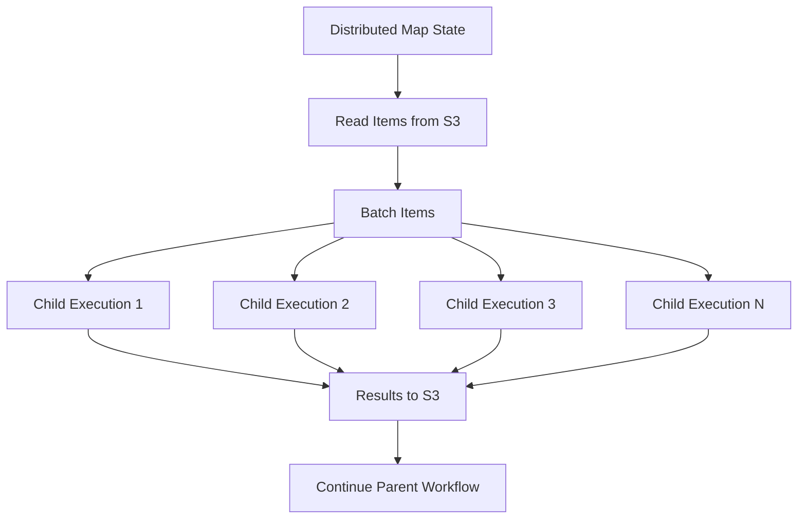

# How to Use Step Functions Distributed Map for Large-Scale Processing

Author: [nawazdhandala](https://github.com/nawazdhandala)

Tags: AWS, Step Functions, Distributed Map, Large-Scale Processing, Serverless, S3

Description: Learn how to use Step Functions Distributed Map to process millions of items from S3 with massive parallelism

---

The standard Map state in Step Functions works great for arrays with a few hundred items. But what if you need to process millions of S3 objects, or a CSV file with 10 million rows? That is where Distributed Map comes in.

Distributed Map is a special mode of the Map state that can process datasets of virtually unlimited size. It reads items directly from S3 (objects, CSV files, JSON arrays, or S3 inventory reports) and launches up to 10,000 parallel child executions to process them.

## How Distributed Map Differs from Inline Map

| Feature | Inline Map | Distributed Map |
|---------|-----------|----------------|
| Max items | ~40,000 (payload limit) | Unlimited |
| Max concurrency | 40 | 10,000 |
| Input source | JSON array in state input | S3 objects directly |
| Child execution | States within parent | Separate child executions |
| Results | Array in parent output | Written to S3 |
| History events | Counted in parent | Separate per child |



## Setting Up Distributed Map

Here is a complete state machine that processes all CSV files in an S3 bucket:

```json
{
  "Comment": "Process large CSV files with Distributed Map",
  "StartAt": "ProcessLargeDataset",
  "States": {
    "ProcessLargeDataset": {
      "Type": "Map",
      "ItemProcessor": {
        "ProcessorConfig": {
          "Mode": "DISTRIBUTED",
          "ExecutionType": "STANDARD"
        },
        "StartAt": "ProcessRecord",
        "States": {
          "ProcessRecord": {
            "Type": "Task",
            "Resource": "arn:aws:lambda:us-east-1:123456789012:function:process-record",
            "End": true
          }
        }
      },
      "ItemReader": {
        "Resource": "arn:aws:states:::s3:getObject",
        "ReaderConfig": {
          "InputType": "CSV",
          "CSVHeaderLocation": "FIRST_ROW"
        },
        "Parameters": {
          "Bucket": "my-data-bucket",
          "Key": "input/large-dataset.csv"
        }
      },
      "MaxConcurrency": 1000,
      "ItemBatcher": {
        "MaxItemsPerBatch": 100,
        "MaxInputBytesPerBatch": 262144
      },
      "ResultWriter": {
        "Resource": "arn:aws:states:::s3:putObject",
        "Parameters": {
          "Bucket": "my-data-bucket",
          "Prefix": "output/results"
        }
      },
      "ToleratedFailurePercentage": 5,
      "End": true
    }
  }
}
```

Let us break down each section.

### ItemReader

The ItemReader tells Distributed Map where to get its input data. It supports several input types:

**CSV file:**
```json
{
  "ItemReader": {
    "Resource": "arn:aws:states:::s3:getObject",
    "ReaderConfig": {
      "InputType": "CSV",
      "CSVHeaderLocation": "FIRST_ROW"
    },
    "Parameters": {
      "Bucket": "my-bucket",
      "Key": "data/input.csv"
    }
  }
}
```

**JSON array file:**
```json
{
  "ItemReader": {
    "Resource": "arn:aws:states:::s3:getObject",
    "ReaderConfig": {
      "InputType": "JSON"
    },
    "Parameters": {
      "Bucket": "my-bucket",
      "Key": "data/input.json"
    }
  }
}
```

**S3 object listing (process all objects in a prefix):**
```json
{
  "ItemReader": {
    "Resource": "arn:aws:states:::s3:listObjectsV2",
    "Parameters": {
      "Bucket": "my-bucket",
      "Prefix": "uploads/2026/02/"
    }
  }
}
```

**S3 Inventory report (for billions of objects):**
```json
{
  "ItemReader": {
    "Resource": "arn:aws:states:::s3:getObject",
    "ReaderConfig": {
      "InputType": "MANIFEST"
    },
    "Parameters": {
      "Bucket": "my-inventory-bucket",
      "Key": "inventory/manifest.json"
    }
  }
}
```

### ItemBatcher

Batching groups multiple items into a single child execution. This is important for efficiency - launching a separate Lambda invocation for each of 10 million records would be slow and expensive.

```json
{
  "ItemBatcher": {
    "MaxItemsPerBatch": 100,
    "MaxInputBytesPerBatch": 262144
  }
}
```

With batching, your Lambda function receives an array of items instead of a single item:

```python
# Lambda function that processes a batch of records from Distributed Map
import json

def handler(event, context):
    items = event['Items']
    results = []

    for item in items:
        # Process each item in the batch
        result = process_record(item)
        results.append(result)

    return results

def process_record(record):
    # Your processing logic here
    return {
        'id': record['id'],
        'status': 'processed'
    }
```

### ResultWriter

Instead of collecting all results in the parent execution's state (which would exceed payload limits for large datasets), Distributed Map writes results to S3:

```json
{
  "ResultWriter": {
    "Resource": "arn:aws:states:::s3:putObject",
    "Parameters": {
      "Bucket": "my-data-bucket",
      "Prefix": "output/results"
    }
  }
}
```

Results are written as JSON files under the specified prefix. Each child execution writes its own result file.

## Real-World Example: Processing S3 Objects at Scale

Here is a practical example that generates thumbnails for millions of images stored in S3:

```json
{
  "Comment": "Generate thumbnails for all images in S3",
  "StartAt": "ListAndProcessImages",
  "States": {
    "ListAndProcessImages": {
      "Type": "Map",
      "ItemProcessor": {
        "ProcessorConfig": {
          "Mode": "DISTRIBUTED",
          "ExecutionType": "STANDARD"
        },
        "StartAt": "GenerateThumbnail",
        "States": {
          "GenerateThumbnail": {
            "Type": "Task",
            "Resource": "arn:aws:lambda:us-east-1:123456789012:function:generate-thumbnail",
            "Retry": [
              {
                "ErrorEquals": ["States.TaskFailed"],
                "IntervalSeconds": 2,
                "MaxAttempts": 3,
                "BackoffRate": 2.0
              }
            ],
            "End": true
          }
        }
      },
      "ItemReader": {
        "Resource": "arn:aws:states:::s3:listObjectsV2",
        "Parameters": {
          "Bucket": "my-images-bucket",
          "Prefix": "originals/"
        }
      },
      "MaxConcurrency": 500,
      "ItemBatcher": {
        "MaxItemsPerBatch": 10
      },
      "ResultWriter": {
        "Resource": "arn:aws:states:::s3:putObject",
        "Parameters": {
          "Bucket": "my-images-bucket",
          "Prefix": "thumbnail-results/"
        }
      },
      "ToleratedFailurePercentage": 2,
      "Next": "NotifyComplete"
    },
    "NotifyComplete": {
      "Type": "Task",
      "Resource": "arn:aws:states:::sns:publish",
      "Parameters": {
        "TopicArn": "arn:aws:sns:us-east-1:123456789012:processing-complete",
        "Message": "Thumbnail generation complete"
      },
      "End": true
    }
  }
}
```

The Lambda function for processing batched S3 objects:

```python
# Processes a batch of S3 objects to generate thumbnails
import boto3
from PIL import Image
import io

s3 = boto3.client('s3')
THUMBNAIL_SIZE = (200, 200)

def handler(event, context):
    items = event['Items']
    results = []

    for item in items:
        bucket = item['Bucket']
        key = item['Key']

        # Skip non-image files
        if not key.lower().endswith(('.jpg', '.jpeg', '.png')):
            results.append({'key': key, 'status': 'skipped'})
            continue

        try:
            # Download the original image
            response = s3.get_object(Bucket=bucket, Key=key)
            image = Image.open(io.BytesIO(response['Body'].read()))

            # Generate thumbnail
            image.thumbnail(THUMBNAIL_SIZE)

            # Upload thumbnail
            buffer = io.BytesIO()
            image.save(buffer, format=image.format or 'JPEG')
            buffer.seek(0)

            thumb_key = key.replace('originals/', 'thumbnails/')
            s3.put_object(Bucket=bucket, Key=thumb_key, Body=buffer.read())

            results.append({'key': key, 'status': 'processed', 'thumbnail': thumb_key})
        except Exception as e:
            results.append({'key': key, 'status': 'error', 'error': str(e)})

    return results
```

## IAM Permissions

The state machine role needs permissions to read from and write to S3, plus permissions to start child executions:

```json
// IAM policy for Distributed Map state machine
{
  "Version": "2012-10-17",
  "Statement": [
    {
      "Effect": "Allow",
      "Action": [
        "s3:GetObject",
        "s3:ListBucket"
      ],
      "Resource": [
        "arn:aws:s3:::my-data-bucket",
        "arn:aws:s3:::my-data-bucket/*"
      ]
    },
    {
      "Effect": "Allow",
      "Action": "s3:PutObject",
      "Resource": "arn:aws:s3:::my-data-bucket/output/*"
    },
    {
      "Effect": "Allow",
      "Action": [
        "states:StartExecution",
        "states:DescribeExecution",
        "states:StopExecution"
      ],
      "Resource": "*"
    },
    {
      "Effect": "Allow",
      "Action": "lambda:InvokeFunction",
      "Resource": "arn:aws:lambda:us-east-1:123456789012:function:*"
    }
  ]
}
```

## Monitoring Distributed Map Executions

Track progress through CloudWatch metrics:

```bash
# Check how many child executions are running, succeeded, or failed
aws stepfunctions describe-map-run \
  --map-run-arn arn:aws:states:us-east-1:123456789012:mapRun:my-state-machine/exec-id:map-run-id
```

The response includes counters for total items, items processed, succeeded, failed, and pending.

## Cost Optimization

Distributed Map pricing is based on state transitions in both the parent and child executions. To minimize cost:

1. **Batch aggressively** - Fewer child executions with more items per batch means fewer state transitions
2. **Use Express child executions** - For processing steps under 5 minutes, set `ExecutionType` to `EXPRESS` for lower per-transition costs
3. **Right-size concurrency** - Higher concurrency finishes faster but may hit Lambda concurrency limits

For high-volume scenarios, see our guide on [Step Functions Express Workflows](https://oneuptime.com/blog/post/2026-02-12-use-step-functions-express-workflows-for-high-volume-events/view).

## Wrapping Up

Distributed Map transforms Step Functions from a workflow tool into a large-scale data processing engine. It handles the complexity of reading from S3, batching items, managing thousands of parallel executions, collecting results, and handling failures. For any batch processing job that needs to handle more than a few thousand items, Distributed Map is the way to go.
