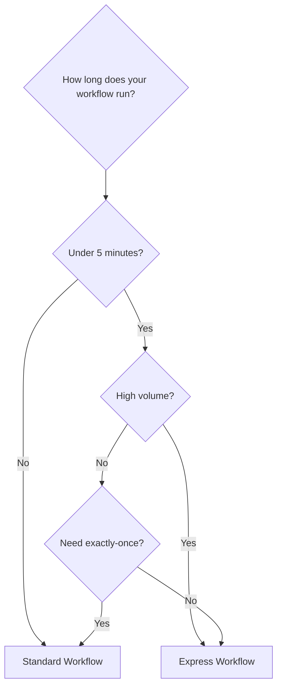

# How to Use Step Functions Express Workflows for High-Volume Events

Author: [nawazdhandala](https://github.com/nawazdhandala)

Tags: AWS, Step Functions, Express Workflows, Serverless, Event Processing, High Volume

Description: Learn when and how to use Step Functions Express Workflows for high-volume, short-duration event processing at lower cost

---

Standard Step Functions workflows are priced per state transition and can run for up to a year. Express Workflows flip this model: they are priced by duration and number of executions, run for up to 5 minutes, and can handle over 100,000 executions per second. If your workflow is short-lived and high-volume, Express Workflows can cut your Step Functions bill by 80% or more.

## Standard vs Express: When to Use Which

The decision comes down to two factors: duration and volume.

| | Standard Workflow | Express Workflow |
|---|---|---|
| Max duration | 1 year | 5 minutes |
| Pricing | Per state transition ($0.025/1000) | Per execution + duration |
| Max executions | ~2,000/sec (soft limit) | 100,000+/sec |
| Execution semantics | Exactly-once | At-least-once (async) or at-most-once (sync) |
| Execution history | Stored for 90 days | CloudWatch Logs only |



**Use Express when:**
- Processing IoT events, clickstreams, or log entries
- Handling API request/response flows
- Running short transformations triggered by SQS, Kinesis, or EventBridge
- Cost is a concern and volume is high

**Use Standard when:**
- Workflows run longer than 5 minutes
- You need exactly-once execution guarantees
- You need built-in execution history and visual debugging
- You are orchestrating long-running jobs (Glue, EMR, etc.)

## Creating an Express Workflow

The only difference in creation is the `type` parameter:

```bash
# Create an Express Workflow state machine
aws stepfunctions create-state-machine \
  --name process-iot-events \
  --definition file://workflow-definition.json \
  --role-arn arn:aws:iam::123456789012:role/express-wf-role \
  --type EXPRESS \
  --logging-configuration '{
    "level": "ALL",
    "includeExecutionData": true,
    "destinations": [
      {
        "cloudWatchLogsLogGroup": {
          "logGroupArn": "arn:aws:logs:us-east-1:123456789012:log-group:/aws/states/process-iot-events:*"
        }
      }
    ]
  }'
```

Notice the logging configuration. Express Workflows do not store execution history like Standard Workflows. You must enable CloudWatch Logs to have any visibility into executions.

## Example: IoT Event Processing Pipeline

Here is a workflow that processes IoT sensor readings, validates them, enriches them with device metadata, and stores them:

```json
{
  "Comment": "Process IoT sensor events - Express Workflow",
  "StartAt": "ValidateReading",
  "States": {
    "ValidateReading": {
      "Type": "Task",
      "Resource": "arn:aws:lambda:us-east-1:123456789012:function:validate-sensor-reading",
      "ResultPath": "$.validation",
      "Catch": [
        {
          "ErrorEquals": ["InvalidReadingError"],
          "Next": "SendToDeadLetter",
          "ResultPath": "$.error"
        }
      ],
      "Next": "CheckThresholds"
    },
    "CheckThresholds": {
      "Type": "Choice",
      "Choices": [
        {
          "Variable": "$.validation.severity",
          "StringEquals": "critical",
          "Next": "ParallelAlertAndStore"
        },
        {
          "Variable": "$.validation.severity",
          "StringEquals": "warning",
          "Next": "EnrichAndStore"
        }
      ],
      "Default": "EnrichAndStore"
    },
    "ParallelAlertAndStore": {
      "Type": "Parallel",
      "Branches": [
        {
          "StartAt": "SendAlert",
          "States": {
            "SendAlert": {
              "Type": "Task",
              "Resource": "arn:aws:states:::sns:publish",
              "Parameters": {
                "TopicArn": "arn:aws:sns:us-east-1:123456789012:iot-critical-alerts",
                "Message.$": "States.Format('Critical reading from device {}: value={}, threshold={}', $.deviceId, $.value, $.validation.threshold)"
              },
              "End": true
            }
          }
        },
        {
          "StartAt": "EnrichData",
          "States": {
            "EnrichData": {
              "Type": "Task",
              "Resource": "arn:aws:lambda:us-east-1:123456789012:function:enrich-with-metadata",
              "Next": "StoreReading"
            },
            "StoreReading": {
              "Type": "Task",
              "Resource": "arn:aws:states:::dynamodb:putItem",
              "Parameters": {
                "TableName": "sensor-readings",
                "Item": {
                  "deviceId": {"S.$": "$.deviceId"},
                  "timestamp": {"S.$": "$.timestamp"},
                  "value": {"N.$": "States.Format('{}', $.value)"},
                  "severity": {"S.$": "$.validation.severity"},
                  "location": {"S.$": "$.enrichment.location"}
                }
              },
              "End": true
            }
          }
        }
      ],
      "Next": "Done"
    },
    "EnrichAndStore": {
      "Type": "Task",
      "Resource": "arn:aws:lambda:us-east-1:123456789012:function:enrich-with-metadata",
      "ResultPath": "$.enrichment",
      "Next": "StoreNormalReading"
    },
    "StoreNormalReading": {
      "Type": "Task",
      "Resource": "arn:aws:states:::dynamodb:putItem",
      "Parameters": {
        "TableName": "sensor-readings",
        "Item": {
          "deviceId": {"S.$": "$.deviceId"},
          "timestamp": {"S.$": "$.timestamp"},
          "value": {"N.$": "States.Format('{}', $.value)"},
          "severity": {"S": "normal"},
          "location": {"S.$": "$.enrichment.location"}
        }
      },
      "Next": "Done"
    },
    "SendToDeadLetter": {
      "Type": "Task",
      "Resource": "arn:aws:states:::sqs:sendMessage",
      "Parameters": {
        "QueueUrl": "https://sqs.us-east-1.amazonaws.com/123456789012/iot-dlq",
        "MessageBody.$": "$"
      },
      "Next": "Done"
    },
    "Done": {
      "Type": "Succeed"
    }
  }
}
```

## Synchronous vs Asynchronous Invocation

Express Workflows support two invocation modes:

### Asynchronous (Fire and Forget)

```bash
# Start an async Express execution - returns immediately
aws stepfunctions start-execution \
  --state-machine-arn arn:aws:states:us-east-1:123456789012:stateMachine:process-iot-events \
  --input '{"deviceId": "sensor-42", "value": 98.6, "timestamp": "2026-02-12T10:00:00Z"}'
```

Use async when you do not need the workflow's output. The caller gets the execution ARN back immediately.

### Synchronous (Request/Response)

```bash
# Start a sync Express execution - waits for completion and returns result
aws stepfunctions start-sync-execution \
  --state-machine-arn arn:aws:states:us-east-1:123456789012:stateMachine:process-api-request \
  --input '{"userId": "user-123", "action": "get-recommendations"}'
```

Use sync when the caller needs the workflow's output. The API call blocks until the workflow completes (up to 5 minutes).

### Sync Express Behind API Gateway

A powerful pattern is putting a sync Express Workflow behind API Gateway:

```yaml
# API Gateway integration with synchronous Express Workflow
Resources:
  ApiMethod:
    Type: AWS::ApiGateway::Method
    Properties:
      HttpMethod: POST
      Integration:
        Type: AWS
        IntegrationHttpMethod: POST
        Uri: !Sub "arn:aws:apigateway:${AWS::Region}:states:action/StartSyncExecution"
        Credentials: !GetAtt ApiRole.Arn
        RequestTemplates:
          application/json: |
            {
              "stateMachineArn": "arn:aws:states:us-east-1:123456789012:stateMachine:api-workflow",
              "input": "$util.escapeJavaScript($input.body)"
            }
```

This gives you a multi-step API handler without any Lambda functions, with built-in error handling and branching logic.

## Triggering from EventBridge

EventBridge can trigger Express Workflows directly:

```bash
# EventBridge rule that triggers Express Workflow on S3 events
aws events put-rule \
  --name s3-upload-processing \
  --event-pattern '{
    "source": ["aws.s3"],
    "detail-type": ["Object Created"],
    "detail": {
      "bucket": {"name": ["my-upload-bucket"]}
    }
  }'

aws events put-targets \
  --rule s3-upload-processing \
  --targets '[{
    "Id": "express-workflow",
    "Arn": "arn:aws:states:us-east-1:123456789012:stateMachine:process-upload",
    "RoleArn": "arn:aws:iam::123456789012:role/eventbridge-sfn-role"
  }]'
```

## Triggering from SQS or Kinesis via Lambda

For SQS or Kinesis event sources, use a thin Lambda function to start executions:

```python
# Lambda function that starts Express Workflow executions for SQS messages
import boto3
import json

sfn = boto3.client('stepfunctions')
STATE_MACHINE_ARN = 'arn:aws:states:us-east-1:123456789012:stateMachine:process-events'

def handler(event, context):
    for record in event['Records']:
        body = json.loads(record['body'])
        sfn.start_execution(
            stateMachineArn=STATE_MACHINE_ARN,
            input=json.dumps(body)
        )
    return {'statusCode': 200}
```

## Cost Comparison

Let us compare costs for processing 1 million events per day, each requiring 5 state transitions and taking 2 seconds.

**Standard Workflow:**
- State transitions: 1,000,000 x 5 = 5,000,000
- Cost: 5,000,000 / 1,000 x $0.025 = $125/day

**Express Workflow:**
- Executions: 1,000,000
- Duration: 1,000,000 x 2 seconds = 2,000,000 seconds of 64MB memory
- Cost: approximately $3-5/day (varies by memory)

That is a 25-40x cost reduction for the same workload.

## Logging and Debugging

Since Express Workflows lack built-in execution history, logging is essential:

```json
{
  "LoggingConfiguration": {
    "Level": "ALL",
    "IncludeExecutionData": true,
    "Destinations": [
      {
        "CloudWatchLogsLogGroup": {
          "LogGroupArn": "arn:aws:logs:us-east-1:123456789012:log-group:/aws/states/my-express-wf:*"
        }
      }
    ]
  }
}
```

Log levels:

- **OFF** - No logging (cheapest but blind)
- **ERROR** - Only failed executions
- **FATAL** - Only executions that abort
- **ALL** - Everything (most expensive but full visibility)

For production, start with `ERROR` and switch to `ALL` temporarily when debugging.

## Wrapping Up

Express Workflows are one of those AWS features that can dramatically reduce costs if you are in the right use case. Short-duration, high-volume event processing is their sweet spot. The trade-off is losing exactly-once semantics and built-in execution history, but for most event processing pipelines, those trade-offs are perfectly acceptable.

For longer-running orchestrations, stick with Standard Workflows. For large-scale batch processing, combine Express Workflows with [Distributed Map](https://oneuptime.com/blog/post/2026-02-12-use-step-functions-distributed-map-for-large-scale-processing/view) for the best of both worlds.
