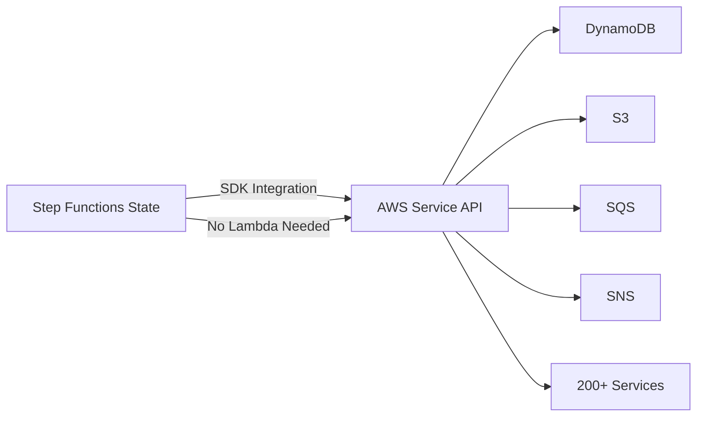

# How to Use Step Functions SDK Integrations (200+ AWS Services)

Author: [nawazdhandala](https://github.com/nawazdhandala)

Tags: AWS, Step Functions, SDK Integrations, Serverless, Automation

Description: Learn how to call 200+ AWS services directly from Step Functions without writing Lambda functions using SDK integrations

---

There was a time when every Step Functions task needed a Lambda function. Want to write to DynamoDB? Lambda. Want to send an SNS notification? Lambda. Want to start a Glue job? Lambda. You ended up with dozens of thin Lambda functions that did nothing but call a single AWS API.

SDK integrations changed that. Step Functions can now call over 200 AWS services and more than 10,000 API actions directly. No Lambda required. You define the API call in the state machine definition, and Step Functions makes it for you.

## How SDK Integrations Work

SDK integrations use the resource ARN format:

```
arn:aws:states:::aws-sdk:SERVICE:API_ACTION
```

The service name and API action map directly to the AWS SDK. For example:

- `aws-sdk:dynamodb:putItem` maps to `DynamoDB.PutItem`
- `aws-sdk:s3:putObject` maps to `S3.PutObject`
- `aws-sdk:sqs:sendMessage` maps to `SQS.SendMessage`
- `aws-sdk:sns:publish` maps to `SNS.Publish`



## Integration Patterns

SDK integrations support three execution patterns:

### Request/Response (Default)

Step Functions calls the API and moves to the next state immediately without waiting for the operation to complete.

```json
{
  "SendNotification": {
    "Type": "Task",
    "Resource": "arn:aws:states:::aws-sdk:sns:publish",
    "Parameters": {
      "TopicArn": "arn:aws:sns:us-east-1:123456789012:my-topic",
      "Message": "Hello from Step Functions"
    },
    "Next": "NextState"
  }
}
```

### Run a Job (.sync)

For long-running operations, append `.sync` to wait for completion. This works with services like Glue, ECS, EMR, and CodeBuild.

```json
{
  "RunGlueJob": {
    "Type": "Task",
    "Resource": "arn:aws:states:::glue:startJobRun.sync",
    "Parameters": {
      "JobName": "my-etl-job"
    },
    "Next": "NextState"
  }
}
```

### Wait for Callback (.waitForTaskToken)

Pause the execution and wait for an external system to call back with a task token.

```json
{
  "WaitForApproval": {
    "Type": "Task",
    "Resource": "arn:aws:states:::sqs:sendMessage.waitForTaskToken",
    "Parameters": {
      "QueueUrl": "https://sqs.us-east-1.amazonaws.com/123456789012/approvals",
      "MessageBody": {
        "taskToken.$": "$$.Task.Token",
        "request.$": "$"
      }
    },
    "Next": "NextState"
  }
}
```

## Common SDK Integration Examples

### DynamoDB Operations

**Write an item:**

```json
{
  "SaveOrder": {
    "Type": "Task",
    "Resource": "arn:aws:states:::aws-sdk:dynamodb:putItem",
    "Parameters": {
      "TableName": "orders",
      "Item": {
        "orderId": {"S.$": "$.orderId"},
        "status": {"S": "created"},
        "amount": {"N.$": "States.Format('{}', $.amount)"},
        "createdAt": {"S.$": "$$.State.EnteredTime"}
      }
    },
    "Next": "NextState"
  }
}
```

**Read an item:**

```json
{
  "GetUser": {
    "Type": "Task",
    "Resource": "arn:aws:states:::aws-sdk:dynamodb:getItem",
    "Parameters": {
      "TableName": "users",
      "Key": {
        "userId": {"S.$": "$.userId"}
      }
    },
    "ResultPath": "$.userRecord",
    "Next": "NextState"
  }
}
```

**Update an item:**

```json
{
  "UpdateOrderStatus": {
    "Type": "Task",
    "Resource": "arn:aws:states:::aws-sdk:dynamodb:updateItem",
    "Parameters": {
      "TableName": "orders",
      "Key": {
        "orderId": {"S.$": "$.orderId"}
      },
      "UpdateExpression": "SET #status = :status, updatedAt = :time",
      "ExpressionAttributeNames": {
        "#status": "status"
      },
      "ExpressionAttributeValues": {
        ":status": {"S": "shipped"},
        ":time": {"S.$": "$$.State.EnteredTime"}
      }
    },
    "Next": "NextState"
  }
}
```

### S3 Operations

**Upload data to S3:**

```json
{
  "SaveReport": {
    "Type": "Task",
    "Resource": "arn:aws:states:::aws-sdk:s3:putObject",
    "Parameters": {
      "Bucket": "my-reports-bucket",
      "Key.$": "States.Format('reports/{}/report.json', $.reportDate)",
      "Body.$": "States.JsonToString($.reportData)",
      "ContentType": "application/json"
    },
    "Next": "NextState"
  }
}
```

**Read from S3:**

```json
{
  "ReadConfig": {
    "Type": "Task",
    "Resource": "arn:aws:states:::aws-sdk:s3:getObject",
    "Parameters": {
      "Bucket": "my-config-bucket",
      "Key": "config/settings.json"
    },
    "ResultSelector": {
      "config.$": "States.StringToJson($.Body)"
    },
    "ResultPath": "$.settings",
    "Next": "NextState"
  }
}
```

### SQS Operations

```json
{
  "EnqueueTask": {
    "Type": "Task",
    "Resource": "arn:aws:states:::aws-sdk:sqs:sendMessage",
    "Parameters": {
      "QueueUrl": "https://sqs.us-east-1.amazonaws.com/123456789012/task-queue",
      "MessageBody.$": "States.JsonToString($)",
      "MessageGroupId.$": "$.customerId",
      "MessageAttributes": {
        "priority": {
          "DataType": "String",
          "StringValue.$": "$.priority"
        }
      }
    },
    "Next": "NextState"
  }
}
```

### ECS RunTask

```json
{
  "RunProcessor": {
    "Type": "Task",
    "Resource": "arn:aws:states:::ecs:runTask.sync",
    "Parameters": {
      "LaunchType": "FARGATE",
      "Cluster": "arn:aws:ecs:us-east-1:123456789012:cluster/my-cluster",
      "TaskDefinition": "arn:aws:ecs:us-east-1:123456789012:task-definition/processor:latest",
      "NetworkConfiguration": {
        "AwsvpcConfiguration": {
          "Subnets": ["subnet-abc123"],
          "SecurityGroups": ["sg-abc123"],
          "AssignPublicIp": "DISABLED"
        }
      },
      "Overrides": {
        "ContainerOverrides": [
          {
            "Name": "processor",
            "Environment": [
              {"Name": "INPUT_KEY", "Value.$": "$.inputKey"},
              {"Name": "OUTPUT_BUCKET", "Value": "my-output-bucket"}
            ]
          }
        ]
      }
    },
    "Next": "NextState"
  }
}
```

### Athena Queries

```json
{
  "RunQuery": {
    "Type": "Task",
    "Resource": "arn:aws:states:::athena:startQueryExecution.sync",
    "Parameters": {
      "QueryString.$": "States.Format('SELECT COUNT(*) FROM orders WHERE date = \\'{}\\'', $.queryDate)",
      "WorkGroup": "primary",
      "ResultConfiguration": {
        "OutputLocation": "s3://my-athena-results/"
      }
    },
    "ResultPath": "$.queryExecution",
    "Next": "GetQueryResults"
  },
  "GetQueryResults": {
    "Type": "Task",
    "Resource": "arn:aws:states:::athena:getQueryResults",
    "Parameters": {
      "QueryExecutionId.$": "$.queryExecution.QueryExecution.QueryExecutionId"
    },
    "ResultPath": "$.queryResults",
    "Next": "NextState"
  }
}
```

## Parameter Naming Convention

SDK integration parameters follow the AWS SDK naming convention but with PascalCase:

- SDK method: `dynamodb.put_item(TableName=..., Item=...)` (Python)
- Step Functions: `"Parameters": {"TableName": "...", "Item": {...}}`

The parameter names match the AWS API request syntax, not any specific SDK's naming convention. Check the AWS API Reference for the correct parameter names.

## Using Intrinsic Functions

Step Functions provides intrinsic functions for data manipulation within SDK integrations:

```json
{
  "Parameters": {
    "Key.$": "States.Format('data/{}/{}.json', $.year, $.month)",
    "Body.$": "States.JsonToString($.data)",
    "Tags.$": "States.Array($.tag1, $.tag2)"
  }
}
```

Useful intrinsic functions:
- `States.Format` - String formatting
- `States.JsonToString` - Convert JSON to string
- `States.StringToJson` - Parse string as JSON
- `States.Array` - Create an array from values
- `States.MathAdd` - Add two numbers
- `States.UUID` - Generate a UUID

## IAM Permissions

The state machine's IAM role needs permissions for every SDK call it makes:

```json
// IAM policy for a state machine that uses DynamoDB, S3, and SNS integrations
{
  "Version": "2012-10-17",
  "Statement": [
    {
      "Effect": "Allow",
      "Action": [
        "dynamodb:PutItem",
        "dynamodb:GetItem",
        "dynamodb:UpdateItem"
      ],
      "Resource": "arn:aws:dynamodb:us-east-1:123456789012:table/orders"
    },
    {
      "Effect": "Allow",
      "Action": "s3:PutObject",
      "Resource": "arn:aws:s3:::my-reports-bucket/*"
    },
    {
      "Effect": "Allow",
      "Action": "sns:Publish",
      "Resource": "arn:aws:sns:us-east-1:123456789012:my-topic"
    }
  ]
}
```

Follow least privilege. Only grant the specific actions and resources that the state machine needs.

## When You Still Need Lambda

SDK integrations cannot do everything. You still need Lambda when you need to:

- Run custom business logic or complex transformations
- Call non-AWS APIs or external services
- Process data that exceeds Step Functions' 256KB payload limit
- Use libraries or packages not available in intrinsic functions

The sweet spot is combining SDK integrations for AWS API calls with Lambda for custom logic. This minimizes the number of Lambda functions you need to maintain.

## Wrapping Up

SDK integrations are one of the most underused features of Step Functions. They eliminate hundreds of thin Lambda functions that serve no purpose beyond calling a single AWS API. The result is simpler state machines, fewer deployment artifacts, lower costs, and less code to maintain. Whenever you are about to write a Lambda function that just wraps an AWS API call, check if there is an SDK integration for it first.
