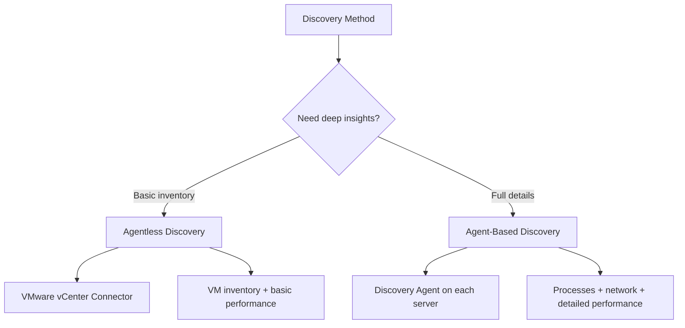

# How to Use the AWS Application Discovery Service

Author: [nawazdhandala](https://github.com/nawazdhandala)

Tags: AWS, Application Discovery Service, Migration, Inventory, Cloud Migration

Description: Learn how to use AWS Application Discovery Service to inventory your on-premises servers, map dependencies, and plan your cloud migration.

---

You cannot migrate what you do not understand. That is the fundamental problem AWS Application Discovery Service solves. Before moving any workload to AWS, you need a clear picture of your on-premises environment: what servers exist, what software runs on them, how they communicate with each other, and how much capacity they actually use. Discovery Service automates this inventory process and feeds the data into Migration Hub for planning.

This guide covers both discovery methods, how to interpret the results, and how to use the data for migration planning.

## Two Approaches to Discovery

Application Discovery Service offers two collection methods, each with different trade-offs:



**Agentless Discovery** deploys a connector as a VMware virtual appliance in your vCenter environment. It collects VM inventory and basic performance metrics without touching individual servers.

**Agent-Based Discovery** installs a lightweight agent on each server. It collects detailed performance data, running processes, and network connection information. This is what you need for dependency mapping.

## Setting Up Agentless Discovery

The agentless connector is a pre-built OVA that you deploy to your VMware vCenter.

### Step 1: Download and Deploy the Connector

Download the OVA from the AWS console and deploy it to vCenter like any other virtual appliance. The connector needs:
- Network access to vCenter API
- Outbound HTTPS access to AWS endpoints
- Credentials for vCenter with read-only access

### Step 2: Configure the Connector

After deployment, access the connector's web console and configure:

```python
# Verify connector is registered and start data collection
import boto3

discovery = boto3.client('discovery')

# List registered connectors
response = discovery.describe_agents(
    filters=[
        {
            'name': 'agentType',
            'values': ['CONNECTOR'],
            'condition': 'EQUALS'
        }
    ]
)

for connector in response['agentsInfo']:
    print(f"Connector: {connector['agentId']}")
    print(f"  Status: {connector['health']}")
    print(f"  Hostname: {connector.get('hostName', 'N/A')}")
    print(f"  Collection Status: {connector.get('collectionStatus', 'N/A')}")
```

### Step 3: Start Data Collection

```python
# Start data collection from the connector
import boto3

discovery = boto3.client('discovery')

connector_id = 'your-connector-id'

response = discovery.start_data_collection_by_agent_ids(
    agentIds=[connector_id]
)

print(f"Data collection started for {len(response.get('agentsConfigurationStatus', []))} connectors")
```

The connector polls vCenter every few minutes and sends the data to AWS. Give it at least 24-48 hours to collect meaningful performance data.

## Setting Up Agent-Based Discovery

For deeper insights, install the Discovery Agent on your servers.

### Linux Installation

```bash
# Download and install the Discovery Agent on Linux
curl -o aws-discovery-agent.tar.gz \
  https://s3-us-west-2.amazonaws.com/aws-discovery-agent.us-west-2/linux/latest/aws-discovery-agent.tar.gz

tar -xzf aws-discovery-agent.tar.gz

# Install with your AWS region and credentials
sudo bash install -r us-east-1 \
  -k YOUR_ACCESS_KEY_ID \
  -s YOUR_SECRET_ACCESS_KEY
```

### Windows Installation

```powershell
# Download and install the Discovery Agent on Windows
# Run in PowerShell as Administrator
Invoke-WebRequest -Uri "https://s3-us-west-2.amazonaws.com/aws-discovery-agent.us-west-2/windows/latest/AWSDiscoveryAgentInstaller.msi" -OutFile "AWSDiscoveryAgentInstaller.msi"

# Install with parameters
msiexec.exe /i AWSDiscoveryAgentInstaller.msi REGION="us-east-1" KEY_ID="YOUR_ACCESS_KEY_ID" KEY_SECRET="YOUR_SECRET_ACCESS_KEY" /q
```

### Managing Agents at Scale

For large environments, use your configuration management tool (Ansible, Chef, Puppet, SCCM) to deploy agents:

```yaml
# Ansible playbook for deploying Discovery Agent
- name: Deploy AWS Discovery Agent
  hosts: all_servers
  become: yes
  tasks:
    - name: Download Discovery Agent
      get_url:
        url: https://s3-us-west-2.amazonaws.com/aws-discovery-agent.us-west-2/linux/latest/aws-discovery-agent.tar.gz
        dest: /tmp/aws-discovery-agent.tar.gz

    - name: Extract agent
      unarchive:
        src: /tmp/aws-discovery-agent.tar.gz
        dest: /tmp/
        remote_src: yes

    - name: Install agent
      shell: bash /tmp/install -r us-east-1 -k "{{ aws_access_key }}" -s "{{ aws_secret_key }}"
```

## Querying Discovery Data

Once data collection has been running, query the results:

```python
# Query discovered servers and their details
import boto3

discovery = boto3.client('discovery')

# List all discovered servers
paginator = discovery.get_paginator('describe_configurations')

for page in paginator.paginate(configurationType='SERVER'):
    for server in page['configurations']:
        print(f"\nServer: {server.get('server.hostName', 'Unknown')}")
        print(f"  OS: {server.get('server.osName', 'Unknown')} {server.get('server.osVersion', '')}")
        print(f"  CPU: {server.get('server.cpuType', 'Unknown')}")
        print(f"  RAM: {server.get('server.totalRamInMB', 'Unknown')} MB")
        print(f"  Type: {server.get('server.type', 'Unknown')}")
```

## Understanding Network Dependencies

The agent-based discovery captures TCP connections between servers. This is gold for understanding application dependencies.

```python
# Export network connection data for dependency analysis
import boto3

discovery = boto3.client('discovery')

# Start a data export to S3
response = discovery.start_export_task(
    exportDataFormat=['CSV'],
    filters=[
        {
            'name': 'agentId',
            'values': ['*'],
            'condition': 'EQUALS'
        }
    ]
)

export_id = response['exportId']
print(f"Export started: {export_id}")

# Check export status
import time
while True:
    status = discovery.describe_export_tasks(
        exportIds=[export_id]
    )['exportsInfo'][0]

    if status['exportStatus'] == 'SUCCEEDED':
        print(f"Export URL: {status['configurationsDownloadUrl']}")
        break
    elif status['exportStatus'] == 'FAILED':
        print(f"Export failed: {status.get('statusMessage')}")
        break

    time.sleep(30)
```

The exported data includes network connection records showing source IP, destination IP, destination port, and bytes transferred. This lets you map out which servers talk to each other and on which ports.

## Building a Dependency Map

Use the network connection data to build a dependency map:

```python
# Analyze network connections to build dependency map
import csv
import collections

dependencies = collections.defaultdict(set)

with open('network_connections.csv', 'r') as f:
    reader = csv.DictReader(f)
    for row in reader:
        source = row['sourceIp']
        dest = row['destinationIp']
        port = row['destinationPort']

        # Only include significant connections (filter out noise)
        bytes_transferred = int(row.get('bytesTransferred', 0))
        if bytes_transferred > 1000:
            dependencies[source].add(f"{dest}:{port}")

# Print dependency map
for server, connections in sorted(dependencies.items()):
    print(f"\n{server} connects to:")
    for conn in sorted(connections):
        print(f"  -> {conn}")
```

This dependency data is critical for migration planning. If Server A depends on Server B, they need to be in the same migration wave or you need to ensure network connectivity between environments during the transition.

## Right-Sizing Recommendations

Discovery data includes performance metrics that help you right-size your AWS instances:

```python
# Analyze performance data for right-sizing
import boto3

discovery = boto3.client('discovery')

# Get performance data for a specific server
server_id = 'd-server-abc123'

response = discovery.list_configurations(
    configurationType='SERVER',
    filters=[
        {
            'name': 'configurationId',
            'values': [server_id],
            'condition': 'EQUALS'
        }
    ]
)

for server in response['configurations']:
    hostname = server.get('server.hostName', 'Unknown')
    cpu_cores = int(server.get('server.cpuNumberOfCores', 0))
    ram_mb = int(server.get('server.totalRamInMB', 0))

    # Peak CPU and memory utilization from performance data
    peak_cpu = float(server.get('server.performance.maxCpuUsagePct', 0))
    avg_cpu = float(server.get('server.performance.avgCpuUsagePct', 0))
    peak_ram = float(server.get('server.performance.maxRamUsagePct', 0))

    print(f"\n{hostname}:")
    print(f"  Current: {cpu_cores} cores, {ram_mb}MB RAM")
    print(f"  CPU: avg {avg_cpu:.1f}%, peak {peak_cpu:.1f}%")
    print(f"  RAM: peak {peak_ram:.1f}%")

    # Simple right-sizing suggestion
    needed_cpu = max(1, int(cpu_cores * peak_cpu / 100 * 1.3))  # 30% headroom
    needed_ram = int(ram_mb * peak_ram / 100 * 1.3)

    print(f"  Suggested: {needed_cpu} cores, {needed_ram}MB RAM")
```

## Importing Data into Migration Hub

Discovery Service data flows automatically into Migration Hub when both are configured in the same home region. You can then use Migration Hub to:

- Group servers into application groups
- Get strategy recommendations (see our guide on [strategy recommendations](https://oneuptime.com/blog/post/assess-your-applications-with-aws-migration-hub-strategy-recommendations/view))
- Track migration progress

## Data Retention and Privacy

Discovery Agent data is encrypted in transit and at rest. Data is retained in your AWS account and you control access through IAM. The agents do not collect file contents or user data, only system configuration, performance metrics, and network connection metadata.

For production environments, use IAM roles with least-privilege access and ensure the discovery data S3 bucket has appropriate bucket policies.

## Wrapping Up

AWS Application Discovery Service is the foundation of a well-planned migration. Without accurate discovery data, you are guessing at what exists, how it is connected, and how much capacity you actually need. Take the time to run both agentless and agent-based discovery, let it collect data for at least two weeks to capture real usage patterns, and use the dependency mapping data to inform your migration wave planning. The upfront investment in discovery pays for itself many times over by preventing surprises during migration.
