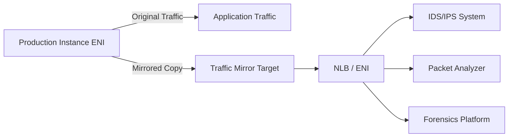
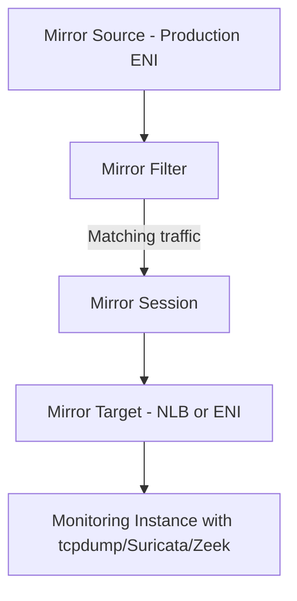

# How to Use Traffic Mirroring for Network Forensics

Author: [nawazdhandala](https://github.com/nawazdhandala)

Tags: AWS, VPC, Traffic Mirroring, Network Security, Forensics, IDS

Description: Learn how to set up AWS VPC traffic mirroring to capture and analyze network traffic for security forensics, intrusion detection, and troubleshooting.

---

When a security incident happens, the first question is always "What traffic was flowing?" VPC Flow Logs tell you who talked to whom, but they do not capture packet contents. Traffic Mirroring gives you full packet capture - every byte of every packet - sent to a destination where you can analyze it with your favorite network forensics tools.

## What is VPC Traffic Mirroring?

Traffic Mirroring copies network traffic from the elastic network interfaces (ENIs) of EC2 instances and sends it to a monitoring destination. It is like a virtual network TAP that works entirely in software.



Key properties:
- Full packet capture (not just metadata like Flow Logs)
- Traffic is mirrored, not intercepted - production traffic is unaffected
- You can filter what gets mirrored (by protocol, port, direction)
- Supports VXLAN encapsulation to the mirror target
- No agent installation required on source instances

## Architecture Overview

A traffic mirroring setup has three components:

**Mirror Source**: The ENI of the instance whose traffic you want to capture.

**Mirror Filter**: Rules that define which traffic to capture (think of it like a BPF filter).

**Mirror Target**: Where the mirrored traffic goes. Can be an ENI on a monitoring instance or a Network Load Balancer fronting a fleet of monitoring instances.

**Mirror Session**: Ties together a source, filter, and target.



## Step 1: Create a Mirror Target

### Option A: Single Monitoring Instance

For simple setups, mirror traffic directly to a monitoring instance's ENI.

```bash
# Create a mirror target pointing to a monitoring instance ENI
aws ec2 create-traffic-mirror-target \
    --network-interface-id eni-monitoring-instance \
    --description "Security monitoring instance" \
    --tag-specifications 'ResourceType=traffic-mirror-target,Tags=[{Key=Name,Value=forensics-target}]'
```

### Option B: NLB for Scalable Monitoring

For production environments, use an NLB to distribute mirrored traffic across multiple monitoring instances.

```bash
# Create an NLB for traffic mirror targets
aws elbv2 create-load-balancer \
    --name mirror-target-nlb \
    --type network \
    --scheme internal \
    --subnets subnet-1a subnet-1b

# Create a target group for monitoring instances
aws elbv2 create-target-group \
    --name mirror-receivers \
    --protocol UDP \
    --port 4789 \
    --vpc-id vpc-0123456789abcdef0 \
    --target-type instance \
    --health-check-protocol TCP \
    --health-check-port 4789

# Register monitoring instances
aws elbv2 register-targets \
    --target-group-arn arn:aws:elasticloadbalancing:us-east-1:123456789012:targetgroup/mirror-receivers/abc123 \
    --targets Id=i-monitor-1 Id=i-monitor-2

# Create UDP listener on port 4789 (VXLAN)
aws elbv2 create-listener \
    --load-balancer-arn arn:aws:elasticloadbalancing:us-east-1:123456789012:loadbalancer/net/mirror-target-nlb/abc123 \
    --protocol UDP \
    --port 4789 \
    --default-actions Type=forward,TargetGroupArn=arn:aws:elasticloadbalancing:us-east-1:123456789012:targetgroup/mirror-receivers/abc123

# Create the mirror target using the NLB
aws ec2 create-traffic-mirror-target \
    --network-load-balancer-arn arn:aws:elasticloadbalancing:us-east-1:123456789012:loadbalancer/net/mirror-target-nlb/abc123 \
    --description "Scalable monitoring fleet" \
    --tag-specifications 'ResourceType=traffic-mirror-target,Tags=[{Key=Name,Value=forensics-nlb-target}]'
```

## Step 2: Create Mirror Filters

Filters control which traffic gets mirrored. Without filters, you would mirror everything - which is expensive and generates enormous amounts of data.

```bash
# Create a mirror filter
aws ec2 create-traffic-mirror-filter \
    --description "Capture web and database traffic" \
    --tag-specifications 'ResourceType=traffic-mirror-filter,Tags=[{Key=Name,Value=web-db-filter}]'

# Add filter rules

# Capture all inbound HTTP/HTTPS traffic
aws ec2 create-traffic-mirror-filter-rule \
    --traffic-mirror-filter-id tmf-0123456789abcdef0 \
    --traffic-direction ingress \
    --rule-number 100 \
    --rule-action accept \
    --protocol 6 \
    --destination-port-range FromPort=80,ToPort=80 \
    --source-cidr-block 0.0.0.0/0 \
    --destination-cidr-block 0.0.0.0/0 \
    --description "Inbound HTTP"

aws ec2 create-traffic-mirror-filter-rule \
    --traffic-mirror-filter-id tmf-0123456789abcdef0 \
    --traffic-direction ingress \
    --rule-number 110 \
    --rule-action accept \
    --protocol 6 \
    --destination-port-range FromPort=443,ToPort=443 \
    --source-cidr-block 0.0.0.0/0 \
    --destination-cidr-block 0.0.0.0/0 \
    --description "Inbound HTTPS"

# Capture outbound database traffic
aws ec2 create-traffic-mirror-filter-rule \
    --traffic-mirror-filter-id tmf-0123456789abcdef0 \
    --traffic-direction egress \
    --rule-number 200 \
    --rule-action accept \
    --protocol 6 \
    --destination-port-range FromPort=5432,ToPort=5432 \
    --source-cidr-block 0.0.0.0/0 \
    --destination-cidr-block 0.0.0.0/0 \
    --description "Outbound PostgreSQL"

# Capture DNS queries (useful for detecting DNS tunneling)
aws ec2 create-traffic-mirror-filter-rule \
    --traffic-mirror-filter-id tmf-0123456789abcdef0 \
    --traffic-direction egress \
    --rule-number 300 \
    --rule-action accept \
    --protocol 17 \
    --destination-port-range FromPort=53,ToPort=53 \
    --source-cidr-block 0.0.0.0/0 \
    --destination-cidr-block 0.0.0.0/0 \
    --description "Outbound DNS"
```

### Filter for Capturing All Traffic

For incident response, you might need to capture everything:

```bash
# Create a capture-all filter
aws ec2 create-traffic-mirror-filter \
    --description "Capture all traffic" \
    --tag-specifications 'ResourceType=traffic-mirror-filter,Tags=[{Key=Name,Value=capture-all}]'

# Accept all inbound traffic
aws ec2 create-traffic-mirror-filter-rule \
    --traffic-mirror-filter-id tmf-capture-all \
    --traffic-direction ingress \
    --rule-number 100 \
    --rule-action accept \
    --protocol 0 \
    --source-cidr-block 0.0.0.0/0 \
    --destination-cidr-block 0.0.0.0/0 \
    --description "All inbound"

# Accept all outbound traffic
aws ec2 create-traffic-mirror-filter-rule \
    --traffic-mirror-filter-id tmf-capture-all \
    --traffic-direction egress \
    --rule-number 100 \
    --rule-action accept \
    --protocol 0 \
    --source-cidr-block 0.0.0.0/0 \
    --destination-cidr-block 0.0.0.0/0 \
    --description "All outbound"
```

## Step 3: Create Mirror Sessions

A session connects a source ENI to a filter and target.

```bash
# Create a mirror session
aws ec2 create-traffic-mirror-session \
    --network-interface-id eni-production-instance \
    --traffic-mirror-target-id tmt-0123456789abcdef0 \
    --traffic-mirror-filter-id tmf-0123456789abcdef0 \
    --session-number 1 \
    --description "Mirror web server traffic" \
    --tag-specifications 'ResourceType=traffic-mirror-session,Tags=[{Key=Name,Value=webserver-mirror}]'
```

You can create multiple sessions for the same source ENI with different filters and targets:

```bash
# Session 1: Web traffic to IDS
aws ec2 create-traffic-mirror-session \
    --network-interface-id eni-production-instance \
    --traffic-mirror-target-id tmt-ids-target \
    --traffic-mirror-filter-id tmf-web-filter \
    --session-number 1

# Session 2: All traffic to forensics platform
aws ec2 create-traffic-mirror-session \
    --network-interface-id eni-production-instance \
    --traffic-mirror-target-id tmt-forensics-target \
    --traffic-mirror-filter-id tmf-capture-all \
    --session-number 2
```

## Step 4: Configure the Monitoring Instance

### Using tcpdump for Quick Capture

```bash
# On the monitoring instance, capture VXLAN-encapsulated traffic
# Traffic arrives on port 4789 as VXLAN packets
sudo tcpdump -i eth0 udp port 4789 -w /tmp/capture.pcap

# Decode VXLAN and capture the inner packets
sudo tcpdump -i eth0 udp port 4789 -n -v
```

### Using Suricata for IDS/IPS

```bash
# Install Suricata on the monitoring instance
sudo apt-get install suricata -y

# Configure Suricata to listen on VXLAN interface
# /etc/suricata/suricata.yaml
# af-packet:
#   - interface: vxlan0
```

Create a VXLAN interface to decapsulate the mirrored traffic:

```bash
# Create VXLAN interface for decapsulation
sudo ip link add vxlan0 type vxlan id 1234 local 10.0.1.50 dstport 4789
sudo ip link set vxlan0 up

# Now Suricata can monitor vxlan0 for decapsulated traffic
sudo suricata -c /etc/suricata/suricata.yaml -i vxlan0
```

### Using Zeek for Network Analysis

```bash
# Install Zeek
# Configure to listen on the VXLAN interface
sudo zeekctl deploy

# Zeek will generate conn.log, dns.log, http.log, etc.
# These logs are invaluable for forensics
cat /opt/zeek/logs/current/conn.log
cat /opt/zeek/logs/current/dns.log
```

## Forensics Use Cases

### Investigating a Suspected Breach

When you suspect a breach, quickly set up full packet capture on the affected instance:

```bash
# Emergency: mirror all traffic from a potentially compromised instance
aws ec2 create-traffic-mirror-session \
    --network-interface-id eni-compromised-instance \
    --traffic-mirror-target-id tmt-forensics-target \
    --traffic-mirror-filter-id tmf-capture-all \
    --session-number 1 \
    --description "INCIDENT: Investigating potential breach on i-abc123"
```

### Detecting Data Exfiltration

Monitor for unusual outbound traffic patterns:

```bash
# Filter for DNS and HTTPS egress (common exfiltration channels)
aws ec2 create-traffic-mirror-filter \
    --description "Exfiltration detection filter"

# Capture outbound DNS (potential DNS tunneling)
aws ec2 create-traffic-mirror-filter-rule \
    --traffic-mirror-filter-id tmf-exfil \
    --traffic-direction egress \
    --rule-number 100 \
    --rule-action accept \
    --protocol 17 \
    --destination-port-range FromPort=53,ToPort=53 \
    --source-cidr-block 0.0.0.0/0 \
    --destination-cidr-block 0.0.0.0/0

# Capture outbound HTTPS to non-standard ports
aws ec2 create-traffic-mirror-filter-rule \
    --traffic-mirror-filter-id tmf-exfil \
    --traffic-direction egress \
    --rule-number 200 \
    --rule-action accept \
    --protocol 6 \
    --destination-port-range FromPort=8443,ToPort=8443 \
    --source-cidr-block 0.0.0.0/0 \
    --destination-cidr-block 0.0.0.0/0
```

For complementary DNS-based monitoring, see our guide on [monitoring Route 53 DNS query logging](https://oneuptime.com/blog/post/monitor-route-53-dns-query-logging/view).

## Cost and Performance Considerations

**Bandwidth**: Mirrored traffic counts against your instance's network bandwidth. A busy instance generating 5 Gbps of traffic will have that traffic doubled (5 Gbps original + 5 Gbps mirrored).

**Storage**: Full packet capture generates large volumes of data. A moderately busy web server can produce 10-50 GB of capture data per hour.

**Instance types**: Traffic mirroring is supported on Nitro-based instances. Older instance types are not supported.

**Cost**: There is no additional AWS charge for traffic mirroring itself, but you pay for the data transfer between the source and target, plus the compute and storage for your monitoring infrastructure.

## Cleanup

When you no longer need traffic mirroring, clean up to stop the traffic duplication:

```bash
# Delete the mirror session
aws ec2 delete-traffic-mirror-session \
    --traffic-mirror-session-id tms-0123456789abcdef0

# Optionally delete the filter and target
aws ec2 delete-traffic-mirror-filter \
    --traffic-mirror-filter-id tmf-0123456789abcdef0

aws ec2 delete-traffic-mirror-target \
    --traffic-mirror-target-id tmt-0123456789abcdef0
```

## Conclusion

VPC Traffic Mirroring is the closest thing to plugging a network TAP into a physical switch, but in the cloud. For security teams doing incident response, compliance auditing, or running IDS/IPS, it provides the packet-level visibility that flow logs cannot. Set up your monitoring infrastructure in advance, define filters for your common use cases, and when an incident occurs, you can start capturing within minutes. The key is being prepared before you need it.
