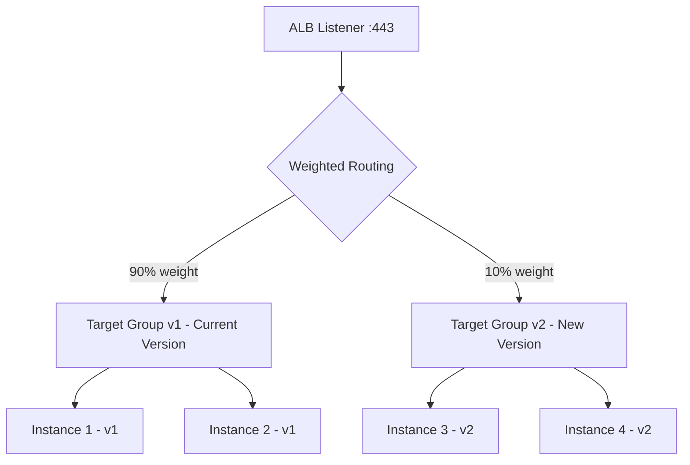

# How to Use Weighted Target Groups with ALB

Author: [nawazdhandala](https://github.com/nawazdhandala)

Tags: AWS, ALB, Load Balancing, Canary Deployments, Blue-Green, Target Groups

Description: Learn how to configure weighted target groups on Application Load Balancer for canary deployments, blue-green deployments, and gradual traffic shifting.

---

Deploying new code to production is always a risk. Weighted target groups on Application Load Balancer let you control that risk by gradually shifting traffic between different versions of your application. Send 5% of traffic to the new version, watch the metrics, and increase the percentage only when you are confident everything works.

## What Are Weighted Target Groups?

An ALB listener can forward traffic to multiple target groups simultaneously, with each target group receiving a configurable percentage of the traffic. You set weights on each target group, and the ALB distributes traffic proportionally.



## Use Cases

**Canary deployments**: Send a small percentage of traffic to a new version. Monitor errors and latency. If something is wrong, roll back by shifting weight back to 0%.

**Blue-green deployments**: Run two full environments. Switch traffic from blue to green in one step, or gradually if you prefer.

**A/B testing**: Route a percentage of users to a different backend for testing purposes.

**Migration**: Gradually move traffic from an old architecture to a new one.

## Step 1: Create Target Groups

Create separate target groups for each version of your application.

```bash
# Target group for current version (v1)
aws elbv2 create-target-group \
    --name app-v1-tg \
    --protocol HTTP \
    --port 80 \
    --vpc-id vpc-0123456789abcdef0 \
    --target-type instance \
    --health-check-path /health \
    --health-check-interval-seconds 15 \
    --healthy-threshold-count 2 \
    --unhealthy-threshold-count 3 \
    --tags 'Key=Version,Value=v1'

# Target group for new version (v2)
aws elbv2 create-target-group \
    --name app-v2-tg \
    --protocol HTTP \
    --port 80 \
    --vpc-id vpc-0123456789abcdef0 \
    --target-type instance \
    --health-check-path /health \
    --health-check-interval-seconds 15 \
    --healthy-threshold-count 2 \
    --unhealthy-threshold-count 3 \
    --tags 'Key=Version,Value=v2'
```

## Step 2: Register Targets

```bash
# Register current version instances
aws elbv2 register-targets \
    --target-group-arn arn:aws:elasticloadbalancing:us-east-1:123456789012:targetgroup/app-v1-tg/abc123 \
    --targets Id=i-v1-instance-1 Id=i-v1-instance-2

# Register new version instances
aws elbv2 register-targets \
    --target-group-arn arn:aws:elasticloadbalancing:us-east-1:123456789012:targetgroup/app-v2-tg/def456 \
    --targets Id=i-v2-instance-1 Id=i-v2-instance-2
```

## Step 3: Configure the Listener with Weights

```bash
# Create or modify listener to use weighted target groups
# Start with 100% on v1 and 0% on v2
aws elbv2 modify-listener \
    --listener-arn arn:aws:elasticloadbalancing:us-east-1:123456789012:listener/app/my-alb/abc123/def456 \
    --default-actions '[
        {
            "Type": "forward",
            "ForwardConfig": {
                "TargetGroups": [
                    {
                        "TargetGroupArn": "arn:aws:elasticloadbalancing:us-east-1:123456789012:targetgroup/app-v1-tg/abc123",
                        "Weight": 100
                    },
                    {
                        "TargetGroupArn": "arn:aws:elasticloadbalancing:us-east-1:123456789012:targetgroup/app-v2-tg/def456",
                        "Weight": 0
                    }
                ],
                "TargetGroupStickinessConfig": {
                    "Enabled": true,
                    "DurationSeconds": 3600
                }
            }
        }
    ]'
```

The `TargetGroupStickinessConfig` is important: when enabled, a user who gets routed to v2 stays on v2 for the configured duration. Without this, a user might flip between versions on every request, which can cause session issues or confusing behavior.

## Step 4: Gradual Traffic Shift

Here is a deployment script that gradually shifts traffic:

```bash
#!/bin/bash
# Canary deployment script - gradually shift traffic to new version

V1_TG="arn:aws:elasticloadbalancing:us-east-1:123456789012:targetgroup/app-v1-tg/abc123"
V2_TG="arn:aws:elasticloadbalancing:us-east-1:123456789012:targetgroup/app-v2-tg/def456"
LISTENER="arn:aws:elasticloadbalancing:us-east-1:123456789012:listener/app/my-alb/abc123/def456"

shift_traffic() {
    local v1_weight=$1
    local v2_weight=$2

    echo "Shifting traffic: v1=${v1_weight}%, v2=${v2_weight}%"

    aws elbv2 modify-listener \
        --listener-arn "$LISTENER" \
        --default-actions "[
            {
                \"Type\": \"forward\",
                \"ForwardConfig\": {
                    \"TargetGroups\": [
                        {\"TargetGroupArn\": \"$V1_TG\", \"Weight\": $v1_weight},
                        {\"TargetGroupArn\": \"$V2_TG\", \"Weight\": $v2_weight}
                    ],
                    \"TargetGroupStickinessConfig\": {
                        \"Enabled\": true,
                        \"DurationSeconds\": 3600
                    }
                }
            }
        ]"
}

# Phase 1: Send 5% to v2
shift_traffic 95 5
echo "Waiting 10 minutes to monitor..."
sleep 600

# Check error rate (you would integrate with your monitoring here)
echo "Phase 1 complete. Check dashboards before proceeding."
read -p "Continue to 25%? (y/n) " -n 1 -r
echo

if [[ $REPLY =~ ^[Yy]$ ]]; then
    # Phase 2: Send 25% to v2
    shift_traffic 75 25
    echo "Waiting 10 minutes..."
    sleep 600

    read -p "Continue to 50%? (y/n) " -n 1 -r
    echo

    if [[ $REPLY =~ ^[Yy]$ ]]; then
        # Phase 3: Send 50% to v2
        shift_traffic 50 50
        echo "Waiting 10 minutes..."
        sleep 600

        read -p "Complete deployment (100%)? (y/n) " -n 1 -r
        echo

        if [[ $REPLY =~ ^[Yy]$ ]]; then
            shift_traffic 0 100
            echo "Deployment complete. v2 receiving 100% of traffic."
        fi
    fi
fi
```

## Automated Canary with CloudWatch

Instead of manual approval, you can automate rollback based on CloudWatch metrics:

```python
import boto3
import time

def get_error_rate(target_group_arn, alb_arn, period_minutes=5):
    """Get the HTTP 5xx error rate for a target group."""
    cloudwatch = boto3.client('cloudwatch')

    # Extract dimension values from ARNs
    tg_dim = target_group_arn.split(':')[-1]
    alb_dim = alb_arn.split(':')[-1].replace('loadbalancer/', '')

    response = cloudwatch.get_metric_statistics(
        Namespace='AWS/ApplicationELB',
        MetricName='HTTPCode_Target_5XX_Count',
        Dimensions=[
            {'Name': 'TargetGroup', 'Value': tg_dim},
            {'Name': 'LoadBalancer', 'Value': alb_dim}
        ],
        StartTime=time.time() - (period_minutes * 60),
        EndTime=time.time(),
        Period=period_minutes * 60,
        Statistics=['Sum']
    )

    if response['Datapoints']:
        return response['Datapoints'][0]['Sum']
    return 0

def canary_deploy(listener_arn, v1_tg, v2_tg, alb_arn, error_threshold=10):
    """
    Automated canary deployment with automatic rollback.
    """
    elbv2 = boto3.client('elbv2')

    stages = [
        (95, 5, "5% canary"),
        (75, 25, "25% traffic"),
        (50, 50, "50% traffic"),
        (0, 100, "Full deployment"),
    ]

    for v1_weight, v2_weight, description in stages:
        print(f"Stage: {description} (v1={v1_weight}%, v2={v2_weight}%)")

        # Shift traffic
        elbv2.modify_listener(
            ListenerArn=listener_arn,
            DefaultActions=[{
                'Type': 'forward',
                'ForwardConfig': {
                    'TargetGroups': [
                        {'TargetGroupArn': v1_tg, 'Weight': v1_weight},
                        {'TargetGroupArn': v2_tg, 'Weight': v2_weight}
                    ]
                }
            }]
        )

        # Wait and check metrics
        print("  Monitoring for 10 minutes...")
        time.sleep(600)

        errors = get_error_rate(v2_tg, alb_arn)
        print(f"  v2 error count: {errors}")

        if errors > error_threshold:
            print(f"  ERROR THRESHOLD EXCEEDED. Rolling back...")
            elbv2.modify_listener(
                ListenerArn=listener_arn,
                DefaultActions=[{
                    'Type': 'forward',
                    'ForwardConfig': {
                        'TargetGroups': [
                            {'TargetGroupArn': v1_tg, 'Weight': 100},
                            {'TargetGroupArn': v2_tg, 'Weight': 0}
                        ]
                    }
                }]
            )
            print("  Rolled back to v1. Investigate and retry.")
            return False

    print("Deployment complete!")
    return True
```

## Using Weighted Target Groups with ALB Rules

You can also apply weighted routing to specific path-based or host-based rules, not just the default action:

```bash
# Create a rule that applies weighted routing only to /api/* paths
aws elbv2 create-rule \
    --listener-arn arn:aws:elasticloadbalancing:us-east-1:123456789012:listener/app/my-alb/abc123/def456 \
    --priority 10 \
    --conditions '[{"Field": "path-pattern", "Values": ["/api/*"]}]' \
    --actions '[
        {
            "Type": "forward",
            "ForwardConfig": {
                "TargetGroups": [
                    {
                        "TargetGroupArn": "arn:aws:elasticloadbalancing:us-east-1:123456789012:targetgroup/api-v1-tg/abc123",
                        "Weight": 90
                    },
                    {
                        "TargetGroupArn": "arn:aws:elasticloadbalancing:us-east-1:123456789012:targetgroup/api-v2-tg/def456",
                        "Weight": 10
                    }
                ]
            }
        }
    ]'
```

This lets you canary-deploy specific parts of your application independently.

## Important Considerations

**Stickiness**: Enable target group stickiness to prevent users from bouncing between versions. This is especially important if v1 and v2 have different session formats or API responses.

**Health checks**: Make sure both target groups have proper health checks. If the new version is unhealthy, the ALB will not route traffic to it regardless of the weight.

**Weight = 0 is not the same as removing the target group**: A target group with weight 0 still exists in the configuration but receives no traffic. This makes it easy to re-enable by just changing the weight.

**Monitoring**: You need per-target-group metrics to compare v1 and v2 performance. CloudWatch provides these automatically. For more ALB configuration options, see our post on [configuring ALB slow start mode](https://oneuptime.com/blog/post/2026-02-12-configure-alb-slow-start-mode/view).

## Conclusion

Weighted target groups are the simplest path to safe deployments on AWS. They do not require any special tooling beyond what the ALB already provides. Start every deployment at 5%, watch your metrics, and increase only when you are confident. The few extra minutes per deployment are worth far more than the hours you would spend debugging a bad full-fleet deployment.
