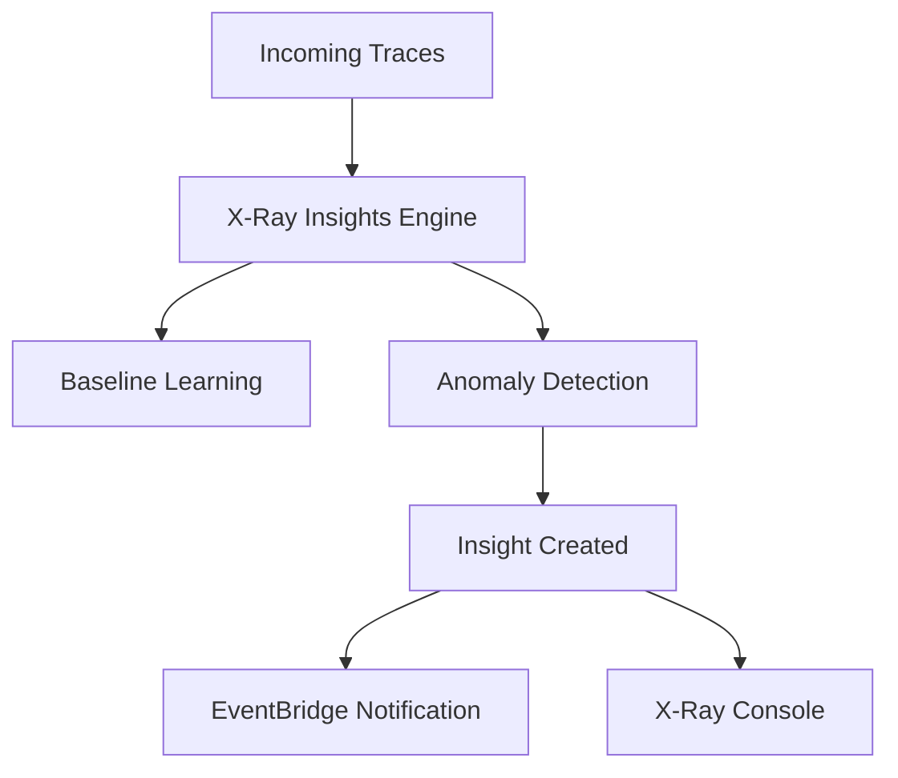

# How to Use X-Ray Insights for Automated Analysis

Author: [nawazdhandala](https://github.com/nawazdhandala)

Tags: AWS, X-Ray, Insights, Distributed Tracing, Anomaly Detection, Observability

Description: Enable and use AWS X-Ray Insights to automatically detect anomalies, identify root causes, and receive notifications for performance issues.

---

AWS X-Ray collects a wealth of trace data from your distributed applications. But sifting through traces manually to find problems is tedious, especially when you have hundreds of services. X-Ray Insights automates that analysis. It continuously monitors your trace data, detects anomalies like elevated error rates or increased latency, and generates insights that pinpoint the root cause.

Think of it as an automated SRE that watches your traces 24/7 and taps you on the shoulder when something looks wrong.

## What X-Ray Insights Does

X-Ray Insights uses machine learning models to establish baselines for your services. When a metric deviates significantly from the baseline, it creates an insight. Each insight includes:

- The affected services and their anomalous metrics
- A timeline showing when the anomaly started and whether it is ongoing
- A root cause analysis pointing to the most likely service or operation causing the problem
- Related anomalies in downstream services



## Prerequisites

- An application already sending traces to X-Ray (via the X-Ray SDK, OpenTelemetry, or the X-Ray daemon)
- A service group defined in X-Ray (or you can enable insights on the default group)
- Sufficient trace volume for the ML models to establish baselines (typically a few hours of steady traffic)

## Step 1: Create an X-Ray Group

X-Ray groups let you define a collection of traces using a filter expression. Insights operate on groups, so you need at least one group. You can use the default group, but creating a specific group gives you more control.

```bash
# Create an X-Ray group for your production services
aws xray create-group \
  --group-name "production-services" \
  --filter-expression 'service("order-service") OR service("payment-service") OR service("inventory-service")' \
  --insights-configuration '{"InsightsEnabled": true, "NotificationsEnabled": true}'
```

The `filter-expression` defines which traces belong to this group. The `InsightsEnabled` flag turns on automated analysis, and `NotificationsEnabled` sends events to Amazon EventBridge when insights are created or updated.

## Step 2: Enable Insights on an Existing Group

If you already have a group, you can enable insights on it:

```bash
# Enable insights on an existing group
aws xray update-group \
  --group-name "production-services" \
  --insights-configuration '{"InsightsEnabled": true, "NotificationsEnabled": true}'
```

You can also do this through the X-Ray console by navigating to Groups, selecting your group, and toggling the Insights switch.

## Step 3: Set Up EventBridge Notifications

When insights are generated, X-Ray sends events to EventBridge. You can route these events to SNS, Lambda, Slack, PagerDuty, or any other target.

```bash
# Create an SNS topic for X-Ray insight notifications
aws sns create-topic --name xray-insights-alerts
aws sns subscribe \
  --topic-arn arn:aws:sns:us-east-1:123456789012:xray-insights-alerts \
  --protocol email \
  --notification-endpoint ops-team@example.com

# Create an EventBridge rule to capture X-Ray insight events
aws events put-rule \
  --name xray-insight-notifications \
  --event-pattern '{
    "source": ["aws.xray"],
    "detail-type": ["X-Ray Insight State Change"]
  }'

# Set the SNS topic as the target
aws events put-targets \
  --rule xray-insight-notifications \
  --targets '[{
    "Id": "sns-target",
    "Arn": "arn:aws:sns:us-east-1:123456789012:xray-insights-alerts"
  }]'
```

The insight events include rich detail about what was detected. A typical event looks like this:

```json
// Sample X-Ray Insight event payload
{
  "source": "aws.xray",
  "detail-type": "X-Ray Insight State Change",
  "detail": {
    "InsightId": "abc-123-def",
    "GroupName": "production-services",
    "State": "ACTIVE",
    "Categories": ["FAULT"],
    "RootCauseServiceId": {
      "Name": "payment-service",
      "Type": "AWS::ECS::Container"
    },
    "TopAnomalousServices": [
      {
        "ServiceId": {"Name": "payment-service"},
        "FaultStatistics": {"ErrorPercent": 12.5}
      }
    ],
    "StartTime": "2026-02-12T10:30:00Z"
  }
}
```

## Step 4: Route to Lambda for Custom Processing

For more sophisticated alerting, send the insight event to a Lambda function that enriches the notification with additional context.

```python
# Lambda function to process X-Ray insight events
import json
import boto3

sns_client = boto3.client('sns')
xray_client = boto3.client('xray')

def handler(event, context):
    detail = event['detail']
    insight_id = detail['InsightId']
    group_name = detail['GroupName']
    state = detail['State']

    # Fetch the full insight details
    insight = xray_client.get_insight(InsightId=insight_id)

    root_cause = detail.get('RootCauseServiceId', {}).get('Name', 'Unknown')

    # Build a human-readable notification
    message = f"""
    X-Ray Insight Alert
    --------------------
    State: {state}
    Group: {group_name}
    Root Cause Service: {root_cause}
    Start Time: {detail.get('StartTime', 'N/A')}

    Top Anomalous Services:
    """

    for svc in detail.get('TopAnomalousServices', []):
        name = svc['ServiceId']['Name']
        error_pct = svc.get('FaultStatistics', {}).get('ErrorPercent', 0)
        message += f"  - {name}: {error_pct}% error rate\n"

    # Send to SNS
    sns_client.publish(
        TopicArn='arn:aws:sns:us-east-1:123456789012:xray-insights-alerts',
        Subject=f'X-Ray Insight: {root_cause} - {state}',
        Message=message
    )

    return {'statusCode': 200}
```

## Step 5: Review Insights in the Console

The X-Ray console provides a visual interface for exploring insights. Navigate to X-Ray > Insights to see active and resolved insights. Each insight shows:

- **Timeline**: A chart showing the anomalous metric over time with the baseline for comparison
- **Root cause**: The service and operation X-Ray identified as the likely origin
- **Impact**: Which downstream services were affected
- **Anomalous services**: All services that showed unusual behavior during the incident

This information is invaluable during incident response. Instead of hunting through dashboards, you get a concise summary of what went wrong and where.

## Step 6: Use the Insights API

You can query insights programmatically for integration with custom tools or runbooks.

```bash
# List all active insights for a group
aws xray get-insight-summaries \
  --group-name "production-services" \
  --start-time $(date -d '24 hours ago' +%s) \
  --end-time $(date +%s) \
  --states ACTIVE
```

To get the full detail of a specific insight:

```bash
# Get detailed insight including root cause and impacted services
aws xray get-insight \
  --insight-id "abc-123-def"
```

For insight events over time (useful for post-mortems):

```bash
# Get the timeline of events for an insight
aws xray get-insight-events \
  --insight-id "abc-123-def"
```

## How Insights Detection Works Under the Hood

X-Ray Insights builds statistical models for each service based on:

- Fault rate (5xx errors)
- Throttle rate (429 errors)
- Latency percentiles (p50, p90, p99)

When a metric exceeds the expected range for a sustained period, the system flags it as anomalous. The root cause analysis works by tracing the anomaly through the service graph. If service A calls service B, and both show elevated error rates, but service B's anomaly started first, then service B is likely the root cause.

The model needs a few hours of data to establish baselines. During the initial learning period, you might see some noisy insights. This settles down once the baselines stabilize.

## Best Practices

**Create focused groups**: Instead of one massive group, create groups per domain (payments, inventory, user management). This gives you cleaner insights and more relevant notifications.

**Combine with alarms**: Insights are great for complex, multi-service anomalies. For simple threshold breaches (like a single Lambda hitting 100% error rate), CloudWatch Alarms are faster. Use both together.

**Review resolved insights**: After an incident, look at the resolved insight to understand the full timeline. This is excellent material for post-mortems.

**Adjust sampling rules**: If your trace volume is very low, insights might not have enough data to work well. Make sure you are sampling at a rate that gives the ML models sufficient data points.

## Wrapping Up

X-Ray Insights takes the manual work out of trace analysis. Instead of digging through thousands of traces looking for patterns, the system does it for you and raises a hand when something is off. Combined with EventBridge notifications, you can get alerted within minutes of an anomaly starting, complete with a root cause hypothesis.

For setting up the tracing pipeline itself, check out our guides on [X-Ray daemon on EC2](https://oneuptime.com/blog/post/2026-02-12-set-up-x-ray-daemon-on-ec2-for-tracing/view) and [X-Ray with ECS sidecar containers](https://oneuptime.com/blog/post/2026-02-12-use-x-ray-with-ecs-sidecar-container/view). If you want to pair insights with SLO monitoring, see our post on [CloudWatch Application Signals for SLO monitoring](https://oneuptime.com/blog/post/2026-02-12-use-cloudwatch-application-signals-for-slo-monitoring/view).
