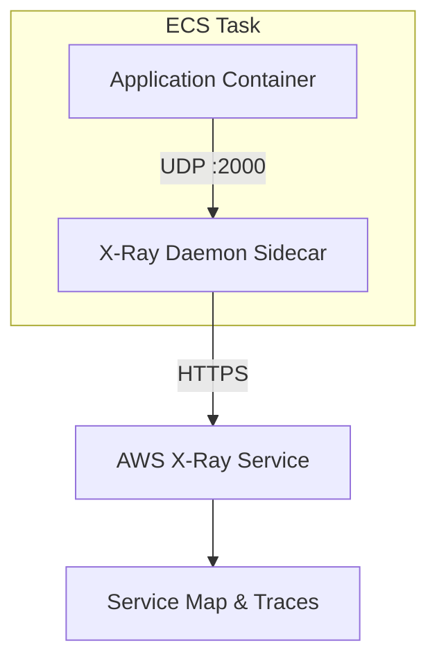

# How to Use X-Ray with ECS Sidecar Container

Author: [nawazdhandala](https://github.com/nawazdhandala)

Tags: AWS, X-Ray, ECS, Containers, Distributed Tracing, Sidecar

Description: Deploy the AWS X-Ray daemon as a sidecar container in your ECS tasks to enable distributed tracing for containerized applications.

---

When running applications on Amazon ECS, you cannot just install the X-Ray daemon on the host like you would on EC2. Instead, you deploy the X-Ray daemon as a sidecar container within the same task definition. Your application container sends trace segments to the sidecar over the local network, and the sidecar relays them to the X-Ray service.

This pattern is clean, portable, and works with both Fargate and EC2 launch types. Let me walk you through the full setup.

## The Sidecar Pattern

In ECS, containers within the same task share a network namespace (in awsvpc mode) or can communicate via localhost (in bridge mode with links). The X-Ray daemon sidecar listens on UDP port 2000 and your application sends trace data to it.



The sidecar approach keeps your application image clean. You do not need to bake the X-Ray daemon into your application container. AWS provides an official X-Ray daemon Docker image that you can reference directly.

## Prerequisites

- An ECS cluster (Fargate or EC2 launch type)
- A task execution role with ECR pull permissions
- An application instrumented with the X-Ray SDK or OpenTelemetry
- AWS CLI configured with admin permissions

## Step 1: Create the Task Role with X-Ray Permissions

The task role (not the execution role) needs permissions to send trace data to X-Ray. Create a role and attach the managed policy.

```bash
# Create the task role trust policy
aws iam create-role \
  --role-name ecs-xray-task-role \
  --assume-role-policy-document '{
    "Version": "2012-10-17",
    "Statement": [{
      "Effect": "Allow",
      "Principal": {"Service": "ecs-tasks.amazonaws.com"},
      "Action": "sts:AssumeRole"
    }]
  }'

# Attach X-Ray write permissions
aws iam attach-role-policy \
  --role-name ecs-xray-task-role \
  --policy-arn arn:aws:iam::aws:policy/AWSXRayDaemonWriteAccess
```

Both the application container and the sidecar container share this task role. The X-Ray daemon in the sidecar is the one making the API calls, but the permission is granted at the task level.

## Step 2: Define the Task Definition

The task definition includes two containers: your application and the X-Ray daemon sidecar. Here is a JSON task definition for Fargate.

```json
// ECS Task Definition with X-Ray sidecar for Fargate
{
  "family": "my-app-with-xray",
  "networkMode": "awsvpc",
  "requiresCompatibilities": ["FARGATE"],
  "cpu": "512",
  "memory": "1024",
  "taskRoleArn": "arn:aws:iam::123456789012:role/ecs-xray-task-role",
  "executionRoleArn": "arn:aws:iam::123456789012:role/ecsTaskExecutionRole",
  "containerDefinitions": [
    {
      "name": "my-app",
      "image": "123456789012.dkr.ecr.us-east-1.amazonaws.com/my-app:latest",
      "essential": true,
      "portMappings": [
        {
          "containerPort": 3000,
          "protocol": "tcp"
        }
      ],
      "environment": [
        {
          "name": "AWS_XRAY_DAEMON_ADDRESS",
          "value": "localhost:2000"
        }
      ],
      "logConfiguration": {
        "logDriver": "awslogs",
        "options": {
          "awslogs-group": "/ecs/my-app",
          "awslogs-region": "us-east-1",
          "awslogs-stream-prefix": "app"
        }
      }
    },
    {
      "name": "xray-daemon",
      "image": "amazon/aws-xray-daemon:latest",
      "essential": false,
      "cpu": 32,
      "memoryReservation": 64,
      "portMappings": [
        {
          "containerPort": 2000,
          "protocol": "udp"
        }
      ],
      "logConfiguration": {
        "logDriver": "awslogs",
        "options": {
          "awslogs-group": "/ecs/my-app",
          "awslogs-region": "us-east-1",
          "awslogs-stream-prefix": "xray"
        }
      }
    }
  ]
}
```

Important notes about this task definition:

- **networkMode is awsvpc**: On Fargate, this is the only option. Both containers share the same network interface, so the application reaches the daemon at `localhost:2000`.
- **The sidecar is marked as essential: false**: This means if the X-Ray daemon crashes, the task keeps running. Your application should not fail just because tracing is down.
- **CPU and memory for the sidecar**: The X-Ray daemon is lightweight. 32 CPU units and 64MB memory reservation is plenty for most workloads.
- **AWS_XRAY_DAEMON_ADDRESS**: This environment variable tells the X-Ray SDK where to find the daemon.

## Step 3: Register the Task Definition

```bash
# Register the task definition with ECS
aws ecs register-task-definition \
  --cli-input-json file://task-definition.json
```

## Step 4: Create the CloudWatch Log Group

Make sure the log group exists before running the task.

```bash
# Create the log group for both containers
aws logs create-log-group \
  --log-group-name /ecs/my-app \
  --region us-east-1
```

## Step 5: Run the Service

Create an ECS service that uses this task definition.

```bash
# Create the ECS service
aws ecs create-service \
  --cluster my-cluster \
  --service-name my-app-service \
  --task-definition my-app-with-xray \
  --desired-count 2 \
  --launch-type FARGATE \
  --network-configuration '{
    "awsvpcConfiguration": {
      "subnets": ["subnet-abc123", "subnet-def456"],
      "securityGroups": ["sg-xyz789"],
      "assignPublicIp": "ENABLED"
    }
  }'
```

## Step 6: Configure Your Application

Your application container needs the X-Ray SDK configured to send to `localhost:2000`. Here is a Node.js example:

```javascript
// X-Ray setup for an ECS containerized Node.js app
const AWSXRay = require('aws-xray-sdk');
const express = require('express');

// The daemon address comes from the environment variable
// set in the task definition
const daemonAddress = process.env.AWS_XRAY_DAEMON_ADDRESS || 'localhost:2000';
AWSXRay.setDaemonAddress(daemonAddress);

const app = express();
app.use(AWSXRay.express.openSegment('my-ecs-app'));

app.get('/health', (req, res) => {
  res.json({ status: 'healthy' });
});

app.get('/api/orders', async (req, res) => {
  // Downstream calls are automatically traced
  // when using the X-Ray patched AWS SDK
  const AWS = AWSXRay.captureAWS(require('aws-sdk'));
  const dynamodb = new AWS.DynamoDB.DocumentClient();

  const result = await dynamodb.scan({
    TableName: 'orders'
  }).promise();

  res.json(result.Items);
});

app.use(AWSXRay.express.closeSegment());
app.listen(3000);
```

## EC2 Launch Type Considerations

If you are using the EC2 launch type instead of Fargate, you have an alternative: run the X-Ray daemon as a daemon service on each container instance instead of as a sidecar in every task. This uses fewer resources since you only run one daemon per host instead of one per task.

```json
// Task definition for the X-Ray daemon as a daemon service
{
  "family": "xray-daemon",
  "networkMode": "host",
  "containerDefinitions": [
    {
      "name": "xray-daemon",
      "image": "amazon/aws-xray-daemon:latest",
      "essential": true,
      "memory": 128,
      "portMappings": [
        {
          "containerPort": 2000,
          "hostPort": 2000,
          "protocol": "udp"
        }
      ]
    }
  ]
}
```

Then create a daemon-type service:

```bash
# Deploy as a daemon service (one per EC2 instance)
aws ecs create-service \
  --cluster my-ec2-cluster \
  --service-name xray-daemon \
  --task-definition xray-daemon \
  --scheduling-strategy DAEMON \
  --launch-type EC2
```

With this approach, your application containers send traces to the host IP on port 2000 instead of localhost.

## Verifying Traces

Once the service is running and receiving traffic, check the X-Ray console for your service map. You can also use the CLI:

```bash
# Fetch recent traces for the service
aws xray get-trace-summaries \
  --start-time $(date -d '10 minutes ago' +%s) \
  --end-time $(date +%s) \
  --filter-expression 'service("my-ecs-app")' \
  --region us-east-1
```

## Troubleshooting

**No traces appearing**: Check the xray-daemon container logs in CloudWatch Logs. If you see "Sending segment documents" messages, the daemon is working. The issue is likely in your application's SDK configuration.

**Connection refused errors**: Make sure the security group allows UDP traffic on port 2000 within the task (for awsvpc mode, this is internal and typically not blocked).

**Daemon OOM killed**: If the daemon container is being killed, increase the `memoryReservation`. High-throughput applications can generate a lot of trace data.

## Wrapping Up

The X-Ray sidecar pattern in ECS is the standard way to add distributed tracing to your containerized applications. It keeps concerns separated, works on both Fargate and EC2, and the official AWS daemon image is maintained and optimized. If you are running on EC2 instances instead, check out our guide on [setting up the X-Ray daemon on EC2](https://oneuptime.com/blog/post/set-up-x-ray-daemon-on-ec2-for-tracing/view). For automated trace analysis, see [X-Ray Insights for automated analysis](https://oneuptime.com/blog/post/use-x-ray-insights-for-automated-analysis/view).
