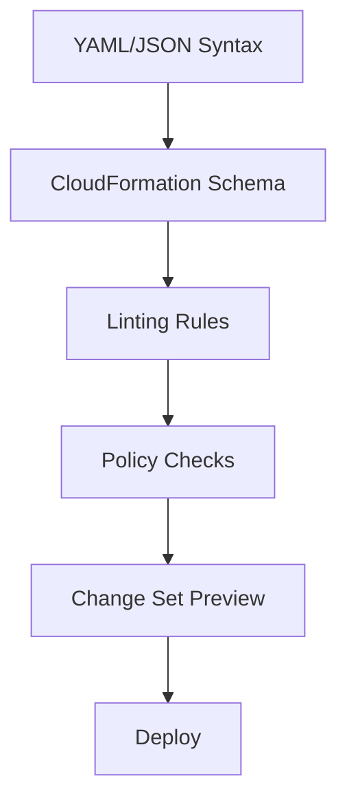

# How to Validate CloudFormation Templates Before Deployment

Author: [nawazdhandala](https://github.com/nawazdhandala)

Tags: AWS, CloudFormation, DevOps, CI/CD, Infrastructure as Code

Description: Learn how to validate CloudFormation templates before deployment using built-in validation, linting tools, and automated CI/CD pipeline checks.

---

Deploying a CloudFormation template with errors wastes time. A syntax error means waiting for the stack to fail, then waiting for the rollback, then fixing the template, then deploying again. That's 10-20 minutes lost per mistake. Validating templates before deployment catches most errors in seconds.

## Levels of Validation

Template validation happens at several levels, and each catches different types of errors:



The earlier you catch an error, the faster the feedback loop.

## Level 1: YAML/JSON Syntax Validation

The most basic check - is the file valid YAML or JSON?

```bash
# Validate YAML syntax with Python
python3 -c "import yaml; yaml.safe_load(open('template.yaml'))"

# Validate JSON syntax
python3 -c "import json; json.load(open('template.json'))"
```

Or use a dedicated YAML linter:

```bash
# Install yamllint
pip install yamllint

# Check YAML formatting and syntax
yamllint template.yaml
```

## Level 2: CloudFormation Validate-Template

The built-in CloudFormation validation checks template structure and basic correctness:

```bash
# Validate a template using the AWS CLI
aws cloudformation validate-template \
  --template-body file://template.yaml
```

This checks:
- Valid CloudFormation template structure
- Required sections are present
- Resource types are valid
- Parameter definitions are syntactically correct

It returns the template parameters and description on success:

```json
{
  "Parameters": [
    {
      "ParameterKey": "Environment",
      "DefaultValue": "dev",
      "NoEcho": false
    }
  ],
  "Description": "My application stack"
}
```

On failure, it returns an error:

```
An error occurred (ValidationError) when calling the ValidateTemplate operation:
Template format error: Every Resources object must contain a Type member.
```

Limitations of `validate-template`:
- It doesn't check if resource property values are valid
- It doesn't verify IAM permissions
- It doesn't catch logical errors (wrong references, circular dependencies)
- Template must be under 51,200 bytes (or use S3)

For templates larger than the direct upload limit:

```bash
# Upload large templates to S3 first
aws s3 cp template.yaml s3://my-bucket/template.yaml

aws cloudformation validate-template \
  --template-url https://s3.amazonaws.com/my-bucket/template.yaml
```

## Level 3: cfn-lint - The Essential Linter

`cfn-lint` (CloudFormation Linter) is the tool that catches what `validate-template` misses. It checks over 100 rules including property values, resource dependencies, and best practices.

```bash
# Install cfn-lint
pip install cfn-lint

# Lint a template
cfn-lint template.yaml
```

Example output:

```
E3012 Property Resources/MyBucket/Properties/BucketName should be of type String
  template.yaml:15:7

W2001 Parameter Environment not used
  template.yaml:5:3

E3002 Invalid property 'Typo' for resource AWS::S3::Bucket
  template.yaml:18:9

I3042 Property Tags has a hardcoded value
  template.yaml:20:9
```

Error levels:
- **E**: Error - will cause deployment failure
- **W**: Warning - might cause issues or indicates bad practice
- **I**: Info - suggestions for improvement

### cfn-lint Configuration

Create a `.cfn-lintrc` file for project-wide settings:

```yaml
# .cfn-lintrc - cfn-lint configuration
templates:
  - templates/**/*.yaml
  - template.yaml

# Ignore specific rules
ignore_checks:
  - W2001  # Unused parameters (sometimes intentional)

# Configure specific rules
configure_rules:
  E3012:
    strict: true

# Specify regions to check against
regions:
  - us-east-1
  - us-west-2
  - eu-west-1
```

### Checking for Specific Issues

```bash
# Only check for errors (skip warnings and info)
cfn-lint template.yaml --include-checks E

# Check a specific rule
cfn-lint template.yaml --include-checks E3012

# Output as JSON for CI/CD parsing
cfn-lint template.yaml --format json

# Check multiple templates
cfn-lint templates/*.yaml
```

## Level 4: cfn-guard - Policy as Code

`cfn-guard` lets you write custom rules that enforce organizational policies:

```bash
# Install cfn-guard
brew install cloudformation-guard

# Or via cargo
cargo install cfn-guard
```

Write a rules file:

```
# rules.guard - Custom policy rules

# All S3 buckets must have encryption enabled
let s3_buckets = Resources.*[ Type == 'AWS::S3::Bucket' ]

rule s3_encryption_required when %s3_buckets !empty {
    %s3_buckets.Properties.BucketEncryption exists
    %s3_buckets.Properties.BucketEncryption.ServerSideEncryptionConfiguration exists
}

# All S3 buckets must block public access
rule s3_no_public_access when %s3_buckets !empty {
    %s3_buckets.Properties.PublicAccessBlockConfiguration exists
    %s3_buckets.Properties.PublicAccessBlockConfiguration.BlockPublicAcls == true
    %s3_buckets.Properties.PublicAccessBlockConfiguration.BlockPublicPolicy == true
}

# RDS instances must have encryption and multi-AZ in production
let rds_instances = Resources.*[ Type == 'AWS::RDS::DBInstance' ]

rule rds_encryption when %rds_instances !empty {
    %rds_instances.Properties.StorageEncrypted == true
}

# No security groups should allow 0.0.0.0/0 on port 22
let security_groups = Resources.*[ Type == 'AWS::EC2::SecurityGroup' ]

rule no_open_ssh when %security_groups !empty {
    %security_groups.Properties.SecurityGroupIngress[*] {
        when FromPort == 22 or ToPort == 22 {
            CidrIp != '0.0.0.0/0'
        }
    }
}
```

Run the validation:

```bash
# Validate template against policy rules
cfn-guard validate \
  --data template.yaml \
  --rules rules.guard
```

## Level 5: Change Set Preview

The most thorough check - create a change set without executing it:

```bash
# Create a change set to preview what will happen
aws cloudformation create-change-set \
  --stack-name my-app-stack \
  --template-body file://template.yaml \
  --change-set-name validation-check \
  --parameters ParameterKey=Environment,ParameterValue=dev \
  --capabilities CAPABILITY_IAM

aws cloudformation wait change-set-create-complete \
  --stack-name my-app-stack \
  --change-set-name validation-check

# Review the changes
aws cloudformation describe-change-set \
  --stack-name my-app-stack \
  --change-set-name validation-check \
  --query 'Changes[*].ResourceChange.{Action:Action,Resource:LogicalResourceId,Replace:Replacement}'

# Clean up (don't execute)
aws cloudformation delete-change-set \
  --stack-name my-app-stack \
  --change-set-name validation-check
```

This catches issues that no linter can - like resource name conflicts, permission errors, and service limit violations. For more on change sets, see our [change sets guide](https://oneuptime.com/blog/post/cloudformation-change-sets-safe-updates/view).

## CI/CD Pipeline Integration

Here's how to integrate validation into a CI pipeline:

### GitHub Actions

```yaml
# .github/workflows/validate-cfn.yaml
name: Validate CloudFormation

on:
  pull_request:
    paths:
      - 'templates/**'
      - 'template.yaml'

jobs:
  validate:
    runs-on: ubuntu-latest
    steps:
      - uses: actions/checkout@v4

      - name: Install cfn-lint
        run: pip install cfn-lint

      - name: Lint CloudFormation templates
        run: cfn-lint templates/**/*.yaml

      - name: Install cfn-guard
        run: |
          curl -Lo cfn-guard.tar.gz https://github.com/aws-cloudformation/cloudformation-guard/releases/latest/download/cfn-guard-v3-ubuntu-latest.tar.gz
          tar xzf cfn-guard.tar.gz
          sudo mv cfn-guard /usr/local/bin/

      - name: Check policy compliance
        run: |
          cfn-guard validate \
            --data templates/**/*.yaml \
            --rules policies/rules.guard

      - name: AWS CloudFormation validate
        env:
          AWS_ACCESS_KEY_ID: ${{ secrets.AWS_ACCESS_KEY_ID }}
          AWS_SECRET_ACCESS_KEY: ${{ secrets.AWS_SECRET_ACCESS_KEY }}
          AWS_REGION: us-east-1
        run: |
          for template in templates/*.yaml; do
            echo "Validating $template"
            aws cloudformation validate-template \
              --template-body "file://$template"
          done
```

### Pre-commit Hook

```bash
#!/bin/bash
# .git/hooks/pre-commit - Validate templates before commit

TEMPLATES=$(git diff --cached --name-only --diff-filter=ACM | grep -E '\.yaml$|\.yml$|\.json$' | grep -i 'template\|cfn\|cloudformation')

if [ -z "$TEMPLATES" ]; then
  exit 0
fi

echo "Validating CloudFormation templates..."

for template in $TEMPLATES; do
  echo "  Checking: $template"
  cfn-lint "$template"
  if [ $? -ne 0 ]; then
    echo "cfn-lint failed for $template"
    exit 1
  fi
done

echo "All templates passed validation."
```

## A Complete Validation Script

```bash
#!/bin/bash
# validate-cfn.sh - Complete template validation pipeline
set -euo pipefail

TEMPLATE="${1:?Usage: validate-cfn.sh TEMPLATE_FILE}"

echo "=== Step 1: YAML Syntax ==="
python3 -c "import yaml; yaml.safe_load(open('$TEMPLATE'))" && echo "PASS"

echo ""
echo "=== Step 2: cfn-lint ==="
cfn-lint "$TEMPLATE" && echo "PASS"

echo ""
echo "=== Step 3: CloudFormation validate-template ==="
aws cloudformation validate-template \
  --template-body "file://$TEMPLATE" > /dev/null && echo "PASS"

echo ""
echo "=== Step 4: cfn-guard (if rules exist) ==="
if [ -f "rules.guard" ]; then
  cfn-guard validate --data "$TEMPLATE" --rules rules.guard && echo "PASS"
else
  echo "SKIP - no rules.guard file found"
fi

echo ""
echo "All validation checks passed for $TEMPLATE"
```

## Editor Integration

Get real-time feedback in your editor:

**VS Code**: Install the "CloudFormation Linter" extension. It runs cfn-lint as you type and highlights errors inline.

**Vim/Neovim**: Configure ALE or similar linting plugins to use cfn-lint:

```vim
" .vimrc - cfn-lint integration
let g:ale_linters = {'yaml': ['cfnlint']}
```

**JetBrains (IntelliJ, PyCharm)**: Install the AWS Toolkit plugin, which includes CloudFormation template validation.

## Best Practices

**Run cfn-lint on every commit.** It catches 80% of issues in under a second. There's no reason not to.

**Use cfn-guard for organizational policies.** Security rules, tagging requirements, and encryption policies should be enforced automatically.

**Create change sets for production updates.** Linting catches syntax issues. Change sets catch runtime issues. Use both.

**Integrate validation into CI/CD.** Don't rely on developers remembering to run validation locally. Make it a pipeline gate.

**Keep your linting tools updated.** cfn-lint gets updated as AWS adds new resources and properties. Run `pip install --upgrade cfn-lint` regularly.

**Write custom cfn-lint rules if needed.** For organization-specific requirements that cfn-guard can't express, cfn-lint supports custom rule plugins.

Template validation is a small investment that pays off enormously. Every error caught before deployment saves minutes of waiting for stack failures and rollbacks. Build it into your workflow from day one and you'll wonder how anyone deploys without it.
