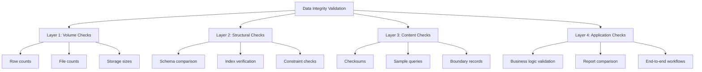

# How to Validate Data Integrity After AWS Migration

Author: [nawazdhandala](https://github.com/nawazdhandala)

Tags: AWS, Migration, Data Integrity, Database, Validation

Description: Techniques and scripts for validating data integrity after migrating databases and file systems to AWS including row counts, checksums, and automated comparison tools.

---

Data is the one thing you absolutely cannot get wrong during a migration. A misconfigured server can be fixed in minutes. Corrupted or missing data can haunt you for months. Here is how to systematically verify that every byte made it to AWS intact.

## The Validation Framework

Data integrity validation works in layers. Each layer catches different types of problems.



## Layer 1: Volume Checks

Start with the simplest possible validation - do we have the same amount of data?

### Database Row Counts

```sql
-- Generate row counts for all tables in a PostgreSQL database
-- Run this on BOTH source and target, then compare
SELECT
    schemaname,
    relname as table_name,
    n_live_tup as row_count
FROM pg_stat_user_tables
ORDER BY schemaname, relname;
```

For a more precise count (pg_stat_user_tables can be slightly off if ANALYZE has not run recently):

```sql
-- Exact row counts for all tables
-- This is slower but perfectly accurate
DO $$
DECLARE
    rec RECORD;
    count_val BIGINT;
BEGIN
    CREATE TEMP TABLE IF NOT EXISTS row_counts (
        table_name TEXT,
        row_count BIGINT
    );

    FOR rec IN
        SELECT tablename
        FROM pg_tables
        WHERE schemaname = 'public'
        ORDER BY tablename
    LOOP
        EXECUTE format('SELECT count(*) FROM %I', rec.tablename) INTO count_val;
        INSERT INTO row_counts VALUES (rec.tablename, count_val);
    END LOOP;
END $$;

SELECT * FROM row_counts ORDER BY table_name;
```

### File System Validation

If you migrated files to S3 or EFS, verify counts and sizes:

```python
import os
import boto3
from collections import defaultdict

def count_local_files(directory):
    """Count files and total size in a local directory."""
    file_count = 0
    total_size = 0

    for root, dirs, files in os.walk(directory):
        for f in files:
            filepath = os.path.join(root, f)
            file_count += 1
            total_size += os.path.getsize(filepath)

    return file_count, total_size

def count_s3_objects(bucket, prefix=""):
    """Count objects and total size in an S3 bucket/prefix."""
    s3 = boto3.client('s3')
    paginator = s3.get_paginator('list_objects_v2')

    object_count = 0
    total_size = 0

    for page in paginator.paginate(Bucket=bucket, Prefix=prefix):
        for obj in page.get('Contents', []):
            object_count += 1
            total_size += obj['Size']

    return object_count, total_size

# Compare source and target
local_count, local_size = count_local_files("/data/uploads")
s3_count, s3_size = count_s3_objects("my-migrated-bucket", "uploads/")

print(f"Source: {local_count} files, {local_size / 1024 / 1024:.2f} MB")
print(f"Target: {s3_count} objects, {s3_size / 1024 / 1024:.2f} MB")
print(f"Match: {'YES' if local_count == s3_count and local_size == s3_size else 'NO'}")
```

## Layer 2: Structural Checks

Verify that the database structure migrated correctly. Missing indexes or constraints can cause subtle bugs that do not show up immediately.

```sql
-- Compare table structures
-- Run on both source and target
SELECT
    c.table_name,
    c.column_name,
    c.data_type,
    c.character_maximum_length,
    c.is_nullable,
    c.column_default
FROM information_schema.columns c
WHERE c.table_schema = 'public'
ORDER BY c.table_name, c.ordinal_position;

-- Compare indexes
SELECT
    tablename,
    indexname,
    indexdef
FROM pg_indexes
WHERE schemaname = 'public'
ORDER BY tablename, indexname;

-- Compare constraints
SELECT
    tc.table_name,
    tc.constraint_name,
    tc.constraint_type,
    kcu.column_name
FROM information_schema.table_constraints tc
JOIN information_schema.key_column_usage kcu
    ON tc.constraint_name = kcu.constraint_name
WHERE tc.table_schema = 'public'
ORDER BY tc.table_name, tc.constraint_name;
```

## Layer 3: Content Checks

Volume and structure are necessary but not sufficient. You need to verify the actual data content.

### Checksum Validation

```sql
-- Generate a checksum for each table by hashing all rows
-- PostgreSQL example
SELECT MD5(STRING_AGG(
    t::text, '|' ORDER BY id
)) as table_checksum
FROM orders t;
```

For large tables, sampling is more practical:

```python
import hashlib
import psycopg2

def sample_checksum(conn_params, table, id_column, sample_size=10000):
    """
    Generate a checksum from a random sample of rows.
    Use the same seed on both source and target for deterministic sampling.
    """
    conn = psycopg2.connect(**conn_params)
    cur = conn.cursor()

    # Get deterministic sample using modulo on ID
    query = f"""
        SELECT MD5(STRING_AGG(row_data, '|' ORDER BY {id_column}))
        FROM (
            SELECT {id_column},
                   MD5(t::text) as row_data
            FROM {table} t
            WHERE MOD({id_column}, (SELECT COUNT(*) / {sample_size} FROM {table})) = 0
            LIMIT {sample_size}
        ) sample
    """

    cur.execute(query)
    result = cur.fetchone()[0]
    cur.close()
    conn.close()
    return result

# Compare source and target
source_params = {"host": "source-db", "dbname": "orderdb", "user": "validator"}
target_params = {"host": "target-rds.abc123.us-east-1.rds.amazonaws.com",
                 "dbname": "orderdb", "user": "validator"}

tables = ["orders", "customers", "products", "order_items"]

for table in tables:
    source_hash = sample_checksum(source_params, table, "id")
    target_hash = sample_checksum(target_params, table, "id")
    status = "MATCH" if source_hash == target_hash else "MISMATCH"
    print(f"{table}: {status} (source={source_hash[:8]}..., target={target_hash[:8]}...)")
```

### Boundary Record Checks

Always verify the first record, last record, and records around known boundaries (year changes, ID ranges, etc.):

```sql
-- Check boundary records exist and match
-- First and last records
(SELECT 'first' as position, * FROM orders ORDER BY id ASC LIMIT 1)
UNION ALL
(SELECT 'last' as position, * FROM orders ORDER BY id DESC LIMIT 1);

-- Records around potential problem boundaries
-- (large IDs, year boundaries, NULL-heavy records)
SELECT * FROM orders WHERE id IN (
    SELECT id FROM orders ORDER BY id ASC LIMIT 5
    UNION
    SELECT id FROM orders ORDER BY id DESC LIMIT 5
    UNION
    SELECT MIN(id) FROM orders WHERE created_at >= '2026-01-01'
);
```

## Layer 4: Application-Level Checks

The ultimate test is whether the application produces the same results.

### Report Comparison

Generate key business reports from both environments and compare:

```python
import pandas as pd

def compare_reports(source_conn, target_conn, query, name):
    """
    Run the same report query against source and target.
    Compare the results.
    """
    source_df = pd.read_sql(query, source_conn)
    target_df = pd.read_sql(query, target_conn)

    if source_df.equals(target_df):
        print(f"MATCH: {name}")
        return True
    else:
        print(f"MISMATCH: {name}")
        # Show differences
        diff = pd.concat([source_df, target_df]).drop_duplicates(keep=False)
        print(f"  Differences found in {len(diff)} rows")
        print(diff.head(10))
        return False

# Compare critical business reports
reports = {
    "Daily Revenue": """
        SELECT DATE(created_at) as date, SUM(total) as revenue, COUNT(*) as order_count
        FROM orders
        WHERE created_at >= '2026-01-01'
        GROUP BY DATE(created_at)
        ORDER BY date
    """,
    "Customer Balances": """
        SELECT customer_id, SUM(amount) as balance
        FROM transactions
        GROUP BY customer_id
        ORDER BY customer_id
    """,
    "Inventory Levels": """
        SELECT product_id, SUM(quantity) as stock
        FROM inventory
        GROUP BY product_id
        ORDER BY product_id
    """
}

all_match = True
for name, query in reports.items():
    if not compare_reports(source_conn, target_conn, query, name):
        all_match = False

print(f"\nOverall: {'ALL REPORTS MATCH' if all_match else 'MISMATCHES FOUND'}")
```

## Automating the Validation Pipeline

For large migrations, automate the entire validation process:

```python
import json
import datetime

class MigrationValidator:
    """Orchestrates all validation checks and produces a report."""

    def __init__(self, source_config, target_config):
        self.source = source_config
        self.target = target_config
        self.results = []

    def add_result(self, category, check_name, passed, details=""):
        self.results.append({
            "category": category,
            "check": check_name,
            "passed": passed,
            "details": details,
            "timestamp": datetime.datetime.now().isoformat()
        })

    def generate_report(self):
        total = len(self.results)
        passed = sum(1 for r in self.results if r["passed"])
        failed = total - passed

        report = {
            "summary": {
                "total_checks": total,
                "passed": passed,
                "failed": failed,
                "pass_rate": f"{(passed/total)*100:.1f}%" if total > 0 else "N/A"
            },
            "failures": [r for r in self.results if not r["passed"]],
            "all_results": self.results
        }

        return json.dumps(report, indent=2)

# Use it
validator = MigrationValidator(source_config, target_config)
# ... run checks, call validator.add_result() for each ...
print(validator.generate_report())
```

## Common Data Issues After Migration

**Character encoding mismatches**: Source database in Latin1, target in UTF-8. Special characters get mangled. Always verify encoding before migration.

**Timestamp precision loss**: Some migration tools truncate microseconds. If your application depends on timestamp ordering, this matters.

**NULL handling differences**: Different databases handle NULLs differently in comparisons and aggregations. Verify NULL counts per column.

**Sequence/auto-increment values**: After migration, sequences may not be set correctly. The next INSERT could fail or create a duplicate.

```sql
-- Fix sequence values after migration
SELECT setval('orders_id_seq', (SELECT MAX(id) FROM orders));
SELECT setval('customers_id_seq', (SELECT MAX(id) FROM customers));
```

## Conclusion

Data validation is not optional and it is not something you eyeball. Build a systematic validation pipeline that checks volume, structure, content, and application behavior. Automate it so you can run it repeatedly during test migrations and again after the final cutover. The time you invest in validation scripts pays for itself the first time they catch a problem that would have gone unnoticed until a customer report.
