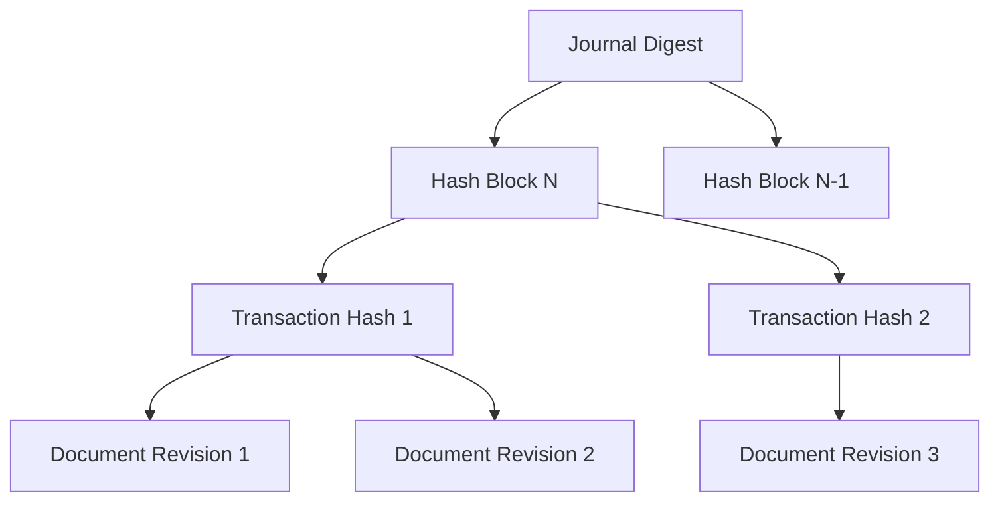

# How to Verify QLDB Document History

Author: [nawazdhandala](https://github.com/nawazdhandala)

Tags: AWS, QLDB, Ledger Database, Verification, Cryptographic, Audit

Description: Learn how to use Amazon QLDB's cryptographic verification features to prove that your ledger data has not been tampered with.

---

Traditional databases let anyone with admin access modify or delete records silently. There is no built-in way to prove that historical data has not been changed. For applications where data integrity is critical - financial transactions, supply chain tracking, regulatory compliance - this is a serious problem.

Amazon QLDB (Quantum Ledger Database) addresses this with a cryptographically verifiable transaction journal. Every change to your data is recorded in an immutable, append-only log. You can verify at any time that no record has been altered or deleted by using QLDB's built-in cryptographic verification.

Note: AWS announced that QLDB will reach end of support on July 31, 2025. If you are starting a new project, consider alternatives. However, for existing QLDB deployments that need to verify their historical data, this guide covers the verification process.

## How QLDB Verification Works

QLDB uses a hash chain (similar to blockchain) to maintain data integrity. Each document revision is hashed, and these hashes are combined into a Merkle tree structure called the journal digest.



To verify a document, you need:
1. The document's revision hash
2. A proof (the set of intermediate hashes connecting the document to the digest)
3. The journal digest

If you can hash your way from the document revision to the digest, you have proven that the document is part of the journal and has not been tampered with.

## Step 1: Set Up a QLDB Ledger

```bash
# Create a QLDB ledger with standard permissions mode
aws qldb create-ledger \
  --name financial-records \
  --permissions-mode STANDARD \
  --deletion-protection \
  --tags Environment=production
```

## Step 2: Insert Some Data

Connect to the ledger and create a table with data.

```python
# Insert records into QLDB using the QLDB driver
from pyqldb.driver.qldb_driver import QldbDriver

def create_table(driver):
    """Create tables for financial records."""
    driver.execute_lambda(lambda executor: executor.execute_statement(
        "CREATE TABLE Transactions"
    ))
    driver.execute_lambda(lambda executor: executor.execute_statement(
        "CREATE INDEX ON Transactions (transactionId)"
    ))

def insert_transaction(driver, transaction_data):
    """Insert a financial transaction record."""
    driver.execute_lambda(lambda executor: executor.execute_statement(
        "INSERT INTO Transactions ?",
        transaction_data
    ))

# Initialize the driver
qldb_driver = QldbDriver(ledger_name='financial-records')

# Create the table
create_table(qldb_driver)

# Insert some transactions
transactions = [
    {
        'transactionId': 'TXN-001',
        'amount': 1500.00,
        'currency': 'USD',
        'from': 'ACC-100',
        'to': 'ACC-200',
        'timestamp': '2026-02-12T10:30:00Z',
        'description': 'Wire transfer'
    },
    {
        'transactionId': 'TXN-002',
        'amount': 750.50,
        'currency': 'USD',
        'from': 'ACC-200',
        'to': 'ACC-300',
        'timestamp': '2026-02-12T11:15:00Z',
        'description': 'Payment processing'
    }
]

for txn in transactions:
    insert_transaction(qldb_driver, txn)
```

## Step 3: Query Document History

QLDB maintains a complete history of every revision of every document.

```python
# Query the full history of a document
def get_document_history(driver, transaction_id):
    """Get all revisions of a specific transaction."""
    results = []
    driver.execute_lambda(lambda executor: results.extend(
        executor.execute_statement(
            """
            SELECT h.metadata.id, h.metadata.version, h.metadata.txTime,
                   h.hash, h.data
            FROM history(Transactions, `2026-01-01T00:00:00Z`, `2026-12-31T23:59:59Z`) AS h
            WHERE h.data.transactionId = ?
            """,
            transaction_id
        )
    ))
    return results

history = get_document_history(qldb_driver, 'TXN-001')

for revision in history:
    print(f"Version {revision['version']}: "
          f"Amount={revision['data']['amount']}, "
          f"Time={revision['txTime']}")
```

## Step 4: Get the Journal Digest

The digest is the cryptographic summary of the entire ledger up to a point in time.

```python
# Get the current digest of the ledger
import boto3

qldb_client = boto3.client('qldb')

def get_digest(ledger_name):
    """Get the current journal digest."""
    response = qldb_client.get_digest(Name=ledger_name)
    return {
        'digest': response['Digest'],
        'digest_tip_address': response['DigestTipAddress']
    }

digest = get_digest('financial-records')
print(f"Digest tip: {digest['digest_tip_address']}")
```

Save this digest securely - it is the anchor point for verification. Many organizations store digests in a separate system (another AWS account, an external database, or even printed on paper) to ensure they cannot be tampered with.

## Step 5: Get a Proof for Verification

A proof is the set of hashes that connects a specific document revision to the digest.

```python
# Get a proof for a specific document revision
def get_revision_and_proof(ledger_name, document_id, block_address, digest_tip_address):
    """Get the revision and its proof relative to a digest."""
    response = qldb_client.get_revision(
        Name=ledger_name,
        BlockAddress=block_address,
        DocumentId=document_id,
        DigestTipAddress=digest_tip_address
    )
    return {
        'revision': response['Revision'],
        'proof': response['Proof']
    }

# You need the document ID and block address from the metadata
def get_document_metadata(driver, transaction_id):
    """Get the metadata needed for verification."""
    results = []
    driver.execute_lambda(lambda executor: results.extend(
        executor.execute_statement(
            """
            SELECT r.metadata.id AS documentId,
                   r.blockAddress AS blockAddress,
                   r.hash AS documentHash
            FROM _ql_committed_Transactions AS r
            WHERE r.data.transactionId = ?
            """,
            transaction_id
        )
    ))
    return results[0] if results else None

metadata = get_document_metadata(qldb_driver, 'TXN-001')
```

## Step 6: Verify the Proof

This is the critical step. You verify that the proof connects the document hash to the digest.

```python
# Verify the cryptographic proof
import hashlib

def verify_proof(proof_hashes, document_hash, digest):
    """
    Verify that a document's hash can be linked to the digest
    through the proof hashes.
    """
    current_hash = document_hash

    for proof_hash in proof_hashes:
        # Combine hashes in the correct order (smaller hash first)
        if current_hash < proof_hash:
            combined = current_hash + proof_hash
        else:
            combined = proof_hash + current_hash

        # Hash the combination
        current_hash = hashlib.sha256(combined).digest()

    # The final hash should match the digest
    return current_hash == digest

# Complete verification workflow
def verify_document(ledger_name, transaction_id):
    """Complete end-to-end verification of a document."""
    # Step 1: Get the digest
    digest_info = get_digest(ledger_name)

    # Step 2: Get document metadata
    metadata = get_document_metadata(qldb_driver, transaction_id)
    if not metadata:
        return False, "Document not found"

    # Step 3: Get the proof
    proof_info = get_revision_and_proof(
        ledger_name,
        metadata['documentId'],
        metadata['blockAddress'],
        digest_info['digest_tip_address']
    )

    # Step 4: Verify
    is_valid = verify_proof(
        proof_info['proof'],
        metadata['documentHash'],
        digest_info['digest']
    )

    return is_valid, "Document verified" if is_valid else "Verification failed"

# Run verification
is_valid, message = verify_document('financial-records', 'TXN-001')
print(f"Verification result: {message}")
```

## Automated Verification

Set up a Lambda function to periodically verify your critical documents.

```python
# Lambda function for automated QLDB verification
import boto3
import json
import os

qldb_client = boto3.client('qldb')
sns_client = boto3.client('sns')

LEDGER_NAME = os.environ['LEDGER_NAME']
SNS_TOPIC = os.environ['SNS_TOPIC_ARN']

def lambda_handler(event, context):
    """
    Periodically verify QLDB documents and alert on failures.
    Triggered by EventBridge on a schedule.
    """
    # Get the current digest
    digest_response = qldb_client.get_digest(Name=LEDGER_NAME)

    # Store the digest for future reference
    store_digest(digest_response)

    # Verify critical documents
    verification_results = []
    critical_docs = get_critical_document_ids()

    for doc in critical_docs:
        try:
            revision = qldb_client.get_revision(
                Name=LEDGER_NAME,
                BlockAddress=doc['block_address'],
                DocumentId=doc['document_id'],
                DigestTipAddress=digest_response['DigestTipAddress']
            )

            # Perform cryptographic verification
            is_valid = perform_verification(
                revision['Revision'],
                revision['Proof'],
                digest_response['Digest']
            )

            verification_results.append({
                'document_id': doc['document_id'],
                'verified': is_valid
            })

        except Exception as e:
            verification_results.append({
                'document_id': doc['document_id'],
                'verified': False,
                'error': str(e)
            })

    # Check for failures and alert
    failures = [r for r in verification_results if not r['verified']]
    if failures:
        sns_client.publish(
            TopicArn=SNS_TOPIC,
            Subject='QLDB Verification Failure Alert',
            Message=json.dumps({
                'ledger': LEDGER_NAME,
                'failures': failures,
                'total_checked': len(verification_results)
            })
        )

    return {
        'total_verified': len(verification_results),
        'failures': len(failures),
        'all_passed': len(failures) == 0
    }
```

## Exporting Verification Data

For audit purposes, you may need to export verification proofs.

```bash
# Export the ledger journal for external verification
aws qldb export-journal-to-s3 \
  --name financial-records \
  --inclusive-start-time 2026-01-01T00:00:00Z \
  --exclusive-end-time 2026-02-01T00:00:00Z \
  --s3-export-configuration '{
    "Bucket": "my-qldb-exports",
    "Prefix": "financial-records/2026-01/",
    "EncryptionConfiguration": {
      "ObjectEncryptionType": "SSE_S3"
    }
  }' \
  --role-arn arn:aws:iam::123456789012:role/QLDBExportRole
```

The exported journal can be independently verified by auditors using the digest and standard cryptographic libraries.

## Best Practices

1. **Store digests externally.** Save periodic digests outside of AWS (print them, store in a separate provider) so you can verify even if the AWS account is compromised.

2. **Automate verification.** Do not rely on manual checks. Run automated verification on a schedule and alert on failures.

3. **Export journal data regularly.** Keep copies of the journal in S3 for disaster recovery and external audits.

4. **Use STANDARD permissions mode.** This gives you fine-grained IAM access control over who can read and write to the ledger.

5. **Enable deletion protection.** Prevent accidental ledger deletion with `--deletion-protection`.

## Summary

QLDB's cryptographic verification gives you mathematical proof that your ledger data has not been tampered with. By regularly computing digests, storing them securely, and verifying documents against those digests, you build an audit trail that can withstand scrutiny from regulators, auditors, and security teams. The key is automating the verification process and storing digests outside the system being verified.

For related topics on data integrity and databases, see our guides on [Timestream for IoT data](https://oneuptime.com/blog/post/2026-02-12-set-up-timestream-for-iot-data/view) and [Keyspaces capacity management](https://oneuptime.com/blog/post/2026-02-12-set-up-keyspaces-on-demand-vs-provisioned-capacity/view).
