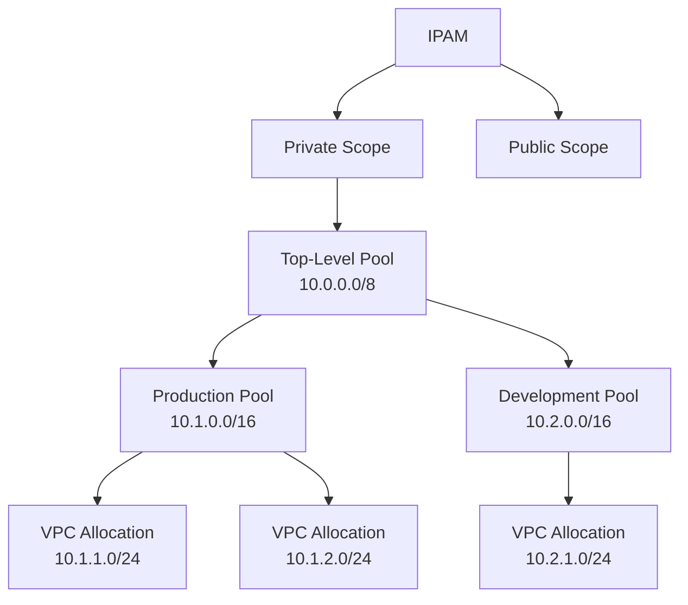

# How to Use VPC IP Address Manager (IPAM)

Author: [nawazdhandala](https://github.com/nawazdhandala)

Tags: AWS, VPC, IPAM, IP Address Management, Networking

Description: Learn how to use Amazon VPC IPAM to plan, track, and manage IP addresses across your AWS organization with automated allocation and compliance monitoring.

---

If you've ever had two teams accidentally use the same CIDR range for their VPCs, you know the pain. VPC peering fails, transit gateway routing gets confused, and someone has to re-IP an entire environment. This happens all the time in organizations that manage IP addresses in spreadsheets or wikis.

VPC IP Address Manager (IPAM) brings structure to this chaos. It's a centralized service for planning, tracking, and auditing IP address usage across your entire AWS organization. You define pools of IP space, delegate allocation to teams, and IPAM enforces that nobody steps on anyone else's addresses.

## Core Concepts

IPAM uses a hierarchical model:

- **IPAM**: The top-level resource. One per organization is typical.
- **Scope**: A container for pools. You get a default public and private scope.
- **Pool**: A range of IP addresses (CIDR block) that can be allocated from. Pools can be nested for delegation.
- **Allocation**: A CIDR block assigned from a pool to a VPC or other resource.



## Creating an IPAM

Start by creating the IPAM and configuring its operating regions.

Create an IPAM:

```bash
# Create the IPAM
aws ec2 create-ipam \
  --description "Organization IPAM" \
  --operating-regions RegionName=us-east-1 RegionName=eu-west-1 RegionName=ap-southeast-1 \
  --tags Key=ManagedBy,Value=NetworkTeam

# Get the IPAM ID and scope IDs
aws ec2 describe-ipams \
  --query 'Ipams[0].{IpamId:IpamId,PrivateScope:PrivateScopeId,PublicScope:PublicScopeId}'
```

Operating regions define where IPAM can discover and monitor resources. Add every region where you run VPCs.

## Creating IP Pools

Set up a hierarchical pool structure. Start with a top-level pool covering your entire private address space, then create child pools for environments or teams.

Create the pool hierarchy:

```bash
# Top-level pool for all private addresses
aws ec2 create-ipam-pool \
  --ipam-scope-id ipam-scope-private-abc123 \
  --description "All Private Addresses" \
  --address-family ipv4 \
  --tags Key=Level,Value=Top

# Provision the top-level CIDR
aws ec2 provision-ipam-pool-cidr \
  --ipam-pool-id ipam-pool-top123 \
  --cidr 10.0.0.0/8

# Create a production pool (child of top-level)
aws ec2 create-ipam-pool \
  --ipam-scope-id ipam-scope-private-abc123 \
  --source-ipam-pool-id ipam-pool-top123 \
  --description "Production VPCs" \
  --address-family ipv4 \
  --allocation-min-netmask-length 24 \
  --allocation-max-netmask-length 16 \
  --allocation-default-netmask-length 20 \
  --auto-import \
  --tags Key=Environment,Value=Production

# Provision CIDR for the production pool
aws ec2 provision-ipam-pool-cidr \
  --ipam-pool-id ipam-pool-prod456 \
  --cidr 10.1.0.0/16

# Create a development pool
aws ec2 create-ipam-pool \
  --ipam-scope-id ipam-scope-private-abc123 \
  --source-ipam-pool-id ipam-pool-top123 \
  --description "Development VPCs" \
  --address-family ipv4 \
  --allocation-min-netmask-length 24 \
  --allocation-max-netmask-length 16 \
  --allocation-default-netmask-length 24 \
  --tags Key=Environment,Value=Development

aws ec2 provision-ipam-pool-cidr \
  --ipam-pool-id ipam-pool-dev789 \
  --cidr 10.2.0.0/16
```

The min/max netmask length settings are guardrails. They prevent teams from accidentally allocating oversized or undersized CIDRs. If a developer tries to create a /8 VPC from the development pool, IPAM rejects it.

## Allocating CIDRs from Pools

When creating VPCs, you allocate CIDRs from IPAM pools instead of specifying CIDRs manually.

Create a VPC with an IPAM-allocated CIDR:

```bash
# Create a VPC using IPAM for CIDR allocation
aws ec2 create-vpc \
  --ipv4-ipam-pool-id ipam-pool-prod456 \
  --ipv4-netmask-length 20 \
  --tag-specifications 'ResourceType=vpc,Tags=[{Key=Name,Value=prod-app-vpc},{Key=Environment,Value=Production}]'

# IPAM automatically assigns a non-overlapping /20 from the production pool
# For example: 10.1.0.0/20
```

If the pool doesn't have enough space for the requested netmask, the creation fails with a clear error. No more silent conflicts.

## Cross-Account IPAM with AWS Organizations

IPAM integrates with AWS Organizations to manage IP addresses across all accounts.

Enable IPAM delegation:

```bash
# From the management account: delegate IPAM to a networking account
aws ec2 enable-ipam-organization-admin-account \
  --delegated-admin-account-id 222222222222

# From the delegated admin: create IPAM with org integration
aws ec2 create-ipam \
  --description "Org-wide IPAM" \
  --operating-regions RegionName=us-east-1 RegionName=eu-west-1
```

Share IPAM pools with specific accounts using RAM:

```bash
# Share a pool with the development team's account
aws ram create-resource-share \
  --name "dev-ipam-pool-share" \
  --resource-arns arn:aws:ec2::123456789012:ipam-pool/ipam-pool-dev789 \
  --principals arn:aws:organizations::123456789012:ou/o-org123/ou-dev456
```

Now the development team can create VPCs using the shared pool, and IPAM ensures they only get addresses from their designated range.

## CloudFormation Integration

CloudFormation templates can reference IPAM pools directly:

```yaml
AWSTemplateFormatVersion: '2010-09-09'
Description: VPC with IPAM-allocated CIDR

Parameters:
  IpamPoolId:
    Type: String
    Description: IPAM Pool ID for CIDR allocation
  NetmaskLength:
    Type: Number
    Default: 20

Resources:
  VPC:
    Type: AWS::EC2::VPC
    Properties:
      Ipv4IpamPoolId: !Ref IpamPoolId
      Ipv4NetmaskLength: !Ref NetmaskLength
      EnableDnsSupport: true
      EnableDnsHostnames: true
      Tags:
        - Key: Name
          Value: ipam-managed-vpc

  SubnetAZ1:
    Type: AWS::EC2::Subnet
    Properties:
      VpcId: !Ref VPC
      CidrBlock: !Select [0, !Cidr [!GetAtt VPC.CidrBlock, 4, 8]]
      AvailabilityZone: !Select [0, !GetAZs ""]

  SubnetAZ2:
    Type: AWS::EC2::Subnet
    Properties:
      VpcId: !Ref VPC
      CidrBlock: !Select [1, !Cidr [!GetAtt VPC.CidrBlock, 4, 8]]
      AvailabilityZone: !Select [1, !GetAZs ""]
```

## Monitoring IP Usage

IPAM provides dashboards and APIs for tracking IP utilization.

Check pool utilization:

```bash
# Get pool allocations
aws ec2 get-ipam-pool-allocations \
  --ipam-pool-id ipam-pool-prod456

# Get discovered resources
aws ec2 get-ipam-discovered-resource-cidrs \
  --ipam-resource-discovery-id ipam-res-disc-abc123 \
  --resource-region us-east-1

# Get pool CIDRs and utilization
aws ec2 get-ipam-pool-cidrs \
  --ipam-pool-id ipam-pool-prod456
```

Set up CloudWatch alarms for pool exhaustion:

```bash
# Alarm when pool utilization exceeds 80%
aws cloudwatch put-metric-alarm \
  --alarm-name "ipam-prod-pool-high-usage" \
  --namespace "AWS/IPAM" \
  --metric-name "PoolUtilization" \
  --dimensions Name=IpamPoolId,Value=ipam-pool-prod456 \
  --statistic Average \
  --period 3600 \
  --threshold 80 \
  --comparison-operator GreaterThanThreshold \
  --evaluation-periods 1 \
  --alarm-actions arn:aws:sns:us-east-1:123456789012:network-alerts
```

## Compliance and Auditing

IPAM tracks all allocations and can identify non-compliant resources - VPCs with CIDRs that aren't managed by IPAM.

Find unmanaged CIDRs:

```bash
# Get discovered resources that aren't managed by IPAM
aws ec2 get-ipam-discovered-resource-cidrs \
  --ipam-resource-discovery-id ipam-res-disc-abc123 \
  --resource-region us-east-1 \
  --filters Name=resource-type,Values=vpc

# Compare with IPAM allocations to find unmanaged VPCs
```

This is invaluable for compliance. You can periodically scan for VPCs that were created outside of IPAM and bring them under management.

## IPv6 Pool Management

IPAM also manages IPv6 address space:

```bash
# Create an IPv6 pool
aws ec2 create-ipam-pool \
  --ipam-scope-id ipam-scope-public-abc123 \
  --description "IPv6 Pool" \
  --address-family ipv6 \
  --publicly-advertisable \
  --aws-service ec2

# Provision Amazon-provided IPv6 CIDR
aws ec2 provision-ipam-pool-cidr \
  --ipam-pool-id ipam-pool-ipv6-abc \
  --netmask-length 52
```

## Best Practices

1. **Plan your hierarchy before creating pools.** Restructuring later means re-IPing VPCs.
2. **Set conservative allocation limits.** You can always relax them, but tightening them after allocation is harder.
3. **Use tags on pools and allocations.** Tags make it easy to identify who owns what.
4. **Monitor utilization proactively.** Running out of addresses in a pool is disruptive - set alarms at 70-80% utilization.
5. **Import existing VPCs.** Use the auto-import feature to bring existing VPCs under IPAM management without re-creating them.

For more on VPC networking, check out our post on [VPC Network Access Analyzer](https://oneuptime.com/blog/post/vpc-network-access-analyzer/view).
