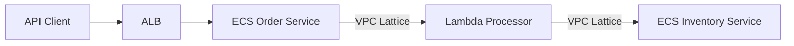

# How to Use VPC Lattice with ECS and Lambda

Author: [nawazdhandala](https://github.com/nawazdhandala)

Tags: AWS, VPC Lattice, ECS, Lambda, Serverless

Description: Step-by-step guide to connecting ECS services and Lambda functions through VPC Lattice for seamless service-to-service communication across compute types.

---

One of the best things about VPC Lattice is that it doesn't care what your services run on. You can have an ECS Fargate service talking to a Lambda function, which in turn calls an EC2-based service - all through the same service network with consistent authentication and traffic management. No more managing separate load balancers and API gateways for each compute type.

Let's walk through setting up VPC Lattice with both ECS and Lambda, including the target group configurations, IAM setup, and some real-world patterns.

## Architecture Overview

Here's what we're building. An ECS service handles incoming API requests and communicates with a Lambda-based processing service through VPC Lattice:



Both the ECS services and the Lambda function are registered as VPC Lattice services, so any of them can call any other through the service network.

## Setting Up ECS as a VPC Lattice Target

For ECS services, you create an IP-type target group. ECS tasks get dynamic IP addresses, so Lattice needs to track those IPs as tasks come and go.

Create an IP target group for ECS:

```bash
# Create the target group
aws vpc-lattice create-target-group \
  --name "order-service-ecs" \
  --type IP \
  --config '{
    "port": 8080,
    "protocol": "HTTP",
    "protocolVersion": "HTTP1",
    "vpcIdentifier": "vpc-ecs001",
    "ipAddressType": "IPV4",
    "healthCheck": {
      "enabled": true,
      "protocol": "HTTP",
      "path": "/health",
      "port": 8080,
      "healthyThresholdCount": 2,
      "unhealthyThresholdCount": 3,
      "matcher": {
        "httpCode": "200"
      }
    }
  }'
```

Now you need to register ECS task IPs as targets. The trick is that ECS tasks have ephemeral IPs - they change every time a task restarts. You handle this by integrating with ECS service discovery or using a Lambda function triggered by ECS task state changes.

Lambda function to auto-register ECS tasks with VPC Lattice:

```python
import boto3
import json

lattice_client = boto3.client('vpc-lattice')
ecs_client = boto3.client('ecs')

TARGET_GROUP_ID = 'tg-ecs-order123'

def handler(event, context):
    """
    Triggered by ECS task state change events.
    Registers running tasks and deregisters stopped tasks.
    """
    detail = event['detail']
    task_arn = detail['taskArn']
    last_status = detail['lastStatus']
    cluster_arn = detail['clusterArn']

    if last_status == 'RUNNING':
        # Get task details to find the IP
        task_response = ecs_client.describe_tasks(
            cluster=cluster_arn,
            tasks=[task_arn]
        )

        for task in task_response['tasks']:
            for attachment in task['attachments']:
                if attachment['type'] == 'ElasticNetworkInterface':
                    for detail_item in attachment['details']:
                        if detail_item['name'] == 'privateIPv4Address':
                            ip = detail_item['value']
                            # Register the task IP
                            lattice_client.register_targets(
                                targetGroupIdentifier=TARGET_GROUP_ID,
                                targets=[{'id': ip, 'port': 8080}]
                            )
                            print(f"Registered target: {ip}:8080")

    elif last_status == 'STOPPED':
        # We need the IP from the stopped event details
        for attachment in detail.get('attachments', []):
            if attachment['type'] == 'ElasticNetworkInterface':
                for detail_item in attachment['details']:
                    if detail_item['name'] == 'privateIPv4Address':
                        ip = detail_item['value']
                        lattice_client.deregister_targets(
                            targetGroupIdentifier=TARGET_GROUP_ID,
                            targets=[{'id': ip, 'port': 8080}]
                        )
                        print(f"Deregistered target: {ip}:8080")

    return {'statusCode': 200}
```

Set up the EventBridge rule to trigger this function:

```bash
# Create EventBridge rule for ECS task state changes
aws events put-rule \
  --name "ecs-task-state-change" \
  --event-pattern '{
    "source": ["aws.ecs"],
    "detail-type": ["ECS Task State Change"],
    "detail": {
      "clusterArn": ["arn:aws:ecs:us-east-1:123456789012:cluster/production"],
      "group": ["service:order-service"]
    }
  }'

# Add Lambda as the target
aws events put-targets \
  --rule "ecs-task-state-change" \
  --targets '[{
    "Id": "lattice-registration",
    "Arn": "arn:aws:lambda:us-east-1:123456789012:function:lattice-ecs-registrar"
  }]'
```

## Setting Up Lambda as a VPC Lattice Target

Lambda integration is much simpler. VPC Lattice natively supports Lambda target groups, so there's no need for the registration dance.

Create a Lambda target group:

```bash
# Create a Lambda target group
aws vpc-lattice create-target-group \
  --name "processor-lambda" \
  --type LAMBDA

# Register the Lambda function as a target
aws vpc-lattice register-targets \
  --target-group-identifier tg-lambda-proc123 \
  --targets id=arn:aws:lambda:us-east-1:123456789012:function:order-processor
```

That's it. VPC Lattice will invoke the Lambda function directly when traffic is routed to this target group. The Lambda function receives the request as a standard event.

Lambda function that receives VPC Lattice requests:

```python
import json

def handler(event, context):
    """
    VPC Lattice sends HTTP request details in the event.
    The event structure is similar to ALB integration.
    """
    # Extract request details
    method = event.get('method', 'GET')
    path = event.get('path', '/')
    headers = event.get('headers', {})
    body = event.get('body', '')
    query_params = event.get('queryStringParameters', {})

    # Your business logic here
    if path == '/process' and method == 'POST':
        order_data = json.loads(body)
        result = process_order(order_data)

        return {
            'statusCode': 200,
            'headers': {'Content-Type': 'application/json'},
            'body': json.dumps({
                'status': 'processed',
                'orderId': result['id']
            })
        }

    return {
        'statusCode': 404,
        'body': json.dumps({'error': 'Not found'})
    }


def process_order(data):
    # Processing logic
    return {'id': data.get('orderId', 'unknown')}
```

## Creating Lattice Services for Both

Now create VPC Lattice services that front both your ECS and Lambda target groups.

Create services and listeners:

```bash
# Create the ECS-backed service
aws vpc-lattice create-service \
  --name "order-service" \
  --auth-type AWS_IAM

aws vpc-lattice create-listener \
  --service-identifier svc-order123 \
  --name "http" \
  --protocol HTTP \
  --port 80 \
  --default-action '{
    "forward": {
      "targetGroups": [
        {"targetGroupIdentifier": "tg-ecs-order123", "weight": 100}
      ]
    }
  }'

# Create the Lambda-backed service
aws vpc-lattice create-service \
  --name "processor-service" \
  --auth-type AWS_IAM

aws vpc-lattice create-listener \
  --service-identifier svc-processor456 \
  --name "http" \
  --protocol HTTP \
  --port 80 \
  --default-action '{
    "forward": {
      "targetGroups": [
        {"targetGroupIdentifier": "tg-lambda-proc123", "weight": 100}
      ]
    }
  }'

# Associate both services with the service network
aws vpc-lattice create-service-network-service-association \
  --service-network-identifier sn-prod123 \
  --service-identifier svc-order123

aws vpc-lattice create-service-network-service-association \
  --service-network-identifier sn-prod123 \
  --service-identifier svc-processor456
```

## Calling Services from ECS

Your ECS tasks need to call VPC Lattice services using SigV4-signed requests. Here's how to do it in your application code.

ECS application calling a Lattice service (Node.js):

```javascript
const { SignatureV4 } = require('@aws-sdk/signature-v4');
const { Sha256 } = require('@aws-crypto/sha256-js');
const { defaultProvider } = require('@aws-sdk/credential-provider-node');
const https = require('https');

async function callProcessorService(orderData) {
  const signer = new SignatureV4({
    credentials: defaultProvider(),
    region: 'us-east-1',
    service: 'vpc-lattice-svcs',
    sha256: Sha256
  });

  const url = new URL('https://processor-service.production.vpc-lattice.us-east-1.on.aws/process');

  const request = {
    method: 'POST',
    hostname: url.hostname,
    path: url.pathname,
    headers: {
      'Content-Type': 'application/json',
      host: url.hostname
    },
    body: JSON.stringify(orderData)
  };

  // Sign the request
  const signedRequest = await signer.sign(request);

  // Make the HTTP call
  return new Promise((resolve, reject) => {
    const req = https.request({
      hostname: signedRequest.hostname,
      path: signedRequest.path,
      method: signedRequest.method,
      headers: signedRequest.headers
    }, (res) => {
      let data = '';
      res.on('data', chunk => data += chunk);
      res.on('end', () => resolve(JSON.parse(data)));
    });

    req.on('error', reject);
    req.write(signedRequest.body);
    req.end();
  });
}
```

## ECS Task Role Configuration

The ECS task role needs permission to invoke VPC Lattice services.

IAM policy for the ECS task role:

```json
{
  "Version": "2012-10-17",
  "Statement": [
    {
      "Effect": "Allow",
      "Action": "vpc-lattice-svcs:Invoke",
      "Resource": [
        "arn:aws:vpc-lattice:us-east-1:123456789012:service/svc-processor456",
        "arn:aws:vpc-lattice:us-east-1:123456789012:service/svc-processor456/*"
      ]
    }
  ]
}
```

## CloudFormation for the Complete Setup

Here's a CloudFormation template bringing it all together:

```yaml
AWSTemplateFormatVersion: '2010-09-09'

Resources:
  LambdaTargetGroup:
    Type: AWS::VpcLattice::TargetGroup
    Properties:
      Name: processor-lambda-tg
      Type: LAMBDA
      Targets:
        - Id: !GetAtt ProcessorFunction.Arn

  ProcessorService:
    Type: AWS::VpcLattice::Service
    Properties:
      Name: processor-service
      AuthType: AWS_IAM

  ProcessorListener:
    Type: AWS::VpcLattice::Listener
    Properties:
      ServiceIdentifier: !Ref ProcessorService
      Protocol: HTTP
      Port: 80
      DefaultAction:
        Forward:
          TargetGroups:
            - TargetGroupIdentifier: !Ref LambdaTargetGroup
              Weight: 100

  LatticeInvokePermission:
    Type: AWS::Lambda::Permission
    Properties:
      FunctionName: !Ref ProcessorFunction
      Action: lambda:InvokeFunction
      Principal: vpc-lattice.amazonaws.com
      SourceArn: !GetAtt LambdaTargetGroup.Arn
```

Don't forget the Lambda permission resource - without it, VPC Lattice can't invoke your function.

## Gradual Migration Pattern

A common use case is migrating from ECS to Lambda (or vice versa). VPC Lattice makes this smooth with weighted routing.

```bash
# Start with 100% ECS, then gradually shift to Lambda
aws vpc-lattice update-rule \
  --service-identifier svc-order123 \
  --listener-identifier listener-abc \
  --rule-identifier rule-default \
  --action '{
    "forward": {
      "targetGroups": [
        {"targetGroupIdentifier": "tg-ecs-order123", "weight": 80},
        {"targetGroupIdentifier": "tg-lambda-order456", "weight": 20}
      ]
    }
  }'
```

Monitor error rates and latency at each weight adjustment before shifting more traffic. For monitoring strategies, see our post on [VPC Lattice service networks](https://oneuptime.com/blog/post/vpc-lattice-service-networks/view).
