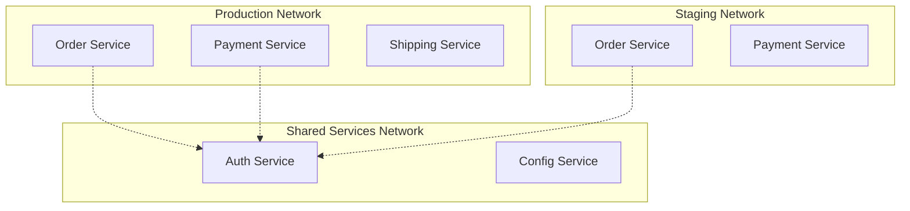

# How to Configure VPC Lattice Service Networks

Author: [nawazdhandala](https://github.com/nawazdhandala)

Tags: AWS, VPC Lattice, Service Networks, Microservices

Description: A detailed walkthrough of configuring VPC Lattice service networks including access controls, cross-account sharing, and multi-VPC connectivity patterns.

---

VPC Lattice service networks are the organizational backbone of the entire VPC Lattice system. They define which services can talk to each other, which VPCs have access, and what authentication is required. Getting the service network design right is critical because it determines your security boundaries, blast radius, and operational model.

In this post, we'll cover creating service networks, configuring access controls, sharing across accounts, and setting up the patterns you'll actually use in production.

## Planning Your Service Network Architecture

Before creating anything, think about how many service networks you need. The main question is: what are your trust boundaries?

Common patterns include:

- **Single service network**: All services in one network. Simple but offers no isolation between service groups.
- **Per-environment**: Separate networks for production, staging, and development. Services in production can't accidentally call staging endpoints.
- **Per-domain**: Separate networks for different business domains (orders, payments, inventory). Adds isolation between teams.
- **Hybrid**: Per-environment networks with cross-network sharing for common services.



## Creating Service Networks

Let's create a production service network with IAM authentication.

Create the service network with proper configuration:

```bash
# Create production service network
aws vpc-lattice create-service-network \
  --name "production" \
  --auth-type AWS_IAM \
  --tags Key=Environment,Value=Production Key=Team,Value=Platform

# Create staging service network
aws vpc-lattice create-service-network \
  --name "staging" \
  --auth-type AWS_IAM \
  --tags Key=Environment,Value=Staging Key=Team,Value=Platform

# Create shared services network
aws vpc-lattice create-service-network \
  --name "shared-services" \
  --auth-type AWS_IAM \
  --tags Key=Environment,Value=Shared Key=Team,Value=Platform
```

## Service Network Auth Policies

Auth policies on the service network act as a coarse-grained access control. They're evaluated before individual service auth policies, so they're your first line of defense.

Set a service network auth policy:

```bash
# Allow only specific accounts to access the production network
aws vpc-lattice put-auth-policy \
  --resource-identifier sn-prod123 \
  --policy '{
    "Version": "2012-10-17",
    "Statement": [
      {
        "Effect": "Allow",
        "Principal": {
          "AWS": [
            "arn:aws:iam::111111111111:root",
            "arn:aws:iam::222222222222:root"
          ]
        },
        "Action": "vpc-lattice-svcs:Invoke",
        "Resource": "*"
      },
      {
        "Effect": "Deny",
        "Principal": "*",
        "Action": "vpc-lattice-svcs:Invoke",
        "Resource": "*",
        "Condition": {
          "StringNotEqualsIfExists": {
            "vpc-lattice-svcs:SourceVpc": [
              "vpc-frontend001",
              "vpc-backend001",
              "vpc-backend002"
            ]
          }
        }
      }
    ]
  }'
```

This policy allows only two specific AWS accounts and restricts access to requests originating from known VPCs. The combination of account-level and VPC-level restrictions creates a strong security boundary.

## VPC Associations

Each VPC that needs to access services must be associated with the service network. The association includes a security group that controls network-level access.

Create a security group and associate VPCs:

```bash
# Create a security group for the Lattice association
aws ec2 create-security-group \
  --group-name "lattice-production-sg" \
  --description "Security group for VPC Lattice production network" \
  --vpc-id vpc-frontend001

# Allow HTTPS outbound to Lattice
aws ec2 authorize-security-group-egress \
  --group-id sg-lattice123 \
  --protocol tcp \
  --port 443 \
  --cidr-block 169.254.171.0/24

# Associate the VPC
aws vpc-lattice create-service-network-vpc-association \
  --service-network-identifier sn-prod123 \
  --vpc-identifier vpc-frontend001 \
  --security-group-ids sg-lattice123
```

The CIDR `169.254.171.0/24` is used by VPC Lattice's data plane. Your security group needs to allow traffic to this range for the association to work.

## Cross-Account Sharing with RAM

In multi-account environments, you'll want to share service networks across accounts using AWS Resource Access Manager (RAM).

Share a service network with another account:

```bash
# Create a RAM resource share
aws ram create-resource-share \
  --name "production-lattice-share" \
  --resource-arns arn:aws:vpc-lattice:us-east-1:111111111111:servicenetwork/sn-prod123 \
  --principals 222222222222 \
  --tags Key=Purpose,Value=CrossAccountLattice

# From the receiving account, accept the share (if auto-accept is not enabled)
aws ram accept-resource-share-invitation \
  --resource-share-invitation-arn arn:aws:ram:us-east-1:222222222222:resource-share-invitation/invitation-abc123
```

Once shared, the receiving account can associate their VPCs with the service network and create services within it.

## CloudFormation for Service Networks

Here's a complete CloudFormation template for setting up service networks with VPC associations.

CloudFormation template:

```yaml
AWSTemplateFormatVersion: '2010-09-09'
Description: VPC Lattice Service Network Configuration

Parameters:
  EnvironmentName:
    Type: String
    AllowedValues: [production, staging, development]
  VpcId:
    Type: AWS::EC2::VPC::Id

Resources:
  ServiceNetwork:
    Type: AWS::VpcLattice::ServiceNetwork
    Properties:
      Name: !Sub "${EnvironmentName}-services"
      AuthType: AWS_IAM
      Tags:
        - Key: Environment
          Value: !Ref EnvironmentName

  LatticeSecurityGroup:
    Type: AWS::EC2::SecurityGroup
    Properties:
      GroupDescription: !Sub "VPC Lattice ${EnvironmentName} SG"
      VpcId: !Ref VpcId
      SecurityGroupEgress:
        - IpProtocol: tcp
          FromPort: 443
          ToPort: 443
          CidrIp: 169.254.171.0/24
          Description: VPC Lattice data plane

  VpcAssociation:
    Type: AWS::VpcLattice::ServiceNetworkVpcAssociation
    Properties:
      ServiceNetworkIdentifier: !Ref ServiceNetwork
      VpcIdentifier: !Ref VpcId
      SecurityGroupIds:
        - !Ref LatticeSecurityGroup

  ServiceNetworkAuthPolicy:
    Type: AWS::VpcLattice::AuthPolicy
    Properties:
      ResourceIdentifier: !Ref ServiceNetwork
      Policy:
        Version: "2012-10-17"
        Statement:
          - Effect: Allow
            Principal:
              AWS: !Sub "arn:aws:iam::${AWS::AccountId}:root"
            Action: "vpc-lattice-svcs:Invoke"
            Resource: "*"

Outputs:
  ServiceNetworkId:
    Value: !Ref ServiceNetwork
    Export:
      Name: !Sub "${EnvironmentName}-service-network-id"
  ServiceNetworkArn:
    Value: !GetAtt ServiceNetwork.Arn
    Export:
      Name: !Sub "${EnvironmentName}-service-network-arn"
```

## Access Logging

Enabling access logs on your service network gives you visibility into every request flowing through it. You can send logs to CloudWatch, S3, or Kinesis Data Firehose.

Enable access logging:

```bash
# Send access logs to CloudWatch
aws vpc-lattice create-access-log-subscription \
  --resource-identifier sn-prod123 \
  --destination-arn arn:aws:logs:us-east-1:123456789012:log-group:/vpc-lattice/production

# Or send to S3 for long-term storage
aws vpc-lattice create-access-log-subscription \
  --resource-identifier sn-prod123 \
  --destination-arn arn:aws:s3:::vpc-lattice-logs-bucket
```

Access logs include the source VPC, source IP, target service, HTTP status code, latency, and the IAM principal that made the request. This is invaluable for debugging auth issues and understanding traffic patterns.

## DNS Configuration

When you associate a VPC with a service network, VPC Lattice automatically configures Route 53 Resolver rules so that service DNS names resolve to the Lattice data plane endpoint. You don't need to manage any DNS records manually.

However, if you want custom domain names for your services, you can configure them.

Set up a custom domain for a service:

```bash
# Create a service with a custom domain
aws vpc-lattice create-service \
  --name "order-service" \
  --auth-type AWS_IAM \
  --custom-domain-name "orders.internal.example.com" \
  --certificate-arn arn:aws:acm:us-east-1:123456789012:certificate/cert-abc123
```

You'll need an ACM certificate for the custom domain and a CNAME record pointing to the Lattice-generated DNS name.

## Monitoring Service Networks

Track the health of your service network with CloudWatch metrics.

Key metrics to monitor:

```bash
# Active connections across the service network
aws cloudwatch get-metric-data \
  --metric-data-queries '[{
    "Id": "activeConnections",
    "MetricStat": {
      "Metric": {
        "Namespace": "AWS/VpcLattice",
        "MetricName": "ActiveConnectionCount",
        "Dimensions": [{
          "Name": "ServiceNetworkId",
          "Value": "sn-prod123"
        }]
      },
      "Period": 300,
      "Stat": "Sum"
    }
  }]' \
  --start-time 2026-02-12T00:00:00Z \
  --end-time 2026-02-12T23:59:59Z
```

Watch for spikes in error rates (4xx and 5xx responses), unusual latency patterns, and auth failures. Auth failures in particular can indicate misconfigured policies or unauthorized access attempts.

## Best Practices

**Start with one service network per environment.** You can always add more later, but splitting too early creates unnecessary complexity.

**Always use IAM auth in production.** The `NONE` auth type is tempting for development but creates a habit of skipping security.

**Log everything.** Access logs are cheap and incredibly useful when something goes wrong. Enable them on every service network from day one.

**Use RAM shares for cross-account access.** Don't try to work around account boundaries with overly permissive auth policies. RAM shares give you explicit, auditable cross-account access.

**Plan your CIDR ranges.** VPCs associated with a service network don't need overlapping CIDRs to communicate through Lattice (since it uses its own data plane), but overlapping CIDRs can cause confusion in route tables.

For information on connecting services running on ECS and Lambda, check out our guide on [VPC Lattice with ECS and Lambda](https://oneuptime.com/blog/post/vpc-lattice-ecs-lambda/view).
