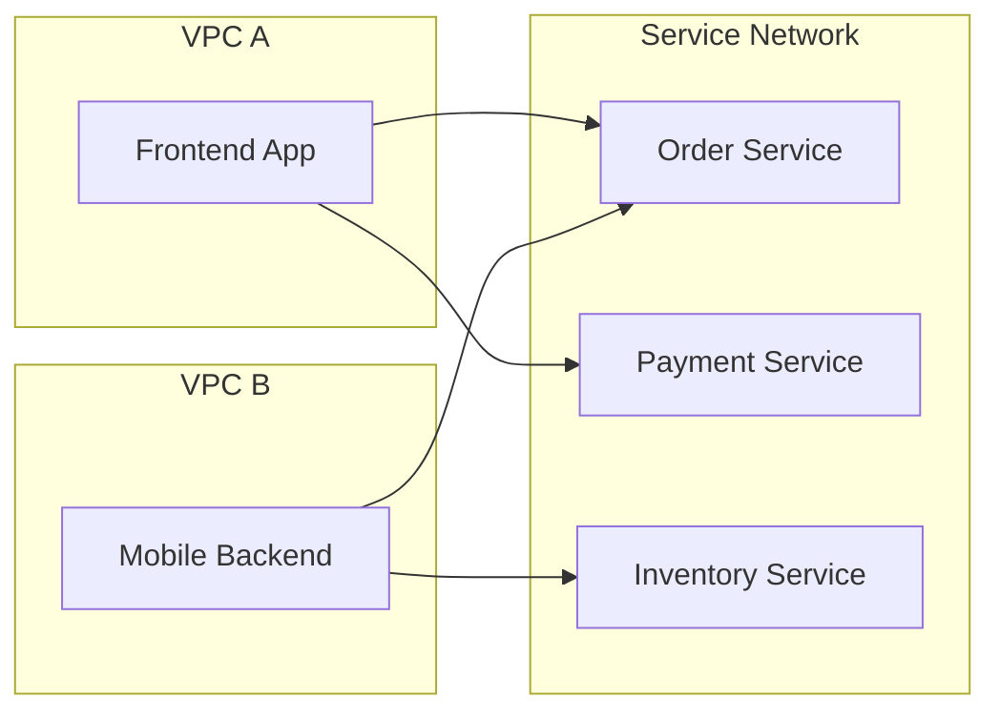

# How to Set Up VPC Lattice for Service-to-Service Networking

Author: [nawazdhandala](https://github.com/nawazdhandala)

Tags: AWS, VPC Lattice, Microservices, Networking, Service Mesh

Description: Learn how to set up Amazon VPC Lattice to simplify service-to-service communication across VPCs and accounts without managing load balancers or complex networking.

---

Connecting services across different VPCs and AWS accounts has traditionally been a pain. You'd set up VPC peering or transit gateways, configure security groups across account boundaries, deploy load balancers, and manage DNS entries. Each new service connection meant repeating this process. VPC Lattice eliminates most of that overhead.

VPC Lattice is an application networking service that handles service-to-service connectivity, traffic management, and access control in a single abstraction. Think of it as a managed service mesh that works at the network layer - you don't need sidecars, proxies, or any changes to your application code.

## Core Concepts

Before diving into the setup, let's clarify the terminology:

- **Service Network**: A logical boundary that groups services together. VPCs associate with a service network to gain access to services within it.
- **Service**: Represents an application or microservice. It has listeners, rules, and target groups - similar to an ALB.
- **Target Group**: The compute resources backing a service (EC2 instances, IP addresses, Lambda functions, or ALB targets).
- **Auth Policy**: IAM-based access control that determines who can invoke a service.



## Creating a Service Network

The service network is your starting point. It defines the boundary within which services can discover and communicate with each other.

Create a service network:

```bash
# Create the service network
aws vpc-lattice create-service-network \
  --name "production-services" \
  --auth-type AWS_IAM \
  --tags Key=Environment,Value=Production

# Note the service network ID and ARN from the output
```

Setting `auth-type` to `AWS_IAM` means all service access is controlled through IAM policies. You can also set it to `NONE` for open access, but that's not recommended for production.

## Associating VPCs

Any VPC that needs to access services in the network must be associated with it.

Associate VPCs with the service network:

```bash
# Associate the first VPC
aws vpc-lattice create-service-network-vpc-association \
  --service-network-identifier sn-0123456789abcdef0 \
  --vpc-identifier vpc-frontend001 \
  --security-group-ids sg-0123456789abcdef0

# Associate a VPC from a different account (requires RAM sharing first)
aws vpc-lattice create-service-network-vpc-association \
  --service-network-identifier sn-0123456789abcdef0 \
  --vpc-identifier vpc-backend002 \
  --security-group-ids sg-abcdef0123456789a
```

The security group you specify controls what traffic can flow from the VPC to the service network. This is the network-level access control - IAM policies add another layer on top.

## Creating a Service

Now let's create an actual service and wire it up to your compute resources.

Create a service and configure its listener:

```bash
# Create the service
aws vpc-lattice create-service \
  --name "order-service" \
  --auth-type AWS_IAM \
  --tags Key=Team,Value=OrderTeam

# Create a target group for the service's backends
aws vpc-lattice create-target-group \
  --name "order-service-targets" \
  --type INSTANCE \
  --config '{
    "port": 8080,
    "protocol": "HTTP",
    "vpcIdentifier": "vpc-backend001",
    "healthCheck": {
      "enabled": true,
      "protocol": "HTTP",
      "path": "/health",
      "port": 8080,
      "healthyThresholdCount": 3,
      "unhealthyThresholdCount": 2,
      "matcher": {
        "httpCode": "200"
      }
    }
  }'

# Register targets
aws vpc-lattice register-targets \
  --target-group-identifier tg-0123456789abcdef0 \
  --targets id=i-0123456789abcdef0 id=i-abcdef0123456789a
```

Next, create a listener that accepts incoming requests and routes them to the target group.

Set up the listener with routing rules:

```bash
# Create a listener
aws vpc-lattice create-listener \
  --service-identifier svc-order123 \
  --name "http-listener" \
  --protocol HTTP \
  --port 80 \
  --default-action '{
    "forward": {
      "targetGroups": [
        {
          "targetGroupIdentifier": "tg-0123456789abcdef0",
          "weight": 100
        }
      ]
    }
  }'
```

## Associating Services with the Network

The service needs to be associated with your service network so that VPCs in the network can reach it.

Associate the service with the service network:

```bash
# Associate service with service network
aws vpc-lattice create-service-network-service-association \
  --service-network-identifier sn-0123456789abcdef0 \
  --service-identifier svc-order123
```

Once associated, VPC Lattice automatically creates a DNS entry for the service. Clients in associated VPCs can reach the service at `order-service.production-services.vpc-lattice.us-east-1.on.aws`.

## Setting Up Auth Policies

Auth policies control which principals can invoke a service. This is where VPC Lattice really shines for security.

Define an auth policy for the service:

```bash
# Set an auth policy that allows specific roles to access the service
aws vpc-lattice put-auth-policy \
  --resource-identifier svc-order123 \
  --policy '{
    "Version": "2012-10-17",
    "Statement": [
      {
        "Effect": "Allow",
        "Principal": {
          "AWS": [
            "arn:aws:iam::123456789012:role/FrontendAppRole",
            "arn:aws:iam::234567890123:role/MobileBackendRole"
          ]
        },
        "Action": "vpc-lattice-svcs:Invoke",
        "Resource": "*",
        "Condition": {
          "StringEquals": {
            "vpc-lattice-svcs:ServiceNetworkArn": "arn:aws:vpc-lattice:us-east-1:123456789012:servicenetwork/sn-0123456789abcdef0"
          }
        }
      }
    ]
  }'
```

This policy only allows the `FrontendAppRole` and `MobileBackendRole` to invoke the order service. Any other principal gets a 403.

## CloudFormation Template

Here's how to set up the whole thing with CloudFormation.

Complete CloudFormation template for VPC Lattice:

```yaml
AWSTemplateFormatVersion: '2010-09-09'
Description: VPC Lattice Service Setup

Parameters:
  ServiceNetworkId:
    Type: String
  VpcId:
    Type: String
  TargetInstanceIds:
    Type: List<AWS::EC2::Instance::Id>

Resources:
  OrderService:
    Type: AWS::VpcLattice::Service
    Properties:
      Name: order-service
      AuthType: AWS_IAM
      Tags:
        - Key: Team
          Value: OrderTeam

  TargetGroup:
    Type: AWS::VpcLattice::TargetGroup
    Properties:
      Name: order-service-targets
      Type: INSTANCE
      Config:
        Port: 8080
        Protocol: HTTP
        VpcIdentifier: !Ref VpcId
        HealthCheck:
          Enabled: true
          Protocol: HTTP
          Path: /health
          Port: 8080
      Targets:
        - Id: !Select [0, !Ref TargetInstanceIds]
        - Id: !Select [1, !Ref TargetInstanceIds]

  Listener:
    Type: AWS::VpcLattice::Listener
    Properties:
      ServiceIdentifier: !Ref OrderService
      Name: http-listener
      Protocol: HTTP
      Port: 80
      DefaultAction:
        Forward:
          TargetGroups:
            - TargetGroupIdentifier: !Ref TargetGroup
              Weight: 100

  ServiceAssociation:
    Type: AWS::VpcLattice::ServiceNetworkServiceAssociation
    Properties:
      ServiceNetworkIdentifier: !Ref ServiceNetworkId
      ServiceIdentifier: !Ref OrderService

Outputs:
  ServiceDnsName:
    Value: !GetAtt OrderService.DnsEntry.DomainName
```

## Making Requests

From your client applications, you call the service using its DNS name. If you've enabled IAM auth, you need to sign your requests with SigV4.

Example Python client using SigV4 signing:

```python
import boto3
from botocore.auth import SigV4Auth
from botocore.awsrequest import AWSRequest
import requests

# Create a signed request
session = boto3.Session()
credentials = session.get_credentials()

service_url = "https://order-service.production-services.vpc-lattice.us-east-1.on.aws/orders"

# Prepare the request
aws_request = AWSRequest(
    method='GET',
    url=service_url,
    headers={'Content-Type': 'application/json'}
)

# Sign it with SigV4
SigV4Auth(credentials, 'vpc-lattice-svcs', 'us-east-1').add_auth(aws_request)

# Send the signed request
response = requests.get(
    service_url,
    headers=dict(aws_request.headers)
)

print(response.json())
```

## Traffic Splitting for Deployments

VPC Lattice supports weighted target groups, which is great for canary deployments.

Configure weighted routing for a canary deployment:

```bash
# Update the listener to split traffic
aws vpc-lattice update-rule \
  --service-identifier svc-order123 \
  --listener-identifier listener-abc123 \
  --rule-identifier rule-default \
  --action '{
    "forward": {
      "targetGroups": [
        {
          "targetGroupIdentifier": "tg-stable",
          "weight": 90
        },
        {
          "targetGroupIdentifier": "tg-canary",
          "weight": 10
        }
      ]
    }
  }'
```

This sends 90% of traffic to your stable version and 10% to the canary. Gradually increase the canary weight as you gain confidence.

VPC Lattice simplifies what used to be a multi-service, multi-configuration task into a clean, policy-driven model. If you're building microservices across VPCs or accounts, it's worth evaluating. For more on service networking patterns, see our post on [VPC Lattice service networks](https://oneuptime.com/blog/post/2026-02-12-vpc-lattice-service-networks/view).
