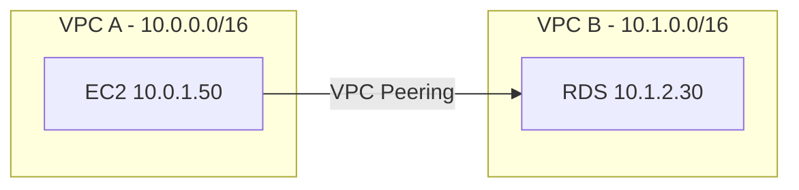

# How to Set Up VPC Peering with Terraform

Author: [nawazdhandala](https://github.com/nawazdhandala)

Tags: AWS, VPC, Terraform, Infrastructure as Code, Networking

Description: Complete Terraform configuration for creating VPC peering connections including cross-account and cross-region setups with route table management.

---

VPC peering lets two VPCs communicate using private IP addresses as if they were on the same network. Setting it up manually through the console is doable for one-off connections, but when you're managing peering across multiple environments, accounts, or regions, Terraform makes it repeatable and version-controlled. Let's build it from scratch.

## What VPC Peering Does

A VPC peering connection creates a networking link between two VPCs. Traffic between peered VPCs stays on the AWS backbone - it never touches the public internet. You can peer VPCs in the same account, across accounts, and even across regions.



Key limitation: VPC CIDRs can't overlap. If both VPCs use `10.0.0.0/16`, peering won't work.

## Basic Same-Account Peering

Here's a complete Terraform configuration that creates two VPCs and peers them:

```hcl
# variables.tf
variable "region" {
  default = "us-east-1"
}

variable "vpc_a_cidr" {
  default = "10.0.0.0/16"
}

variable "vpc_b_cidr" {
  default = "10.1.0.0/16"
}
```

```hcl
# main.tf
provider "aws" {
  region = var.region
}

# VPC A - Application VPC
resource "aws_vpc" "vpc_a" {
  cidr_block           = var.vpc_a_cidr
  enable_dns_support   = true
  enable_dns_hostnames = true

  tags = {
    Name = "app-vpc"
  }
}

resource "aws_subnet" "vpc_a_private" {
  vpc_id            = aws_vpc.vpc_a.id
  cidr_block        = "10.0.1.0/24"
  availability_zone = "${var.region}a"

  tags = {
    Name = "app-vpc-private-1"
  }
}

# VPC B - Database VPC
resource "aws_vpc" "vpc_b" {
  cidr_block           = var.vpc_b_cidr
  enable_dns_support   = true
  enable_dns_hostnames = true

  tags = {
    Name = "db-vpc"
  }
}

resource "aws_subnet" "vpc_b_private" {
  vpc_id            = aws_vpc.vpc_b.id
  cidr_block        = "10.1.1.0/24"
  availability_zone = "${var.region}a"

  tags = {
    Name = "db-vpc-private-1"
  }
}

# VPC Peering Connection
resource "aws_vpc_peering_connection" "app_to_db" {
  vpc_id      = aws_vpc.vpc_a.id  # Requester
  peer_vpc_id = aws_vpc.vpc_b.id  # Accepter
  auto_accept = true               # Only works for same-account, same-region

  tags = {
    Name = "app-to-db-peering"
  }
}

# Enable DNS resolution across the peering connection
resource "aws_vpc_peering_connection_options" "app_to_db" {
  vpc_peering_connection_id = aws_vpc_peering_connection.app_to_db.id

  requester {
    allow_remote_vpc_dns_resolution = true
  }

  accepter {
    allow_remote_vpc_dns_resolution = true
  }
}
```

## Adding Routes

The peering connection exists, but traffic won't flow without routes. Each VPC needs a route pointing to the other VPC's CIDR through the peering connection:

```hcl
# Route table for VPC A
resource "aws_route_table" "vpc_a_private" {
  vpc_id = aws_vpc.vpc_a.id

  tags = {
    Name = "app-vpc-private-rt"
  }
}

# Route from VPC A to VPC B via peering
resource "aws_route" "vpc_a_to_vpc_b" {
  route_table_id            = aws_route_table.vpc_a_private.id
  destination_cidr_block    = var.vpc_b_cidr
  vpc_peering_connection_id = aws_vpc_peering_connection.app_to_db.id
}

resource "aws_route_table_association" "vpc_a_private" {
  subnet_id      = aws_subnet.vpc_a_private.id
  route_table_id = aws_route_table.vpc_a_private.id
}

# Route table for VPC B
resource "aws_route_table" "vpc_b_private" {
  vpc_id = aws_vpc.vpc_b.id

  tags = {
    Name = "db-vpc-private-rt"
  }
}

# Route from VPC B to VPC A via peering
resource "aws_route" "vpc_b_to_vpc_a" {
  route_table_id            = aws_route_table.vpc_b_private.id
  destination_cidr_block    = var.vpc_a_cidr
  vpc_peering_connection_id = aws_vpc_peering_connection.app_to_db.id
}

resource "aws_route_table_association" "vpc_b_private" {
  subnet_id      = aws_subnet.vpc_b_private.id
  route_table_id = aws_route_table.vpc_b_private.id
}
```

## Security Groups for Peered VPCs

Security groups need to allow traffic from the peered VPC. You can reference the peer VPC's CIDR or, even better, reference security groups across the peering connection (same-region only):

```hcl
# Security group in VPC A allowing traffic to VPC B
resource "aws_security_group" "app_server" {
  name_prefix = "app-server-"
  vpc_id      = aws_vpc.vpc_a.id

  # Allow outbound to database VPC
  egress {
    from_port   = 5432
    to_port     = 5432
    protocol    = "tcp"
    cidr_blocks = [var.vpc_b_cidr]
    description = "PostgreSQL to database VPC"
  }

  tags = {
    Name = "app-server-sg"
  }
}

# Security group in VPC B allowing traffic from VPC A
resource "aws_security_group" "database" {
  name_prefix = "database-"
  vpc_id      = aws_vpc.vpc_b.id

  # Allow inbound from app VPC
  ingress {
    from_port   = 5432
    to_port     = 5432
    protocol    = "tcp"
    cidr_blocks = [var.vpc_a_cidr]
    description = "PostgreSQL from app VPC"
  }

  tags = {
    Name = "database-sg"
  }
}
```

## Cross-Account Peering

For cross-account peering, you can't auto-accept. The peering request needs to be accepted by the other account:

```hcl
# Provider for the peer account
provider "aws" {
  alias  = "peer"
  region = var.region
  # Uses a different AWS profile or assume role for the peer account
  assume_role {
    role_arn = "arn:aws:iam::987654321098:role/VPCPeeringRole"
  }
}

# Create the peering connection from account A
resource "aws_vpc_peering_connection" "cross_account" {
  vpc_id        = aws_vpc.vpc_a.id
  peer_vpc_id   = "vpc-in-other-account"
  peer_owner_id = "987654321098"  # Peer account ID
  auto_accept   = false            # Can't auto-accept cross-account

  tags = {
    Name = "cross-account-peering"
  }
}

# Accept the peering connection in account B
resource "aws_vpc_peering_connection_accepter" "cross_account" {
  provider                  = aws.peer
  vpc_peering_connection_id = aws_vpc_peering_connection.cross_account.id
  auto_accept               = true

  tags = {
    Name = "cross-account-peering-accepted"
  }
}

# Enable DNS resolution on the peering
resource "aws_vpc_peering_connection_options" "cross_account_requester" {
  vpc_peering_connection_id = aws_vpc_peering_connection.cross_account.id

  requester {
    allow_remote_vpc_dns_resolution = true
  }

  depends_on = [aws_vpc_peering_connection_accepter.cross_account]
}

resource "aws_vpc_peering_connection_options" "cross_account_accepter" {
  provider                  = aws.peer
  vpc_peering_connection_id = aws_vpc_peering_connection.cross_account.id

  accepter {
    allow_remote_vpc_dns_resolution = true
  }

  depends_on = [aws_vpc_peering_connection_accepter.cross_account]
}
```

The peer account needs an IAM role that allows the requesting account to accept peering connections:

```hcl
# In the peer account - IAM role for peering acceptance
resource "aws_iam_role" "vpc_peering_role" {
  provider = aws.peer
  name     = "VPCPeeringRole"

  assume_role_policy = jsonencode({
    Version = "2012-10-17"
    Statement = [{
      Action = "sts:AssumeRole"
      Effect = "Allow"
      Principal = {
        AWS = "arn:aws:iam::123456789012:root"  # Requester account
      }
    }]
  })
}

resource "aws_iam_role_policy" "vpc_peering_policy" {
  provider = aws.peer
  name     = "VPCPeeringPolicy"
  role     = aws_iam_role.vpc_peering_role.id

  policy = jsonencode({
    Version = "2012-10-17"
    Statement = [{
      Action = [
        "ec2:AcceptVpcPeeringConnection",
        "ec2:DescribeVpcPeeringConnections"
      ]
      Effect   = "Allow"
      Resource = "*"
    }]
  })
}
```

## Cross-Region Peering

Cross-region peering works similarly but requires providers for each region:

```hcl
provider "aws" {
  alias  = "us_east"
  region = "us-east-1"
}

provider "aws" {
  alias  = "eu_west"
  region = "eu-west-1"
}

resource "aws_vpc" "us_east" {
  provider   = aws.us_east
  cidr_block = "10.0.0.0/16"
}

resource "aws_vpc" "eu_west" {
  provider   = aws.eu_west
  cidr_block = "10.1.0.0/16"
}

# Cross-region peering request
resource "aws_vpc_peering_connection" "cross_region" {
  provider    = aws.us_east
  vpc_id      = aws_vpc.us_east.id
  peer_vpc_id = aws_vpc.eu_west.id
  peer_region = "eu-west-1"
  auto_accept = false  # Can't auto-accept cross-region

  tags = {
    Name = "us-east-to-eu-west"
  }
}

# Accept in the peer region
resource "aws_vpc_peering_connection_accepter" "cross_region" {
  provider                  = aws.eu_west
  vpc_peering_connection_id = aws_vpc_peering_connection.cross_region.id
  auto_accept               = true

  tags = {
    Name = "us-east-to-eu-west-accepted"
  }
}
```

Note: DNS resolution across cross-region peering has some limitations. Private hosted zone associations don't automatically work across regions - you'll need to associate the hosted zone with the peer VPC manually.

## Modular Approach for Multiple Peerings

When managing many peering connections, create a reusable module:

```hcl
# modules/vpc-peering/main.tf
variable "requester_vpc_id" {}
variable "accepter_vpc_id" {}
variable "requester_cidr" {}
variable "accepter_cidr" {}
variable "requester_route_table_ids" { type = list(string) }
variable "accepter_route_table_ids" { type = list(string) }
variable "name" {}

resource "aws_vpc_peering_connection" "this" {
  vpc_id      = var.requester_vpc_id
  peer_vpc_id = var.accepter_vpc_id
  auto_accept = true

  tags = {
    Name = var.name
  }
}

resource "aws_route" "requester_to_accepter" {
  count                     = length(var.requester_route_table_ids)
  route_table_id            = var.requester_route_table_ids[count.index]
  destination_cidr_block    = var.accepter_cidr
  vpc_peering_connection_id = aws_vpc_peering_connection.this.id
}

resource "aws_route" "accepter_to_requester" {
  count                     = length(var.accepter_route_table_ids)
  route_table_id            = var.accepter_route_table_ids[count.index]
  destination_cidr_block    = var.requester_cidr
  vpc_peering_connection_id = aws_vpc_peering_connection.this.id
}

output "peering_connection_id" {
  value = aws_vpc_peering_connection.this.id
}
```

Use the module:

```hcl
module "app_to_db_peering" {
  source = "./modules/vpc-peering"

  requester_vpc_id          = module.app_vpc.vpc_id
  accepter_vpc_id           = module.db_vpc.vpc_id
  requester_cidr            = "10.0.0.0/16"
  accepter_cidr             = "10.1.0.0/16"
  requester_route_table_ids = module.app_vpc.private_route_table_ids
  accepter_route_table_ids  = module.db_vpc.private_route_table_ids
  name                      = "app-to-db"
}
```

## Deploying and Verifying

```bash
# Initialize and apply
terraform init
terraform plan -out=plan.tfplan
terraform apply plan.tfplan

# Verify the peering connection status
aws ec2 describe-vpc-peering-connections \
  --query 'VpcPeeringConnections[*].{Id:VpcPeeringConnectionId,Status:Status.Code,Requester:RequesterVpcInfo.CidrBlock,Accepter:AccepterVpcInfo.CidrBlock}'
```

Test connectivity between peered VPCs:

```bash
# From an instance in VPC A, ping an instance in VPC B
ping 10.1.1.50

# Test a specific port
nc -zv 10.1.1.50 5432
```

## Summary

Terraform makes VPC peering manageable at scale. The basic pattern is always the same: create the peering connection, accept it (automatic for same-account same-region), add routes in both VPCs, and configure security groups to allow cross-VPC traffic. For cross-account setups, use provider aliases with assumed roles. For cross-region, use separate providers per region. Wrap it all in a reusable module when you have multiple peering connections to manage. For more on VPC networking, check out our guide on [troubleshooting VPC subnet routing issues](https://oneuptime.com/blog/post/2026-02-12-troubleshoot-vpc-subnet-routing-issues/view).
