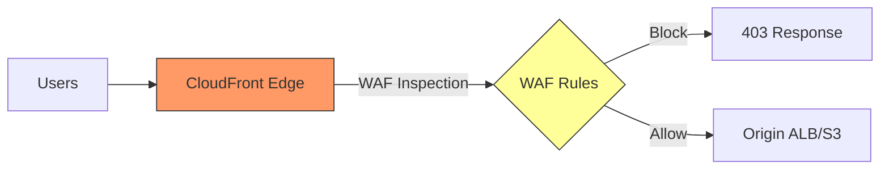

# How to Set Up WAF with CloudFront for Global Protection

Author: [nawazdhandala](https://github.com/nawazdhandala)

Tags: AWS, WAF, CloudFront, CDN, Security

Description: Learn how to deploy AWS WAF with CloudFront to filter malicious traffic at the edge, protecting your web applications globally with minimal latency impact.

---

If you're deploying WAF on an Application Load Balancer, malicious traffic has to travel all the way to your AWS region before it gets blocked. That's not ideal. The request still consumes your network bandwidth, and the latency for blocking means more resources are tied up processing bad traffic.

Deploying WAF on CloudFront flips this around. CloudFront has over 450 edge locations worldwide. When you attach a WAF Web ACL to a CloudFront distribution, every request gets inspected at the nearest edge location. Malicious traffic gets blocked at the edge before it ever reaches your origin. This is faster, more efficient, and cheaper than filtering at the origin.

## Why CloudFront + WAF Is Better Than ALB + WAF

The advantages are significant:

1. **Block at the edge** - Malicious requests are stopped at the nearest CloudFront POP, not at your origin region
2. **Lower latency** - Legitimate traffic passes through faster because it's not competing with attack traffic
3. **DDoS protection** - CloudFront absorbs volumetric attacks at the edge. Combined with AWS Shield Standard (included free), you get decent DDoS mitigation
4. **Global coverage** - Same WAF rules apply at every edge location worldwide
5. **Origin protection** - Your ALB/origin can be completely hidden behind CloudFront, reducing the attack surface

## Setting Up the Architecture



## Step 1: Create the Web ACL for CloudFront

WAF Web ACLs for CloudFront must be created in `us-east-1`, regardless of where your origin is. This is a requirement because CloudFront is a global service.

```bash
# Create the Web ACL in us-east-1 for CloudFront
aws wafv2 create-web-acl \
  --name cloudfront-waf \
  --scope CLOUDFRONT \
  --region us-east-1 \
  --default-action '{"Allow": {}}' \
  --visibility-config '{
    "SampledRequestsEnabled": true,
    "CloudWatchMetricsEnabled": true,
    "MetricName": "CloudFrontWAF"
  }' \
  --rules '[]'
```

## Step 2: Add Protection Rules

Add a comprehensive set of rules. Here's a production-ready configuration with managed rule groups and rate limiting.

```bash
WEB_ACL_ID=$(aws wafv2 list-web-acls --scope CLOUDFRONT --region us-east-1 \
  --query 'WebACLs[?Name==`cloudfront-waf`].Id' --output text)

LOCK_TOKEN=$(aws wafv2 get-web-acl --name cloudfront-waf --scope CLOUDFRONT \
  --id $WEB_ACL_ID --region us-east-1 --query 'LockToken' --output text)

aws wafv2 update-web-acl \
  --name cloudfront-waf \
  --scope CLOUDFRONT \
  --region us-east-1 \
  --id $WEB_ACL_ID \
  --lock-token $LOCK_TOKEN \
  --default-action '{"Allow": {}}' \
  --visibility-config '{
    "SampledRequestsEnabled": true,
    "CloudWatchMetricsEnabled": true,
    "MetricName": "CloudFrontWAF"
  }' \
  --rules '[
    {
      "Name": "IPReputation",
      "Priority": 0,
      "OverrideAction": {"None": {}},
      "Statement": {
        "ManagedRuleGroupStatement": {
          "VendorName": "AWS",
          "Name": "AWSManagedRulesAmazonIpReputationList"
        }
      },
      "VisibilityConfig": {
        "SampledRequestsEnabled": true,
        "CloudWatchMetricsEnabled": true,
        "MetricName": "IPReputation"
      }
    },
    {
      "Name": "CommonRuleSet",
      "Priority": 1,
      "OverrideAction": {"None": {}},
      "Statement": {
        "ManagedRuleGroupStatement": {
          "VendorName": "AWS",
          "Name": "AWSManagedRulesCommonRuleSet"
        }
      },
      "VisibilityConfig": {
        "SampledRequestsEnabled": true,
        "CloudWatchMetricsEnabled": true,
        "MetricName": "CommonRules"
      }
    },
    {
      "Name": "KnownBadInputs",
      "Priority": 2,
      "OverrideAction": {"None": {}},
      "Statement": {
        "ManagedRuleGroupStatement": {
          "VendorName": "AWS",
          "Name": "AWSManagedRulesKnownBadInputsRuleSet"
        }
      },
      "VisibilityConfig": {
        "SampledRequestsEnabled": true,
        "CloudWatchMetricsEnabled": true,
        "MetricName": "KnownBadInputs"
      }
    },
    {
      "Name": "RateLimit",
      "Priority": 3,
      "Action": {"Block": {}},
      "Statement": {
        "RateBasedStatement": {
          "Limit": 2000,
          "AggregateKeyType": "IP"
        }
      },
      "VisibilityConfig": {
        "SampledRequestsEnabled": true,
        "CloudWatchMetricsEnabled": true,
        "MetricName": "RateLimit"
      }
    }
  ]'
```

## Step 3: Create or Update CloudFront Distribution

Associate the Web ACL with your CloudFront distribution.

If you're creating a new distribution:

```bash
aws cloudfront create-distribution \
  --distribution-config '{
    "CallerReference": "unique-ref-123",
    "Comment": "Production distribution with WAF",
    "DefaultCacheBehavior": {
      "TargetOriginId": "myALBOrigin",
      "ViewerProtocolPolicy": "redirect-to-https",
      "CachePolicyId": "658327ea-f89d-4fab-a63d-7e88639e58f6",
      "AllowedMethods": {
        "Quantity": 7,
        "Items": ["GET", "HEAD", "OPTIONS", "PUT", "POST", "PATCH", "DELETE"]
      },
      "Compress": true
    },
    "Origins": {
      "Quantity": 1,
      "Items": [{
        "Id": "myALBOrigin",
        "DomainName": "my-alb-1234567890.us-east-1.elb.amazonaws.com",
        "CustomOriginConfig": {
          "HTTPPort": 80,
          "HTTPSPort": 443,
          "OriginProtocolPolicy": "https-only"
        }
      }]
    },
    "Enabled": true,
    "WebACLId": "arn:aws:wafv2:us-east-1:111111111111:global/webacl/cloudfront-waf/abc123"
  }'
```

If you have an existing distribution, update it.

```bash
# Get the current config
aws cloudfront get-distribution-config --id E1234567890ABC > dist-config.json

# Edit the config to add WebACLId field
# Then update:
aws cloudfront update-distribution \
  --id E1234567890ABC \
  --distribution-config file://dist-config.json \
  --if-match ETAG_FROM_PREVIOUS_COMMAND
```

## Step 4: Lock Down the Origin

With CloudFront handling traffic and WAF inspection, restrict your origin (ALB) so it only accepts traffic from CloudFront. This prevents attackers from bypassing CloudFront and hitting your ALB directly.

Use CloudFront-managed prefix lists in your ALB security group.

```bash
# Get the CloudFront managed prefix list
PREFIX_LIST_ID=$(aws ec2 describe-managed-prefix-lists \
  --filters "Name=prefix-list-name,Values=com.amazonaws.global.cloudfront.origin-facing" \
  --query 'PrefixLists[0].PrefixListId' --output text)

# Allow only CloudFront IPs in the ALB security group
aws ec2 authorize-security-group-ingress \
  --group-id sg-alb-security-group \
  --ip-permissions "[{
    \"IpProtocol\": \"tcp\",
    \"FromPort\": 443,
    \"ToPort\": 443,
    \"PrefixListIds\": [{\"PrefixListId\": \"$PREFIX_LIST_ID\"}]
  }]"
```

You can also add a custom header in CloudFront that your ALB checks for.

```json
{
  "Origins": {
    "Items": [{
      "CustomHeaders": {
        "Quantity": 1,
        "Items": [{
          "HeaderName": "X-Origin-Verify",
          "HeaderValue": "your-secret-value-here"
        }]
      }
    }]
  }
}
```

Then create an ALB listener rule that only allows requests with this header.

## Terraform Configuration

Here's the complete Terraform setup for CloudFront with WAF.

```hcl
# WAF Web ACL - must be in us-east-1 for CloudFront
provider "aws" {
  alias  = "us_east_1"
  region = "us-east-1"
}

resource "aws_wafv2_web_acl" "cloudfront" {
  provider    = aws.us_east_1
  name        = "cloudfront-waf"
  description = "WAF for CloudFront distribution"
  scope       = "CLOUDFRONT"

  default_action {
    allow {}
  }

  rule {
    name     = "IPReputation"
    priority = 0
    override_action { none {} }

    statement {
      managed_rule_group_statement {
        name        = "AWSManagedRulesAmazonIpReputationList"
        vendor_name = "AWS"
      }
    }

    visibility_config {
      sampled_requests_enabled   = true
      cloudwatch_metrics_enabled = true
      metric_name                = "IPReputation"
    }
  }

  rule {
    name     = "CommonRules"
    priority = 1
    override_action { none {} }

    statement {
      managed_rule_group_statement {
        name        = "AWSManagedRulesCommonRuleSet"
        vendor_name = "AWS"
      }
    }

    visibility_config {
      sampled_requests_enabled   = true
      cloudwatch_metrics_enabled = true
      metric_name                = "CommonRules"
    }
  }

  rule {
    name     = "RateLimit"
    priority = 2

    action {
      block {}
    }

    statement {
      rate_based_statement {
        limit              = 2000
        aggregate_key_type = "IP"
      }
    }

    visibility_config {
      sampled_requests_enabled   = true
      cloudwatch_metrics_enabled = true
      metric_name                = "RateLimit"
    }
  }

  visibility_config {
    cloudwatch_metrics_enabled = true
    metric_name                = "CloudFrontWAF"
    sampled_requests_enabled   = true
  }
}

# CloudFront Distribution
resource "aws_cloudfront_distribution" "main" {
  enabled             = true
  web_acl_id          = aws_wafv2_web_acl.cloudfront.arn
  comment             = "Production distribution with WAF"
  default_root_object = "index.html"

  origin {
    domain_name = aws_lb.main.dns_name
    origin_id   = "ALBOrigin"

    custom_origin_config {
      http_port              = 80
      https_port             = 443
      origin_protocol_policy = "https-only"
      origin_ssl_protocols   = ["TLSv1.2"]
    }

    custom_header {
      name  = "X-Origin-Verify"
      value = var.origin_verify_secret
    }
  }

  default_cache_behavior {
    allowed_methods        = ["DELETE", "GET", "HEAD", "OPTIONS", "PATCH", "POST", "PUT"]
    cached_methods         = ["GET", "HEAD"]
    target_origin_id       = "ALBOrigin"
    viewer_protocol_policy = "redirect-to-https"
    compress               = true

    cache_policy_id          = "658327ea-f89d-4fab-a63d-7e88639e58f6"
    origin_request_policy_id = "216adef6-5c7f-47e4-b989-5492eafa07d3"
  }

  restrictions {
    geo_restriction {
      restriction_type = "none"
    }
  }

  viewer_certificate {
    acm_certificate_arn      = aws_acm_certificate.main.arn
    ssl_support_method       = "sni-only"
    minimum_protocol_version = "TLSv1.2_2021"
  }
}
```

## Monitoring and Logging

Enable WAF logging to track blocked requests at the edge. For CloudFront WAF, the logging configuration must be in `us-east-1`.

```bash
aws wafv2 put-logging-configuration \
  --region us-east-1 \
  --logging-configuration '{
    "ResourceArn": "arn:aws:wafv2:us-east-1:111111111111:global/webacl/cloudfront-waf/abc123",
    "LogDestinationConfigs": [
      "arn:aws:firehose:us-east-1:111111111111:deliverystream/aws-waf-logs-cloudfront"
    ]
  }'
```

You can also enable CloudFront standard logging and real-time logging for additional visibility.

```bash
# Check WAF metrics in CloudWatch
aws cloudwatch get-metric-statistics \
  --namespace AWS/WAFV2 \
  --metric-name BlockedRequests \
  --dimensions Name=WebACL,Value=cloudfront-waf Name=Rule,Value=ALL Name=Region,Value=us-east-1 \
  --start-time 2026-02-12T00:00:00Z \
  --end-time 2026-02-12T23:59:59Z \
  --period 3600 \
  --statistics Sum \
  --region us-east-1
```

## Cost Considerations

CloudFront WAF pricing is the same as regional WAF:
- $5.00 per Web ACL per month
- $1.00 per rule or rule group per month
- $0.60 per million requests inspected

The managed rule groups are priced individually. For example, the Common Rule Set is $1.00/month plus $0.60 per million requests. Bot Control is more expensive at $10.00/month plus $1.00 per million requests.

For most applications, the total WAF cost is $20-50/month, which is a tiny fraction of what a successful attack could cost you.

## Combining with Other Protections

For the most comprehensive protection:
- Use [managed rule groups](https://oneuptime.com/blog/post/waf-managed-rule-groups/view) for baseline protection against known threats
- Add [custom rules for common web attacks](https://oneuptime.com/blog/post/aws-waf-rules-common-web-attacks/view) specific to your application
- Configure [rate-limiting rules](https://oneuptime.com/blog/post/waf-rate-limiting-rules-prevent-ddos/view) to stop DDoS and brute-force attacks
- Deploy [WAF on your ALB](https://oneuptime.com/blog/post/waf-application-load-balancer/view) as a second layer if needed

Edge-level WAF with CloudFront gives you the best possible protection with the least latency impact. Get it set up and you'll sleep better at night.
