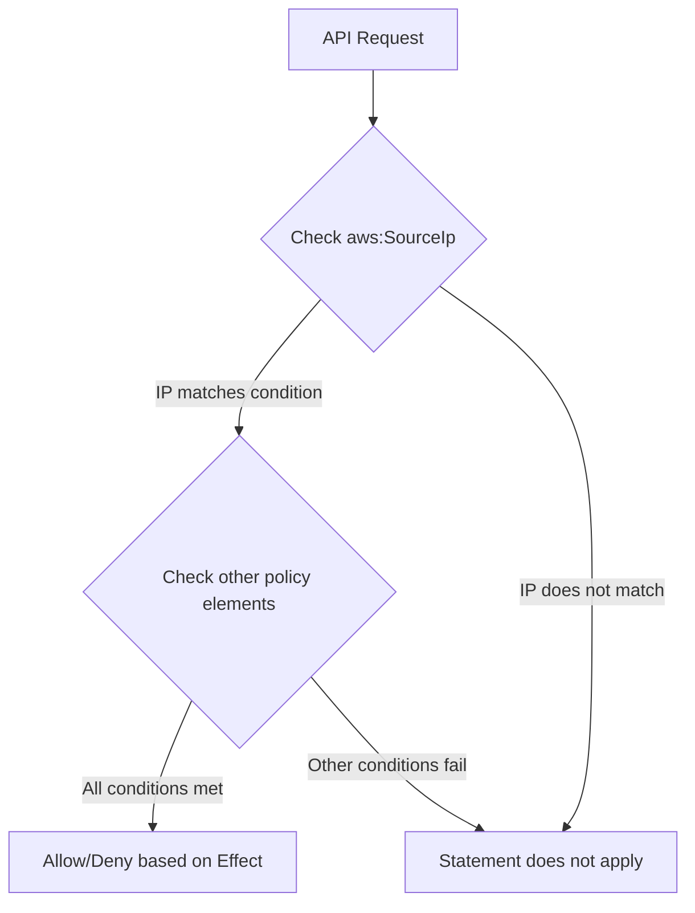

# How to Write IAM Policy Conditions for IP-Based Access

Author: [nawazdhandala](https://github.com/nawazdhandala)

Tags: AWS, IAM, Security, Networking

Description: Learn how to restrict AWS access to specific IP addresses and CIDR ranges using IAM policy conditions, with examples for common use cases.

---

Not every request to your AWS account should be treated equally. A request from your corporate network is very different from one coming from a random IP address. IAM policy conditions let you restrict access based on the source IP, adding a network-level layer of defense on top of your regular permissions.

Let's go through how to write IP-based conditions properly, because the details matter more than you might expect.

## How IP Conditions Work

IAM evaluates policy conditions as part of every authorization decision. When you add an IP condition, AWS checks the source IP of the request against your specified range. If the IP doesn't match, the condition fails and the statement doesn't apply.

The key condition key is `aws:SourceIp`. It contains the IP address of the caller making the API request.



## Basic IP Restriction

Here's a policy that only allows S3 access from a specific IP range:

```json
{
    "Version": "2012-10-17",
    "Statement": [
        {
            "Sid": "AllowS3FromOffice",
            "Effect": "Allow",
            "Action": "s3:*",
            "Resource": [
                "arn:aws:s3:::my-company-data",
                "arn:aws:s3:::my-company-data/*"
            ],
            "Condition": {
                "IpAddress": {
                    "aws:SourceIp": "203.0.113.0/24"
                }
            }
        }
    ]
}
```

The `/24` is CIDR notation covering all IPs from 203.0.113.0 to 203.0.113.255. You can also specify individual IPs by using `/32`:

```json
"Condition": {
    "IpAddress": {
        "aws:SourceIp": "203.0.113.42/32"
    }
}
```

## Multiple IP Ranges

Most organizations have multiple offices, VPN endpoints, or known IP ranges. You can specify multiple values:

```json
{
    "Version": "2012-10-17",
    "Statement": [
        {
            "Sid": "AllowFromKnownLocations",
            "Effect": "Allow",
            "Action": "s3:*",
            "Resource": "*",
            "Condition": {
                "IpAddress": {
                    "aws:SourceIp": [
                        "203.0.113.0/24",
                        "198.51.100.0/24",
                        "192.0.2.0/24",
                        "10.0.0.0/8"
                    ]
                }
            }
        }
    ]
}
```

When you provide multiple values, they're evaluated with OR logic - the condition is true if the source IP matches any of the listed ranges.

## The Deny-Based Approach (Recommended)

Instead of allowing only from certain IPs, it's often better to deny from everywhere else. The difference is subtle but important. An allow-based approach only works if this is the only policy granting access. A deny-based approach works even if other policies grant broad access, because explicit denies always win.

```json
{
    "Version": "2012-10-17",
    "Statement": [
        {
            "Sid": "DenyAccessFromOutsideNetwork",
            "Effect": "Deny",
            "Action": "*",
            "Resource": "*",
            "Condition": {
                "NotIpAddress": {
                    "aws:SourceIp": [
                        "203.0.113.0/24",
                        "198.51.100.0/24"
                    ]
                },
                "Bool": {
                    "aws:ViaAWSService": "false"
                }
            }
        }
    ]
}
```

Let's unpack this. The `NotIpAddress` condition matches when the source IP is NOT in the listed ranges. Combined with `Effect: Deny`, this means "deny everything from IPs not in our known ranges."

The `aws:ViaAWSService` condition is critical and often overlooked. When AWS services make requests on your behalf (like S3 replication or CloudFormation creating resources), the source IP is an AWS internal IP, not your corporate IP. Without this condition, those service-to-service calls would be denied.

## IPv6 Support

If your network uses IPv6, you can include those ranges too:

```json
"Condition": {
    "IpAddress": {
        "aws:SourceIp": [
            "203.0.113.0/24",
            "2001:db8::/32"
        ]
    }
}
```

Mix IPv4 and IPv6 ranges freely in the same condition.

## IP Restrictions with VPC Endpoints

Here's where things get tricky. When requests come through a VPC endpoint, `aws:SourceIp` isn't available - the request doesn't traverse the public internet. Instead, you need to use `aws:SourceVpc` or `aws:SourceVpce`:

```json
{
    "Version": "2012-10-17",
    "Statement": [
        {
            "Sid": "AllowFromVPCOrOffice",
            "Effect": "Deny",
            "Action": "s3:*",
            "Resource": "*",
            "Condition": {
                "NotIpAddress": {
                    "aws:SourceIp": "203.0.113.0/24"
                },
                "StringNotEquals": {
                    "aws:SourceVpce": "vpce-1234567890abcdef0"
                },
                "Bool": {
                    "aws:ViaAWSService": "false"
                }
            }
        }
    ]
}
```

This denies access unless the request comes from either the corporate network IP range or a specific VPC endpoint. All conditions within a statement are ANDed, so all three conditions must be true for the deny to take effect. That means a request from the corporate IP won't be denied (because the IP condition fails), and a request through the VPC endpoint won't be denied (because the VPC endpoint condition fails).

## Applying IP Restrictions at the Organization Level

For account-wide IP restrictions, attach the policy as a Service Control Policy (SCP) in AWS Organizations:

```json
{
    "Version": "2012-10-17",
    "Statement": [
        {
            "Sid": "DenyOutsideCorporateNetwork",
            "Effect": "Deny",
            "Action": "*",
            "Resource": "*",
            "Condition": {
                "NotIpAddress": {
                    "aws:SourceIp": [
                        "203.0.113.0/24",
                        "198.51.100.0/24"
                    ]
                },
                "Bool": {
                    "aws:ViaAWSService": "false"
                },
                "StringNotLike": {
                    "aws:PrincipalArn": [
                        "arn:aws:iam::*:role/OrganizationAccountAccessRole",
                        "arn:aws:iam::*:role/AWSServiceRole*"
                    ]
                }
            }
        }
    ]
}
```

The `StringNotLike` condition excludes service-linked roles and the organization management role, which need to operate without IP restrictions.

For more on SCPs, check out our guide on [using Service Control Policies in AWS Organizations](https://oneuptime.com/blog/post/2026-02-12-use-service-control-policies-scps-in-aws-organizations/view).

## Testing IP Conditions

Use the IAM Policy Simulator with context keys to test your IP conditions:

```bash
# Test that access is allowed from the corporate network
aws iam simulate-custom-policy \
  --policy-input-list file://ip-policy.json \
  --action-names s3:GetObject \
  --resource-arns arn:aws:s3:::my-bucket/file.txt \
  --context-entries \
    "ContextKeyName=aws:SourceIp,ContextKeyType=ip,ContextKeyValues=203.0.113.50"

# Test that access is denied from an unknown IP
aws iam simulate-custom-policy \
  --policy-input-list file://ip-policy.json \
  --action-names s3:GetObject \
  --resource-arns arn:aws:s3:::my-bucket/file.txt \
  --context-entries \
    "ContextKeyName=aws:SourceIp,ContextKeyType=ip,ContextKeyValues=198.51.100.50"
```

## Common Mistakes

**Forgetting `aws:ViaAWSService`.** Without it, service-to-service calls fail. Your Lambda functions, CloudFormation stacks, and S3 replication will break.

**Using Allow instead of Deny.** If any other policy grants broader access, an allow-based IP restriction is bypassed. Deny-based restrictions are much more robust.

**Not accounting for VPN and remote workers.** If your team uses a VPN, make sure the VPN's exit IP is in your allowed list. If people work from home without a VPN, IP-based restrictions might lock them out.

**Overlooking IPv6.** Some AWS SDKs and tools prefer IPv6 when available. If your condition only lists IPv4 ranges, IPv6 requests get denied.

## Wrapping Up

IP-based conditions add a strong layer of defense to your IAM policies. The deny-based approach is more resilient than allow-based, and you should always include the `aws:ViaAWSService` exception. Test thoroughly with the Policy Simulator before deploying, and remember to account for VPC endpoints, IPv6, and service-to-service calls. Combined with MFA requirements and proper role design, IP restrictions significantly reduce your attack surface.
