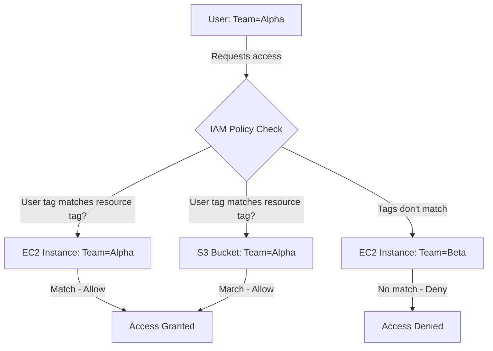

# How to Write IAM Policy Conditions for Tag-Based Access Control

Author: [nawazdhandala](https://github.com/nawazdhandala)

Tags: AWS, IAM, Security, ABAC

Description: Learn how to implement tag-based access control (ABAC) in AWS using IAM policy conditions, enabling scalable and dynamic permission management across teams and environments.

---

As your AWS environment grows, managing permissions for every individual resource becomes impractical. Tag-based access control, also known as Attribute-Based Access Control (ABAC), solves this by granting permissions based on resource tags rather than specific ARNs. Instead of listing every bucket or instance a team can access, you tag resources with the team name and write one policy that works for all of them.

This approach scales beautifully. When you create a new resource, just tag it correctly and the existing policies automatically apply.

## How Tag-Based Access Control Works

Traditional policies reference specific resource ARNs:

```
"Resource": "arn:aws:s3:::team-alpha-data"
```

Tag-based policies use conditions instead:

```
"Condition": {
    "StringEquals": {
        "s3:ResourceTag/Team": "alpha"
    }
}
```

The second approach works for any resource tagged with `Team: alpha`, whether it exists now or gets created next week.



## Setting Up Tags

First, establish a tagging strategy. You need consistent tag keys across your organization. Common ones include:

- `Team` - Which team owns the resource
- `Environment` - production, staging, development
- `Project` - Which project the resource belongs to
- `CostCenter` - For billing attribution

Tag your IAM users too:

```bash
# Tag IAM users with their team membership
aws iam tag-user \
  --user-name alice \
  --tags Key=Team,Value=alpha Key=Department,Value=engineering

aws iam tag-user \
  --user-name bob \
  --tags Key=Team,Value=beta Key=Department,Value=engineering
```

Tag your resources:

```bash
# Tag EC2 instances with team ownership
aws ec2 create-tags \
  --resources i-1234567890abcdef0 \
  --tags Key=Team,Value=alpha Key=Environment,Value=production
```

## Basic Tag-Based Policy

Here's a policy that lets users manage EC2 instances belonging to their team:

```json
{
    "Version": "2012-10-17",
    "Statement": [
        {
            "Sid": "AllowDescribeAll",
            "Effect": "Allow",
            "Action": [
                "ec2:Describe*"
            ],
            "Resource": "*"
        },
        {
            "Sid": "AllowManageTeamInstances",
            "Effect": "Allow",
            "Action": [
                "ec2:StartInstances",
                "ec2:StopInstances",
                "ec2:RebootInstances"
            ],
            "Resource": "arn:aws:ec2:*:*:instance/*",
            "Condition": {
                "StringEquals": {
                    "ec2:ResourceTag/Team": "${aws:PrincipalTag/Team}"
                }
            }
        }
    ]
}
```

The magic is `${aws:PrincipalTag/Team}`. This policy variable resolves to the Team tag on the IAM user making the request. If alice (Team=alpha) tries to stop an instance tagged Team=alpha, it works. If she tries to stop a Team=beta instance, it's denied.

One policy serves all teams. No need to write separate policies for each team.

## Controlling Resource Creation

Allowing users to manage tagged resources is only half the story. You also need to ensure they tag new resources correctly and can't change tags to gain access to other teams' resources:

```json
{
    "Version": "2012-10-17",
    "Statement": [
        {
            "Sid": "AllowRunInstancesWithCorrectTags",
            "Effect": "Allow",
            "Action": "ec2:RunInstances",
            "Resource": "arn:aws:ec2:*:*:instance/*",
            "Condition": {
                "StringEquals": {
                    "aws:RequestTag/Team": "${aws:PrincipalTag/Team}"
                },
                "ForAllValues:StringEquals": {
                    "aws:TagKeys": ["Team", "Environment", "Name"]
                }
            }
        },
        {
            "Sid": "AllowRunInstancesResources",
            "Effect": "Allow",
            "Action": "ec2:RunInstances",
            "Resource": [
                "arn:aws:ec2:*:*:subnet/*",
                "arn:aws:ec2:*:*:security-group/*",
                "arn:aws:ec2:*:*:network-interface/*",
                "arn:aws:ec2:*:*:volume/*",
                "arn:aws:ec2:*::image/*"
            ]
        },
        {
            "Sid": "AllowCreateTagsOnCreation",
            "Effect": "Allow",
            "Action": "ec2:CreateTags",
            "Resource": "*",
            "Condition": {
                "StringEquals": {
                    "ec2:CreateAction": "RunInstances"
                }
            }
        }
    ]
}
```

The `aws:RequestTag/Team` condition ensures the Team tag in the request matches the user's Team tag. The `ForAllValues:StringEquals` on `aws:TagKeys` restricts which tags can be set, preventing users from adding unexpected tags.

## Preventing Tag Manipulation

A critical part of ABAC is preventing users from changing tags to escalate their access:

```json
{
    "Version": "2012-10-17",
    "Statement": [
        {
            "Sid": "DenyTagModification",
            "Effect": "Deny",
            "Action": [
                "ec2:CreateTags",
                "ec2:DeleteTags"
            ],
            "Resource": "*",
            "Condition": {
                "ForAnyValue:StringEquals": {
                    "aws:TagKeys": ["Team"]
                }
            }
        }
    ]
}
```

This prevents anyone from adding or removing the Team tag on any resource. Without this, a user could change a resource's Team tag to match their own and gain access to it.

You might want to allow tag modification for some tags while protecting others:

```json
{
    "Sid": "AllowModifyNonSecurityTags",
    "Effect": "Allow",
    "Action": [
        "ec2:CreateTags",
        "ec2:DeleteTags"
    ],
    "Resource": "*",
    "Condition": {
        "StringEquals": {
            "ec2:ResourceTag/Team": "${aws:PrincipalTag/Team}"
        },
        "ForAllValues:StringNotEquals": {
            "aws:TagKeys": ["Team", "Environment"]
        }
    }
}
```

This lets users modify tags on their own team's resources, but they can't touch the Team or Environment tags.

## Multi-Dimensional ABAC

You can combine multiple tag dimensions. Here's a policy where users need both the right team AND the right environment:

```json
{
    "Version": "2012-10-17",
    "Statement": [
        {
            "Sid": "AllowManageMatchingResources",
            "Effect": "Allow",
            "Action": [
                "ec2:StartInstances",
                "ec2:StopInstances"
            ],
            "Resource": "*",
            "Condition": {
                "StringEquals": {
                    "ec2:ResourceTag/Team": "${aws:PrincipalTag/Team}",
                    "ec2:ResourceTag/Environment": "${aws:PrincipalTag/Environment}"
                }
            }
        }
    ]
}
```

A developer tagged with `Team=alpha, Environment=development` can only manage instances that have both tags matching. They can't touch production instances even if they belong to their team.

## S3 Tag-Based Access

S3 has its own condition keys for tags:

```json
{
    "Version": "2012-10-17",
    "Statement": [
        {
            "Sid": "AllowAccessToTeamObjects",
            "Effect": "Allow",
            "Action": [
                "s3:GetObject",
                "s3:PutObject"
            ],
            "Resource": "arn:aws:s3:::shared-data/*",
            "Condition": {
                "StringEquals": {
                    "s3:ExistingObjectTag/Team": "${aws:PrincipalTag/Team}"
                }
            }
        }
    ]
}
```

Note that S3 object tagging uses `s3:ExistingObjectTag/` for reading existing objects and `s3:RequestObjectTag/` for tagging new objects.

## Terraform Implementation

Here's how to set up ABAC with Terraform:

```hcl
# Create the ABAC policy
resource "aws_iam_policy" "abac_ec2" {
  name = "ABAC-EC2-TeamAccess"

  policy = jsonencode({
    Version = "2012-10-17"
    Statement = [
      {
        Sid      = "AllowDescribeAll"
        Effect   = "Allow"
        Action   = ["ec2:Describe*"]
        Resource = "*"
      },
      {
        Sid    = "AllowManageTeamInstances"
        Effect = "Allow"
        Action = [
          "ec2:StartInstances",
          "ec2:StopInstances",
          "ec2:RebootInstances"
        ]
        Resource = "arn:aws:ec2:*:*:instance/*"
        Condition = {
          StringEquals = {
            "ec2:ResourceTag/Team" = "$${aws:PrincipalTag/Team}"
          }
        }
      }
    ]
  })
}

# Tag IAM users with their team
resource "aws_iam_user" "alice" {
  name = "alice"
  tags = {
    Team        = "alpha"
    Environment = "development"
  }
}
```

Note the `$$` in Terraform - that's how you escape the `$` in HCL to produce a literal `${...}` in the JSON output.

## Wrapping Up

Tag-based access control is one of the most scalable permission models in AWS. Write your policies once using tag conditions, tag your users and resources consistently, and permissions flow automatically. The key things to get right are: protect the tags that control access from modification, require proper tags at resource creation time, and use principal tags to match against resource tags. For a deeper look at policy variables used in ABAC, check our guide on [using IAM policy variables for dynamic permissions](https://oneuptime.com/blog/post/use-iam-policy-variables-for-dynamic-permissions/view).
