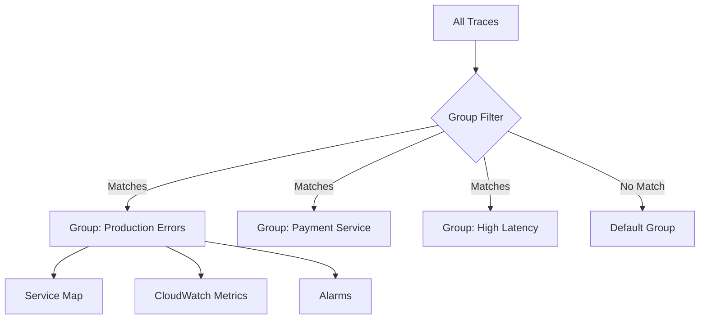

# How to Set Up X-Ray Groups for Filtering Traces

Author: [nawazdhandala](https://github.com/nawazdhandala)

Tags: AWS, X-Ray, Trace Filtering, Groups, Observability

Description: Learn how to create and use X-Ray groups to filter traces by service, annotation, error type, or latency for focused observability in complex applications.

---

When you have a large application with dozens of services all sending traces to X-Ray, looking at the unfiltered service map or trace list is like drinking from a fire hose. X-Ray groups let you slice your trace data into meaningful subsets so you can focus on what matters - whether that's a specific team's services, a particular environment, or just the error traces.

Groups work by defining a filter expression that selects specific traces. Once you create a group, you can use it to scope the service map, generate CloudWatch metrics, and trigger alarms. They're one of those features that seem simple but make X-Ray dramatically more useful in practice.

## What Are X-Ray Groups?

An X-Ray group is a named filter expression. When you select a group in the X-Ray console, the service map and trace list only show data matching that group's filter. Behind the scenes, X-Ray also publishes per-group metrics to CloudWatch, which means you can alarm on specific subsets of your trace data.

Here's the flow:



A single trace can match multiple groups simultaneously. Groups don't partition your data - they create overlapping views.

## Creating Your First Group

### Via the Console

1. Open the X-Ray section in the AWS Console
2. Click "Groups" in the left nav
3. Click "Create group"
4. Enter a name and filter expression
5. Optionally enable CloudWatch Insights

### Via the CLI

```bash
# Create a group for production services
aws xray create-group \
  --group-name "production" \
  --filter-expression 'annotation.environment = "production"'
```

```bash
# Create a group for error traces
aws xray create-group \
  --group-name "errors-only" \
  --filter-expression 'fault = true OR error = true'
```

```bash
# Create a group for a specific service
aws xray create-group \
  --group-name "order-service" \
  --filter-expression 'service("order-service")'
```

## Filter Expression Syntax

X-Ray filter expressions support a rich query language. Here's a reference of the most useful patterns.

### Service Filters

```bash
# Traces that pass through a specific service
service("order-service")

# Traces through any of multiple services
service("order-service") OR service("payment-service")

# Traces where a specific service had faults
service("order-service") { fault = true }
```

### Response Time Filters

```bash
# Traces slower than 3 seconds
responsetime > 3

# Traces between 1 and 5 seconds
responsetime > 1 AND responsetime < 5

# Traces where a specific service was slow
service("payment-service") { responsetime > 2 }
```

### Error and Fault Filters

```bash
# Traces with any fault (5xx)
fault = true

# Traces with client errors (4xx)
error = true

# Traces with throttling
throttle = true

# Traces with errors in a specific service
service("api-gateway") { error = true }
```

### HTTP Filters

```bash
# Traces for a specific URL pattern
http.url CONTAINS "/api/orders"

# Traces for POST requests
http.method = "POST"

# Traces with specific status codes
http.status = 500
```

### Annotation Filters

```bash
# Filter by custom annotations (requires your app to set these)
annotation.customerId = "cust-12345"
annotation.environment = "staging"
annotation.orderType = "premium"

# Numeric annotation comparison
annotation.orderTotal > 100
```

### Combining Filters

```bash
# Complex filters with AND, OR, and parentheses
(service("payment-service") AND fault = true) OR responsetime > 10

# Production errors on a specific endpoint
annotation.environment = "production" AND http.url CONTAINS "/api/checkout" AND fault = true
```

## Practical Group Definitions

Here are groups that work well in most production environments:

### By Environment

```bash
# Production group
aws xray create-group \
  --group-name "production" \
  --filter-expression 'annotation.environment = "production"'

# Staging group
aws xray create-group \
  --group-name "staging" \
  --filter-expression 'annotation.environment = "staging"'
```

For these to work, your application needs to set the environment annotation:

```javascript
// Set environment annotation in your application
const AWSXRay = require('aws-xray-sdk');

AWSXRay.middleware.setSamplingRules({});
const ns = AWSXRay.getNamespace();

// In your request handler
app.use((req, res, next) => {
  const segment = AWSXRay.getSegment();
  // Add environment annotation to every trace
  segment.addAnnotation('environment', process.env.NODE_ENV || 'development');
  segment.addAnnotation('version', process.env.APP_VERSION || 'unknown');
  next();
});
```

### By Team

```bash
# Platform team services
aws xray create-group \
  --group-name "platform-team" \
  --filter-expression 'service("auth-service") OR service("api-gateway") OR service("user-service")'

# Commerce team services
aws xray create-group \
  --group-name "commerce-team" \
  --filter-expression 'service("order-service") OR service("payment-service") OR service("inventory-service")'
```

### By Error Type

```bash
# All 5xx errors
aws xray create-group \
  --group-name "server-errors" \
  --filter-expression 'fault = true'

# Timeout traces (slow responses that likely timed out)
aws xray create-group \
  --group-name "timeouts" \
  --filter-expression 'responsetime > 30 OR fault = true'

# Throttled requests
aws xray create-group \
  --group-name "throttled" \
  --filter-expression 'throttle = true'
```

### By Latency Tier

```bash
# Fast traces (under 100ms)
aws xray create-group \
  --group-name "fast-traces" \
  --filter-expression 'responsetime < 0.1'

# Slow traces (over 5 seconds)
aws xray create-group \
  --group-name "slow-traces" \
  --filter-expression 'responsetime > 5'
```

## CloudWatch Metrics from Groups

Each X-Ray group automatically publishes metrics to CloudWatch. These metrics include:

- `ApproximateTraceCount` - number of traces matching the group
- `TraceLimitExceeded` - whether trace limits were hit

You can create alarms on these:

```bash
# Alarm when error traces exceed a threshold
aws cloudwatch put-metric-alarm \
  --alarm-name "XRay-HighErrorTraces" \
  --namespace "AWS/XRay" \
  --metric-name "ApproximateTraceCount" \
  --dimensions Name=GroupName,Value=server-errors \
  --statistic Sum \
  --period 300 \
  --threshold 100 \
  --comparison-operator GreaterThanThreshold \
  --evaluation-periods 2 \
  --alarm-actions arn:aws:sns:us-east-1:123456789012:alerts
```

This alarm fires when more than 100 error traces are recorded in a 5-minute window. It's a great way to detect error spikes without watching dashboards.

## Managing Groups

List all groups:

```bash
# List all X-Ray groups
aws xray get-groups
```

Update a group's filter:

```bash
# Update the filter expression for an existing group
aws xray update-group \
  --group-name "production" \
  --filter-expression 'annotation.environment = "production" AND annotation.version = "v2"'
```

Delete a group:

```bash
# Delete an X-Ray group
aws xray delete-group \
  --group-name "staging"
```

## CloudFormation Template

```yaml
# CloudFormation for X-Ray groups
AWSTemplateFormatVersion: '2010-09-09'

Resources:
  ProductionGroup:
    Type: AWS::XRay::Group
    Properties:
      GroupName: production
      FilterExpression: 'annotation.environment = "production"'
      InsightsConfiguration:
        InsightsEnabled: true

  ErrorGroup:
    Type: AWS::XRay::Group
    Properties:
      GroupName: server-errors
      FilterExpression: 'fault = true'
      InsightsConfiguration:
        InsightsEnabled: true

  SlowTraceGroup:
    Type: AWS::XRay::Group
    Properties:
      GroupName: slow-traces
      FilterExpression: 'responsetime > 5'
      InsightsConfiguration:
        InsightsEnabled: true

  ErrorAlarm:
    Type: AWS::CloudWatch::Alarm
    Properties:
      AlarmName: HighErrorTraceCount
      Namespace: AWS/XRay
      MetricName: ApproximateTraceCount
      Dimensions:
        - Name: GroupName
          Value: !Ref ErrorGroup
      Statistic: Sum
      Period: 300
      EvaluationPeriods: 2
      Threshold: 50
      ComparisonOperator: GreaterThanThreshold
      AlarmActions:
        - !ImportValue AlertsTopicArn
```

## Insights with Groups

X-Ray Insights is an anomaly detection feature that works with groups. When you enable Insights on a group, X-Ray monitors the group's traces for anomalies in latency, error rate, and throughput. When it detects an unusual pattern, it creates an insight notification.

Enable Insights when creating a group:

```bash
# Create a group with Insights enabled
aws xray create-group \
  --group-name "production-errors" \
  --filter-expression 'annotation.environment = "production" AND fault = true' \
  --insights-configuration InsightsEnabled=true,NotificationsEnabled=true
```

Insights notifications go to EventBridge, where you can route them to SNS, Lambda, or any other target.

## Limits and Considerations

- You can create up to 25 groups per account per region
- The "Default" group always exists and cannot be deleted
- Filter expressions have a maximum length of 2000 characters
- Groups don't affect sampling - they only filter what you see
- Group metrics have a 5-minute resolution

## Best Practices

**Start with a few essential groups.** Production, staging, and errors are a good starting set. Add more as specific needs arise.

**Use annotations, not just service names.** Service-based groups break when services are renamed. Annotation-based groups (like `environment = "production"`) are more resilient to architecture changes.

**Set up alarms on error groups.** The CloudWatch metrics from X-Ray groups are an underused feature. A spike in error trace count is often an earlier signal than an increase in CloudWatch error metrics.

**Combine groups with the service map.** The service map filtered by a group shows you only the relevant services. This is essential when you have a large microservices architecture.

**Review groups when your architecture changes.** New services need to be added to team-based groups. Deprecated services should be removed to keep the groups clean.

For related configuration, check out [X-Ray sampling rules](https://oneuptime.com/blog/post/xray-sampling-rules/view) and [analyzing traces for performance bottlenecks](https://oneuptime.com/blog/post/xray-traces-performance-bottlenecks/view).

## Wrapping Up

X-Ray groups transform a wall of trace data into focused, actionable views. They're quick to set up, work across the service map and trace list, and generate CloudWatch metrics you can alarm on. If you're using X-Ray with more than a handful of services, groups aren't optional - they're essential for making sense of your trace data.
