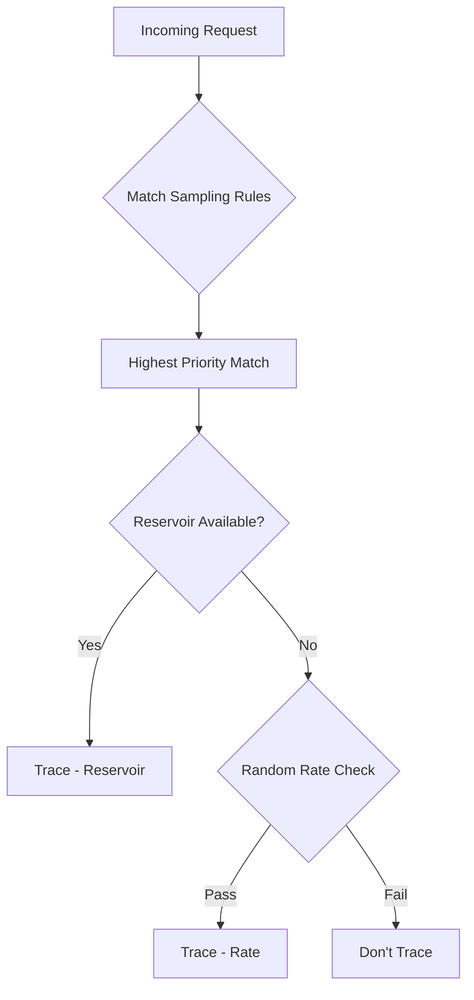

# How to Set Up X-Ray Sampling Rules

Author: [nawazdhandala](https://github.com/nawazdhandala)

Tags: AWS, X-Ray, Sampling, Tracing, Performance

Description: Learn how to configure AWS X-Ray sampling rules to control which requests get traced, balancing trace detail with cost and performance overhead.

---

Tracing every single request in a production application sounds great in theory. In practice, it would generate massive amounts of data, increase latency from the tracing overhead, and cost a fortune. That's why X-Ray uses sampling - it traces a representative subset of requests instead of all of them.

The default sampling rule traces 1 request per second plus 5% of additional requests. For many applications, this is fine. But when you need more detail on specific endpoints, want to reduce costs on high-traffic paths, or need to ensure certain request types are always traced, you'll need custom sampling rules.

## How X-Ray Sampling Works

X-Ray's sampling happens at the entry point of a trace. When your application receives a request, the X-Ray SDK checks the sampling rules to decide whether to trace it. If the request is sampled, the trace ID propagates through all downstream calls. If it's not sampled, no trace data is generated for that request path.

The sampling decision follows this process:



Each sampling rule has two components:

- **Reservoir** - a fixed number of requests per second guaranteed to be traced
- **Rate** - a percentage of additional requests beyond the reservoir to trace

## The Default Sampling Rule

X-Ray comes with a default rule:

- **Reservoir:** 1 request per second
- **Rate:** 5% (0.05) of additional requests
- **Priority:** 10000 (lowest priority - all custom rules take precedence)

This means for a service handling 1000 requests per second, X-Ray traces approximately 1 + (999 * 0.05) = ~51 traces per second. That's a 5% sampling rate overall.

## Creating Custom Sampling Rules

### Via the Console

Go to X-Ray > Sampling > Create sampling rule. Fill in the rule properties and matching criteria.

### Via the CLI

Here's how to create sampling rules for common scenarios:

**Always trace error-prone endpoints:**

```bash
# Create a rule that traces 100% of requests to a problematic endpoint
aws xray create-sampling-rule \
  --sampling-rule '{
    "RuleName": "HighSample-PaymentEndpoint",
    "RuleARN": "*",
    "ResourceARN": "*",
    "Priority": 100,
    "FixedRate": 1.0,
    "ReservoirSize": 10,
    "ServiceName": "payment-service",
    "ServiceType": "*",
    "Host": "*",
    "HTTPMethod": "*",
    "URLPath": "/api/payments/*",
    "Version": 1
  }'
```

**Reduce sampling on health checks:**

```bash
# Trace only 1% of health check requests to save costs
aws xray create-sampling-rule \
  --sampling-rule '{
    "RuleName": "LowSample-HealthChecks",
    "RuleARN": "*",
    "ResourceARN": "*",
    "Priority": 50,
    "FixedRate": 0.01,
    "ReservoirSize": 0,
    "ServiceName": "*",
    "ServiceType": "*",
    "Host": "*",
    "HTTPMethod": "GET",
    "URLPath": "/health*",
    "Version": 1
  }'
```

**Higher sampling for a specific service:**

```bash
# Trace 25% of requests to the order service
aws xray create-sampling-rule \
  --sampling-rule '{
    "RuleName": "MediumSample-OrderService",
    "RuleARN": "*",
    "ResourceARN": "*",
    "Priority": 200,
    "FixedRate": 0.25,
    "ReservoirSize": 5,
    "ServiceName": "order-service",
    "ServiceType": "*",
    "Host": "*",
    "HTTPMethod": "*",
    "URLPath": "*",
    "Version": 1
  }'
```

**Trace all POST requests but sample GETs:**

```bash
# Always trace write operations
aws xray create-sampling-rule \
  --sampling-rule '{
    "RuleName": "FullSample-Writes",
    "RuleARN": "*",
    "ResourceARN": "*",
    "Priority": 150,
    "FixedRate": 1.0,
    "ReservoirSize": 10,
    "ServiceName": "*",
    "ServiceType": "*",
    "Host": "*",
    "HTTPMethod": "POST",
    "URLPath": "/api/*",
    "Version": 1
  }'

# Sample read operations at 5%
aws xray create-sampling-rule \
  --sampling-rule '{
    "RuleName": "LowSample-Reads",
    "RuleARN": "*",
    "ResourceARN": "*",
    "Priority": 300,
    "FixedRate": 0.05,
    "ReservoirSize": 1,
    "ServiceName": "*",
    "ServiceType": "*",
    "Host": "*",
    "HTTPMethod": "GET",
    "URLPath": "/api/*",
    "Version": 1
  }'
```

## Understanding Priority

Rules are evaluated in priority order (lowest number first). The first matching rule wins. This means:

- Priority 1 rules are checked first
- The default rule (priority 10000) is the fallback
- If two custom rules could match the same request, the lower-priority-number rule wins

Design your rules so that more specific rules have lower priority numbers:

```
Priority 50:  Health checks -> 1% sampling
Priority 100: Payment endpoint -> 100% sampling
Priority 200: Order service -> 25% sampling
Priority 300: All API GETs -> 5% sampling
Priority 10000: Default rule -> 5% sampling
```

## Understanding Reservoir vs. Rate

The reservoir guarantees a minimum number of traces per second, even at low traffic. The rate applies to requests that don't get a reservoir slot.

**Example: ReservoirSize=5, FixedRate=0.10**

- First 5 requests each second are always traced (reservoir)
- Of the remaining requests, 10% are traced (rate)
- At 100 RPS: 5 + (95 * 0.10) = ~14.5 traces per second
- At 10 RPS: 5 + (5 * 0.10) = ~5.5 traces per second
- At 2 RPS: 2 traces per second (both hit the reservoir)

The reservoir is especially useful for low-traffic endpoints where percentage-based sampling might not capture any traces.

## Matching Criteria

Sampling rules match requests based on:

| Criteria | Description | Example |
|----------|-------------|---------|
| ServiceName | Name of the X-Ray segment | `order-service` |
| ServiceType | Type of service | `AWS::EC2::Instance`, `AWS::Lambda::Function` |
| Host | HTTP Host header | `api.example.com` |
| HTTPMethod | HTTP method | `GET`, `POST`, `PUT` |
| URLPath | URL path pattern | `/api/orders/*` |
| ResourceARN | AWS resource ARN | `arn:aws:lambda:us-east-1:*:function:my-func` |

Use `*` as a wildcard for any criteria you don't want to filter on.

## Managing Sampling Rules

List existing rules:

```bash
# List all sampling rules
aws xray get-sampling-rules
```

Update a rule:

```bash
# Update the fixed rate of an existing rule
aws xray update-sampling-rule \
  --sampling-rule-update '{
    "RuleName": "MediumSample-OrderService",
    "FixedRate": 0.50,
    "ReservoirSize": 10
  }'
```

Delete a rule:

```bash
# Delete a sampling rule
aws xray delete-sampling-rule \
  --rule-name "LowSample-HealthChecks"
```

## CloudFormation for Sampling Rules

```yaml
# CloudFormation template for X-Ray sampling rules
AWSTemplateFormatVersion: '2010-09-09'

Resources:
  HealthCheckRule:
    Type: AWS::XRay::SamplingRule
    Properties:
      SamplingRule:
        RuleName: LowSample-HealthChecks
        Priority: 50
        FixedRate: 0.01
        ReservoirSize: 0
        ServiceName: '*'
        ServiceType: '*'
        Host: '*'
        HTTPMethod: GET
        URLPath: '/health*'
        ResourceARN: '*'
        Version: 1

  PaymentRule:
    Type: AWS::XRay::SamplingRule
    Properties:
      SamplingRule:
        RuleName: FullSample-Payments
        Priority: 100
        FixedRate: 1.0
        ReservoirSize: 10
        ServiceName: payment-service
        ServiceType: '*'
        Host: '*'
        HTTPMethod: '*'
        URLPath: '/api/payments/*'
        ResourceARN: '*'
        Version: 1

  DefaultAPIRule:
    Type: AWS::XRay::SamplingRule
    Properties:
      SamplingRule:
        RuleName: StandardSample-API
        Priority: 500
        FixedRate: 0.10
        ReservoirSize: 5
        ServiceName: '*'
        ServiceType: '*'
        Host: '*'
        HTTPMethod: '*'
        URLPath: '/api/*'
        ResourceARN: '*'
        Version: 1
```

## Dynamic Sampling During Incidents

During an incident, you might want to temporarily increase sampling to capture more detail. Here's a script to do that:

```python
# Temporarily increase sampling during an incident
import boto3
import time

xray = boto3.client('xray')

def increase_sampling(rule_name, new_rate, duration_minutes=30):
    """Temporarily increase sampling rate, then restore original."""

    # Get current rule
    rules = xray.get_sampling_rules()
    original_rule = None

    for record in rules['SamplingRuleRecords']:
        if record['SamplingRule']['RuleName'] == rule_name:
            original_rule = record['SamplingRule']
            break

    if not original_rule:
        print(f'Rule {rule_name} not found')
        return

    original_rate = original_rule['FixedRate']
    print(f'Increasing {rule_name} from {original_rate} to {new_rate}')

    # Increase the rate
    xray.update_sampling_rule(
        SamplingRuleUpdate={
            'RuleName': rule_name,
            'FixedRate': new_rate
        }
    )

    print(f'Sampling increased. Will restore in {duration_minutes} minutes.')
    time.sleep(duration_minutes * 60)

    # Restore original rate
    xray.update_sampling_rule(
        SamplingRuleUpdate={
            'RuleName': rule_name,
            'FixedRate': original_rate
        }
    )
    print(f'Sampling restored to {original_rate}')


# Usage: increase order service sampling to 100% for 30 minutes
increase_sampling('MediumSample-OrderService', 1.0, duration_minutes=30)
```

## Cost Impact of Sampling

X-Ray pricing is based on traces recorded and retrieved:

- Recording: $5.00 per million traces
- Retrieval: $0.50 per million traces retrieved

At 100 RPS with 5% sampling:
- 5 traces/second * 86,400 seconds/day * 30 days = ~12.96 million traces/month
- Cost: ~$64.80/month

At 100 RPS with 100% sampling:
- 100 traces/second * 86,400 * 30 = ~259.2 million traces/month
- Cost: ~$1,296/month

That's a 20x difference. Smart sampling rules let you get the traces you need without the traces you don't.

## Best Practices

**Don't trace health checks at full rate.** They're high volume and low value. Set them to 1% or even 0%.

**Trace critical paths at higher rates.** Payment processing, user authentication, and other critical flows deserve more visibility.

**Use reservoirs for low-traffic endpoints.** A percentage-based rate might not capture any traces for endpoints that get a few requests per hour. Set a reservoir of 1-5 to guarantee some traces.

**Review sampling rules quarterly.** As your application evolves, your sampling needs change. New services, deprecated endpoints, and changed traffic patterns all affect what you should be tracing.

**Test rule matching.** After creating rules, verify they're matching correctly by checking the sampling statistics in the X-Ray console.

For related topics, see our guides on [X-Ray groups for filtering traces](https://oneuptime.com/blog/post/xray-groups-filtering-traces/view) and [analyzing traces for performance bottlenecks](https://oneuptime.com/blog/post/xray-traces-performance-bottlenecks/view).

## Wrapping Up

Sampling rules are how you balance observability with cost and performance. The default rule works for getting started, but production applications should have custom rules that trace critical paths at higher rates and noisy paths at lower rates. Think of it as an attention budget - spend it where it matters most.
