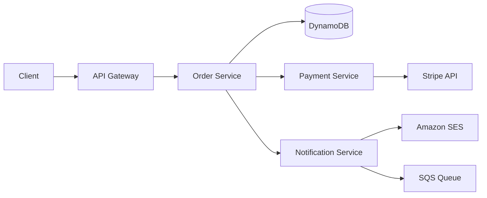

# How to Use X-Ray Service Map for Application Dependencies

Author: [nawazdhandala](https://github.com/nawazdhandala)

Tags: AWS, X-Ray, Service Map, Microservices, Observability

Description: Learn how to use the AWS X-Ray service map to visualize application dependencies, identify performance bottlenecks, and understand request flows across microservices.

---

Microservices architecture brings a lot of benefits, but it also makes it really hard to answer a simple question: what talks to what? When you have 20, 50, or 100 services, keeping track of dependencies in your head - or in a wiki that's always out of date - doesn't work. You need a live map of your system.

That's exactly what the X-Ray service map provides. It's an automatically generated, real-time visualization of your application's architecture based on actual traffic patterns. No manual diagramming, no stale documentation - just a graph that reflects what's actually happening in production right now.

## What the Service Map Shows

The service map is a directed graph where:

- **Nodes** represent services, AWS resources, and external dependencies
- **Edges** represent the connections between them (HTTP calls, SDK calls, etc.)
- **Node color** indicates health (green for healthy, yellow for warnings, red for errors)
- **Edge statistics** show latency, request rate, and error rate



Each node in the real X-Ray service map is clickable. You can drill into any service to see its latency distribution, error breakdown, and individual traces.

## Prerequisites

The service map is populated by X-Ray traces. For it to be useful, you need:

1. X-Ray tracing enabled on your services (see our [X-Ray tracing setup guide](https://oneuptime.com/blog/post/xray-tracing-application-requests/view))
2. The X-Ray daemon running alongside your application
3. Sufficient traffic to generate traces (at least a few requests per minute)

## Accessing the Service Map

### Via the Console

Navigate to the X-Ray section in the AWS Console, then click "Service map" in the left nav. The map renders automatically based on the traces collected in the selected time range.

You can adjust the time range in the upper right. Shorter time ranges (last 5 or 15 minutes) show you current state. Longer ranges (last 6 hours or 1 day) show you the overall architecture.

### Via the API

You can also retrieve the service graph programmatically:

```bash
# Get the service graph for the last hour
aws xray get-service-graph \
  --start-time $(date -u -d '1 hour ago' +%Y-%m-%dT%H:%M:%S) \
  --end-time $(date -u +%Y-%m-%dT%H:%M:%S)
```

The response contains a JSON representation of the graph with all the same statistics you see in the console.

For a more targeted view, get the graph for a specific service:

```bash
# Get the service graph centered on a specific service
aws xray get-service-graph \
  --start-time $(date -u -d '1 hour ago' +%Y-%m-%dT%H:%M:%S) \
  --end-time $(date -u +%Y-%m-%dT%H:%M:%S) \
  --group-name "production-services"
```

## Reading the Service Map

### Node Types

The service map uses different shapes and icons for different resource types:

- **Your services** - hexagonal nodes labeled with the segment name you set in your X-Ray instrumentation
- **AWS services** - nodes with AWS service icons (DynamoDB, SQS, S3, etc.)
- **External services** - rectangular nodes for non-AWS HTTP endpoints
- **Client** - the leftmost node representing incoming requests

### Health Indicators

Each node shows a ring around it:

- **Green ring** - error rate below 1% and latency within expected bounds
- **Yellow ring** - elevated error rate (1-5%) or increased latency
- **Red ring** - high error rate (above 5%) or significant latency degradation
- **Purple ring** - throttling events detected

### Edge Statistics

Hover over an edge to see:

- **Requests per minute** - throughput on this connection
- **Average latency** - how long calls take
- **Error rate** - percentage of failed calls
- **Fault rate** - percentage of 5xx errors

## Using the Service Map for Incident Response

During an incident, the service map becomes your first stop for triage. Here's a practical workflow:

**1. Open the service map and look for red or yellow nodes.** This immediately tells you which services are affected.

**2. Check if the problem is at the source or downstream.** If your API service is red but DynamoDB below it is also red, the problem is likely in DynamoDB, not your API code.

**3. Click on the affected node** to see detailed statistics. Look at the response time distribution - is it uniformly slow, or are there outliers?

**4. View traces** for the affected service. Filter by error or high latency to find specific failing requests.

**5. Follow the trace** through the subsegments to find exactly where time is being spent.

Here's a Python script to programmatically detect unhealthy services:

```python
# Script to check X-Ray service graph for unhealthy services
import boto3
from datetime import datetime, timedelta

def check_service_health():
    xray = boto3.client('xray')

    end_time = datetime.utcnow()
    start_time = end_time - timedelta(minutes=15)

    response = xray.get_service_graph(
        StartTime=start_time,
        EndTime=end_time
    )

    unhealthy_services = []

    for service in response['Services']:
        name = service.get('Name', 'Unknown')
        summary = service.get('SummaryStatistics', {})

        total = summary.get('TotalCount', 0)
        fault_count = summary.get('FaultStatistics', {}).get('TotalCount', 0)
        error_count = summary.get('ErrorStatistics', {}).get('TotalCount', 0)

        if total > 0:
            fault_rate = (fault_count / total) * 100
            error_rate = (error_count / total) * 100

            if fault_rate > 5 or error_rate > 10:
                unhealthy_services.append({
                    'name': name,
                    'total_requests': total,
                    'fault_rate': f'{fault_rate:.1f}%',
                    'error_rate': f'{error_rate:.1f}%',
                    'avg_latency': summary.get('TotalResponseTime', 0) / total
                })

    return unhealthy_services

# Run the check
issues = check_service_health()
for svc in issues:
    print(f"UNHEALTHY: {svc['name']} - Faults: {svc['fault_rate']}, "
          f"Errors: {svc['error_rate']}, Avg Latency: {svc['avg_latency']:.3f}s")
```

## Filtering with X-Ray Groups

If your service map is cluttered because you have many services, use X-Ray groups to filter the view. Groups let you define filter expressions that scope the service map to a subset of traces.

```bash
# Create a group for production traffic only
aws xray create-group \
  --group-name "production" \
  --filter-expression 'annotation.environment = "production"'

# Create a group for a specific application
aws xray create-group \
  --group-name "order-system" \
  --filter-expression 'service("order-service") OR service("payment-service") OR service("inventory-service")'
```

Then select the group in the service map dropdown to see only the relevant services. For more details on groups, see our guide on [X-Ray groups for filtering traces](https://oneuptime.com/blog/post/xray-groups-filtering-traces/view).

## Discovering Dependencies You Didn't Know About

One of the most valuable aspects of the service map is discovering unexpected dependencies. I've seen teams find:

- Services calling external APIs they forgot about
- Database connections to the wrong environment
- Circular dependencies between services
- Services that were supposed to be decommissioned but still receive traffic

Here's how to export the dependency graph for documentation or analysis:

```python
# Export the service dependency graph as an adjacency list
import boto3
from datetime import datetime, timedelta

def export_dependencies():
    xray = boto3.client('xray')

    end_time = datetime.utcnow()
    start_time = end_time - timedelta(hours=24)

    response = xray.get_service_graph(
        StartTime=start_time,
        EndTime=end_time
    )

    dependencies = []

    for service in response['Services']:
        source = service.get('Name', 'Unknown')
        source_type = service.get('Type', 'Unknown')

        for edge in service.get('Edges', []):
            # Find the target service name
            target_ref = edge.get('ReferenceId')
            target_service = next(
                (s for s in response['Services']
                 if s.get('ReferenceId') == target_ref),
                None
            )

            if target_service:
                target_name = target_service.get('Name', 'Unknown')
                stats = edge.get('SummaryStatistics', {})

                dependencies.append({
                    'source': source,
                    'target': target_name,
                    'requests': stats.get('TotalCount', 0),
                    'avg_latency_ms': (stats.get('TotalResponseTime', 0) /
                                       max(stats.get('TotalCount', 1), 1)) * 1000
                })

    return dependencies

# Print the dependency graph
deps = export_dependencies()
for dep in sorted(deps, key=lambda d: d['requests'], reverse=True):
    print(f"{dep['source']} -> {dep['target']}: "
          f"{dep['requests']} requests, {dep['avg_latency_ms']:.0f}ms avg")
```

## Service Map with CloudWatch ServiceLens

The X-Ray service map is also accessible through [CloudWatch ServiceLens](https://oneuptime.com/blog/post/cloudwatch-servicelens-application-monitoring/view), which adds CloudWatch metrics and logs to the view. When you access the service map through ServiceLens, clicking a node shows you:

- X-Ray trace data (same as standalone X-Ray)
- CloudWatch metrics for that service (CPU, memory, etc.)
- Related CloudWatch Logs

This combined view is more useful for operational work since you get all three observability signals in one place.

## Latency Distribution Analysis

Clicking on a service node in the map shows its response time distribution. This is more useful than average latency because it reveals patterns:

- **Bimodal distribution** (two peaks) - often means cache hits are fast and cache misses are slow
- **Long tail** - most requests are fast, but some are very slow (cold starts, GC pauses, etc.)
- **Uniform slowness** - the service itself is overloaded or a dependency is slow

Use this information to decide where to optimize. A service with a long tail might benefit from connection pooling or caching. A uniformly slow service might need more compute capacity.

## Best Practices

**Name your services consistently.** The service map labels come from your X-Ray segment names. Use a clear naming convention like `{team}-{service}-{environment}`.

**Make sure all services are instrumented.** Gaps in instrumentation create gaps in the service map. If service A calls service B but B isn't instrumented, you'll see the call going to an unknown external service.

**Use the map during architecture reviews.** Pull up the production service map during design discussions. It shows the real architecture, not the intended one.

**Compare time ranges.** If you suspect a recent deployment caused issues, compare the service map before and after the deployment. New edges or changed error rates will stand out.

**Export periodically.** The service graph API lets you capture point-in-time snapshots of your architecture. Store these for historical analysis.

## Wrapping Up

The X-Ray service map is the closest thing to a "live architecture diagram" that you'll find. It builds itself from actual traffic, updates in real time, and shows health information that static diagrams never could. If you've instrumented your services with X-Ray, the service map comes for free. Open it up, and you might be surprised by what your architecture actually looks like.
