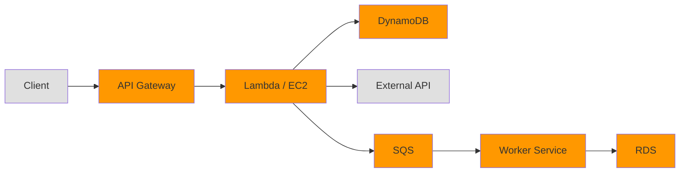

# How to Set Up X-Ray Tracing for Application Requests

Author: [nawazdhandala](https://github.com/nawazdhandala)

Tags: AWS, X-Ray, Tracing, Distributed Systems, Observability

Description: A hands-on guide to setting up AWS X-Ray distributed tracing in your application to track requests across services and identify performance issues.

---

When a user reports that your application is slow, where do you start looking? If your app is a single monolith, you check the logs. But if it's a set of microservices, the request probably touched five different services, two databases, and an external API before the user saw a timeout. Without distributed tracing, finding the bottleneck in that chain is like finding a needle in a haystack.

AWS X-Ray solves this by giving every request a unique trace ID and tracking it as it flows through your system. You can see exactly how long each service took, which downstream calls were made, and where things went wrong. Let's set it up.

## How X-Ray Tracing Works

X-Ray uses three key concepts:

**Segments** represent the work done by a single service to handle a request. Your web server creates a segment when it receives a request and closes it when it responds.

**Subsegments** break down the work within a segment. A database query, an HTTP call to another service, or a call to an AWS SDK all create subsegments.

**Traces** connect all the segments and subsegments for a single request across all services. They share a common trace ID that propagates through HTTP headers.



Everything in orange gets a segment in the trace. The trace shows the full request lifecycle.

## Setting Up the X-Ray Daemon

The X-Ray SDK in your application doesn't send traces directly to the X-Ray service. Instead, it sends UDP packets to the X-Ray daemon, which batches and forwards them. You need the daemon running wherever your application runs.

**On EC2:**

```bash
# Download and install the X-Ray daemon
curl https://s3.us-east-2.amazonaws.com/aws-xray-assets.us-east-2/xray-daemon/aws-xray-daemon-linux-3.x.zip -o xray-daemon.zip
unzip xray-daemon.zip
sudo cp xray-daemon /usr/local/bin/

# Run the daemon
xray-daemon -o -n us-east-1 &
```

Or install as a systemd service:

```bash
# Create a systemd service for the X-Ray daemon
sudo tee /etc/systemd/system/xray.service > /dev/null <<'EOF'
[Unit]
Description=AWS X-Ray Daemon
After=network.target

[Service]
Type=simple
ExecStart=/usr/local/bin/xray-daemon -o -n us-east-1
Restart=always

[Install]
WantedBy=multi-user.target
EOF

sudo systemctl enable xray && sudo systemctl start xray
```

**On ECS (as a sidecar):**

```json
// Add X-Ray daemon as a sidecar container in your task definition
{
  "name": "xray-daemon",
  "image": "amazon/aws-xray-daemon:latest",
  "essential": false,
  "portMappings": [
    {
      "containerPort": 2000,
      "protocol": "udp"
    }
  ],
  "logConfiguration": {
    "logDriver": "awslogs",
    "options": {
      "awslogs-group": "/ecs/xray-daemon",
      "awslogs-region": "us-east-1",
      "awslogs-stream-prefix": "xray"
    }
  }
}
```

**On Lambda:** X-Ray is built in. Just enable it in the function configuration:

```bash
# Enable X-Ray tracing for a Lambda function
aws lambda update-function-configuration \
  --function-name my-function \
  --tracing-config Mode=Active
```

## Instrumenting a Node.js Application

Install the X-Ray SDK:

```bash
# Install the AWS X-Ray SDK
npm install aws-xray-sdk
```

Set up automatic instrumentation:

```javascript
// Initialize X-Ray at the very top of your app, before other imports
const AWSXRay = require('aws-xray-sdk');

// Capture all AWS SDK calls
const AWS = AWSXRay.captureAWS(require('aws-sdk'));

// Capture all outgoing HTTP/HTTPS requests
AWSXRay.captureHTTPsGlobal(require('http'));
AWSXRay.captureHTTPsGlobal(require('https'));

// Capture promise chains for better async trace context
AWSXRay.capturePromise();

const express = require('express');
const app = express();

// Open X-Ray segment for each incoming request
app.use(AWSXRay.express.openSegment('order-service'));

app.get('/api/orders/:id', async (req, res) => {
  const orderId = req.params.id;

  // All downstream calls are automatically traced
  const dynamodb = new AWS.DynamoDB.DocumentClient();
  const order = await dynamodb.get({
    TableName: 'Orders',
    Key: { orderId }
  }).promise();

  // External HTTP calls are also traced
  const https = require('https');
  // This call to an external service appears as a subsegment

  res.json(order.Item);
});

// Close X-Ray segment - must be after all routes
app.use(AWSXRay.express.closeSegment());

app.listen(3000, () => {
  console.log('Order service running on port 3000');
});
```

## Instrumenting a Python Application

```bash
# Install the X-Ray SDK for Python
pip install aws-xray-sdk
```

For Flask:

```python
# Initialize X-Ray in your Flask application
from aws_xray_sdk.core import xray_recorder
from aws_xray_sdk.ext.flask.middleware import XRayMiddleware
from aws_xray_sdk.core import patch_all
import flask
import boto3

# Patch all supported libraries automatically
# This instruments boto3, requests, sqlite3, mysql, psycopg2, etc.
patch_all()

app = flask.Flask(__name__)

# Configure the X-Ray recorder
xray_recorder.configure(
    service='user-service',
    daemon_address='127.0.0.1:2000',  # X-Ray daemon address
    sampling=True
)

# Add X-Ray middleware
XRayMiddleware(app, xray_recorder)

@app.route('/api/users/<user_id>')
def get_user(user_id):
    # boto3 calls are automatically traced
    dynamodb = boto3.resource('dynamodb')
    table = dynamodb.Table('Users')
    response = table.get_item(Key={'userId': user_id})

    return flask.jsonify(response.get('Item', {}))
```

For Django, add the middleware:

```python
# settings.py - Add X-Ray middleware
INSTALLED_APPS = [
    'aws_xray_sdk.ext.django',
    # ... your other apps
]

MIDDLEWARE = [
    'aws_xray_sdk.ext.django.middleware.XRayMiddleware',
    # ... your other middleware (X-Ray should be first)
]

# X-Ray configuration
XRAY_RECORDER = {
    'AWS_XRAY_DAEMON_ADDRESS': '127.0.0.1:2000',
    'SAMPLING': True,
    'AUTO_INSTRUMENT': True,
    'PLUGINS': ('EC2Plugin', 'ECSPlugin'),
}
```

## Instrumenting a Java Application

For Spring Boot:

```xml
<!-- Add X-Ray dependencies to pom.xml -->
<dependency>
    <groupId>com.amazonaws</groupId>
    <artifactId>aws-xray-recorder-sdk-core</artifactId>
    <version>2.14.0</version>
</dependency>
<dependency>
    <groupId>com.amazonaws</groupId>
    <artifactId>aws-xray-recorder-sdk-spring</artifactId>
    <version>2.14.0</version>
</dependency>
<dependency>
    <groupId>com.amazonaws</groupId>
    <artifactId>aws-xray-recorder-sdk-aws-sdk-v2</artifactId>
    <version>2.14.0</version>
</dependency>
```

```java
// Spring configuration for X-Ray
@Configuration
public class XRayConfig {

    @Bean
    public Filter tracingFilter() {
        // Creates a segment for each incoming HTTP request
        return new AWSXRayServletFilter("payment-service");
    }

    static {
        // Configure X-Ray plugins for EC2/ECS metadata
        AWSXRayRecorderBuilder builder = AWSXRayRecorderBuilder.standard()
            .withPlugin(new EC2Plugin())
            .withPlugin(new ECSPlugin());

        AWSXRay.setGlobalRecorder(builder.build());
    }
}
```

## Adding Custom Annotations and Metadata

Annotations are indexed and searchable. Metadata is stored but not indexed. Use annotations for things you'll filter on.

```javascript
// Add custom annotations and metadata to traces
const AWSXRay = require('aws-xray-sdk');

function processPayment(orderId, amount, customerId) {
  const segment = AWSXRay.getSegment();
  const subsegment = segment.addNewSubsegment('ProcessPayment');

  // Annotations are searchable in the X-Ray console
  subsegment.addAnnotation('orderId', orderId);
  subsegment.addAnnotation('customerId', customerId);
  subsegment.addAnnotation('paymentAmount', amount);

  // Metadata provides detailed context but isn't indexed
  subsegment.addMetadata('paymentDetails', {
    method: 'credit_card',
    currency: 'USD',
    processor: 'stripe',
    items: 5
  });

  try {
    const result = chargeCard(amount);
    subsegment.addAnnotation('paymentStatus', 'success');
    subsegment.close();
    return result;
  } catch (error) {
    subsegment.addAnnotation('paymentStatus', 'failed');
    subsegment.addError(error);
    subsegment.close();
    throw error;
  }
}
```

## IAM Permissions

Your application needs permissions to send traces to X-Ray:

```json
// IAM policy for sending X-Ray traces
{
  "Version": "2012-10-17",
  "Statement": [
    {
      "Effect": "Allow",
      "Action": [
        "xray:PutTraceSegments",
        "xray:PutTelemetryRecords",
        "xray:GetSamplingRules",
        "xray:GetSamplingTargets",
        "xray:GetSamplingStatisticSummaries"
      ],
      "Resource": "*"
    }
  ]
}
```

Or simply attach the managed policy `AWSXRayDaemonWriteAccess`.

## Verifying Traces Are Flowing

After deploying your instrumented application, check that traces are arriving:

```bash
# Get recent trace summaries
aws xray get-trace-summaries \
  --start-time $(date -u -d '10 minutes ago' +%s) \
  --end-time $(date -u +%s)

# Get a specific trace by ID
aws xray batch-get-traces \
  --trace-ids "1-67abcdef-1234567890abcdef"
```

You should see traces in the X-Ray console within a minute of making requests to your application.

## Common Gotchas

**Missing trace context propagation.** If you're calling between services using plain HTTP, make sure the X-Ray trace header (`X-Amzn-Trace-Id`) is being forwarded. The SDK handles this automatically for instrumented HTTP clients, but custom HTTP code might not.

**Daemon not reachable.** If traces aren't showing up, verify the X-Ray daemon is running and your application can reach it on UDP port 2000. On ECS, make sure the daemon container is in the same task.

**Lambda cold starts.** The first invocation of a Lambda function takes longer due to initialization. X-Ray shows this as initialization time in the trace, which is helpful for understanding cold start impact.

**Sampling.** By default, X-Ray samples 1 request per second plus 5% of additional requests. If you're testing with low traffic, you might not see every request. See our guide on [X-Ray sampling rules](https://oneuptime.com/blog/post/2026-02-12-xray-sampling-rules/view) to customize this.

## Best Practices

**Instrument at the edges first.** Start with your API gateway or load balancer, then work inward. You don't need to instrument every service on day one.

**Use meaningful segment names.** The segment name becomes the service name in the [X-Ray service map](https://oneuptime.com/blog/post/2026-02-12-xray-service-map-application-dependencies/view). Make it descriptive.

**Add annotations for key business attributes.** Customer ID, order ID, and request type are all great annotations. They let you find specific traces when debugging customer-reported issues.

**Don't trace health checks.** Exclude health check endpoints from tracing to keep your trace data meaningful and reduce costs.

## Wrapping Up

Setting up X-Ray tracing is a one-time investment that pays off every time you need to debug a production issue. The SDKs do most of the heavy lifting - once you've added the initialization code and middleware, all your AWS SDK calls and HTTP requests are automatically captured. Start with one service, verify traces are flowing, then roll it out across your application.
