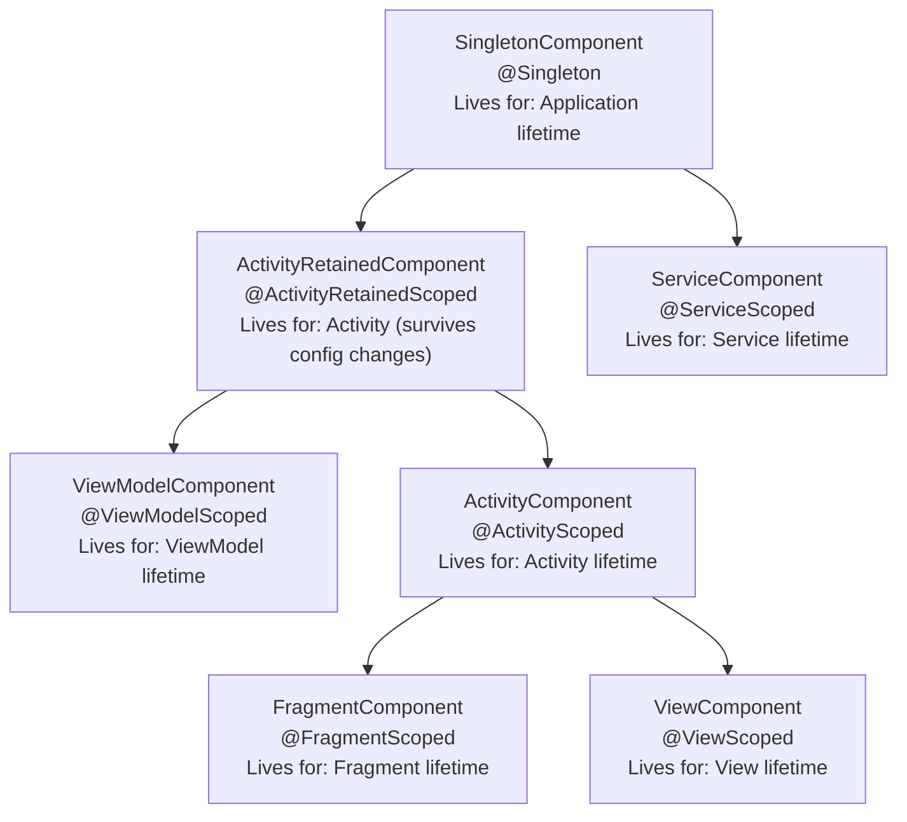

# How to Set Up Dependency Injection in Android with Hilt

Author: [nawazdhandala](https://github.com/nawazdhandala)

Tags: Android, Hilt, Dependency Injection, Kotlin, Dagger

Description: A step-by-step guide to implementing dependency injection in Android applications using Hilt, covering modules, scopes, testing, and common patterns.

---

Hilt is Google's recommended dependency injection library for Android. It is built on top of Dagger 2, which means you get compile-time verification and high performance, but without the verbose boilerplate that made Dagger painful to set up. If you have tried Dagger directly and bounced off the complexity, Hilt is worth another look.

## Why Dependency Injection Matters for Android

Android components (Activities, Fragments, ViewModels, Services) are created by the framework, not by your code. You do not call `new MainActivity()`. This makes manual dependency management awkward. You end up with singletons, static references, or God-objects that wire everything together in `Application.onCreate()`.

Dependency injection solves this by providing a structured way to supply dependencies to components that did not create those dependencies themselves. The result is code that is easier to test, easier to refactor, and easier to reason about because each class declares what it needs rather than reaching out to grab it.

## Adding Hilt to Your Project

Start by adding the Hilt Gradle plugin and dependencies.

In your project-level `build.gradle.kts`:

```kotlin
// Add the Hilt Gradle plugin to the project classpath
// This plugin generates the Dagger components that Hilt manages
plugins {
    id("com.google.dagger.hilt.android") version "2.51" apply false
}
```

In your app-level `build.gradle.kts`:

```kotlin
// Apply the Hilt plugin and add the required dependencies
// kapt is needed for Hilt's annotation processing
plugins {
    id("com.google.dagger.hilt.android")
    kotlin("kapt")
}

dependencies {
    implementation("com.google.dagger:hilt-android:2.51")
    kapt("com.google.dagger:hilt-android-compiler:2.51")

    // For ViewModel injection
    implementation("androidx.hilt:hilt-navigation-compose:1.2.0")

    // Test dependencies
    testImplementation("com.google.dagger:hilt-android-testing:2.51")
    kaptTest("com.google.dagger:hilt-android-compiler:2.51")
    androidTestImplementation("com.google.dagger:hilt-android-testing:2.51")
    kaptAndroidTest("com.google.dagger:hilt-android-compiler:2.51")
}
```

## The Application Class

Every Hilt app needs an `Application` class annotated with `@HiltAndroidApp`. This triggers Hilt's code generation and serves as the root of the dependency graph.

```kotlin
// This annotation triggers Hilt code generation
// It creates a base class that your Application extends at compile time
@HiltAndroidApp
class MyApplication : Application()
```

Register it in your `AndroidManifest.xml`:

```xml
<!-- Point the manifest to your Hilt-annotated Application class -->
<application
    android:name=".MyApplication"
    ... >
```

## Injecting into Android Components

Hilt supports injection into Activities, Fragments, Views, Services, and BroadcastReceivers. Annotate the component with `@AndroidEntryPoint`, then use `@Inject` on the fields you want Hilt to provide.

```kotlin
// @AndroidEntryPoint tells Hilt to generate injection code for this Activity
// Field injection works for Android components because we cannot control their constructors
@AndroidEntryPoint
class MainActivity : AppCompatActivity() {

    // Hilt will provide this dependency automatically
    @Inject
    lateinit var userRepository: UserRepository

    override fun onCreate(savedInstanceState: Bundle?) {
        super.onCreate(savedInstanceState)
        // userRepository is available here, already initialized by Hilt
        val user = userRepository.getCurrentUser()
    }
}
```

For Fragments, the same pattern applies:

```kotlin
// The parent Activity must also be @AndroidEntryPoint
@AndroidEntryPoint
class ProfileFragment : Fragment() {

    @Inject
    lateinit var analyticsTracker: AnalyticsTracker

    override fun onViewCreated(view: View, savedInstanceState: Bundle?) {
        super.onViewCreated(view, savedInstanceState)
        analyticsTracker.trackScreenView("profile")
    }
}
```

## Hilt Modules

When Hilt cannot figure out how to create a dependency on its own (interfaces, third-party classes, or classes that need specific configuration), you provide that information through modules.

```kotlin
// Modules tell Hilt how to create instances of types it cannot construct directly
// @InstallIn(SingletonComponent::class) makes these bindings available app-wide
@Module
@InstallIn(SingletonComponent::class)
object NetworkModule {

    // @Provides tells Hilt to call this function when an OkHttpClient is needed
    // @Singleton ensures only one instance is created for the app's lifetime
    @Provides
    @Singleton
    fun provideOkHttpClient(): OkHttpClient {
        return OkHttpClient.Builder()
            .connectTimeout(30, TimeUnit.SECONDS)
            .readTimeout(30, TimeUnit.SECONDS)
            .addInterceptor(HttpLoggingInterceptor().apply {
                level = HttpLoggingInterceptor.Level.BODY
            })
            .build()
    }

    // This depends on OkHttpClient, which Hilt will provide from the method above
    @Provides
    @Singleton
    fun provideRetrofit(okHttpClient: OkHttpClient): Retrofit {
        return Retrofit.Builder()
            .baseUrl("https://api.example.com/")
            .client(okHttpClient)
            .addConverterFactory(GsonConverterFactory.create())
            .build()
    }

    // Create the API service interface from Retrofit
    @Provides
    @Singleton
    fun provideUserApiService(retrofit: Retrofit): UserApiService {
        return retrofit.create(UserApiService::class.java)
    }
}
```

For binding interfaces to implementations, use `@Binds`:

```kotlin
// Use @Binds when you want to tell Hilt which implementation to use for an interface
// This is more efficient than @Provides for simple interface bindings
@Module
@InstallIn(SingletonComponent::class)
abstract class RepositoryModule {

    // When something needs a UserRepository, provide UserRepositoryImpl
    @Binds
    @Singleton
    abstract fun bindUserRepository(
        impl: UserRepositoryImpl
    ): UserRepository
}
```

The `UserRepositoryImpl` class uses constructor injection:

```kotlin
// @Inject on the constructor tells Hilt how to create this class
// Hilt will provide the UserApiService and UserDao automatically
class UserRepositoryImpl @Inject constructor(
    private val apiService: UserApiService,
    private val userDao: UserDao
) : UserRepository {

    override suspend fun getCurrentUser(): User {
        return try {
            val user = apiService.getMe()
            userDao.upsert(user)
            user
        } catch (e: Exception) {
            userDao.getCurrentUser() ?: throw e
        }
    }
}
```

## Scopes and Component Hierarchy

Hilt provides a predefined set of components that map to Android's lifecycle. Each component has an associated scope annotation:



A scoped binding creates one instance per component instance. An unscoped binding creates a new instance every time it is injected. Use scopes deliberately:

- `@Singleton`: One instance for the entire app. Use for shared resources like databases, HTTP clients, and repositories.
- `@ViewModelScoped`: One instance per ViewModel. Use for use cases or interactors tied to a specific screen.
- `@ActivityScoped`: One instance per Activity. Rarely needed; most things are either app-wide or ViewModel-scoped.

## ViewModel Injection

Hilt integrates with Jetpack's `ViewModel` through the `@HiltViewModel` annotation:

```kotlin
// @HiltViewModel tells Hilt to handle this ViewModel's dependency injection
// The ViewModel is created by Hilt's ViewModel factory
@HiltViewModel
class ProfileViewModel @Inject constructor(
    private val userRepository: UserRepository,
    private val savedStateHandle: SavedStateHandle
) : ViewModel() {

    // savedStateHandle is automatically provided by Hilt
    // It contains the arguments passed to the navigation destination
    private val userId: String = savedStateHandle.get<String>("userId") ?: ""

    private val _uiState = MutableStateFlow<ProfileUiState>(ProfileUiState.Loading)
    val uiState: StateFlow<ProfileUiState> = _uiState.asStateFlow()

    init {
        loadProfile()
    }

    private fun loadProfile() {
        viewModelScope.launch {
            try {
                val user = userRepository.getUser(userId)
                _uiState.value = ProfileUiState.Success(user)
            } catch (e: Exception) {
                _uiState.value = ProfileUiState.Error(e.message ?: "Unknown error")
            }
        }
    }
}
```

In a Compose screen, get the ViewModel using `hiltViewModel()`:

```kotlin
// hiltViewModel() creates or retrieves the ViewModel with Hilt injection
@Composable
fun ProfileScreen(
    viewModel: ProfileViewModel = hiltViewModel()
) {
    val uiState by viewModel.uiState.collectAsStateWithLifecycle()

    when (val state = uiState) {
        is ProfileUiState.Loading -> CircularProgressIndicator()
        is ProfileUiState.Success -> ProfileContent(state.user)
        is ProfileUiState.Error -> ErrorMessage(state.message)
    }
}
```

## Testing with Hilt

One of the biggest advantages of dependency injection is testability. Hilt provides tools for replacing dependencies in tests.

For unit tests, you do not need Hilt at all. Just pass mock or fake dependencies through the constructor:

```kotlin
// Unit tests use constructor injection directly with fakes
// No Hilt setup needed for plain unit tests
class ProfileViewModelTest {

    private lateinit var viewModel: ProfileViewModel
    private val fakeRepository = FakeUserRepository()
    private val savedStateHandle = SavedStateHandle(mapOf("userId" to "123"))

    @Before
    fun setup() {
        viewModel = ProfileViewModel(fakeRepository, savedStateHandle)
    }

    @Test
    fun `loads user profile on init`() = runTest {
        fakeRepository.setUser(User(id = "123", name = "Alice"))

        val state = viewModel.uiState.first { it is ProfileUiState.Success }

        assertEquals("Alice", (state as ProfileUiState.Success).user.name)
    }
}
```

For instrumented tests that need to replace Hilt bindings:

```kotlin
// Use @UninstallModules to remove a production module
// Then provide test-specific bindings with @TestInstallIn or inline modules
@HiltAndroidTest
@UninstallModules(RepositoryModule::class)
class ProfileScreenTest {

    @get:Rule
    val hiltRule = HiltAndroidRule(this)

    // Provide a fake implementation for the test
    @Module
    @InstallIn(SingletonComponent::class)
    object TestRepositoryModule {
        @Provides
        @Singleton
        fun provideUserRepository(): UserRepository = FakeUserRepository()
    }

    @Before
    fun setup() {
        hiltRule.inject()
    }

    @Test
    fun displaysUserName() {
        // The test now uses FakeUserRepository instead of the real one
    }
}
```

## Qualifiers for Multiple Bindings

When you need multiple instances of the same type (for example, two different `OkHttpClient` configurations), use qualifiers:

```kotlin
// Define custom qualifier annotations to distinguish between bindings of the same type
@Qualifier
@Retention(AnnotationRetention.BINARY)
annotation class AuthenticatedClient

@Qualifier
@Retention(AnnotationRetention.BINARY)
annotation class PublicClient

@Module
@InstallIn(SingletonComponent::class)
object NetworkModule {

    // Client with auth interceptor for authenticated API calls
    @AuthenticatedClient
    @Provides
    @Singleton
    fun provideAuthenticatedClient(authInterceptor: AuthInterceptor): OkHttpClient {
        return OkHttpClient.Builder()
            .addInterceptor(authInterceptor)
            .build()
    }

    // Client without auth for public endpoints
    @PublicClient
    @Provides
    @Singleton
    fun providePublicClient(): OkHttpClient {
        return OkHttpClient.Builder().build()
    }
}
```

Then inject using the qualifier:

```kotlin
class AuthApiService @Inject constructor(
    @AuthenticatedClient private val client: OkHttpClient
)
```

Hilt removes most of the ceremony that made Dagger hard to adopt. You define your modules, annotate your components, and Hilt generates the wiring. The compile-time safety means you catch dependency graph errors before running the app, and the integration with Android's lifecycle means you do not have to think about when to create or destroy your dependency containers. Start with `@HiltAndroidApp`, `@AndroidEntryPoint`, and `@HiltViewModel`, and add modules as you need them. That covers 90% of what most Android apps require.
