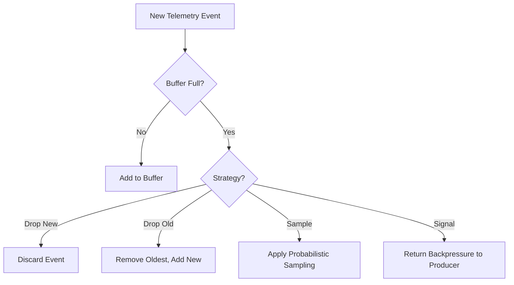
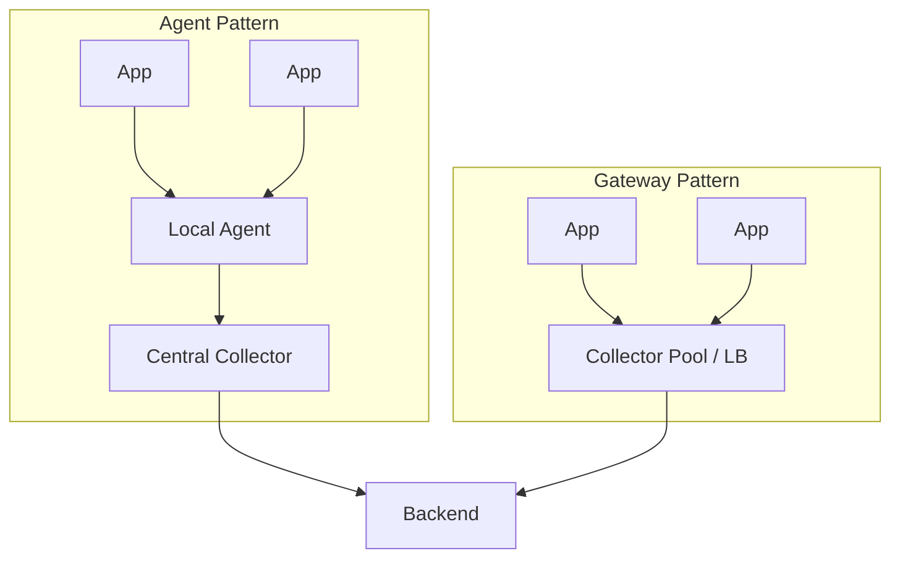

# How to Process Telemetry Data Asynchronously at Scale

Author: [nawazdhandala](https://github.com/nawazdhandala)

Tags: Telemetry, Observability, Async Processing, OpenTelemetry, Architecture

Description: Techniques for processing telemetry data asynchronously including buffering, batching, backpressure handling, and building reliable telemetry pipelines.

---

Telemetry data (metrics, logs, and traces) is the lifeblood of observability. But it is also one of the highest-volume data streams in any production system. A moderately sized microservices deployment can generate millions of telemetry events per minute. Processing that data synchronously in the request path is a non-starter. It would add latency to every request, and a downstream outage in your telemetry backend would cascade into application failures.

The solution is asynchronous processing: decouple telemetry collection from telemetry export so that your application never waits on the observability pipeline.

## The Architecture of Async Telemetry

A well-designed telemetry pipeline has clear separation between three stages: collection, processing, and export.


**Collection** happens inside the application. Instrumentation libraries capture spans, metrics, and log records. This must be fast and must not block the application thread.

**Processing** happens asynchronously. A background thread or separate process batches telemetry records, enriches them (adding service name, environment, hostname), filters unwanted data, and prepares export payloads.

**Export** sends data to a collector or directly to a backend. The exporter handles serialization, compression, retries, and circuit breaking.

## Buffering and Batching

Sending each telemetry event individually over the network is wasteful. Network calls have fixed overhead (connection setup, TLS handshake, HTTP framing) that dominates when payloads are small. Batching amortizes that overhead across many events.

OpenTelemetry's SDK implements this with a `BatchProcessor` pattern. Here is the core concept:

```python
import threading
import time
from collections import deque
from typing import List, Callable, Any

class BatchProcessor:
    """
    Collects items into a buffer and flushes them in batches.
    Flushing happens either when the batch is full or after a timeout,
    whichever comes first.
    """
    def __init__(
        self,
        export_fn: Callable[[List[Any]], bool],
        max_batch_size: int = 512,
        flush_interval_seconds: float = 5.0,
        max_queue_size: int = 2048
    ):
        self.export_fn = export_fn
        self.max_batch_size = max_batch_size
        self.flush_interval = flush_interval_seconds
        self.max_queue_size = max_queue_size
        self._queue = deque(maxlen=max_queue_size)
        self._lock = threading.Lock()
        self._stop_event = threading.Event()

        # Start the background flush thread
        self._flush_thread = threading.Thread(target=self._run, daemon=True)
        self._flush_thread.start()

    def enqueue(self, item: Any) -> bool:
        """
        Add an item to the buffer. Returns False if the queue is full
        (backpressure signal to the caller).
        """
        with self._lock:
            if len(self._queue) >= self.max_queue_size:
                return False  # Drop or signal backpressure
            self._queue.append(item)

            # Flush immediately if batch is full
            if len(self._queue) >= self.max_batch_size:
                self._flush()
        return True

    def _run(self):
        """Background loop that flushes on a timer."""
        while not self._stop_event.is_set():
            time.sleep(self.flush_interval)
            with self._lock:
                self._flush()

    def _flush(self):
        """Export all queued items in batches."""
        while self._queue:
            batch = []
            for _ in range(min(self.max_batch_size, len(self._queue))):
                batch.append(self._queue.popleft())
            if batch:
                self.export_fn(batch)

    def shutdown(self):
        """Flush remaining items and stop the background thread."""
        self._stop_event.set()
        with self._lock:
            self._flush()
        self._flush_thread.join(timeout=10)
```

The two flush triggers (batch size and time interval) address different scenarios. High-throughput services fill batches quickly and export based on size. Low-throughput services might take minutes to fill a batch, so the time-based flush ensures data is not stuck in the buffer indefinitely.

## Backpressure Handling

When the telemetry backend is slow or unavailable, data accumulates in the buffer. Without backpressure handling, this leads to out-of-memory errors or unbounded queue growth.

There are several strategies:

**Drop on overflow**: When the buffer is full, discard new events. This is the simplest approach and is appropriate for metrics and logs where losing a few data points is acceptable. OpenTelemetry's `BatchSpanProcessor` uses this strategy by default.

**Drop oldest**: When the buffer is full, discard the oldest events to make room for new ones. This keeps the most recent data, which is usually more relevant for debugging.

**Apply sampling**: When backpressure is detected, increase the sampling rate to reduce volume while retaining representative data.

**Signal upstream**: Propagate backpressure to the producer. In a collector-based architecture, the collector can send HTTP 429 (Too Many Requests) to agents, which then buffer locally or reduce their export rate.



## The OpenTelemetry Collector

Running telemetry processing inside the application adds CPU and memory overhead to your service. The OpenTelemetry Collector moves that work out of the application process.

The Collector is a standalone binary that receives, processes, and exports telemetry data. Applications send raw telemetry to the Collector over OTLP (OpenTelemetry Protocol), and the Collector handles batching, filtering, enrichment, retry, and routing to backends.

A typical Collector configuration:

```yaml
# OpenTelemetry Collector configuration
# Receivers accept data from applications
# Processors transform the data in transit
# Exporters send data to backends
receivers:
  otlp:
    protocols:
      grpc:
        endpoint: 0.0.0.0:4317
      http:
        endpoint: 0.0.0.0:4318

processors:
  # Batch telemetry to reduce export overhead
  batch:
    send_batch_size: 1024
    send_batch_max_size: 2048
    timeout: 5s

  # Limit memory usage to prevent OOM
  memory_limiter:
    check_interval: 1s
    limit_mib: 512
    spike_limit_mib: 128

  # Filter out noisy, low-value spans
  filter:
    spans:
      exclude:
        match_type: regexp
        span_names:
          - "health_check"
          - "readiness_probe"

exporters:
  otlp:
    endpoint: "telemetry-backend.internal:4317"
    retry_on_failure:
      enabled: true
      initial_interval: 5s
      max_interval: 30s
      max_elapsed_time: 300s
    sending_queue:
      enabled: true
      num_consumers: 10
      queue_size: 5000

service:
  pipelines:
    traces:
      receivers: [otlp]
      processors: [memory_limiter, filter, batch]
      exporters: [otlp]
    metrics:
      receivers: [otlp]
      processors: [memory_limiter, batch]
      exporters: [otlp]
    logs:
      receivers: [otlp]
      processors: [memory_limiter, batch]
      exporters: [otlp]
```

The `memory_limiter` processor is critical for production. It monitors the Collector's memory usage and drops data when approaching the limit, preventing OOM kills.

## Retry and Circuit Breaking

Telemetry exports will fail. Networks are unreliable, backends have maintenance windows, and rate limits exist. A good export layer handles failures without losing all buffered data and without hammering a struggling backend.

**Exponential backoff with jitter** prevents thundering herd problems when a backend recovers from an outage. If all exporters retry at the same time, they overwhelm the backend again.

**Circuit breaking** stops trying to export when repeated failures indicate the backend is genuinely down. After a cooldown period, the circuit "half-opens" and allows a probe request. If it succeeds, normal operation resumes.

```python
import time
import random
from enum import Enum

class CircuitState(Enum):
    CLOSED = "closed"       # Normal operation
    OPEN = "open"           # Failing, not sending
    HALF_OPEN = "half_open" # Testing if backend recovered

class CircuitBreaker:
    """
    Circuit breaker for telemetry exporters.
    Prevents overwhelming a struggling backend with retries.
    """
    def __init__(
        self,
        failure_threshold: int = 5,
        recovery_timeout: float = 30.0,
    ):
        self.failure_threshold = failure_threshold
        self.recovery_timeout = recovery_timeout
        self.state = CircuitState.CLOSED
        self.failure_count = 0
        self.last_failure_time = 0.0

    def can_send(self) -> bool:
        """Check if the circuit allows sending."""
        if self.state == CircuitState.CLOSED:
            return True
        if self.state == CircuitState.OPEN:
            # Check if enough time has passed to try again
            if time.time() - self.last_failure_time > self.recovery_timeout:
                self.state = CircuitState.HALF_OPEN
                return True
            return False
        # HALF_OPEN: allow one request to probe
        return True

    def record_success(self):
        """Record a successful export."""
        self.failure_count = 0
        self.state = CircuitState.CLOSED

    def record_failure(self):
        """Record a failed export."""
        self.failure_count += 1
        self.last_failure_time = time.time()
        if self.failure_count >= self.failure_threshold:
            self.state = CircuitState.OPEN
```

## Sampling at the Edge

When volume is truly massive, even async processing cannot keep up. Sampling reduces the volume while preserving the ability to debug issues.

**Head-based sampling** decides at the start of a trace whether to record it. Simple and cheap, but you might miss interesting traces that start out looking normal.

**Tail-based sampling** collects all spans for a trace, then decides whether to keep the trace after it completes. This lets you keep traces that have errors, high latency, or other interesting properties. The trade-off is that you need to buffer complete traces before making a decision, which requires more memory.

The OpenTelemetry Collector supports tail-based sampling:

```yaml
# Tail sampling processor keeps interesting traces and samples the rest
# This runs in the Collector, not in the application
processors:
  tail_sampling:
    decision_wait: 10s
    num_traces: 100000
    policies:
      # Always keep traces with errors
      - name: errors
        type: status_code
        status_code:
          status_codes:
            - ERROR

      # Always keep traces slower than 2 seconds
      - name: slow-traces
        type: latency
        latency:
          threshold_ms: 2000

      # Sample 10% of everything else
      - name: probabilistic
        type: probabilistic
        probabilistic:
          sampling_percentage: 10
```

## Deployment Patterns

There are two common deployment patterns for the Collector:

**Agent pattern**: Run a Collector instance on every host (as a DaemonSet in Kubernetes). Applications send telemetry to localhost, minimizing network latency and providing local buffering. Agents forward to a central Collector cluster.

**Gateway pattern**: Run a pool of Collector instances behind a load balancer. Applications send directly to the gateway. This simplifies deployment but adds network latency and removes the local buffer.



Most production deployments use the agent pattern because it provides local buffering during network interruptions and reduces cross-node traffic.

## Measuring Pipeline Health

Your telemetry pipeline is infrastructure, and infrastructure needs monitoring. Track these metrics:

- **Queue depth**: How many events are waiting to be exported. Rising depth indicates the exporter cannot keep up.
- **Drop rate**: How many events are being discarded due to backpressure. Non-zero drops mean you are losing data.
- **Export latency**: How long it takes to send a batch to the backend. Rising latency often precedes drops.
- **Export error rate**: How often exports fail. Correlate with backend availability.
- **Memory usage**: Buffered data consumes memory. Monitor the Collector's RSS to prevent OOM kills.

The OpenTelemetry Collector exposes these metrics via Prometheus endpoint by default. Build dashboards and set alerts on them.

Asynchronous telemetry processing is not optional at scale. It is the difference between an observability system that works reliably under load and one that degrades your application's performance or loses data when you need it most. Buffer locally, batch aggressively, handle backpressure explicitly, and monitor the pipeline itself. These principles apply whether you are using OpenTelemetry, a custom solution, or any other telemetry framework.
